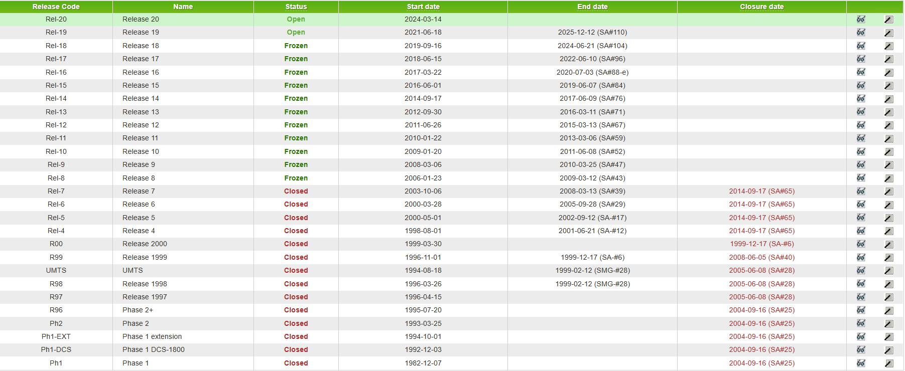
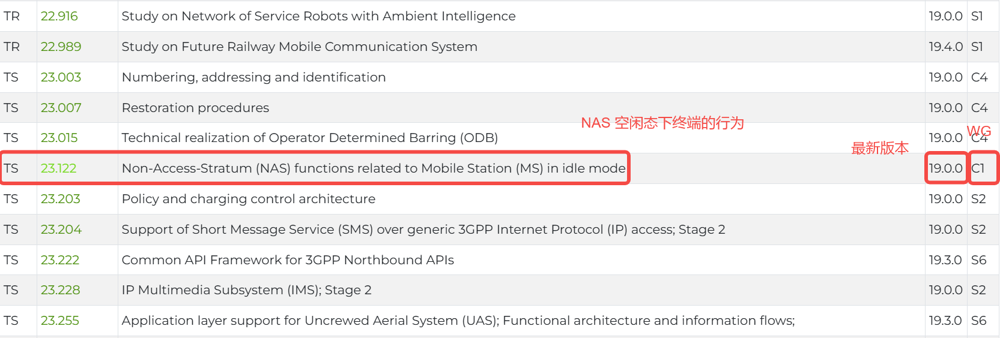
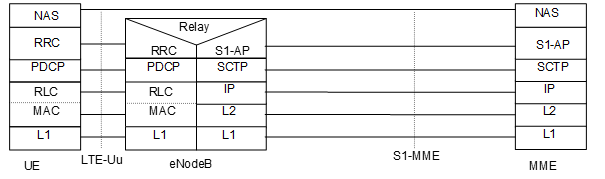
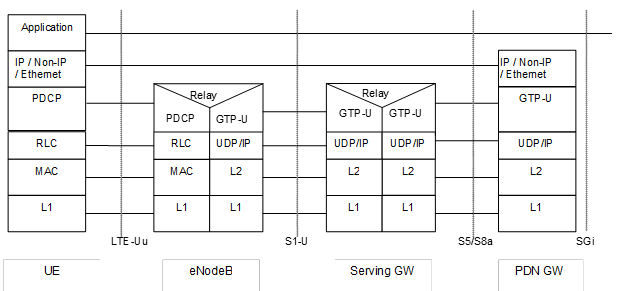

## 阅读入口

- 本文是迁入/补充资料，先按本节入口定位，再看正文和来源记录。
- 可复用结论应沉淀到主流程/配置/排障/case；本文只保留溯源材料和操作细节。

# 3GPP协议阅读方法

## 阅读重点

- 这篇保留 3GPP 官网、协议编号、协议栈和目录阅读方法。
- PLMN 选网策略看 [[PLMN自动选网流程]]、[[PLMN手动选网与小区选择]]。

## 从协议层面理解找网流程——PLMN选择

### 1、怎么去找协议

#### 1.1、了解3GPP

3GPP(3rd Generation Partnership Project，第三代合作伙伴计划)：由一系列技术规范和标准组成的框架，由多个全球移动通信标准组织合作开发。目标是为全球移动通信提供一致的技术规范和互操作性。3GPP组织中包括项目合作组（Project Cooperation Group，PCG）和技术规范组（Technology Standards Group，TSG）。项目合作组PCG负责管理和规划，技术规范组TSG负责技术。

一共有三个TSG，每个TSG下有不同的工作组（Working Groups，WG）。

* 无线接入网 Radio Access Networks (RAN)；
* 核心网&终端 Core Network & Terminals (CT) ；
* 业务&系统 Services & Systems Aspects (SA)；

TSG设立项目，WG进行研究并提供TR（Technical Reports，技术报告）和**TS（Technical Specifications，技术规范）**，最后TSG进行审批和输出。

#### 1.2、怎么去下载协议

release状态和内容介绍：

<https://www.3gpp.org/specifications-technologies/releases>

不同系列的介绍：

<https://www.3gpp.org/specifications-technologies/specifications-by-series>

协议简介和下载：

<https://www.3gpp.org/dynareport?code=status-report.htm>

所有资料下载（包括会议、提案、规范等）：

<https://www.3gpp.org/ftp/>

其中通过ftp方式下载协议(稳定，快速)：

<https://www.3gpp.org/ftp/Specs/archive>

例1：relaese状态

 

例2：协议简介

 

#### 1.3、了解协议规范编号

3GPP TS aa.bbb x.y.z

表1：规范编号范围aa

| GSM only（R4之前） | GSM only（R4及之后） | 3G和更高/GSM（R99及之后） | 用途 | 备注 |
|----|----|----|----|----|
| 01.bb | 41.bbb | 21.bbb | 需求规范 | 通常包含需求的过渡性规范，可能包括其他规范；当技术解决方案完全确定后，也可能变得过时了；它们可能被描述系统性能的报告所取代，或被删除而不是替换，或因历史原因保留但作为背景材料。 |
| 02.bb | 42.bbb | 22.bbb | 服务方面 | 服务、服务特性、构建服务的构建块或平台（服务特性或服务构建块可能提供某些通用功能，包括用户的控制；平台可能包括一个或多个网络网元，例如UIM、移动终端、辅助系统到核心网络等）；也包括第一阶段规范；也包括定义可以通过通用构建块实现的服务的报告。 |
| 03.bb | 43.bbb | **23.bbb** | **技术实现** | 主要是第二阶段规范（或描述多个接口之间的互操作、正常行为等类似性质的规范）。 |
| 04.bb | 44.bbb | **24.bbb** | **信令协议（UE到CN）** | MS/UE和核心网络之间的详细且精确到比特的第三阶段协议规范。 |
| 05.bb | 45.bbb | 25.bbb | 无线接入方面 | UTRAN无线方面。 |
| 06.bb | 46.bbb | 26.bbb | 编解码器 | 语音和其他编解码器（如视频等）。 |
| 07.bb | 47.bbb | 27.bbb | 数据 | 支持数据应用所需的功能。 |
| 08.bb | 48.bbb | 28.bbb | 信令协议（RSS到CN） | 无线子系统（例如BSS）和CN周边（例如MSC）之间的详细且精确到比特的第三阶段协议规范。 |
| 09.bb | 49.bbb | 29.bbb | 核心网络信令协议 | 核心网络内部的详细且精确到比特的第三阶段协议规范。 |
| 10.bb | 50.bbb | 30.bbb | 项目管理 | 第三代移动系统项目计划/项目工作计划和主要工作项的独立文件。 |
| 11.bb | 51.bbb | **31.bbb** | **SIM/UIM** | 用户/用户身份模块和它与其他实体之间的接口。 |
| 12.bb | 52.bbb | 32.bbb | 计费和OAM&P（运营、管理、维护和配置） | 3GPP第三代移动系统的应用TMN和其他运营、管理、维护第三代移动系统网络的功能。 |
| 13.bb |    |    |    | 监管测试规范。（从ETSI TC SMG转移到ETSI TC MSG。） |
|    |    | 33.bbb | 安全方面 |    |
|    |    | 34.bbb | 测试规范 |    |
|    | 55.bbb | 35.bbb | 算法 | 用于保密和认证等的加密算法规范。 |
|    |    | **36.bbb** | **LTE\*\*\*\*无线接入** | 在Release 8中引入，用于LTE。使用与25系列类似的细分。 |
|    |    | 37.bbb | 多无线接入技术方面 | 如切换、回退、互操作等。 |
|    |    | **38.bbb** | **NR\*\*\*\*无线接入** | Release 14中引入 |

注1：第1列为R4之前使用的原始GSM规范系列；第2列为针对R4及以后实施的GSM特有的规范——即仅与GSM/EDGE无线接入相关的规范；第3列为R99及以后具有UTRAN无线接入的实施所创建的规范。

表2：规范编号范围bb

| 序号 | 使用范围 | 用途 | 备注 |
|----|----|----|----|
| 1 | aa.bb | 适用于R4之前的GSM系统规范 | 继续由3GPP维护，不延续到R99以后的版本。 |
| 2 | **aa.0bb** | **适用于2G**（**GSM**）和**3G**系统的规范 | + aa在21到39范围内：<br>早期版本中存在编号为\[aa - 20\].\[bb\]的GSM规范。示例：3GPP TS 28.032从1999版本开始取代GSM 08.32。<br>+ aa在41到59范围内：<br>规范要么是从早期2G（GSM）规范派生，但有技术修改；要么是直接等同于前一版本的aa.bb GSM规范。 |
| 3 | **aa.1bb** | **要么是从早期2G（GSM）规范派生，但有技术修改；要么是新规范** | + aa在21到39范围内：<br>早期版本中存在编号为\[aa - 20\].\[bbb - 100\]的GSM规范，并且可能在相同版本中继续存在（并行）。<br>示例：3GPP TS 28.133基于GSM 08.33，但两个规范从R99版本开始都存在。<br>+ aa在41到59范围内：<br>R4或更高版本的新GSM规范。 |
| 4 | **aa.2bb到aa.7bb** | **新规范** | 一般不是从R4以前的GSM派生的。<br>注：对于一些规范系列，aa.8bb TRs的存量已经耗尽，在这些情况下，后面的内部TRs被分配了aa.7bb编号 |
| 5 | aa.8bb | 不打算发布的技术报告 | 3GPP小组的工作文件，不计划被3GPP转换成出版物. |
| 6 | aa.9bb | 打算发布的技术报告 | 与aa.8bb系列不同。 |

表3：版本字段号x.y.z

| 字段 | 用途 | 备注 |
|----|----|----|
| x | release | 0: 草稿<br>1: 提交给TSG供信息参考（主要负责组估计规范至少稳定60%）<br>2: 提交给TSG批准（主要负责组估计规范至少稳定80%）<br>3或更大数字：经TSG批准并处于变更控制之下。 |
| y | 技术 | 每次在规范中引入技术更改时递增。一旦处于变更控制之下，只有在TSG批准一个或多个变更请求时，才进行此类更改。每次"release"字段递增时重置为零。 |
| z | 编辑 | 每次在规范中引入纯编辑更改时递增。每次"技术"字段递增或重置为零时重置为零。 |

注：1）一个TS或TR如果至少达到了60%的稳定性，并且是第一次提交给TSG，应将其主版本号设置为1，即作为版本1.y.z呈现。2）从Release 4版本开始，3GPP规范编号和版本格式适用于所有规范。

例：

**3GPP TS 23.122 V13.6.0 (2016-09)**

3GPP：组织名   TS：技术规范   23：系列号   122：编号

V13.6.0：版本号。前两位为release版本。   2016-09：发布时间

### 2、怎么阅读3GPP协议

#### 2.1、了解通信协议栈

\*\*三层：\*\*物理层（PHY），L2数据链路层（PDCP：分组数据汇聚协议层，RLC：无线链路控制层，MAC：媒体接入层），L3网络层（NAS：非接入层协议，RRC：无线资源控制层）。

\*\*两面：\*\*用户面和控制面。

TS 23.401：协议栈结构划分和作用，UE到EPS中的整体流程，核心网介绍等。

 

```
                 Figure 5.1.1.3-1: Control Plane UE - MME
```

 

```
                             Figure 5.1.2.1-1: User Plane
```

| 三层划分 | 层说明 | 作用 |
|:---:|:---:|----|
| L3 | NAS<br>（TS 24.301，TS 23.122） | 处理终端用户的移动性和会话管理，包括用户识别、认证和安全控制。 |
|    | RRC<br>（TS 36.331，TS 36.304） | 负责无线层面的会话管理和承载控制，处理寻呼、系统信息广播和RRC连接的建立与维护，移动性管理（UE测量报告、小区切换、UE小区选择和重选等）。 |
| L2 | PDCP<br>（TS 36.323） | 负责对控制平面和用户平面的消息进行传输保护，包括头压缩、加密和完整性保护。 |
|    | RLC<br>（TS 36.322） | 管理数据链路，提供分段和重组功能，确保数据的正确传输。支持透明模式、确认模式和非确认模式，以适应不同的传输需求。 |
|    | MAC<br>（TS 36.321） | 负责调度介质访问物理层的无线电资源，进行SDU的复用与解复用，以及通过HARQ机制修正传输中的错误。 |
| L1 | PHY | 比特转换与无线电信号处理：PHY负责将比特数据转换为无线电信号，并确保信号的正确传输。这包括错误检验与纠错、速率匹配、功率控制等。<br>无线电资源管理：PHY调度无线电资源块，这些资源块在时域、频域和空域上分配，确保高效的频谱使用。 |

#### 2.2、熟悉协议的目录架构

以TS 23.122为例：

| 章节 | 简介与导读 | 建议 |
|----|----|----|
| Foreword | 前言 | 了解 |
| Scope | 文档目的和适用范围 | 了解 |
| References | 参考文献。包括3GPP和ITU、IETF、IEEE等其它组织发布的。 | 了解 |
| Definitions and abbreviations | 定义和缩写。对术语进行解释。 | 精读 |
| Body | 第3章：要求和技术解决方案。接收到不同原因值时的PLMN处理；接入控制；限制服务状态说明等。<br>第4章：过程整体描述。PLMN选择过程和LR过程等。<br>第5章：选网整体流程图。Figure 2a自动选网，Figure 2b手动选网。 | 按需精读 |
| Annex | 附录。分为informative（供参考，可选）和normative（必选）两种，以及变更说明。 | 了解 |

## 来源记录

- [从协议层面理解找网流程——PLMN选择](http://192.168.3.94:8888/doc/plmn-cBqf3HJyqL) (`cBqf3HJyqL`)
- [LTE学习--小区搜索之概述及扫频](http://192.168.3.94:8888/doc/lte-91YMbjV3pr) (`91YMbjV3pr`)
- [LTE学习--小区搜索之PSS&SSS检测](http://192.168.3.94:8888/doc/lte-psssss-Ht8zaJhX0A) (`Ht8zaJhX0A`)

