## 阅读入口

- 本文是迁入/补充资料，先按本节入口定位，再看正文和来源记录。
- 可复用结论应沉淀到主流程/配置/排障/case；本文只保留溯源材料和操作细节。

# LTE-PSS-SSS检测

## 阅读重点

- 这篇只讲 LTE 物理小区 ID、PSS、SSS、时频域位置和检测方法。
- 小区搜索完整前置链路看 [[LTE小区搜索与扫频]]，选网基础看 [[PLMN基础与术语]]。

## [LTE学习]--小区搜索之PSS&SSS检测

原创 皮皮学习 [皮皮学习](https://javascript:void(0);)

*2025年05月22日 23:06* *四川*

UE在完成扫频之后，将在可能存在小区的频点上去检测同步信号，以进一步确定该频点是否存在可用的小区，小区搜索之概述及扫频[\[LTE学习\]--小区搜索之概述及扫频](https://mp.weixin.qq.com/s?__biz=MzI5OTI3ODg1MQ==&mid=2247484197&idx=1&sn=c25b08cd69f5d273009ff651ac46378a&scene=21#wechat_redirect)


## 物理小区ID

LTE一共定义了504个不同的物理小区ID（PCI，对应协议36.211中的N_cell_ID，取值范围0\~503），且每个PCI对应一个特定的下行参考信号序列，所有PCI的集合被分成168个组（对应协议 ，取值范围0\~167），每组包含3个小区ID（对应协议 取值范围0\~2）。即有：


UE通过对主同步信号PSS的检测获得 ，对辅同步信号SSS的检测可以获得，这样就可以获得小区的物理小区ID，即PCI。


---


## PSS


## 什么是PSS

为了支持小区搜索，LTE 定义了2 个下行同步信号：PSS（Primary Synchronization Signal，主同步信号）和SSS（Secondary Synchronization Signal，辅同步信号）。对于TDD 和FDD 而言，这2 类同步信号的结构是完全一样的，但在帧中的时域位置有所不同。

通过对PSS的检测获取组内ID，即N_ID_2值。具体做法是：eNB将组内ID号N_ID_2值与一个根序列索引u相关联，然后编码生成1个长度为62的ZC序列du(n)，并映射到PSS对应的RE（Resource Element）中，UE通过盲检测序列就可以获取当前小区的 。协议上PSS序列生成公式如下，


 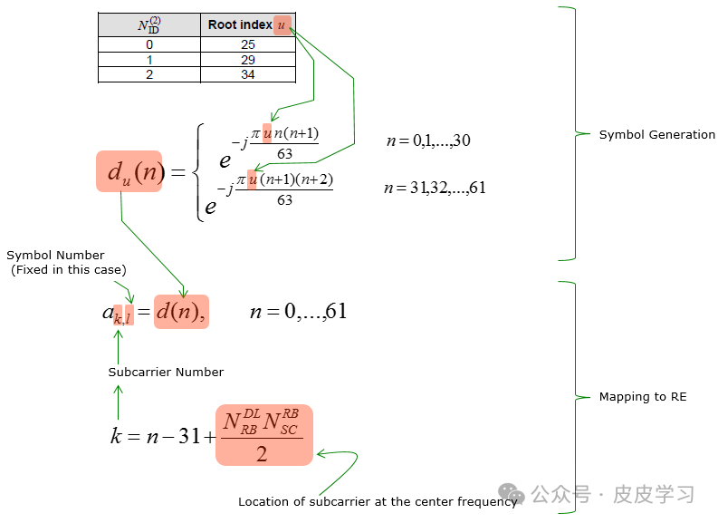


## PSS时频域位置

对于 FDD 而言，PSS 在子帧 0 和 5 的第一个 slot 的最后一个 OFDM 符号上发送；
对于 TDD 而言，PSS 在子帧 1 和 6 的第三个 OFDM 符号上发送；


 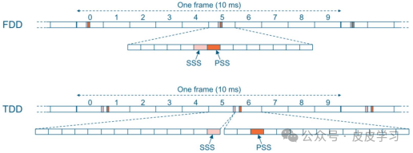PSS在频域上占用频段中间的6个RB（72个RE），PSS 使用长度为 63 的 Zadoff-Chu 序列（中间有 DC 子载波，所以实际上传输的长度为 62 ），加 上边界额外预留的用作保护频段的 5 个子载波，形成了占据中心 72 个子载波（不包含 DC ）的PSS。


 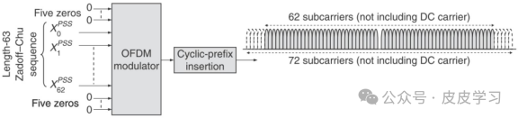


## PSS在实际中检测方法

PSS 检测是通过将接收到的信号与本地生成的 PSS 序列相关联来完成的。可以使用两种主要方法：时域相关，直接将信号与 PSS 序列进行比较，或频域相关。

### 时域相关检测方法


 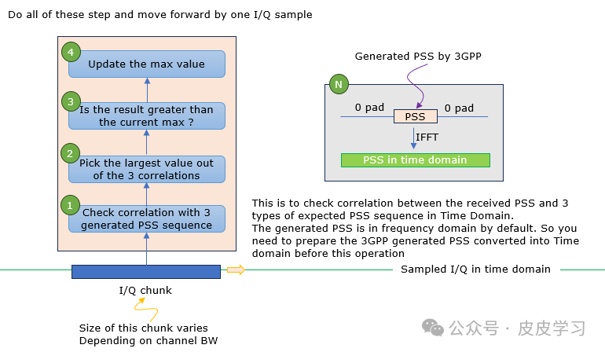


### 频域相关检测方法


 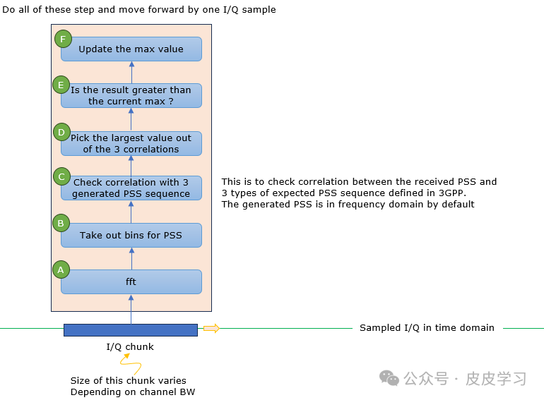


### Python模拟的一种检测方法

实际UE为了检测出PSS，使用协议规定的三种Root index  对应的三种PSS序列与接收的PSS信号分别做相关运算，挑选检测结果最强的信号，从而得到等信息。本实例是用python写的一种简单检测方法：

```javascript
import numpy as np
import matplotlib.pyplot as plt

# 模拟PSS信号生成
def generate_pss_signal(N_id_2, N):
    """
    生成PSS信号
    :param N_id_2: PSS序列的标识符 (0, 1, 2)
    :param N: 信号长度
    :return: PSS信号
    """
    if N_id_2 not in [0, 1, 2]:
        raise ValueError("N_id_2 必须是 0, 1 或 2")

    # 使用Zadoff-Chu序列生成PSS信号
    u = [25, 29, 34][N_id_2]  # 根据N_id_2选择u值
    n = np.arange(N)
    pss_signal = np.exp(-1j * np.pi * u * n * (n + 1) / N)
    return pss_signal

# 模拟接收信号（包含噪声和PSS信号）
def simulate_received_signal(pss_signal, noise_power, N):
    """
    模拟接收信号
    :param pss_signal: 原始PSS信号
    :param noise_power: 噪声功率
    :param N: 信号长度
    :return: 接收信号
    """
    noise = np.sqrt(noise_power / 2) * (np.random.randn(N) + 1j * np.random.randn(N))
    received_signal = pss_signal + noise
    return received_signal

# PSS检测（相关性检测）
def detect_pss(received_signal, pss_signal):
    """
    检测PSS信号
    :param received_signal: 接收信号
    :param pss_signal: 原始PSS信号
    :return: 相关性结果
    """
    correlation = np.abs(np.correlate(received_signal, pss_signal, mode='full'))
    return correlation

# 参数设置
N_id_2 = 0  # PSS序列标识符
N = 63  # PSS信号长度
noise_power = 0.1  # 噪声功率

# 生成PSS信号
pss_signal = generate_pss_signal(N_id_2, N)

# 模拟接收信号
received_signal = simulate_received_signal(pss_signal, noise_power, N)

# 检测PSS信号
correlation = detect_pss(received_signal, pss_signal)

# 可视化结果
plt.figure(figsize=(10, 6))
plt.subplot(2, 1, 1)
plt.title("received signal")
plt.plot(np.real(received_signal), label="real")
plt.plot(np.imag(received_signal), label="image")
plt.legend()

plt.subplot(2, 1, 2)
plt.title("PSS correlation detect")
plt.plot(correlation)
plt.xlabel("sample")
plt.ylabel("amplitude")
plt.tight_layout()
plt.show()

```

 自相关结果：


 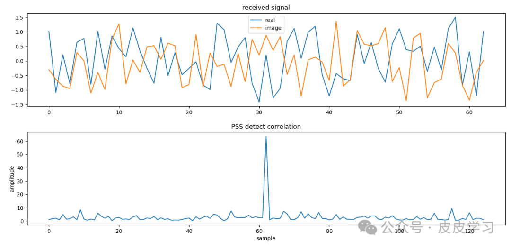


和 相关的结果：


 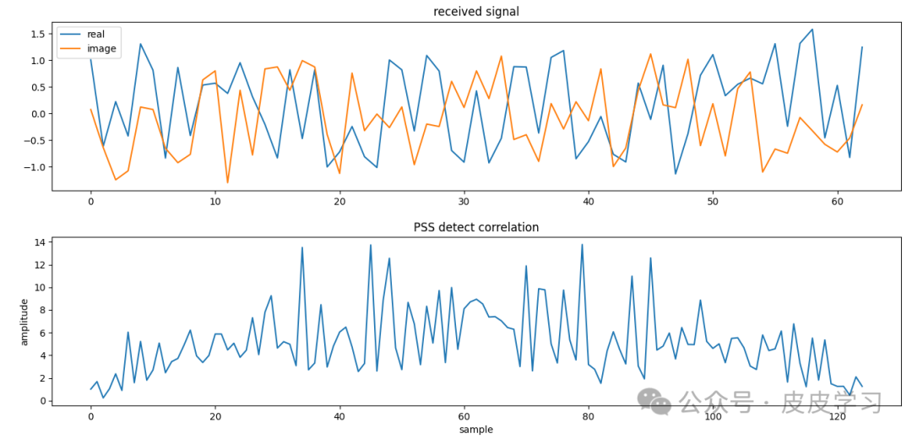和 相关的结果：


 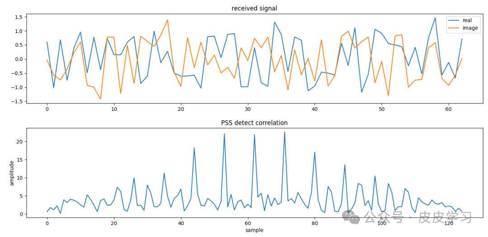


## PSS检测总结

UE 为了接收 PSS ，会使用 36.211 中 Table 6.11.1.1-1 指定的 Root index u 来尝试解码 PSS ，直到其中某个 Root index  成功解出 PSS 为止。 这样，UE 就知道了该小区的 N_ID_2， 又由于 PSS 在时域上的位置是固定的，因此 UE 又可以得到该小区的 5 ms timing（ 一个系统帧内有两个 PSS ，且这两个 PSS 是相同的，因此UE 不知道解出的 PSS 是第一个还是第二个，所以只能得到 5   ms timing ），同时UE可以通过PSS检测过程中进行频偏估计并进行补偿。

* 小区组内ID，
* 5 ms timing同步


---


## SSS


## 什么是SSS

SSS的全称是Secondary Synchronization Signal，即辅同步信号，UE通过检测SSS可以获得小区组ID即N_ID_1值。具体做法是：eNB通过组ID号值生成两个索引值m0和m1，然后引入组内ID号值编码生成2个长度均为31的序列d(2n)和d(2n+1)，并映射到SSS的RE中，UE通过盲检测序列就可以知道当前eNB下发的是哪种序列，从而获取当前小区的。下图示意的就是怎么计算d(2n)和d(2n+1)这两个序列。
协议生成公式如下：


 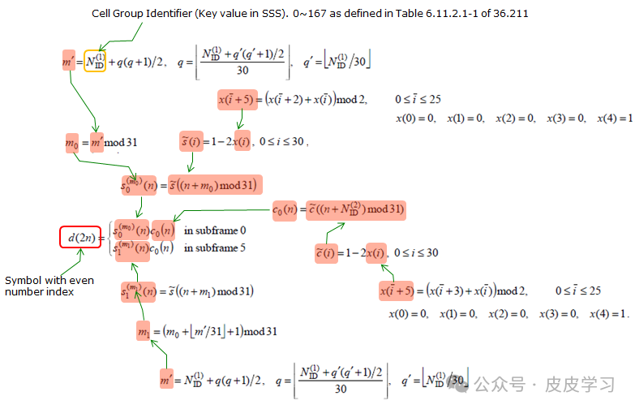 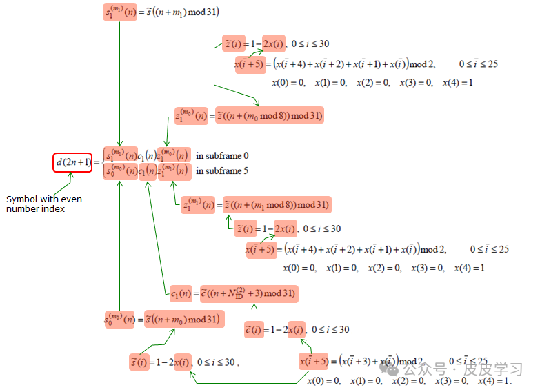


 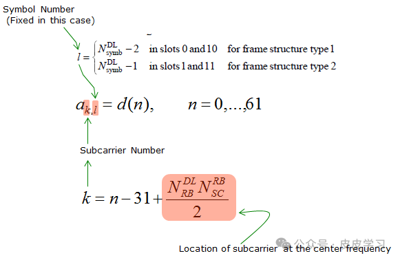从公式上可以看出，SSS 的设计有其特别之处：


* 2 个 SSS（ 位于子帧 0， 位于子帧 5）的值来源于 168 个可选值的集合，其对应168 个不同 ； （见 36.211 的 Table 6.11.2.1-1， = / 3）
* 的取值范围与是不同的，因此允许 UE 只接收一个 SSS 就检测出系统帧 10 ms 的timing（即子帧 0 所在的位置）。这样做的原因在于，小区搜索过程中， UE 会搜索多个小区，搜索的时间窗可能不足以让 UE 检测超过一个 SSS。


## SSS时频域位置

对于 FDD 而言， SSS 与 PSS 在 同一子帧同 一 slot 上发送，但 SSS 位于倒数第二个 OFDM 符号上 ，比 PSS 提前一个 OFDM 符号。
对于 TDD 而言，而 SSS 在子帧 0 和 5 的最后 一 个 OFDM 符号上发送，比PSS 提前 3 个符号。


 SSS 也是占用频段中间6个RB，SSS由 2 个长度为 31 的 m-sequence 交织而成，形成长为 63 的序列（中间有 DC 子载波，所以  实际上传输的长度为 62 ），加上边界额外预留的用作保护频段的 5 个子载波，形成了占据中心 72 个子载波（不包含 DC ）的 SSS。


 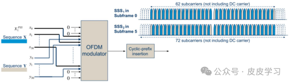


## SSS在实际中的检测

 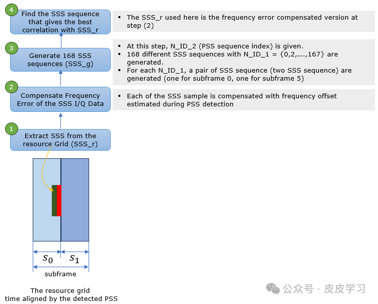


**SSS 检测：**
**步骤一： UE 知道 PSS 后，就知道了 SSS 可能的位置。**
首先， UE 在检测到 SSS 之前，还不知道该小区是工作在 FDD 还是 TDD 模式下。如果 UE 同时支持 FDD 和 TDD，则会在 2 个可能的位置上去尝试解码 SSS。如果在 PSS 的前一个OFDM 符号上检测到 SSS，则小区工作在 FDD 模式下；如果在 PSS 的前 3 个 OFDM 符号上检测到SSS，则小区工作在 TDD 模式下。如果 UE 只支持 FDD 或 TDD，则只会在相应的位置上去检测SSS，如果检测不到，则认为不能接入该小区。 （通过检测 SSS， UE 知道小区是工作在 FDD 模式还是 TDD 模式下）
其次， SSS 的确切位置还和循环前缀（ Cyclic Prefix， CP）的长度有关（如下图）。在此阶段， UE 还不知道小区的循环前缀配置（ 正常的循环前缀还是扩展的循环前缀），因此会在这两个可能的位置去盲检 SSS。 （通过检测 SSS， UE 知道小区的循环前缀配置）


 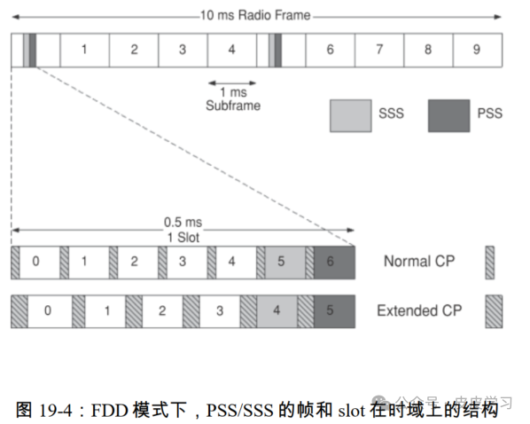


 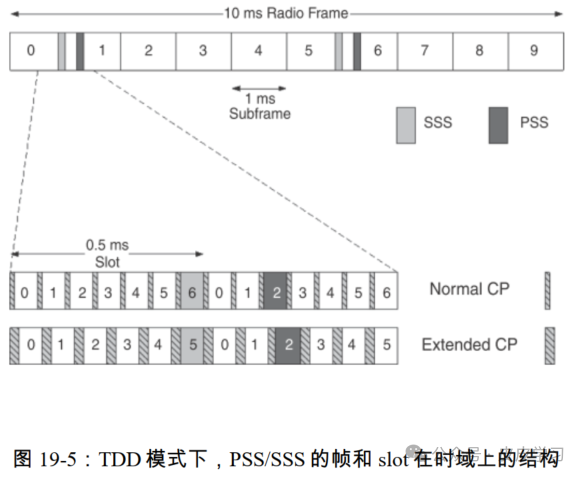**步骤二：**
UE 会在 SSS 可能出现的位置（如果 UE 同时支持 FDD 和 TDD，则至多有 4 个位置），根据 36.211 中 6.11.2.1 节里的公式、 Table 6.11.2.1-1 中可能出现的 168 种取值、以及 X 与 Y交织的顺序（以便确定是 还是）等，盲检 SSS。 如果成功解码出 SSS，就确定了 168 种取值之一，也就确定了小区ID  。确定了 SSS 是 还是，也就确定了该 SSS 是位于子帧 0 还是子帧 5， 进而也就确定了该系统帧中子帧 0 所在的位置，即 10 ms timing。


## SSS检测总结

通过SSS检测，UE可以得到如下信息：

* ，加上检测 PSS 时得到的，也就得到了小区的 PCI；
* 由于小区特定的参考信号及其时频位置与 PCI 是一一对应的，因此也就知道了该小区的下行小区特定的参考信号及其时频位置；
* 10 ms timing，即系统帧中子帧 0 所在的位置（此时还不知道系统帧号，需要进一步解码PBCH）；
* 小区是工作在 FDD 还是 TDD 模式下；
* 循环前缀配置：是正常的循环前缀还是扩展的循环前缀。


---


## 参考资料

https://www.sharetechnote.com/html/Handbook_LTE.html#google_vignette


---

## 来源记录

- [从协议层面理解找网流程——PLMN选择](http://192.168.3.94:8888/doc/plmn-cBqf3HJyqL) (`cBqf3HJyqL`)
- [LTE学习--小区搜索之概述及扫频](http://192.168.3.94:8888/doc/lte-91YMbjV3pr) (`91YMbjV3pr`)
- [LTE学习--小区搜索之PSS&SSS检测](http://192.168.3.94:8888/doc/lte-psssss-Ht8zaJhX0A) (`Ht8zaJhX0A`)

