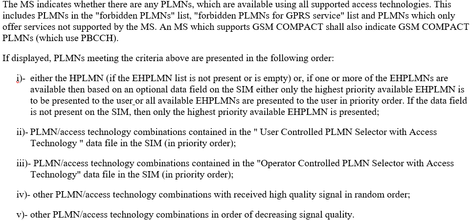
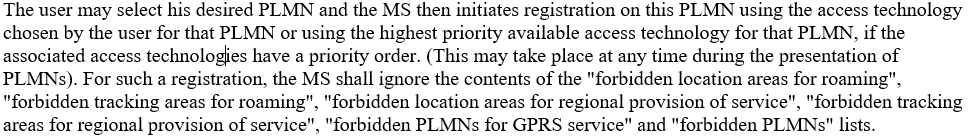
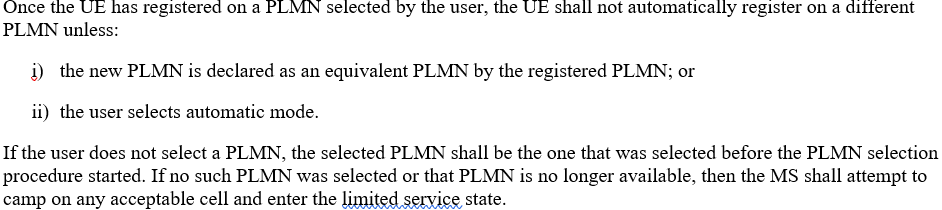
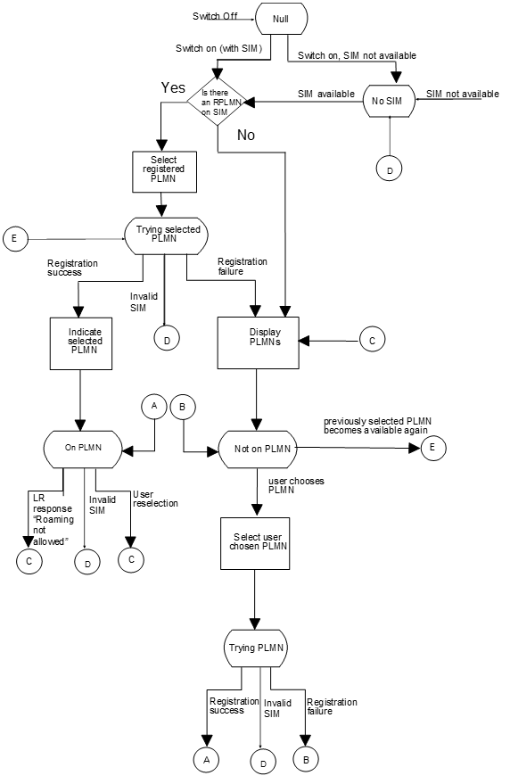
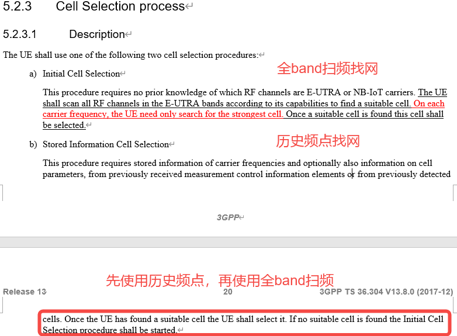

## 阅读入口

- 本文是迁入/补充资料，先按本节入口定位，再看正文和来源记录。
- 可复用结论应沉淀到主流程/配置/排障/case；本文只保留溯源材料和操作细节。

# PLMN手动选网与小区选择

## 阅读重点

- 这篇保留手动选网流程、小区选择入口和 S 准则。
- LTE 物理层扫频看 [[LTE小区搜索与扫频]]，PSS/SSS 同步看 [[LTE-PSS-SSS检测]]。

### 4.3、手动选网

### 4.3.1、选网流程

 

 

 

* MS会按优先级列出所有可用的PLMN
* 用户选择的PLMN是FPLMN，也会发起找网和注册
* 若用户只选择PLMN，未选择RAT，RAT有优先级顺序就使用该PLMN下最高优先级RAT
* 若只更改为手动选网模式，未指定PLMN和RAT，则使用最开始设置的PLMN或限制驻留在任意PLMN上
* 已经在某个PLMN上成功注册，除非重选或者更改为自动模式，否则不会在其它PLMN上注册

### 4.3.2、整体流程图（TS 23.122 Figure 2b）

 

## 5、小区选择

### 5.1、两种找网方式

 

### 5.2、S准则

**S准则**：小区选择准则，需要满足**小区接收信号功率S\*\*\*\*rxlev***\*\*>0 \*\****dB**，且**小区接收信号质量S\*\*\*\*qual***\*\* > 0\*\**\*\* dB\*\*。

Srxlev=Qrxlevmeas-(Qrxlevmin+Qrxlevminoffset)-QCompensation- Qoffsettemp≥0

其中：QCompensation=max(Pemax-PPowerClass,0)

| 参数 | 描述 | 来源 | 具体位置 | 单位 |
|----|----|----|----|----|
| Qrxlevmeas | 测量得到的目标小区RSRP | 测量 | / | dBm |
| Qrxlevmin | 终端驻留的最低RSRP | SIB1 | SIB1->cellSelectionInfo->q-RxLevMin | dBm |
| Qrxlevminoffset | 最低RSRP的偏置值 | SIB1 | SIB1->cellSelectionInfo->q-RxLevMinOffset | dB |
| Pemax | 终端上行最大可用发射功率 | SIB1 | SIB1>p-Max | dBm |
| PPowerClass | 终端最大发射功率 | 终端功率等级 | / | dBm |
| Qoffsettemp | 小区临时偏置 | SIB2 | SIB2->radioResourceConfigCommon->rach-ConfigCommon-v1250->txFailParams>connEstFailOffset | dB |

（1）Qrxlevmin\*\*：\*\*

该参数表示小区最低接收电平，增加某小区的该值，使得该小区更难符合S规则，更难成为适当小区，UE选择该小区的难度增加，反之亦然。该参数的取值应使得被选定的小区能够提供基础类业务的信号质量要求，界面取值范围，-70\~-22，**单位2毫瓦分贝（dBm）**，建议值-64，最低接收电平-128dBm。

（2）Qrxlevminoffset：

该参数表示小区最低接收电平偏置，\*\*仅当UE驻留在VPLMN且由于周期性的搜索高优先级PLMN而触发的小区选择时，才使用本参数。\*\*增加某小区的该值，使得该小区更容易符合S规则，更容易成为适当小区，选择该小区的难度减小，反之亦然。界面取值范围，0\~8，**单位2分贝（dB）**，建议值0。

（3）QCompensation=max(Pemax-PPowerClass,0)（dB）

用于惩罚达不到小区最大功率的UE，Pemax（小区允许UE 的最大上行发射功率）、PPowerClass（UE 能力支持的最大上行发射功率）。

* 当 UE 最大允许发射功率Pemax小于等于 UE 能力支持最大发射功率PPowerClass时，QCompensation=0；
* 当 UE 最大允许发射功率Pemax大于UE 能力支持最大发射功率PPowerClass时， QCompensation =Pemax-PPowerClass；
* UE 最大允许发射功率Pemax：本小区允许 UE 的最大发射功率，应用于小区选择准则（S 准则）的判决，用于计算功率补偿值。**如果该参数不配置，则 UE 的最大发射功率由UE 自己的能力决定**。该参数设置的越大，UE 的发射功率也越大，增强本小区覆盖的同时会增加对邻区的干扰；该参数设置的越小，UE 的发射功率也越小，减少本小区覆盖的同时会减少对邻区的干扰。面取值范围，-30\~33，单位1毫瓦分贝（dBm），建议值23。

（4）Qoffsettemp：

不存在时为0。

Squal = Qqualmeas – (Qqualmin + QqualminOffset)- Qoffsettemp

| 参数 | 描述 | 来源 | 具体位置 | 单位 |
|----|----|----|----|----|
| Qqualmeas | 测量得到的目标小区RSRQ | 测量 | / | dBm |
| Qqualmin | 终端驻留的最低RSRP | SIB1 | SIB1->nonCriticalExtension->nonCriticalExtension->CellSelectionInfo-v920->q-QualMin-r9 | dBm |
| QqualminOffset | 最低RSRP的偏置值 | SIB1 | SIB1>nonCriticalExtension->nonCriticalExtension->CellSelectionInfo-v920->q-QualMinOffset-r9 | dB |

（1）Qqualmin：

该参数表示EUTRAN异频邻区重选需要的最小接收信号质量，用来控制EUTRAN小区重选的难易程度。增加某小区的该值，使得该小区更难符合S规则，更难成为适合的小区，选择该小区的难度增加，反之亦然。应使得被选定的小区能够提供基础类业务的信号质量要求。界面取值范围，-34\~-3，单位1分贝（dB），建议值-18。不带时为负无穷大。

（2）QqualMinOffset：最小接收信号接收质量偏置值

该参数表示小区最小接收信号接收质量偏置，应用于小区选择准则（S准则）公式，\*\*仅当UE驻留在VPLMN且由于周期性的搜索高优先级PLMN而触发的小区选择时，才使用本参数。\*\*增加某小区的该值，使得该小区更容易符合S规则，更容易成为适当小区，选择该小区的难度减小，反之亦然。若不配置，即空口没下发该参数，UE默认使用0。面取值范围，1\~8，单位1分贝（dB），建议值无。

例：选择小区

| Module | Message | Comment |
|----|----|----|
| EL1_MPC - ERRC | MSG_ID_ERRC_EL1MPC_RADIO_MEASURE_IND | rsrp = 0xfe07 -505   rsrq = 0xffc7 -57 |
| ERRC_SYS | \[NW->MS\] SystemInformationBlockType1 (EARFCN\[3750\], PCI\[488\]) | q-RxLevMin: -120dBm (-60)   q-QualMin-r9: -18 dB    |
| ERRC_MOB | \[COM\] Srxlev\[-25\] = RSRP\[-505\] - (q_rxlevmin\[-480\] + q_rxlevmin_offset\[0\]) - pcomp\[0\] - offset_temp\[0\] | 注：q-RxLevMin和q-QualMin-r9 MTK做了乘4 |
| ERRC_MOB | \[COM\] Squal\[15\] = RSRQ\[-57\] - (q_qualmin\[-72\] + q_qualmin_offset\[0\]) - offset_temp\[0\] |    |

## 来源记录

- [从协议层面理解找网流程——PLMN选择](http://192.168.3.94:8888/doc/plmn-cBqf3HJyqL) (`cBqf3HJyqL`)
- [LTE学习--小区搜索之概述及扫频](http://192.168.3.94:8888/doc/lte-91YMbjV3pr) (`91YMbjV3pr`)
- [LTE学习--小区搜索之PSS&SSS检测](http://192.168.3.94:8888/doc/lte-psssss-Ht8zaJhX0A) (`Ht8zaJhX0A`)

