## 阅读入口

- 本文是迁入/补充资料，先按本节入口定位，再看正文和来源记录。
- 可复用结论应沉淀到主流程/配置/排障/case；本文只保留溯源材料和操作细节。

# PLMN自动选网流程

## 阅读重点

- 这篇保留 IDLE 下 NAS/AS 功能划分、RPLMN、自动选网顺序、RAT 确定、VPLMN 驻留。
- 手动选网和 S 准则保留在本文的选网流程/小区选择相关章节；LTE 扫频入口看 [[LTE小区搜索与扫频]]。

## 3、IDLE下NAS和AS的功能

### 3.1、IDLE下NAS和AS的功能划分

TS 36.304 4.2：

 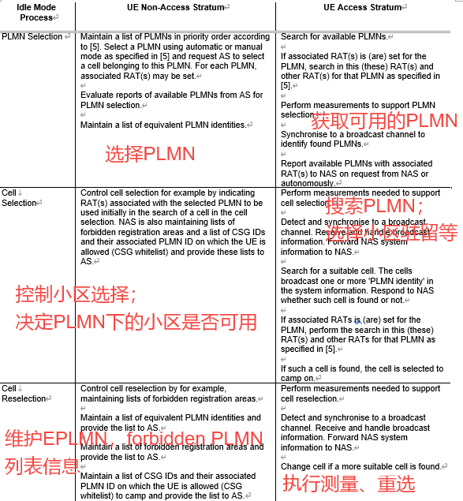

NAS：选择PLMN进而影响选择小区

AS：选择小区进而影响选择PLMN

### 3.2、IDLE下PLMN选择整体流程

 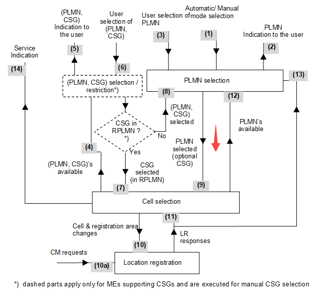

## 4、选网流程（主要涉及TS 23.122）

### 4.1、选网模式

>  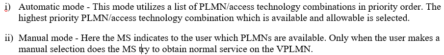

自动模式：终端根据优先级自主选择合适的PLMN进行驻留。

手动模式：只能在用户选择的PMN上驻留，不在其它PLMN上驻留。

### 4.2、自动选网

RPLMN：Registered PLMN，注册的PLMNHPLMN:  Home PLMN，归属PLMN，从IMSI中获取

EHPLMN：EquivalentHome PLMN，与HPLMN等价的PLMN

EPLMN： Equivalent PLMN，与RPLMN等价的PLMN

UPLMN：User Controlled PLMN，用户控制的PLMN

OPLMN：Operator Controlled PLMN，运营商控制的PLMN

FPLMN：Forbidden PLMN，禁用的PLMN

VPLMN：Visited PLMN，访问PLMN

### 4.2.1、RPLMN的确定

■RPLMN具有最高的优先级：

 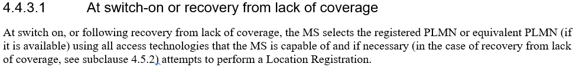

 

* 开机或者丢失覆盖恢复时具有相同的找网逻辑
* 如果存在RPLMN，则使用RPMN。即开机或丢失覆盖恢复时RPLMN具有最高的优先级
* RPLMN在每次**注册成功后就会变化**

■RPLMN存储在SIM卡或者NV中：

TS 24.301中：

 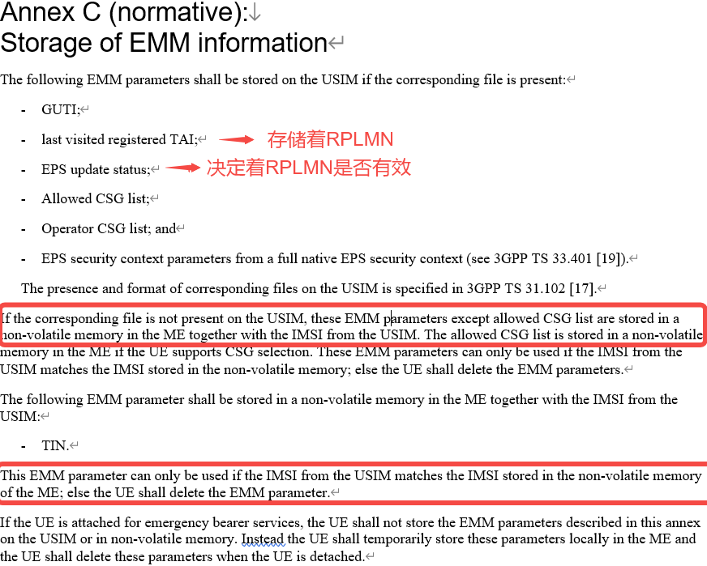

* RPLMN应该存储在SIM卡中的某个文件中（4G为EPSLOCI文件，2G/3G为LOCI和PSLOCI文件）
* 如果SIM卡中存储RPLMN参数的文件不存在，需要将RPLMN参数存储在设备NV中
* NV中需要存储IMSI，以便匹配同一个IMSI的NV参数

■RPLMN存在SIM卡中的位置：

TS 31.302：SIM卡文件介绍

EFEPSLOCI：

 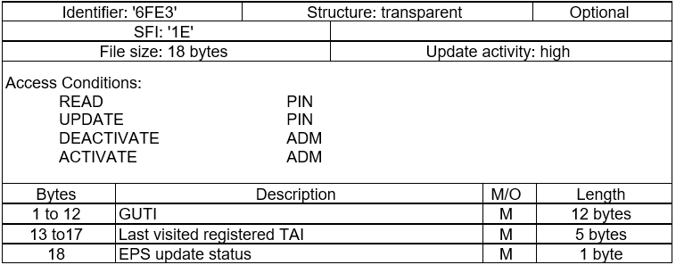

EFLOCI：

 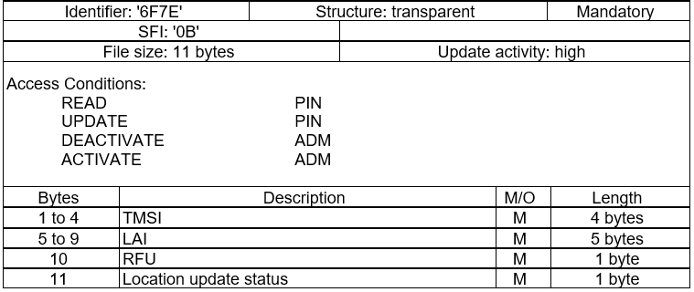

EFPSLOCI：

 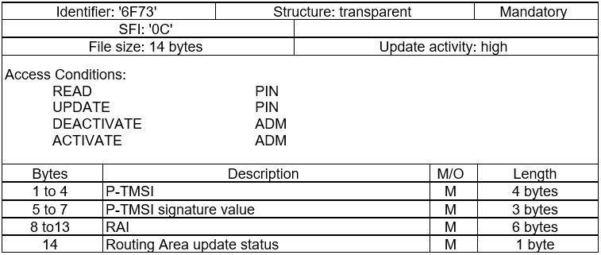

* EFEPSLOCI文件是可选的
* EFLOCI和EFPSLOCI是必选的

EFEPSLOCI文件不存在：

| Module | Message | Comment |
|----|----|----|
| EMM_SV | \[EMM SV\] \[status\] is_valid_ef_epsloci = KAL_FALSE |    |
| EMM_USIMSRV | \[EMM USIMSRV\] inserted SIM has no EF_EPSLOCI | 不存在EFEPSLOCI文件 |
| EMM_NVMSRV | \[EMM NVMSRV\] EPSLOCI in USIM is invalid |    |

EFEPSLOCI文件存在：

| Module | Message | Comment |
|----|----|----|
| SIM | APDU_tx 0: 00 A4 08 04 04 7F FF 6F E3 00 | 00A4：选择7FFF下面的6FE3文件 |
| SIM | APDU_rx:len=30 |    |
| SIM | APDU_rx 0: 62 1C 82 02 41 21 83 02 6F E3 A5 03 C0 01 80 8A |    |
| SIM | APDU_rx 1: 01 05 8B 03 6F 06 0B 80 02 00 12 88 01 F0 |    |
| SIM | SIM_CMD_SUCCESS |    |
| SIM | \[FILE_PTR\]\[ch0\]file_idx:FILE_U_EPSLOCI_IDX df_idx:FILE_USIM_IDX df_id:7FFF path:7F-FF-6F-E3-00-00 |    |
| SIM | SELECT:FILE_U_EPSLOCI_IDX => 90 00 |    |
| SIM | SIM_READ_BINARY:len=5 |    |
| SIM | APDU_tx 0: 00 B0 00 00 12 | 00B0：读二进制文件 |
| SIM | \[SIM_CACHE_OP_READ\]ret_val:KAL_TRUE FILE_U_EPSLOCI_IDX => SIM_CACHE_FILE_EPSLOCI_IDX |    |
| SIM | SIM_CACHE_FILE_EPSLOCI_IDX\[0\]:len=18 |    |
| SIM | APDU_rx:len=18 | 文件长度 |
| SIM | APDU_rx 0: FF FF FF FF FF FF FF FF FF FF FF FF FF FF FF 00 | 读取的数据。红色：GUTI；绿色：TAI；蓝色：更新状态。 |

■是否使用RPLMN根据EFLRPLMNSI文件

 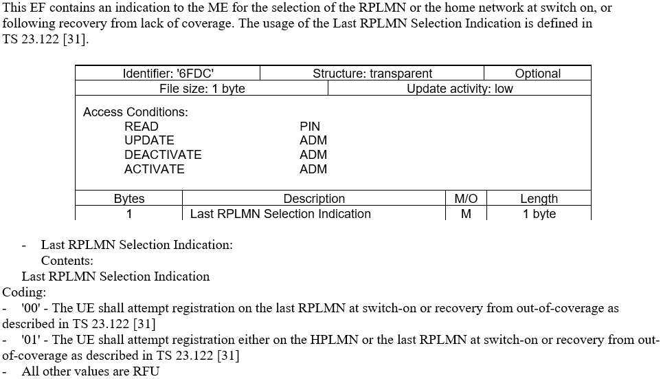

* 存在且为1时，选择HPLMN或者RPLMN
* 不存在或存在且为0时，选择RPLMN

### 4.2.2、选网顺序

■PLMN优先级

 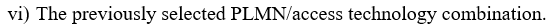 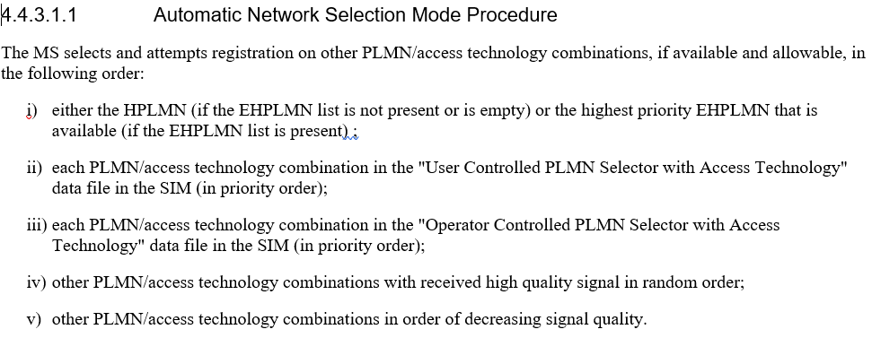

* EFIMSI用于获取HPLMN，EFEHPLMN用于获取EHPLMN
* EFPLMNwAcT文件用于获取UPLMN和对应的RAT
* EFOPLMNwACT文件用于获取OPLMN和对应的RAT
* Other PLMN为从环境中搜索到的未在SIM卡文件中指明的PLMN
* 自动选网PLMN优先级顺序：**RPLMN>HPLMN/EHPLMN>UPLMN>OPLMN>other PLMN**

■EHPLMN存在时，不使用HPLMN

 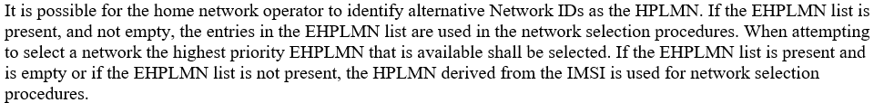

* 有EHPLMN用EHPLMN，没有EHPLMN用HPLMN

Q：驻留在HPLMN上是否属于漫游？

A：TS 23.122 Annex A HPLMN Matching Criteria。当EHPLMN list不为空时，驻留在HPLMN上属于漫游；当EHPLMN list不存在或为空时，驻留在HPLMN上不属于漫游。

### 4.2.3、RAT的确定

 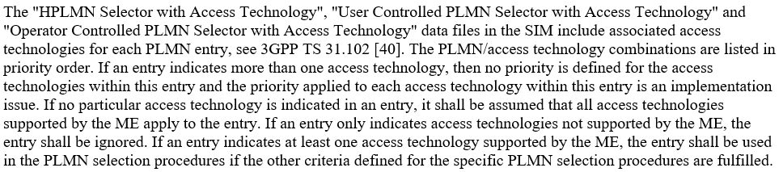

 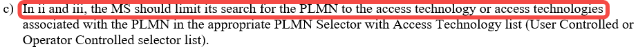

 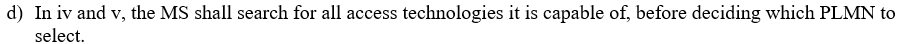

 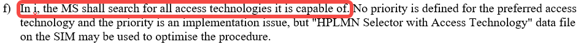

* EFHPLMNwACT文件用于优化HPLMN/EHPLMN找网RAT顺序
* EFPLMNwAcT文件和EFOPLMNwAcT包含PLMN的RAT，且PLMN/RAT存在优先级顺序
* **EFPLMNwAcT文件和EFOPLMNwAcT中一个PLMN包含多个RAT具体使用哪个RAT取决于实现**
* EFPLMNwAcT文件和EFOPLMNwAcT中如果PLMN没有指明RAT，表示所有的RAT都支持
* EFPLMNwAcT文件和EFOPLMNwAcT中如果PLMN指明的RAT设备不支持，忽略该PLMN
* HPLMN/EHPLMN按优化的RAT进行找网；OPLMN和UPLMN按对应的RAT顺序进行找网；Other PLMN搜索全部RAT（顺序一般为4G>3G>2G）

EFPLMNwAcT：

 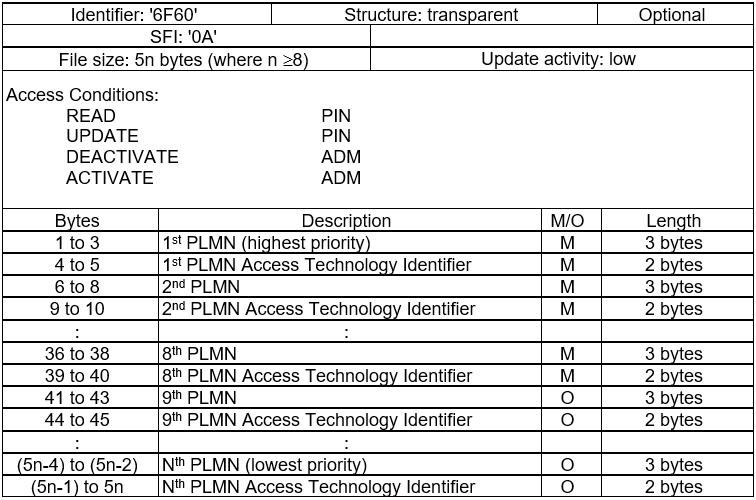

 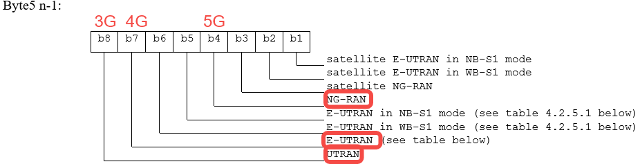 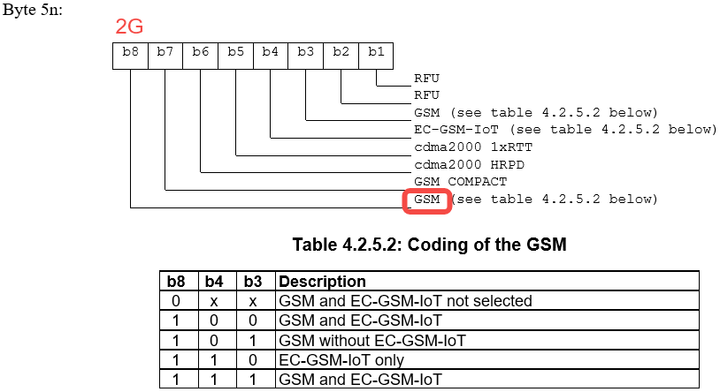

例1、配置一个支持4G、3G和2G的UPLMN

64F000C080

64F000：PLMN

C0：即11000000，支持3G和4G

80：即10000000，支持2G

例2、通过EFHPLMNwACT更改EHPLMN的找网顺序

设置如下SIM卡配置：

 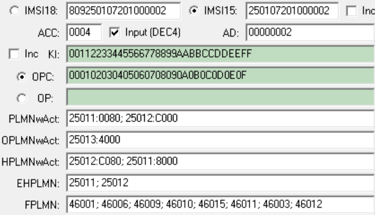

| Message | Comment |
|----|----|
| \[NWSEL Context\] RPLMN: ffffff, NWSEL_RAT_NONE; Prefer RAT: NWSEL_TD_FDD_LTE; Previous RPLMN: ffffff, NWSEL_RAT_NONE | RPLMN不存在 |
| \[NWSEL Context\] NWSEL_EHPLMN\[0\]: 25011f , RAT_NONE | EHPLMN顺序为：25011->25012 |
| \[NWSEL Context\] NWSEL_EHPLMN\[1\]: 25012f , RAT_NONE |    |
| \[NWSEL Context\] NWSEL_FPLMN\[0\]: 46001f , RAT_GSM_UMTS_LTE | FPLMN |
| \[NWSEL Context\] NWSEL_FPLMN\[1\]: 46006f , RAT_GSM_UMTS_LTE |    |
| \[NWSEL Context\] NWSEL_FPLMN\[2\]: 46009f , RAT_GSM_UMTS_LTE |    |
| \[NWSEL Context\] NWSEL_FPLMN\[3\]: 46010f , RAT_GSM_UMTS_LTE |    |
| \[NWSEL Context\] NWSEL_FPLMN\[4\]: 46015f , RAT_GSM_UMTS_LTE |    |
| \[NWSEL Context\] NWSEL_FPLMN\[5\]: 46011f , RAT_GSM_UMTS_LTE |    |
| \[NWSEL Context\] NWSEL_FPLMN\[6\]: 46003f , RAT_GSM_UMTS_LTE |    |
| \[NWSEL Context\] NWSEL_FPLMN\[7\]: 46012f , RAT_GSM_UMTS_LTE |    |
| \[NWSEL Context\] NWSEL_FPLMN\[8\]: 46000f , RAT_GSM_UMTS_LTE |    |
| \[NWSEL Context\] NWSEL_UPLMN\[0\]: 25011f , RAT_GSM | UPLMN |
| \[NWSEL Context\] NWSEL_UPLMN\[1\]: 25012f , RAT_UMTS_LTE |    |
| \[NWSEL Context\] NWSEL_OPLMN\[0\]: 25013f , RAT_LTE | OPLMN |
| \[NWSEL Context\] **idx 0, ffffff**, NWSEL_RAT_NONE, NWSEL_SEARCHED, NWSEL_RAT_NONE, NWSEL_SEARCHED, NWSEL_RAT_NONE, NWSEL_SEARCHED, NWSEL_RAT_NONE, NWSEL_SEARCHED, KAL_FALSE, KAL_FALSE | RPLMN不存在 |
| \[NWSEL Context\]** idx 1, 25011f, NWSEL_UMTS**, NWSEL_NOT_SEARCHED, NWSEL_TD_FDD_LTE, NWSEL_NOT_SEARCHED, NWSEL_GSM, NWSEL_NOT_SEARCHED, NWSEL_RAT_NONE, NWSEL_SEARCHED, KAL_FALSE, KAL_FALSE | 更改后的RAT顺序为： 3G>4G>2G |
| \[NWSEL Context\] **idx 2, 25012f**, NWSEL_TD_FDD_LTE, NWSEL_NOT_SEARCHED, NWSEL_UMTS, NWSEL_NOT_SEARCHED, NWSEL_GSM, NWSEL_NOT_SEARCHED, NWSEL_RAT_NONE, NWSEL_SEARCHED, KAL_FALSE, KAL_FALSE | 没有更改RAT顺序，默认顺序为4G>3G>2G |
| \[NWSEL\]\[PLMN Search REQ\] **rat: RAT_UMTS, scan_type: STORED_ONLY, plmn_id\[0\]: 25011f**, plmn_search_type: GIVEN_PLMN_EXCLUDE_FORBIDDEN_LA_FOR_ROAMING | 3G>4G>2G |
| \[NWSEL\]\[PLMN Search REQ\] **rat: RAT_LTE, scan_type: STORED_ONLY, plmn_id\[0\]: 25011f**, plmn_search_type: GIVEN_PLMN_EXCLUDE_FORBIDDEN_LA_FOR_ROAMING |    |
| \[NWSEL\]\[PLMN Search REQ\] **rat: RAT_GSM, scan_type: STORED_ONLY, plmn_id\[0\]: 25011f**, plmn_search_type: GIVEN_PLMN_EXCLUDE_FORBIDDEN_LA_FOR_ROAMING |    |
| \[NWSEL\]\[PLMN Search REQ\] **rat: RAT_LTE, scan_type: STORED_ONLY, plmn_id\[0\]: 25012f**, plmn_search_type: GIVEN_PLMN_EXCLUDE_FORBIDDEN_LA_FOR_ROAMING | 4G>3G>2G |
| \[NWSEL\]\[PLMN Search REQ\] **rat: RAT_UMTS, scan_type: STORED_ONLY, plmn_id\[0\]: 25012f**, plmn_search_type: GIVEN_PLMN_EXCLUDE_FORBIDDEN_LA_FOR_ROAMING |    |
| \[NWSEL\]\[PLMN Search REQ\] **rat: RAT_GSM, scan_type: STORED_ONLY, plmn_id\[0\]: 25012f**, plmn_search_type: GIVEN_PLMN_EXCLUDE_FORBIDDEN_LA_FOR_ROAMING |    |

### 4.2.4、在VPLMN上驻留

 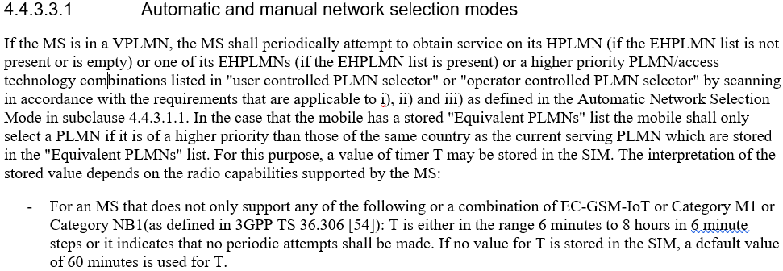

 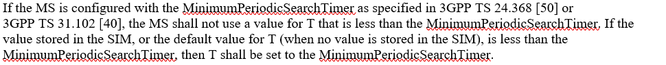

 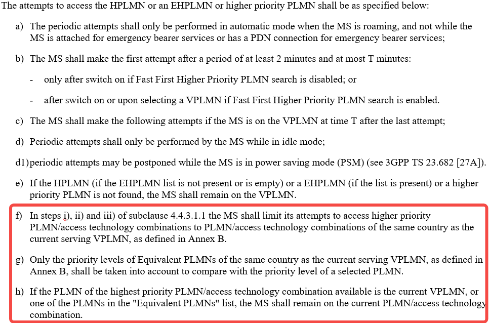

* 成功驻留在VPLMN上，会周期性搜索HPLMN/EHPLMN
* 默认是60min或在6min\~8hours范围内，以步长6min增加
* MinimumPeriodicSearchTimer规定了最小的搜索时间，在EFNASCONFIG中定义
* Fast First Higher Priority PLMN search规定了开机快速启动高优先级定时器，在EFNASCONFIG中定义，最少2min
* 选择的优先级应该比与VPLMN同一个国家的EPLMN要高
* 只在和VPLMN相同国家的PLMN中进行高优先级找网

EFHPPLMN：

 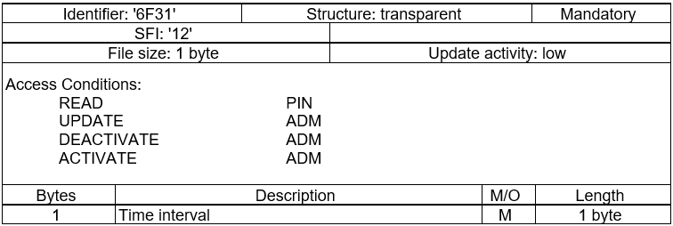

 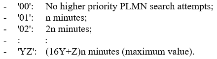

### 4.2.5、整体流程图（TS 23.122 Figure 2a）

 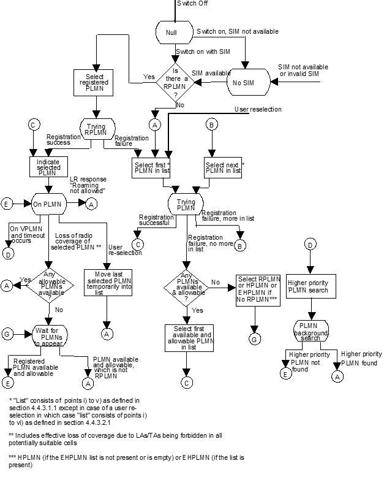

拓展：MTK和展锐OOS/限制驻留定时器对比：

| 方式 | MTK（FAQ23879） | 展锐 |
|----|----|----|
| 默认时长 | 第1\~6次：20s   第7\~12次：30s   第13\~18次：60s   第19次之后：120s | 第1次：5s   第2\~10次：10s   第11\~19次：20s   第20次之后：30s |
| NV配置 | NWSEL_RECOVERY_TIMER_INTERVAL | nv_oos_times_config表示次数，nv_oos_timer_configi表示时长 举例：前10次时长为40秒，11到20次为80秒，20次之后为120秒 nv_oos_times_config\[0\]=10，nv_oos_times_config\[1\]=20，nv_oos_times_config\[2\]=20，nv_oos_times_config\[3\]=20。   nv_oos_timer_config\[0\]=4，nv_oos_timer_config\[1\]=8，   nv_oos_timer_config\[3\]=12，nv_oos_timer_config\[4\]=12 |
| AT指令 | / | AT+SPNASDUMMY="get oos timer",1,10,20,20,20,4,8,12,12 或AT+SPNASDUMMY="get limited timer",1,10,20,20,20,4,8,12,12 |

P671LP672L-4357找网问题分析：

展锐：

| 11:27:41.750 | MSG_ID_GMMREG_POWERON_PS_REQ | 开机 |
|----|----|----|
| 11:27:41.753 | EPSLOCI_ID_R1：FF FF FF FF FF FF FF FF FF FF FF FF FF FF FF 00 00 01 | EPCLOCI文件没有有效数据 |
| 11:27:41.772 | mm_ph: plmn info HPLMN is 25011f,act:19 | HPLMN为25011 |
| 11:27:41.772 | mm_ph: plmn info FPLMN in FPLMN_ID is 25001f current_fplmn_num:1 | FPLMN |
| 11:27:41.772 | mm_ph: plmn info FPLMN in FPLMN_ID is 25099f current_fplmn_num:2 |    |
| 11:27:41.772 | mm_ph: plmn info FPLMN in FPLMN_ID is 25020f current_fplmn_num:3 |    |
| 11:27:41.772 | mm_plm_read_common_sim_info rplmn_from_nv_flag:1 at line:2691 | NV中的存在有效RAT |
| 11:27:41.772 | mm_plm_read_common_sim_info nv_rplmn:0x25050f | NV中RPLMN为25050 |
| 11:27:41.772 | mm_plm_read_common_sim_info rplmn:0xffffff | SIM卡中的RPLMN为空 |
| 11:27:41.834 | mm_ph: plmn info UPLMN in USIM_PLMNwACT_ID is 25011f act 16 | UPLMN |
| 11:27:41.834 | mm_ph: plmn info UPLMN in USIM_PLMNwACT_ID is 25011f act 2 |    |
| 11:27:41.834 | mm_ph: plmn info UPLMN in USIM_PLMNwACT_ID is 25011f act 1 |    |
| 11:27:41.853 | mm_ph: plmn info OPLMN in USIM_OPLMNwACT_ID is 25011f act 16 | OPLMN |
| 11:27:41.853 | mm_ph: plmn info OPLMN in USIM_OPLMNwACT_ID is 25050f act 2 |    |
| 11:27:41.853 | mm_ph: plmn info OPLMN in USIM_OPLMNwACT_ID is 25050f act 1 |    |
| 11:27:41.866 | mm_ph:plmn info EHPLMN in USIM is 25011f added to plm_list_ptr\[PLM_EHPLMN_INDEX\],set default avai:0x13 | EHPLMN：25011，25002 |
| 11:27:41.866 | mm_ph:plmn info EHPLMN in USIM is 25002f added to plm_list_ptr\[PLM_EHPLMN_INDEX\],set default avai:0x13 |    |
| 11:27:41.893 | mm_ph: plmn info EHPLMN in USIM_HPLMNwACT_ID is 25011f act 16 | HPLMNwACT |
| 11:27:41.893 | mm_ph: plmn info EHPLMN in USIM_HPLMNwACT_ID is 25050f act 2 |    |
| 11:27:41.893 | mm_ph: plmn info EHPLMN in USIM_HPLMNwACT_ID is 25050f act 1 |    |
| 11:27:41.893 | mm_ph: plmn info EHPLMN in (1) is 25011f act 16 | 更改了EHPLMN的RAT |
| 11:27:41.893 | mm_ph: plmn info EHPLMN in (1) is 25011f act 3 |    |
| 11:27:41.893 | mm_ph: plmn info EHPLMN in (1) is 25002f act 19 |    |
| 11:27:41.893 | plm:plm_set_current_plmn,plmn:25011f,avai:0x10,supp_acc:0x10,srched:0x0 | 选中25011进行4G找网 |
| 11:27:41.894 | mm_plm_sim_read_complete_hdlr(), NAS POWERON FINISH. | 读卡完成 |
| 11:27:41.911 | MSG_ID_CMD_ASM_SELECT_CELL_REQUEST | 开始4G找网 |
| 11:27:41.913 | MSG_ID_LTE_CPHY_FREQ_SEARCH_CELL_REQ | 使用历史频点找网 |
|    | ...... |    |
| 11:27:43.009 | MSG_ID_LTE_CPHY_FREQ_SEARCH_CELL_CNF |    |
| 11:27:43.047 | **MSG_ID_LTE_CPHY_BAND_SWEEP_REQ** | 扫频 |
| 11:28:09.400 | **MSG_ID_RR_PLM_PLMN_SEL_FAILURE_IND** | 4G找网结束，找到了\*\*25050\*\*和25099。整体耗时28s。 |
| 11:28:09.400 | plm:plm_set_current_plmn,plmn:25011f,avai:0x3,supp_acc:0x3,srched:0x0 | 选中25011进行3G找网 |
| 11:28:09.463 | MSG_ID_PLM_AS_3G_PLMN_SEL_REQ | 开始3G找网 |
| 11:28:10.927 | MSG_ID_RR_PLM_PLMN_SEL_FAILURE_IND | 3G找网结束 |
| 11:28:10.927 | plm:plm_set_current_plmn,plmn:25011f,avai:0x1,supp_acc:0x3,srched:0x2 | 选中25011进行2G找网 |
| 11:28:10.933 | MSG_ID_PLM_AS_GPRS_PLMN_SEL_REQ | 开始2G找网 |
| 11:28:25.987 | MSG_ID_RR_PLM_PLMN_SEL_FAILURE_IND | 2G找网结束，available_plmn=25050,25002,25001 |
|    | ...... | 在25002上ATTACH和LR被拒的过程 |
| 11:31:26.326 | plm:plm_set_current_plmn,plmn:25050f,avai:0x10,supp_acc:0x10,srched:0x0 | 选中25050进行4G找网 |
| 11:31:26.349 | MSG_ID_CMD_ASM_SELECT_CELL_REQUEST | 总耗时约3分半 |

MTK：

| Local Time | Message | Comment |
|----|----|----|
| 10:46:12:060 | MSG_ID_SIM_PLUG_IN_IND |    |
| 10:46:14:864 | \[NWSEL Context\] NWSEL_EHPLMN\[0\]: 25011f , RAT_NONE |    |
| 10:46:14:864 | \[NWSEL Context\] NWSEL_EHPLMN\[1\]: 25002f , RAT_NONE |    |
| 10:46:14:864 | \[NWSEL Context\] NWSEL_FPLMN\[0\]: 25001f , RAT_GSM_UMTS_LTE_NR |    |
| 10:46:14:864 | \[NWSEL Context\] NWSEL_FPLMN\[1\]: 25099f , RAT_GSM_UMTS_LTE_NR |    |
| 10:46:14:864 | \[NWSEL Context\] NWSEL_FPLMN\[2\]: 25020f , RAT_GSM_UMTS_LTE_NR |    |
| 10:46:14:864 | \[NWSEL Context\] NWSEL_UPLMN\[0\]: 25011f , RAT_LTE |    |
| 10:46:14:864 | \[NWSEL Context\] NWSEL_UPLMN\[1\]: 25011f , RAT_UMTS |    |
| 10:46:14:864 | \[NWSEL Context\] NWSEL_UPLMN\[2\]: 25011f , RAT_GSM |    |
| 10:46:14:864 | \[NWSEL Context\] NWSEL_OPLMN\[0\]: 25011f , RAT_LTE |    |
| 10:46:14:864 | \[NWSEL Context\] NWSEL_OPLMN\[1\]: 25050f , RAT_UMTS |    |
| 10:46:14:864 | \[NWSEL Context\] NWSEL_OPLMN\[2\]: 25050f , RAT_GSM |    |
| 10:46:15:064 | MSG_ID_NAS_SV_EMM_PLMN_SEARCH_REQ | **rat = RAT_LTE** (enum 4)   **select_plmn=25011**   plmn_search_type = GIVEN_PLMN_EXCLUDE_FORBIDDEN_LA_FOR_ROAMING (enum 1)   **scan_type = STORED_ONLY** (enum 1) |
| 10:46:16:865 | MSG_ID_NAS_SV_EMM_PLMN_SEARCH_CNF | **result = PLMN_NOT_FOUND** (enum 0)   scan_type = STORED_ONLY (enum 1)   **available_plmn=25050** |
| 10:46:16:865 | MSG_ID_NAS_SV_MM_PLMN_SEARCH_REQ | **rat = RAT_UMTS** (enum 2)   plmn_search_type = GIVEN_PLMN_EXCLUDE_FORBIDDEN_LA_FOR_ROAMING (enum 1)   **select_plmn=25011**   **scan_type = STORED_ONLY** (enum 1) |
| 10:46:17:266 | MSG_ID_NAS_SV_MM_PLMN_SEARCH_CNF | **result = PLMN_NOT_FOUND** (enum 0)   rat = RAT_UMTS (enum 2)   scan_type = STORED_ONLY (enum 1) |
| 10:46:17:266 | MSG_ID_NAS_SV_MM_PLMN_SEARCH_REQ | \*\*rat = RAT_GSM \*\*(enum 1)   plmn_search_type = GIVEN_PLMN_EXCLUDE_FORBIDDEN_LA_FOR_ROAMING (enum 1)   **select_plmn=25011**   **scan_type = STORED_ONLY** (enum 1) |
| 10:46:17:266 | MSG_ID_NAS_SV_MM_PLMN_SEARCH_CNF | **result = PLMN_NOT_FOUND** (enum 0)   rat = RAT_GSM (enum 1)   scan_type = STORED_ONLY (enum 1) |
| 10:46:17:266 | MSG_ID_NAS_SV_EMM_PLMN_SEARCH_REQ | \*\*rat = RAT_LTE \*\*(enum 4)   plmn_search_type = GIVEN_PLMN_EXCLUDE_FORBIDDEN_LA_FOR_ROAMING (enum 1)   **select_plmn=25002**   **scan_type = STORED_ONLY** (enum 1) |
| 10:46:18:669 | MSG_ID_NAS_SV_EMM_PLMN_SEARCH_CNF | **result = PLMN_NOT_FOUND** (enum 0)   **available_plmn=25050**   scan_type = STORED_ONLY (enum 1) |
| 10:46:18:669 | MSG_ID_NAS_SV_MM_PLMN_SEARCH_REQ | **rat = RAT_UMTS** (enum 2)   plmn_search_type = GIVEN_PLMN_EXCLUDE_FORBIDDEN_LA_FOR_ROAMING (enum 1)   **select_plmn=25002**   **scan_type = STORED_ONLY** (enum 1) |
| 10:46:19:482 | MSG_ID_NAS_SV_MM_PLMN_SEARCH_CNF | **result = PLMN_NOT_FOUND** (enum 0)   rat = RAT_UMTS (enum 2)   scan_type = STORED_ONLY (enum 1) |
| 10:46:19:482 | MSG_ID_NAS_SV_MM_PLMN_SEARCH_REQ | **rat = RAT_GSM** (enum 1)   plmn_search_type = GIVEN_PLMN_EXCLUDE_FORBIDDEN_LA_FOR_ROAMING (enum 1)   **select_plmn=25002**   **scan_type = STORED_ONLY** (enum 1) |
| 10:46:20:529 | MSG_ID_NAS_SV_MM_PLMN_SEARCH_CNF | **result = PLMN_NOT_FOUND** (enum 0)   rat = RAT_GSM (enum 1)   scan_type = STORED_ONLY (enum 1) |
| 10:46:20:529 | MSG_ID_NAS_SV_EMM_PLMN_SEARCH_REQ | **rat = RAT_LTE** (enum 4)   plmn_search_type = GIVEN_PLMN_EXCLUDE_FORBIDDEN_LA_FOR_ROAMING (enum 1)   **select_plmn=25050**   **scan_type = STORED_ONLY** (enum 1) |
| 10:46:20:729 | MSG_ID_NAS_SV_EMM_PLMN_SEARCH_CNF | **result = PLMN_FOUND** (enum 1)   找网整体耗时5s |

开机/丢失覆盖恢复选网：

 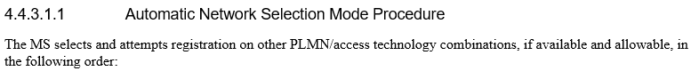

手动重选：

 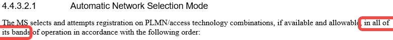

|    | 展锐 | MTK |
|----|----|----|
| 找网区别 | 展锐是为了驻留高优先级PLMN。在每个RAT下先携带一个EHPLMN，用历史频点找网，找不到EHPLMN，会使用全band找网。将搜索到的PLMN进行排序，选择最高优先级的PLMN进行驻留。 | MTK是为了开机时加快驻留PLMN。先使用历史频点找每个RAT下的EHPLMN，如果都找不到EHPLMN，则使用历史频点搜索出来的VPLMN，选择优先级最高进行驻留。完全找不到任何网络或者使用历史频点找到的网络全部注册失败，才会使用全band找网。 |

解决方案：

使用NV中的RPLMN： 配置NV prior_try_all_rplmn_and_rat_flag为1。PLMN优先级为：

NV PLMN>(SIM)RPLMN>HPLMN/EHPLMN>UPLMN>OPLMN>other PLMN。

## 来源记录

- [从协议层面理解找网流程——PLMN选择](http://192.168.3.94:8888/doc/plmn-cBqf3HJyqL) (`cBqf3HJyqL`)
- [LTE学习--小区搜索之概述及扫频](http://192.168.3.94:8888/doc/lte-91YMbjV3pr) (`91YMbjV3pr`)
- [LTE学习--小区搜索之PSS&SSS检测](http://192.168.3.94:8888/doc/lte-psssss-Ht8zaJhX0A) (`Ht8zaJhX0A`)
