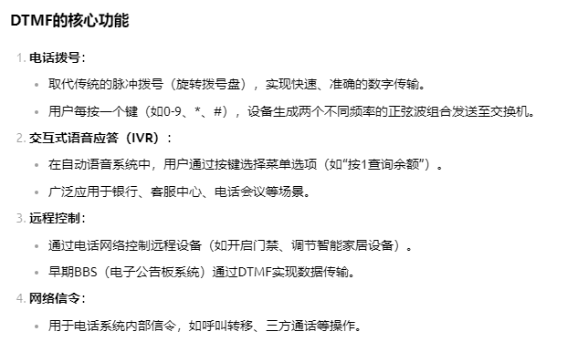

# FDN与通信基础概念

## 阅读入口

- 本文是迁入/补充资料，先按本节入口定位，再看正文和来源记录。
- 可复用结论应沉淀到主流程/配置/排障/case；本文只保留溯源材料和操作细节。

## 阅读重点

- 本文用于补充协议和基础概念；实际问题定位时需要回到对应业务流程、平台代码和案例库交叉验证。
- 图片已转成本地附件，适合在 HTML 中快速查看流程图和字段截图。

迁入基础概念中可复用的 FDN 等概念整理。

> 图片已保存为本地附件；非图片附件仍保留原 Outline 链接作为资料索引。

## 1、基本概念

### FDN (Fixed Dialing Number)

固定拨号功能, 这个功能是为了在手机借给第三方时防止非授权的使用。就是只允许呼出FDN菜单中自己输入的联系人号码，设定指定号码后，手机只能拨出指定号码，非指定的号码不能拨出，短信的发送也会受到此规则的限制。但是，紧急呼叫是不受限制的. FDN菜单可以在Call Setting下找到

#### 常见需求：

1. FDN 最大个数要求（FDN是存储在SIM卡中的，个数限制取决于运营商SIM卡，Android没有限制，但是功能机由于空间限制一般有限制）
2. 某个或某些号码不受FDN限制

#### SMS中的FDN检查

FDN 对短信也生效，并且检查范围不是只有收件人号码。按照历史问题结论，SMS 发送时会同时检查短信中心号码（SMSC）和最终收件人号码，因此测试 FDN + SMS 时需要把两者都加入 FDN list。详见 [[../60_Configuration/SMS配置方法#SMSC来源与FDN边界|SMS配置方法]]。

### SDN (Service Dialing Number)

服务号码，该功能手机一般都支持，可以从SIM中读取SDN，显示在电话本，效果类似于内置联系人。

该需求有时会被误认为紧急号码预置！！！因为有些运营商写的服务号码有类似 "Ambulance number 181"

### P-CSCF (Proxy-Call Session Control Function)

代理呼叫会话控制功能，是IMS网络的第一接入点，处理SIP信令路由（如VoLTE/VoWiFi通话）。

### HSS (Home Subscriber Server)

HSS是IMS核心网络中的归属用户服务器，存储IMS用户的签约数据、无线用户的鉴权五元组等信息。它提供用户认证、授权和用户策略管理的功能，是IMS网络中的重要用户数据库

### RBT (Ring Back Tone)

回铃音，就是MO 拨打MT时。MO端听到的铃声。如果是彩铃那么就是Color Ring Back Tone(CRBT)

MO: Mobile Originated   MT: Mobile Terminated

在移动通讯过程中，发送端和接收端的专业称呼，用户SMS，MMS，Call等

RBT 的来源：ring back tone有的时候是网络播放的，有的时候是手机本地播放的。不同地区和不同运营商之间的RBT不同。

RBT 的客制化：由于有些国家或运营商对RBT要强制要求，一定要播放特定铃声，所以需要对UE内置RBT进行客制化。我们可以通过判断mcc 或mccmnc 等方法对不同地区不同运营商进行特定客制化。

### RTT (Real-time Text)

RTT 是一种辅助通信技术，专为听障或言语障碍用户设计，支持在通话中实时传输文本（输入即发送，无需点击"发送"按钮）

### RCS (Rich Communication Services)

富媒体通信服务，RCS是传统短信（SMS）和彩信（MMS）的升级版，由全球移动通信系统协会（GSMA）主导制定，旨在提供更丰富的通信体验
RCS语音消息允许用户通过手机原生短信应用直接发送语音片段，而无需依赖第三方应用。语音消息可与其他富媒体内容（如图片、视频、位置、文件等）结合发送，并支持群聊、已读回执、输入状态提示等互动功能

### RTP (Real-time Transport Protocol)

实时传输协议，是一种用于传递实时音频、视频或模拟数据的网络传输协议。它设计用于传输多媒体数据，如音频和视频，以支持实时通信应用，如VoIP电话、视频会议和流媒体。RTP报文由两部分组成：报头和有效载荷。RTP报头包含版本号、填充标志、扩展标志、CSRC计数器、标记、有效载荷类型、序列号、时戳和同步信源标识符等信息

### NSA (Non-Standalone)

非独立组网，是用现有的4G网络，进行改造、升级和增加一些5G设备，4G核心网/5G核心网+4G基站+5G基站的组合模式。目的是为了利用现有4G普及的优势，不仅可以节省成本还能快速部署

### SA (Standalone)

独立组网，是一套全新的5G网络，包括全新的核心网和基站设备，引入了全新网元与接口，并大规模采用网络虚拟化、软件定义网络等新技术

### CSFB (Circuit Switched Fallback)

是一种单卡单待方案，同一时刻终端只能驻留于一种网络中（LTE或2/3G）。

支持CSFB的终端开机后若有LTE覆盖，则驻留于LTE网络中，当接收语音呼叫时，UE回落到2/3G网络接听CS呼叫，呼叫结束后又回到LTE网络。

UE发起语音呼叫时，UE先回落到2/3G网络，呼叫结束后再回到LTE网络。

### SRVCC (Single Radio Voice Call Continuity)

SRVCC是VoLTE不完全覆盖前的解决方案，也是一种单卡单待方案。

由于终端同一时刻只驻留于一种网络中，当在两种网络中切换并保持连续性时，需要CS域、LTE PS域和IMS域共同完成承载和会话层的切换。

当LTE基站发现终端有正在进行的语音通话且需要切换，且目标小区是2G/3G小区时，通知MME进行SRVCC切换。

简而言之，当你正在VoLTE通话中时，从4G覆盖地区移动到了无4G覆盖的地区（只有2G/3G），可以平滑地切换，保持电话不中断。

### DTMF (Dual-Tone Multi-Frequency)

是一种通过组合两个特定频率的音频信号来传输信息的通信技术，主要用于电话系统中的数字和符号传输

 

### **FQDN (**Fully Qualified Domain Name)

完全限定域名,是网络环境中用于**精确标识设备/服务位置的全局唯一域名**，其作用可类比"网络世界的GPS坐标"

### IMPU（IP Multimedia Public Identity）

IP多媒体公共身份，IMS网络中用于标识用户的公共身份，通常以SIP URI或Tel URI的形式存在。SIP URI遵循RFC 3261和RFC 4474的格式，允许使用字母数字字符，例如sip:user123@telstra.com

### **IMPI (**IP Multimedia Private Identity)

IP多媒体私有身份，IMPI是IMS（IP Multimedia Subsystem）网络中的核心用户标识符，其作用可类比为"IMS网络中的用户名"

### **PANI (P-Access-Network-Info)**

P-Access-Network-Info: IEEE-802.11;i-wlan-node-id=c637aad7c9ba;country=SA
P-Access-Network-Info: 3GPP-E-UTRAN-FDD;utran-cell-id-3gpp=420032c931b2545a

| **参数名称** | **格式要求** |
|----|----|
| **access-type** | 3GPP-E-UTRAN-FDD / 3GPP-NR-TDD |
| **utran-cell-id-3gpp** | 28位十六进制（ECI） |
| **tac-3gpp** | 16位十六进制 |
| **plmn-3gpp** | MCC+MNC（例：001-01） |

### CB(Cell Broadcasting)

小区广播（Cell Broadcasting，CB）是由运营商或者其他网络发起者向指定区域内的设备用户发送的一种免费的特定消息，例如海啸地震预警，天气预报或当前的位置信息等

因为目前小区广播已经集成在mainline里了，所以目前我们的修改只能通过overlay去修改标题

### 2、3、4G不同制式

| **缩略词** | **全称** | **描述** |
|----|----|----|
| GSM | Global System for Mobile Communications全球移动通信系统 | 是由欧洲电信标准组织ETSI（ European Telecommunications Standards Institute）制订的一个数字移动通信标准。是应用最广的2G标准 |
| GPRS | General Packet Radio Service通用分组无线业务 | 由GSM网络升级改造而来，属于2.5G，理论最高速率171kbps |
| EDGE | Enhanced Data Rate for GSM Evolution强型数据速率GSM演进技术 | 由GSM网络升级改造而来，属于2.75G，理论最高速率384kbps |
| GERAN | GSM EDGE Radio Access Networ，GSM/EDGE 无线通讯网络 | 由3GPP制定和维护，是GSM的一个关键部分，也包括在UMTS/GSM网络中。GERAN是GSM/EDGE的无线接入部分，包括基站(base stations)和基站控制器(base station controllers)以及它们的接口(Ater接口、Abis接口、A 接口等)。一个移动运营商的网络由多个GERANs组成，在UMTS/GSM的网络中则和UTRAN组合。不包含EDGE的GERAN的网络就是GRAN。不包含GSM的GERAN的网络就是ERAN。 |
| CDMA | Code Division Multiple Access码分多址 | 最早由美国高通公司推出，是在数字技术的分支--扩频通信技术上发展起来的一种崭新而成熟的无线通信技术。 |
| CDMA 1x |   | 由CDMA演进而来，属于2.5G，理论最高速率153kbps |

| UMTS | Universal Mobile Telecommunications System通用移动通信系统 | 3G技术的统称是由3GPP组织进行标准化的第三代移动通信标准（3G），其空中接口协议包括WCDMA和TD-SCDMA两个，核心网则是沿用GPRS时期的核心网。UMTS有时也叫3GSM，强调结合了3G技术而且是GSM标准的后续标准 |
|----|----|----|
| WCDMA | Wideband Code Division Multiple Access宽带码分多址 | 是一种3G蜂窝网络，使用的部分协议与2G GSM标准一致，它是一个ITU标准由3GPP 开发，全球使用，全球份额最大 |
| TD-SCDMA | Time Division-Synchronous Code Division Multiple Access时分同步码分多址 | 是ITU正式发布的第三代移动通信空间接口技术规范之一，它得到了CWTS及3GPP的全面支持由大唐电信开发，仅中国使用，份额最小 |
| UTRAN | UMTS Terrestrial Radio Access NetworkUMTS陆地无线接入网  | 在3G网络中，接入网部分叫做UTRAN。是UMTS最重要的一种接入方式，适用范围最广 |
| HSDPA | High Speed Downlink Packet Access高速下行分组接入 | 是一种移动通信协议，WCDMA在R5规范中引入的 |
| HSUPA | high speed uplink packet access高速上行链路分组接入 | WCDMA在R6规范中引入的  |
| HSPA | HSPA High-Speed Packet Access高速分组接入 | HSDPA和HSUPA合称为HSPA，通常被称为3.5G，是WCDMA网络的升级版 |
| HSPA+ | High-Speed Packet Access+增强型高速分组接入 | WCDMA在R7规范中引入的是HSPA的强化版本。HSPA+比HSPA的速度更快，性能更好，技术更先进，同时网络也更稳定，是LTE技术运用之前的最快的网络 |
| CDMA2000 | Code Division Multiple Access 2000 | 由3GPP2 开发，是一个3G移动通讯标准，ITU的IMT-2000标准认可的无线电接口，也是2G CDMA标准的延伸。 根本的信令标准是IS-2000。CDMA2000与UMTS不兼容目前使用CDMA的地区只有日、韩和北美，所以CDMA2000的支持者不如WCDMA多 |

| LTE | Long Term Evolution通用移动通信技术的长期演进 | 由3GPP组织制定的UMTS技术标准的长期演进，是3G与4G技术之间的过渡，俗称为3.9G。虽然"4G"和"LTE"通常可以互换使用，实际上它不是真正的4G，因为它没有符合ITU无线电通讯部门要求的4G标准，除最大带宽、上行峰值速率两个指标略低于4G要求外，其他技术指标都已经达到了4G标准的要求。 |
|----|----|----|
| LTE-A | LTE-Advanced长期演进技术升级版 | 是LTE技术的后续演进。2008年6月，3GPP完成了LTE-A的技术需求报告，提出了LTE-A的最小需求：下行峰值速率1Gbps，上行峰值速率500Mbps，上下行峰值频谱利用率分别达到15Mbps/Hz和30Mbps/Hz。这些参数已经远高于ITU的最小技术需求指标，具有明显的优势。 |
| E-UTRAN | Evolved Universal Terrestrial Radio Access Network演进的通用陆基无线接入网 | 在3G网络中，接入网部分叫做UTRAN。在LTE网络中，因为演进关系，我们将接入网部分称为E-UTRAN，即LTE中的移动通信无线网络。 |
| LTE-TDD（别名TD-LTE） | Time Division Duplexing时分双工 | 通过在时间上错开，来区分上行（手机到基站的传输）与下行（基站到手机的传输）业务，避免干扰。是基于CDMA的技术规范。全球TD-LTE可使用频段12个，分别为：band 33/34/35/36/37/38/39/40/41/42/43/44/ |
| LTE-FDD | Frequency Division Duplexing频分双工 | 指上行链路（移动台到基站）和下行链路（基站到移动台）采用两个分开的频率（有一定频率间隔要求，间隔190MHz）工作，该模式工作在对称频带上。由于无线技术的差异、使用频段的不同以及各个厂家的利益等因素，LTE-FDD的标准化与产业发展都领先于LTE-TDD。LTE-FDD已成为当前世界上各国广泛采用的终端种类最丰富的一种4G标准。 |

### 相关文档

[网络基础知识.ppt 8384512](..\attachments\outline\files\015ac6c8-e637-4d79-8daa-45ef20e74d76_网络基础知识.ppt)

[运营商常见需求解读和移动通信相关知识介绍.pptx 2762492](..\attachments\outline\files\4d29251c-468a-4d1d-a8e5-848e54416d4e_运营商常见需求解读和移动通信相关知识介绍.pptx)

## 来源记录

- [1、基本概念](http://192.168.3.94:8888/doc/1-KCtcZ2tjuz) (`KCtcZ2tjuz`)
