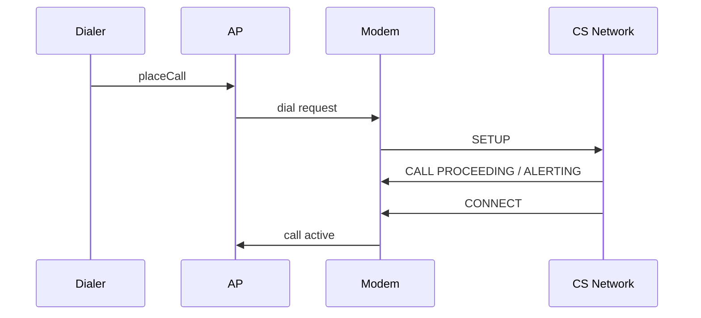
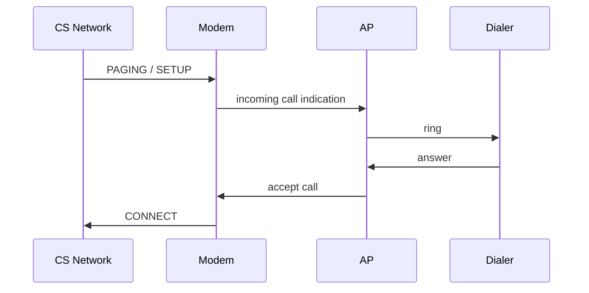
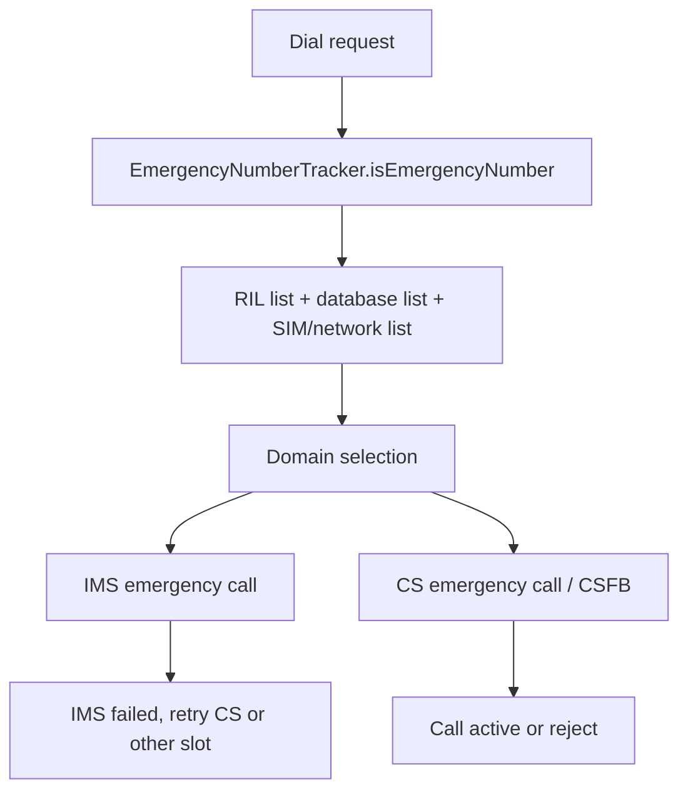
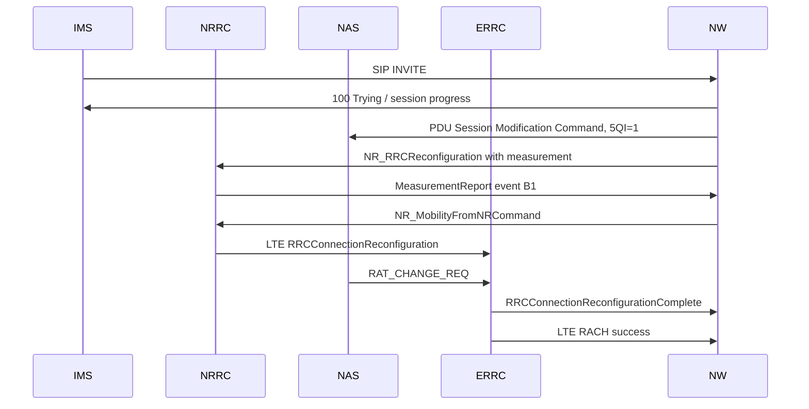
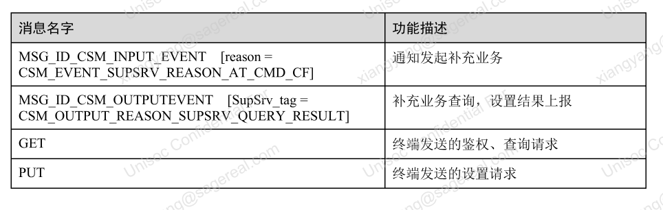
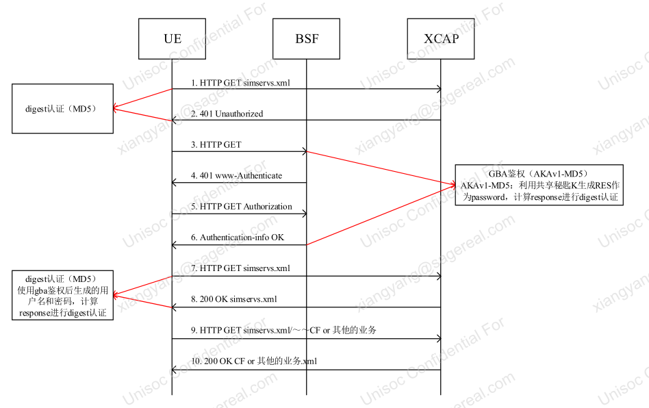
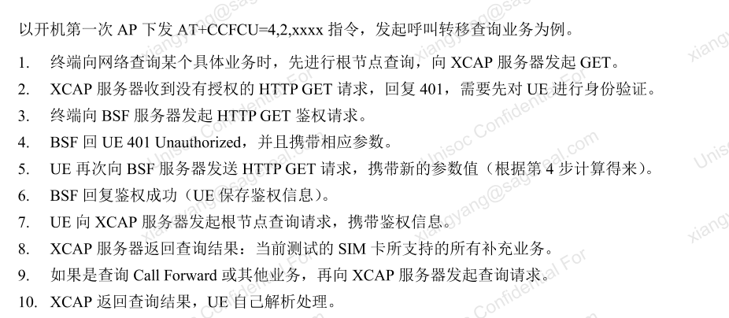
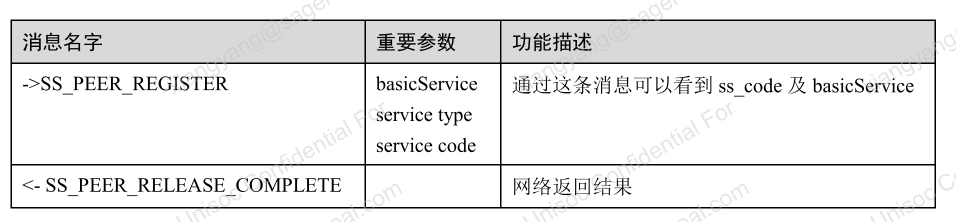
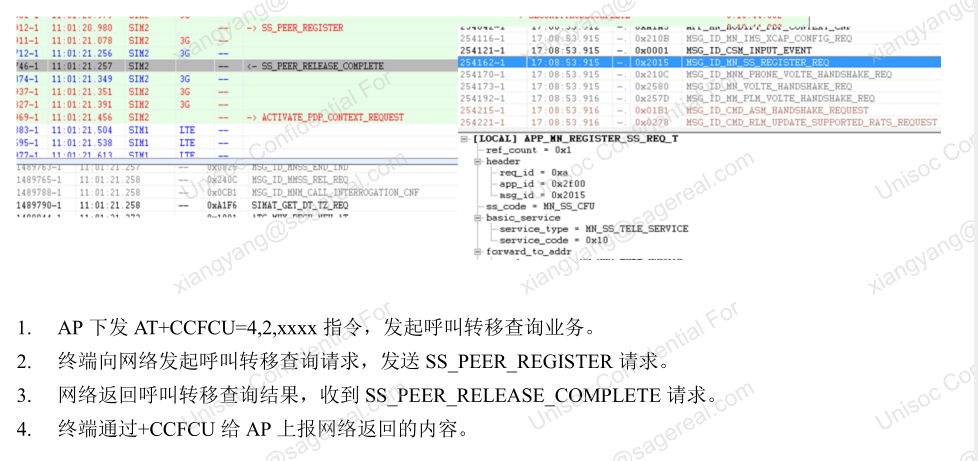

# Call业务流程

## 阅读入口

- 本文是迁入/补充资料，先按本节入口定位，再看正文和来源记录。
- 可复用结论应沉淀到主流程/配置/排障/case；本文只保留溯源材料和操作细节。

Call 相关短流程统一放在这里：CS Call、ECC、SRVCC、EPSFB、掉话和补充业务。长篇迁入代码资料仍保留在 [[CS-Call流程补充]]。

## CS-Call流程

---
domain: Call
feature: CS Call
rat: GSM/WCDMA
layer: AP/Modem/Network
status: draft
---

### MO Call正常路径



### MT Call正常路径



### 常见观察点

- 当前是否有CS注册。
- LTE场景下是否需要CSFB。
- AP是否发出 dial/accept/hangup。
- Modem是否发出 SETUP 或收到 SETUP。
- disconnect cause 是否来自网络、modem、AP策略。

### 常见异常

| 现象 | 可能方向 |
|---|---|
| LTE下CS拨号失败 | CSFB未触发、IMS/CS域选择错误 |
| 2G/3G下拨号失败 | CS注册、SETUP reject、网络侧cause |
| 来电不响铃 | paging、MT indication、AP通知链路 |
| 接通后掉话 | 无线、网络释放、modem异常、AP误挂断 |

## ECC紧急呼叫流程

### 一句话

紧急呼叫问题先分清“号码是否被识别为紧急号码”和“紧急呼叫是否能建立成功”。前者看号码来源和 AP 缓存，后者看域选择、IMS/CS 回退、搜网和释放原因。

### 紧急号码来源

| 来源 | 关键证据 | 说明 |
|---|---|---|
| 协议默认 | 无卡默认号码、有卡默认 `911/112` | 不能只按本地配置判断 |
| SIM | EF_ECC | USIM/SIM 卡内号码 |
| 网络 | Attach/TAU Accept、`+CEN2:<cat>,<number>` | 网络可下发紧急号码列表 |
| 本地配置 | EccList / `ecc_list.xml` / 运营商需求表 | AP 或平台资源维护 |

### AP侧判断链路



双卡机要特别注意：`EmergencyNumberTracker` 缓存的是设备级紧急号码列表，RIL 上报和 database 中的号码可能被合并。某张卡配置的紧急号码在另一张卡拨号时也可能被识别为 emergency number，这可能是平台设计，不一定是错误。

无卡紧急呼叫还要额外确认 AP 最终选择的 `phoneId/subId/slotId`。历史案例 [[../../40_Case-Library/Call/2025-12-10_ECC_UNISOC_无卡紧急呼叫选到eSIM卡槽失败|无卡紧急呼叫选到 eSIM 卡槽失败]] 显示，设备没有实体 SIM 但存在 eUICC 时，紧急呼叫可能被 AP 选卡逻辑下发到非预期协议栈。此时不要只看 ECC 号码识别和域选择，要同时看 RIL/AT 命令实际下发到了哪个 `sim:x`。

### 建立失败第一坏点

| 阶段 | 现象 | 优先方向 |
|---|---|---|
| 号码识别 | 普通号码被识别为紧急号码 | EccList、RIL上报、database缓存、双卡共享策略 |
| 卡槽选择 | 无卡/eSIM/双卡场景拨号下发到非预期栈 | `phoneId/subId/slotId`、eUICC过滤、RIL/AT `sim:x` |
| 锁卡状态 | PIN/PUK locked 下号码识别正确但呼叫无声或不建立 | ECC 属性、`is_escv_present`、`MNCALL_JudgeCallDomain` |
| 域选择 | 应走 CS 却先走 IMS，或 IMS emergency 不支持 | VDM/domain selection、IMS emergency capability |
| IMS | SIP 返回 380/403/408 | IMS emergency 策略、网络支持、P-CSCF |
| CS回退 | CS RAT 找网超时 | 2G/3G开关、CSFB、PLMN search、T_CSFB |
| 无卡/副卡重试 | 主卡失败后没有及时切换 | L4 retry、slot选择、超时策略 |
| 网络拒绝 | Location update / RAU reject | 漫游限制、LA/RA限制、SIM签约 |

### 结论写法

```text
该问题不是简单的“紧急号码配置错误”。当前第一坏点在 xxx：
- AP 已/未将号码识别为 emergency number；
- 域选择结果为 IMS/CS；
- IMS/CS 侧失败原因是 xxx；
- 后续是否触发副卡/无卡/CS retry。
```

## SRVCC流程

### SRVCC和CSFB区别

| 维度 | SRVCC | CSFB |
|---|---|---|
| 场景 | VoLTE/VoNR 通话中从 PS 域切到 CS 域 | LTE/NR 上发起 CS 业务前回落 |
| 目标 | 保持语音会话连续 | 建立 CS 呼叫 |
| 触发 | 测量、覆盖、网络切换策略 | 域选择和 CS service |
| 网络要求 | MME/MSC Server/IMS 锚定支持 | MME/MSC 联合附着支持 |
| 用户感知 | 理想情况下不断话 | 呼叫建立前有回落时延 |

### SRVCC类型

| 类型 | 触发阶段 | Feature Tag |
|---|---|---|
| normal SRVCC / eSRVCC | 200 OK 后，通话 active 阶段 | `g.3gpp.srvcc` |
| pre-alerting SRVCC / bSRVCC | 183 到 180 前 | `g.3gpp.ps2cs-srvcc-orig-pre-alerting` |
| alerting SRVCC / aSRVCC | 180 到 200 OK 之间 | `g.3gpp.srvcc-alerting` |
| mid-call SRVCC | hold、conference 等 mid-call 场景 | `g.3gpp.mid-call` |

### 能力协商

| 方向 | 看哪里 |
|---|---|
| 终端支持 normal SRVCC | LTE Attach Request 或 NR Registration Request capability |
| 终端支持 a/b/mid SRVCC | SIP INVITE / 1xx / 2xx 的 Contact feature tag |
| 网络支持 normal SRVCC | 主叫网络 1xx / 2xx |
| 网络支持 a/b/mid SRVCC | Feature-Caps 字段 |

主叫侧常用判断：

- INVITE Contact 看终端能力。
- 183 / 1xx / 2xx Feature-Caps 看网络能力。

被叫侧常用判断：

- INVITE Feature-Caps 看网络能力。
- 183 / 1xx / 2xx Contact 看终端能力。

### MTK配置速查

| 参数 | 含义 |
|---|---|
| `nvram_ims_profile_ptr->ua_config.srvcc_feature_enable` | bit0 SRVCC、bit1 aSRVCC、bit2 midSRVCC、bit3 bSRVCC，默认常见为 `0x000F` |
| `force_srvcc_transfer` | 网络未明确支持时是否强制执行部分 SRVCC 转移 |

### 第一坏点

| 现象 | 优先方向 |
|---|---|
| 不触发 SRVCC | UE能力未上报、网络未下发能力、测量/覆盖未满足 |
| SRVCC 后掉话 | MSC/IMS 锚定、STN-SR、切换执行、CS侧建立失败 |
| 仅特定运营商失败 | 运营商 Feature-Caps、IMS profile、SRVCC 签约 |
| conference/hold 场景失败 | mid-call SRVCC feature tag 和 modem patch |

## EPSFB流程

### 一句话

EPSFB 是 NR/5GC 语音业务不可直接在 NR 上完成时，回落到 LTE/EPC 承载语音的过程。定位时要同时看 SIP/IMS、NR RRC mobility、LTE RRC 接入、EPS bearer。

### 典型信令链路



### MTK关键证据

| 关键字 | 含义 |
|---|---|
| SIP `INVITE` | 语音业务触发 |
| `VGSM_PDU_SESSION_MODIFICATION_COMMAND` | 网络修改 PDU session，语音 5QI 常见为 1 |
| `NR_RRCReconfiguration` | 配置测量对象和 B1 事件 |
| `NR_MeasurementReport` | UE 上报满足回落条件 |
| `NR_MobilityFromNRCommand` | 网络下发从 NR 到 LTE 的 mobility 命令 |
| `MSG_ID_NAS_SV_NRRC_RAT_CHANGE_IND` | NAS 收到 RAT change 指示 |
| `ERRC_RRCConnectionReconfiguration` | LTE 侧承接重配置 |
| `EL2_MAC_RACH_Attempt_Event` | LTE RACH 成功或失败 |

### 第一坏点

| 阶段 | 异常 | 方向 |
|---|---|---|
| IMS触发 | 没有 INVITE 或语音专载 | IMS 能力、域选择、VoNR/EPSFB 策略 |
| PDU修改 | 5QI=1 承载失败 | PDU session / QoS / 网络 |
| NR测量 | 无 B1 report | 测量配置、覆盖、门限 |
| Mobility | 无 `NR_MobilityFromNRCommand` | 网络策略或测量未满足 |
| LTE承接 | LTE RACH/RRC 失败 | 目标 LTE 小区、RACH、RF |
| 回落后掉话 | SIP/CS/IMS 状态不连续 | IMS 锚定、bearer、AP call state |

## Call-Drop分析

---
domain: Call
feature: Call Drop
layer: AP/IMSStack/Modem/Network
status: draft
---

### 核心问题

掉话分析首先要回答：是谁先释放了通话？

| 首个释放方 | 常见方向 |
|---|---|
| AP | 用户操作、上层策略、Telecom/Telephony异常 |
| IMS/SIP网络 | BYE、CANCEL、SIP error |
| CS网络 | Q.850 cause、无线/核心网释放 |
| Modem | 内部状态机、无线掉链、assert/restart |
| 对端 | 对端挂机或拒接 |

### 时间线关键点

- 通话建立时间。
- 音频是否正常。
- 第一个释放事件。
- AP DisconnectCause。
- SIP BYE/CANCEL/error 或 CS cause。
- RRC/NAS是否同时异常。
- 是否伴随信号变差、RAT切换、SRVCC、Wi-Fi切换。

### 分析模板

```text
第一个释放事件发生在 xx:xx:xx，来源是 xxx。
AP侧随后上报 DisconnectCause=xxx。
Modem/网络侧证据显示 xxx。
因此当前优先判断为：网络释放 / AP主动释放 / modem异常 / 对端释放。
```

## 补充业务流程补充资料

### 阅读顺序

- 先看入口触发，再看 AP 到 modem 的消息链路，再看协议层关键消息，最后看状态同步和异常分支。
- 厂商客制化需要记录开关来源、默认值、配置路径、log 关键字和回退条件。
- 本文作为流程补充，主线结论仍优先沉淀到对应业务流程文档。

补充业务、USSD/SS 相关流程补充。

> 图片已保存为本地附件；非图片附件仍保留原 Outline 链接作为资料索引。

### 补充业务排查速查

补充业务失败不要只看“是否发生 CSFB”。先判断入口和目标域：

| 场景 | 第一证据 | 配置入口 |
|---|---|---|
| Call Forwarding / Call Barring 查询或设置 | `AT+CCFC(U)`、SS domain decision、XCAP HTTP | [XCAP URL与AUID](../../60_Configuration/补充业务配置方法.md#XCAP-URL与ss_XcapAuid) |
| USSD code 失败 | `AT+ECUSD/EIUSD`、SIP 403、CISS REGISTER/FACILITY | [USSD域选](../../60_Configuration/补充业务配置方法.md#USSD域选) |
| XCAP 失败后 CSFB | HTTP 400/403、PDN reject、`EXTENDED_SERVICE_REQUEST` | 先查 XCAP URL/APN/签约，再看 CSFB |

### 补充业务流程

### 展锐平台

### 1.关键消息

 

### 2.正常流程

 

 

### 1.关键消息

 

### 2.正常流程

 

### 走本地补充业务

### MTK平台

<https://online.mediatek.com/apps/quickstart/QS00136#QSS02317>

### USSD流程

郑永俊

### 来源记录

- [补充业务流程](http://192.168.3.94:8888/doc/6kgl5ywf5lia5yqh5rwb56il-iI40lz20GX) (`iI40lz20GX`)
- [USSD流程](http://192.168.3.94:8888/doc/ussd-FnZp9BwIAV) (`FnZp9BwIAV`)
