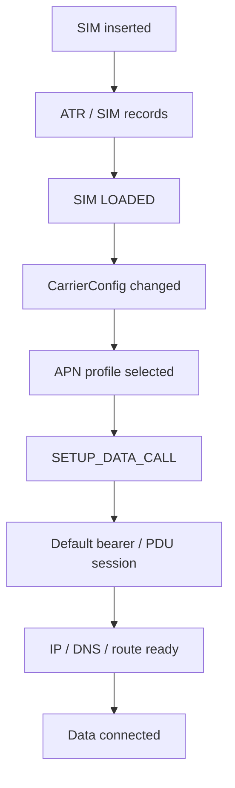

# Data业务流程

## 阅读入口

- 本文是迁入/补充资料，先按本节入口定位，再看正文和来源记录。
- 可复用结论应沉淀到主流程/配置/排障/case；本文只保留溯源材料和操作细节。

Data 域流程统一放在这里：APN/数据连接、默认承载/PDU Session、吞吐量和快速回网。配置字段细节仍放在 `60_Configuration`。

## 数据连接与APN流程

### 正常路径



### AP侧关键证据

| 阶段 | 关键字 | 含义 |
|---|---|---|
| 插卡 | `ACTION_SIM_STATE_CHANGED`、`GET_SIM_STATUS`、`+ESIMS` | 确认卡已插入并被 RIL 感知 |
| 加载完成 | `ACTION_SIM_STATE_CHANGED LOADED` | SIM records 已加载 |
| 配置刷新 | `CARRIER_CONFIG_CHANGED` | 运营商配置已切换到当前 subscription |
| 发起数据连接 | `SETUP_DATA_CALL` | AP/RIL 下发 DataProfile |
| 数据返回 | `DataCallResponse` | 看 `cause`、地址、DNS、MTU、PDU session |
| 断开 | `DEACTIVATE_DATA_CALL`、`DataCallListChanged` | 判断网络释放、AP释放还是重试 |

### APN字段检查

| 字段 | 说明 | 常见问题 |
|---|---|---|
| `carrier` | APN 名称显示 | 表格 NAME 和 XML 字段不一致 |
| `mcc/mnc` | 运营商匹配 | MNC 前导 0 丢失 |
| `apn` | DNN/APN 名称 | 与运营商表不一致 |
| `type` | default/ims/mms/xcap 等 | 类型漏配导致业务走错 APN |
| `protocol` | IP/IPV6/IPV4V6 | 写成非平台支持值或与网络能力不匹配 |
| `roaming_protocol` | 漫游协议 | 漫游下不可用 |
| `authtype` | 0/1/2/3 | 表格 NONE/PAP/CHAP 映射错误 |
| `user_visible` / `user_editable` | 用户可见/可编辑 | false 未落库或误隐藏 |
| `network_type_bitmask` | RAT 限制 | 漏配或多配特定 RAT |

### 快速验证APN

适合 userdebug 版本快速验证 APN 表项：

1. 导出设备中的 `apns-conf.xml`。
2. 修改期望字段。
3. 解锁 / remount 后 push 回设备。
4. 删除 `telephony.db`。
5. 重启，确认 APN 重新导入。
6. 复测 `SETUP_DATA_CALL` 和数据业务。

### 连接成功但不能上网

数据连接已经成功时，问题通常不在 `SETUP_DATA_CALL` 本身，要继续看网络数据面。

| 现象 | 优先方向 |
|---|---|
| DNS失败 | DNS query、DNS server、IPv4/IPv6 优先级 |
| TCP timeout | 三次握手、server 无响应、防火墙、代理 |
| `validation failed` | `NetworkMonitor` 的 DNS/HTTP/HTTPS 探测结果、portal redirect |
| IPv6-only APN不可用 | CLAT、NAT64 前缀、代理是否支持 IPv6 |
| 手动新建APN可用 | 项目 APN 表字段和手动 APN 差异 |
| XCAP/IMS相关数据失败 | XCAP URL、APN、DNS、IPv4/IPv6 优先级 |
| Wi-Fi 切蜂窝后无网络 | 默认网络切换、data call 是否重建、连通性检测是否被运营商重定向 |
| 已注册但网速慢 | RSRP/RSRQ/SINR/dbm、DNS/TCP 重传、同卡同地点对比 |

典型判断：

```text
APN 改为 IPv6 后数据不可用，但手动新建 IPv6 APN 可上网。
对比发现项目 APN 配置了 proxy，代理不支持 IPv6。
删除 proxy 后恢复，根因是 APN proxy 与 IPv6-only 网络不兼容。
```

### NetworkMonitor连通性检测

Android 建立 Wi-Fi 或蜂窝网络后，会通过 `NetworkMonitor` 对网络可用性做 DNS/HTTP/HTTPS 探测。数据连接成功但 UI 显示 `No internet connection`、网络图标异常、应用访问慢时，优先拉这一段证据。

| 关键字 | 判断 |
|---|---|
| `PROBE_DNS ... FAIL Timeout` | DNS server 无响应、链路丢包或 IPv4/IPv6 选择异常 |
| `UnknownHostException` | 域名解析失败后的结果，继续回看 DNS query/response |
| `PROBE_HTTP ... ret=204` | HTTP 连通性检查成功 |
| `PROBE_HTTPS ... Read timed out` | HTTPS 路径慢或无响应，结合 DNS/TCP 判断 |
| `validation failed with redirect` | 运营商门户、套餐/欠费页面、网关重定向或 captive portal |
| `isSuccessful=false isPortal=false` | 当前网络未通过系统连通性检测 |

分析顺序：

1. 先确认 `SETUP_DATA_CALL` 是否 `cause=NONE`，IP、DNS、ifname 是否存在。
2. 看 `NetworkMonitor` 是 DNS 失败、HTTP/HTTPS 失败，还是 redirect。
3. 用 netlog/pcap 对齐：DNS query 是否发出，是否有 response，TCP 是否重传。
4. 用 modem log 对齐：AP 侧包是否送到 CP，空口质量、RLC/PDCP 是否异常。
5. 弱场或 portal 场景必须做同卡同地点对比，不能只凭一次恢复动作归因 APN。

### 默认承载/PDN失败速查

默认承载问题要先区分“没建立起来”“被网络拒绝”“建立后被释放”三类。三类问题的第一坏点不同，处理方向也不同。

| 现象 | 关键证据 | 方向 |
|---|---|---|
| 默认承载未建立 | `PDN_CONNECTIVITY_REQUEST` 后没有 `ACTIVATE_DEFAULT_EPS_BEARER_CONTEXT_REQUEST/ACCEPT` | 网络未响应、弱场、核心网或 trace 不完整 |
| 网络拒绝 | `PDN CONNECTIVITY REJECT`、`ESM cause`、`Activate PDP context Reject` | APN/签约/业务选项/运营商策略 |
| 建立后释放 | `DEACTIVATE_DATA_CALL`、`ESM_PDN_DISCONNECT_REQUEST`、`PDN disconnect request` | AP/应用主动释放、按需激活策略、网络释放 |
| AP侧失败 | `DataCallResponse cause != NONE` 或无 IP/DNS/ifname | RIL/Modem 返回失败，继续看 ESM cause |
| AP侧成功但不可用 | `cause=NONE`，但 DNS/HTTP/TCP 失败 | 转 NetworkMonitor/netlog 数据面 |

常见 cause 口径：

| cause | 含义 | 常见判断 |
|---|---|---|
| `#27 missing or unknown APN` | 网络不认识请求的 APN | APN 名称、DNN、签约表不匹配 |
| `#29 user authentication failed` | 鉴权失败 | username/password/authtype 或签约问题 |
| `#31 request rejected, unspecified` | 网络拒绝但未给具体原因 | 需要同卡对比和运营商侧确认 |
| `#33 requested service option not subscribed` | 请求的业务选项未签约 | 常见于错误 APN、未开通业务或测试卡签约限制 |

CQWeb 历史问题中有两个容易误判的场景：

- 错误 APN 测试会触发 `PDN connectivity reject / Activate PDP context reject cause 33`，这属于网络按签约拒绝，不是注册失败。
- RTOS/穿戴平台 data PDN 可能按需激活；业务结束后由上层触发 `PDN disconnect request`，不是默认承载自己异常掉线。

## 吞吐量分析流程

### 先区分CA和DC

| 维度 | CA | DC / EN-DC |
|---|---|---|
| 分流层 | MAC | PDCP |
| 节点 | 同一基站内多载波为主 | MN/SN 两个节点 |
| 典型场景 | LTE CA、NR CA | NSA EN-DC、MR-DC |
| 关键小区 | PCell/SCell | MCG/SCG、PCell/PSCell/SCell |
| 常见收益 | 峰值速率提升 | 覆盖、容量、双站分流 |

### MR-DC形态

| 类型 | MN | SN | 说明 |
|---|---|---|---|
| EN-DC | eNB | gNB | NSA 最常见，LTE 锚点 + NR 辅站 |
| NE-DC | gNB | eNB | NR 主站，LTE 辅站 |
| NR-DC | gNB | gNB | NR 双连接 |
| NG-EN-DC | gNB / 5GC 组合 | eNB | 过渡形态，配置更复杂 |

### 测试条件先统一

吞吐量问题不能直接拿一次 speedtest 下结论。先控制变量：

- DUT/REF UE capability 一致，尤其弱场 RF 能力。
- 使用 user 版本。
- 设备校准正确，电量大于 60%。
- 关闭 Wi-Fi、蓝牙和后台干扰。
- DUT/REF 驻留同小区，RSRP 差异尽量小于 5 dB。
- 静态交替测试至少 10 次，中途交换 SIM 和位置。
- 动态测试交替至少 20 次。
- Speedtest 版本、server、单线程/多线程策略一致。
- 弱场测试避免手持，设备间隔和天线朝向保持一致。

### Modem侧关键证据

| 方向 | 关键证据 |
|---|---|
| UE能力 | UE category、band combination、NR/LTE capability |
| CA/DC | SCell/SCG add/release、split bearer、MCG/SCG bearer |
| 无线条件 | RSRP、RSRQ、SINR、CQI、MCS、BLER |
| 调度 | DL/UL grant、RB 数、MIMO rank、layer |
| 数据面 | PDCP/RLC/MAC throughput、retransmission |
| 弱场 | RLF、SCG failure、beam/HO、测量报告 |

### KPI字段速查

| 制式 | 重点字段 |
|---|---|
| LTE | band、earfcn、PCI、bandwidth、PCell/SCell RSRP/RSRQ、CQI、RI、SINR、MCS、NPRB、BLER、TB size、modulation、schedule rate、layer |
| NR | band、narfcn、PCI、bandwidth、SCS、TDD config、PSCell/SCell RSRP/RSRQ、CQI、RI、SINR、MCS、NPRB、BLER、TB size、modulation、schedule rate、layer |
| 3G | RSCP、EcNo、DL throughput、uarfcn、PSC、BLER、TBS、CQI |

关系口径：

- BLER 高通常意味着重传多，先看无线质量、干扰和调度。
- CQI/SINR 低会压低 MCS，MCS 低时即使 RB 不少，吞吐也上不去。
- CA/DC 未建立时，先确认 UE capability、band combination、网络配置和门限。

### Wireshark分段

Speedtest 常见顺序是下行、断开、上行、断开，中间可能夹杂 ping。分段时不要只看 APK 截图：

| 目标 | 方法 |
|---|---|
| 终端 IP | 从默认承载 IP、测速软件、Wireshark `Statistics -> Conversations` 获取 |
| server IP | `dns.count.answers > 0`、`dns.qry.name contains "<server>"`、IPv4/IPv6 Statistics 活跃地址 |
| 多线程聚合 | 同一时间段多个 `tcp.stream` 的 A->B 或 B->A 速率相加 |
| 下行开始 | 下行阶段最小 `tcp.stream` 建立时间 |
| 下行结束 | 下行流最后 ACK 时间 |
| 上行开始 | 上行阶段最小 `tcp.stream` 建立时间 |
| 上行结束 | 上行流最后 ACK 时间 |

### 快速回4G策略

快速回 4G 问题通常发生在 UE 掉到 2G/3G 后，网络没有配置 4G 邻区，或者连接态有数据传输导致不能 idle 重选。

| 平台 | 方向 | 关键点 |
|---|---|---|
| MTK | 背景搜 / blind 4G / AT+ERETLTE | idle 和连接释放时依赖平台功能、SBP 和阈值 |
| UNISOC | 客制 AT 恢复，例如指定 PLMN/RAT 搜索 | 要避免手动选网保持导致长期无网 |

UNISOC 类策略要记录：

```text
AT+SPCOPSEX=<type>,<plmn>,<rat>,<srchtype>[,<rsrp_threshold>]
rat=7 表示 LTE
srchtype=0 全 band，1 历史频点
```

结论边界：

- 找不到 4G 邻区不等于 AP bug，先看网络是否下发邻区。
- 指令触发回 4G 有风险，必须确认失败后是否能继续驻留当前 RAT。
- 手动选网保持开关会影响恢复策略，必须记录当前 NV/配置值。

## 吞吐量分析流程补充资料

### 阅读顺序

- 先看入口触发，再看 AP 到 modem 的消息链路，再看协议层关键消息，最后看状态同步和异常分支。
- 厂商客制化需要记录开关来源、默认值、配置路径、log 关键字和回退条件。
- 本文作为流程补充，主线结论仍优先沉淀到对应业务流程文档。

迁入吞吐量分析流程补充。

> 图片已保存为本地附件；非图片附件仍保留原 Outline 链接作为资料索引。

### 速率和吞吐量分析流程

刘刚

### 来源记录

- [速率和吞吐量分析流程](http://192.168.3.94:8888/doc/6ycf546h5zkm5zce5zcq6yep5yig5p6q5rwb56il-7iSaEQHYCD) (`7iSaEQHYCD`)
