# IMS业务流程

## 阅读入口

- 本文是迁入/补充资料，先按本节入口定位，再看正文和来源记录。
- 可复用结论应沉淀到主流程/配置/排障/case；本文只保留溯源材料和操作细节。

IMS 相关小流程统一放在这里：IMS 注册、VoLTE、VoWiFi、VoNR、SMS over IP、USSD。大篇代码/导入资料仍保留在 [[IMS-Call流程补充]]。

## IMS注册流程

---
domain: IMS
feature: IMS Registration
layer: AP/IMSStack/Modem/Network
status: draft
---

### 正常路径

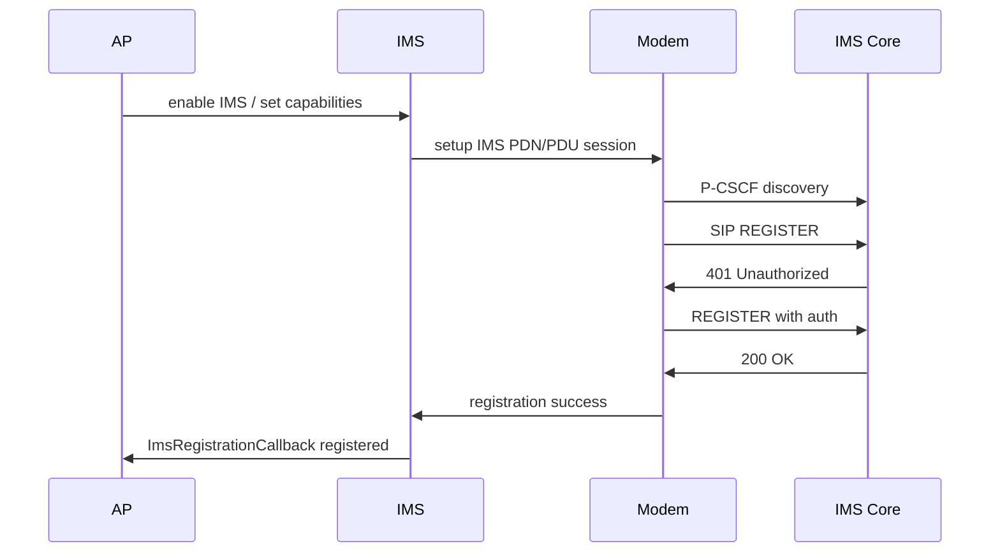

### 前置条件

- SIM ready，IMSI/ISIM/IMPI/IMPU 读取正常。
- LTE/NR/IWLAN承载可用。
- CarrierConfig允许IMS/VoLTE/VoWiFi/VoNR。
- IMS service 已绑定。
- P-CSCF可发现。
- IMS APN/PDU session 建立成功。

### AP侧观察点

- `ImsResolver` 是否绑定 IMS service。
- `ImsManager` 是否打开 IMS。
- `MmTelFeature` 能力是否包含 voice/video/UT/SMS。
- 注册回调是否从 `not registered` 变为 `registered`。
- 失败原因是否上报给 framework。

### Modem/IMS侧观察点

- IMS PDN/PDU session 是否建立。
- P-CSCF discovery 是否成功。
- SIP REGISTER 是否发出。
- 401 challenge 是否正常处理。
- 最终是 200 OK、403、408、503，还是没有响应。

### 常见异常分叉

| 阶段 | 异常 | 可能方向 |
|---|---|---|
| 能力门控 | IMS未启动 | CarrierConfig、IMS service、SIM能力 |
| 承载建立 | IMS APN失败 | APN配置、PDU session、网络 |
| P-CSCF | 找不到P-CSCF | DHCP/PCO、DNS、网络配置 |
| SIP鉴权 | 401后失败 | ISIM/AKA、IMPI/IMPU、鉴权 |
| SIP拒绝 | 403 | 签约、运营商策略、号码/域配置 |
| AP回调 | SIP成功但AP未注册 | IMS service回调、RIL/厂商栈 |

### 配置与能力门控补充

IMS 问题不要只看 SIP REGISTER，前置配置经常已经决定是否会走到 SIP。

| 检查项 | 说明 |
|---|---|
| IMS APN / PDU session | IMS bearer 未建立时不会有正常 SIP 注册 |
| P-CSCF 来源 | PCO/DHCP/DNS/本地配置，VoWiFi 还要看 ePDG/IWLAN 路径 |
| ISIM/IMPI/IMPU | 401/AKA 或注册域异常时要回看卡内 IMS 身份 |
| CarrierConfig | VoLTE/VoWiFi/VoNR、SMS over IMS、UT、video 能力门控 |
| modem IMS参数 | 平台侧 IMS profile、运营商包、NV/MDDB 参数 |
| AP能力上报 | `MmTelFeature` voice/video/UT/SMS 是否和 modem/network 一致 |
| MTK SBP / DSBP / CXP | LTE 已注册但无 IMS PDN 时，检查 operator code、SBP ID 和 IMC 条件 |

### 常见第一坏点

| 第一坏点 | 优先方向 |
|---|---|
| IMS APN/PDU session reject | APN、PDU session、签约、网络 |
| P-CSCF为空或不可达 | PCO/DHCP/DNS/ePDG、本地配置 |
| 无 SIP REGISTER | IMS service 未启动、能力门控、modem IMS 未就绪 |
| 无 IMS PDN | IMS APN 未配置、IMC 条件失败、SBP/运营商包未匹配 |
| 401 后鉴权失败 | ISIM/AKA、IMPI/IMPU、鉴权参数 |
| 403 | 签约、运营商策略、号码/域、IMS profile；若带 `IMEI check failed`，优先查运营商 IMEI 备案 |
| 408/无响应 | 网络可达性、DNS、P-CSCF路由、防火墙 |
| SIP 200 OK 但 AP 未 registered | vendor IMS 回调、RIL 状态同步、framework 注册状态处理 |

### MTK IMC / SBP 触发条件

MTK 项目中，AP 和 modem 能力都打开后，IMC 仍可能因为运营商未匹配而不发起 IMS PDN。关键日志：

```text
[IMC-REG] Operator code = 0, IMSI-MNC:11, IMSI-MCC:432
[IMC-REG] imc_check_mncmcc_whitelist()
[IMC-REG] Normal REG condition check result: IMC_REG_CHECK_MNCMCC_FAILED
```

这种场景下第一坏点是 SBP / DSBP / CXP / 运营商支持状态，不是 LTE attach。配置细节看 [[../../60_Configuration/IMS配置方法#MTK-SBP-DSBP-CXP]]，案例看 [[../../40_Case-Library/IMS/Imported_IMS_02_Iran_无法注册IMS问题]]。

## VoLTE-MO流程

---
domain: IMS
feature: VoLTE MO Call
rat: LTE
layer: AP/IMSStack/Modem/Network
status: draft
---

### 正常路径

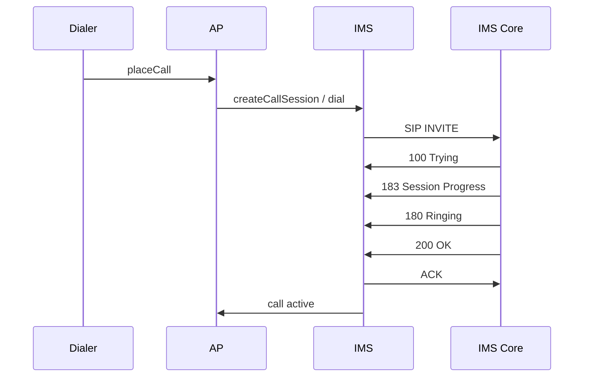

### 前置条件

- LTE/NR注册正常。
- IMS registered。
- MMTEL voice capability available。
- VoLTE配置允许。
- emergency/normal call domain selection 正确。

### 关键观察点

| 阶段 | AP侧 | IMS/Modem侧 |
|---|---|---|
| 拨号入口 | Dialer到Telecom/Telephony | 无 |
| 域选择 | IMS还是CSFB | voice domain选择 |
| INVITE | ImsPhoneCallTracker状态 | SIP INVITE是否发出 |
| 媒体协商 | call state、audio route | SDP/RTP、QCI/5QI |
| 释放 | DisconnectCause | SIP BYE/CANCEL/error |

### 常见结论格式

```text
AP已经发起IMS拨号请求，但modem/IMS侧未看到SIP INVITE，断点在AP到厂商IMS service之间。
```

```text
SIP INVITE已发出，网络返回xxx，AP侧DisconnectCause与网络原因一致，优先按网络/签约/被叫状态分析。
```

## VoWiFi注册流程

---
domain: IMS
feature: VoWiFi
rat: IWLAN
layer: AP/IMSStack/ePDG/Network
status: draft
---

### 正常路径

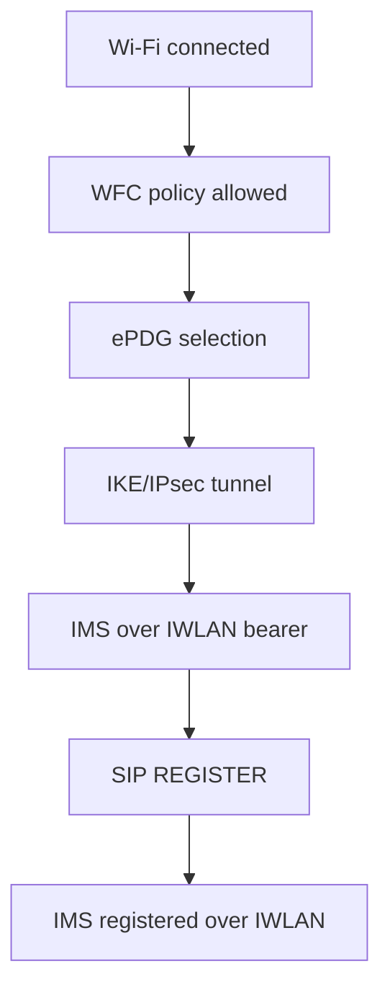

### 前置条件

- Wi-Fi连接可用，互联网可达。
- WFC开关和CarrierConfig允许。
- SIM/运营商支持 VoWiFi。
- ePDG地址可解析且可连通。
- IKE/IPsec建链成功。
- IMS注册允许在 IWLAN 承载上进行。

### 常见异常分叉

| 阶段 | 异常 | 可能方向 |
|---|---|---|
| 开关 | VoWiFi开关不显示 | CarrierConfig、SIM匹配、IMS能力 |
| ePDG选择 | 找不到ePDG | DNS、运营商配置、国家/PLMN |
| 隧道 | IKE失败 | 证书、鉴权、网络限制、防火墙 |
| IMS | IMS over IWLAN注册失败 | SIP、P-CSCF、签约 |
| 切换 | LTE/IWLAN来回切 | Wi-Fi质量、策略、阈值 |

### 需要特别记录

- Wi-Fi SSID和网络环境。
- 是否公司/校园/公共Wi-Fi。
- LTE IMS是否正常。
- ePDG是否解析成功。
- 失败发生在 IKE 还是 SIP。

### IKE配置失败样例

如果 VoWiFi handover 已触发但 IKE 直接失败，优先看 IKE proposal / 完整性算法：

```text
MSG_ID_IKE_ATTACH_REQ
IKE: nv: ike_intg = 18
IKE_SessCheckAlgorithms unsupported integ algo:18
MSG_ID_IKE_ATTACH_FAILED
```

该类问题发生在 SIP REGISTER 之前。案例看 [[../../40_Case-Library/IMS/Imported_IMS_03_6032+_Spark反馈WFC注册有问题]]，配置口径看 [[../../60_Configuration/IMS配置方法#VoWiFi-IKE配置]]。

## VoNR流程

---
domain: IMS
feature: VoNR
rat: NR
layer: AP/IMSStack/Modem/Network
status: draft
---

### 一句话

VoNR = NR/5GC承载上的IMS语音。判断VoNR问题时，要同时确认 NR SA 注册、IMS over NR、MMTEL voice capability、运营商策略。

### 基本条件

- UE处于 NR SA 或满足运营商定义的 VoNR 条件。
- 5GS registration 正常。
- IMS PDU session 正常。
- IMS registered。
- MMTEL voice capability available。
- CarrierConfig和modem能力均允许 VoNR。

### 常见路径

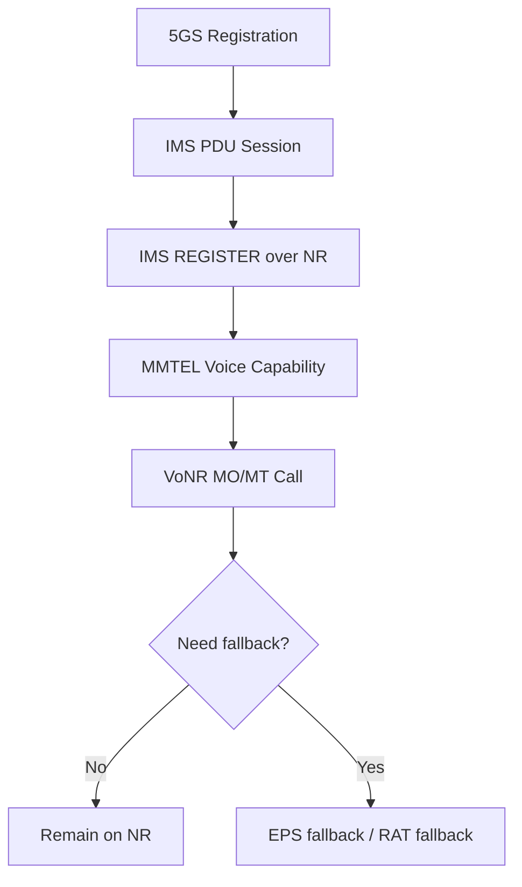

### 常见问题

| 现象 | 优先方向 |
|---|---|
| NR注册正常但VoNR不可用 | IMS over NR、能力门控、运营商配置 |
| 拨号回落LTE | EPS fallback策略、VoNR未允许、网络不支持 |
| 通话中掉NR | 覆盖、RRC、移动性、网络策略 |
| AP显示支持但modem不走VoNR | 能力同步、NV、IMS service实现 |


### 迁入资料：VoNR/EPSFB与注册字段

> 该段从 NR 注册导入资料中拆出；NR 注册页只保留接入注册，语音域字段集中维护在这里。

#### VoNR/EPSFB概念与回落

VoNR是 5G 网络中用于提供语音通话服务的一项技术，类似于 4G 网络中的 VoLTE。它基于 5G 无线接入技术和 5G 核心网（5GC）进行语音通信，完全依赖于 5G 网络而无需回落到 4G 网络。

VoNR是5G SA架构下基于IMS的语音解决方案

 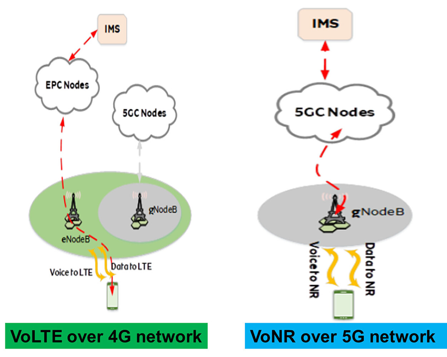

EPSFB是一种5G到4G的语音解决方案，它允许5G用户在进行语音通话时从5G回落到4G网络，利用现有的VoLTE服务通话。当5G网络不支持VoNR或在覆盖边缘时，EPSFB机制能够确保用户仍然能够进行高质量的语音通信。

| EPSFB | VoNR 如图红色highlight |
|----|----|
|  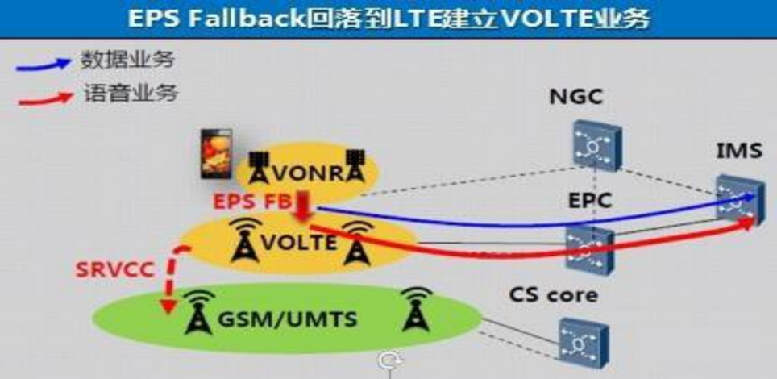 |  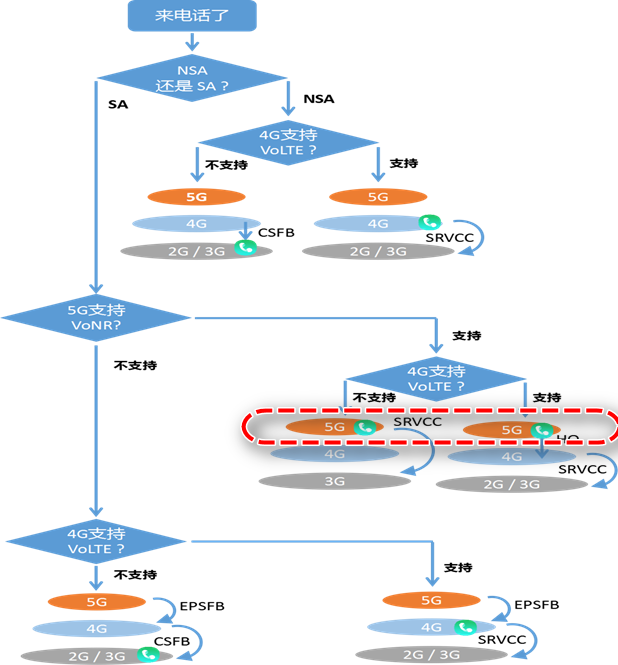 |

#### VoNR注册关键证据

在 5G 注册成功的基础上，VoNR 还需要建立 IMS PDU，并完成后续 SIP 注册。

 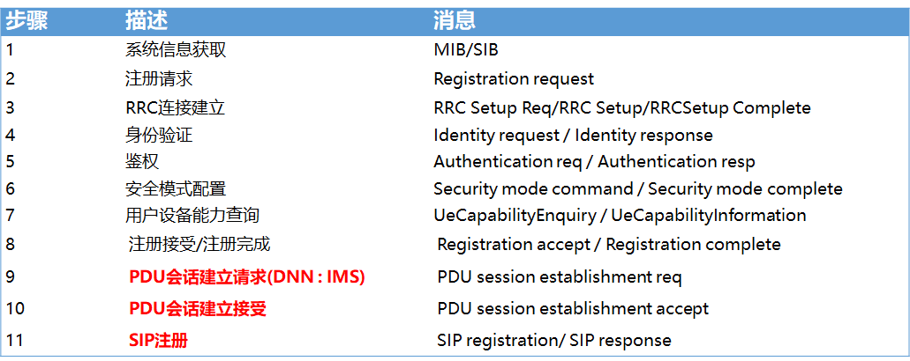

 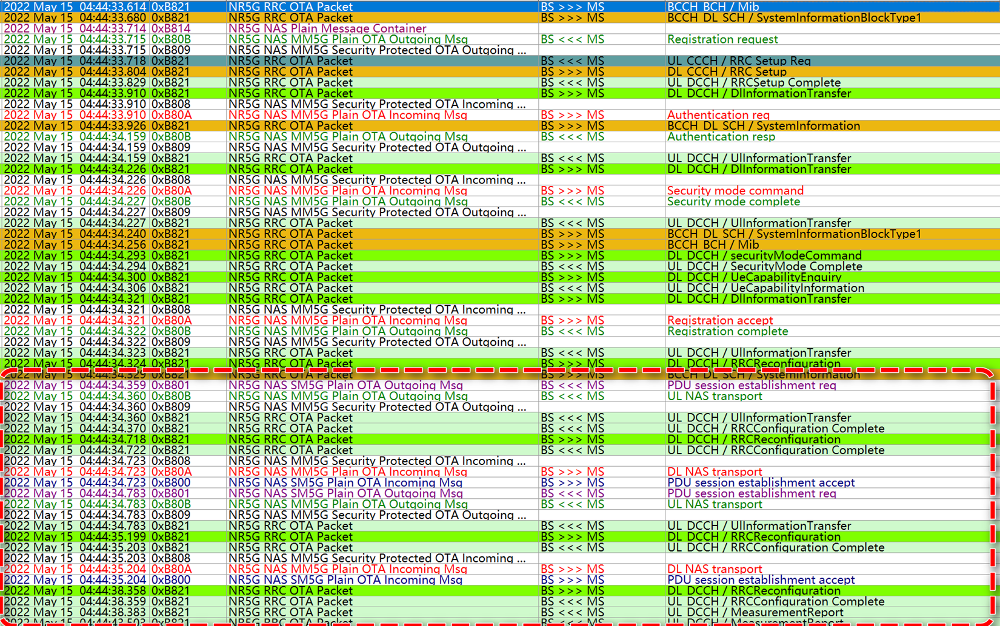


1. Registration request 是 Voice centric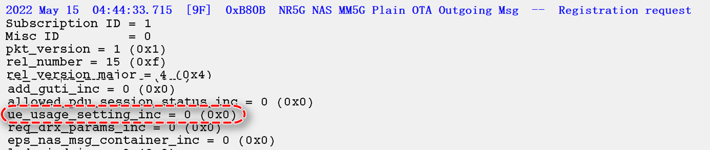
2. 建立RRC连接和进行鉴权的过程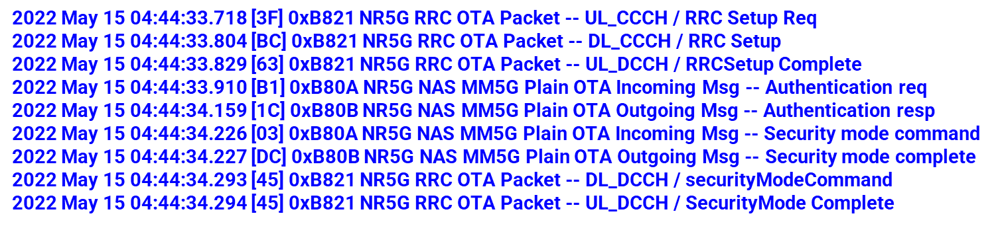
3. 手机通知基站支持VoNR
4. 网络支持VoNR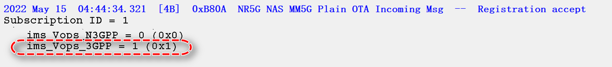
5. 手机发起PDU请求,携带IMS DNN,网络接收PDU建立请求,以及后续的SIP注册

### 结论模板

```text
当前设备已完成NR SA注册，但IMS注册仍走LTE/IWLAN，尚不能证明VoNR链路可用。
优先检查IMS PDU session承载、VoNR capability和CarrierConfig。
```

## SMS over IP流程

### 传输方式

| 方式 | 承载 | 说明 |
|---|---|---|
| SMS over IP | IMS/SIP | SMS 封装在 SIP 消息中，LTE/NR/IMS 场景常用 |
| SMS over SGs | LTE NAS + SGs | LTE 下经 MME-MSC 的 SGs 接口传递 SMS |
| CS SMS | 2G/3G CS | 传统 CS 域短信 |

### 域选择

| Attach状态 / Domain Preference | CS Only | PS Only | CS Preferred | PS Preferred |
|---|---|---|---|---|
| No Attach | No Service | No Service | No Service | No Service |
| CS Attach | CS Domain | No Service | CS Domain | CS Domain |
| PS Attach | No Service | PS Domain | PS Domain | PS Domain |
| CS-PS Combined | CS Domain | PS Domain | CS Domain | PS Domain |

### MTK配置点

| 文件/参数 | 含义 |
|---|---|
| `custom_imc_config.c` / `ua_config.sms_network_types` | SMS over IMS 支持的网络类型，bit0 LTE、bit1 Wi-Fi、bit2 2/3G、bit3 NR |
| `ua_config.sms_support_in_23g` | 2/3G 下 SMS 支持 |
| `imc_config.sms_support` | SMS over IP 总开关 |
| `custom_sdm_utility.c` / `sdm_cust_sms_over_ip_allowed_tbl` | 配置 MCC/MNC 时可能表示不允许 SMS over IP |
| `sdm_cust_prefer_sms_over_sgs_to_ims_tbl` | 配置后 SMS over SGs 优先于 IMS |
| `sms_over_wifi_allowed_tbl` | SMS over Wi-Fi 能力门控 |
| `iwlan_nvram_config.h` / `wans_ims_no_voice_sup_sms_enable` | 无语音项目仍需要 SMS over IMS 时，用于保持 IMS PDN/注册 |

### 关键证据

| 证据 | 说明 |
|---|---|
| `AT+EIMSCFG` | 查看 IMS 相关能力和 SMS over IP 支持情况 |
| `+g.3gpp.smsip` | SIP / netlog 中检查终端是否宣告 SMS over IP 能力 |
| SDM domain selection | 判断短信选择 IMS、SGs 还是 CS |
| SIP MESSAGE / RP-DATA | IMS 提交短信证据 |
| 网络提交确认 | 判断是发送成功还是 fallback 后成功 |
| `[SDM][ADS] Prefer SMS over SGs to IMS in LTE` | 命中 SGs 优先配置 |
| `from SDM = KAL_FALSE` | SDM 侧禁止 SMS over IP |

### 典型结论

```text
第一次修改只改变 SDM 域选择，短信优先走 IMS，但 IMS 配置未真正打开 SMS over IP，随后回落 CS 成功。
第二次同时打开 IMS profile 中 sms_network_types 和 sms_support 后，SDM 选择 IMS，网络返回提交成功。
```

参考案例：[[../../40_Case-Library/IMS/2025-07-29_IMS_SMS-over-IP配置缺失]]。

## USSD流程

### 一句话

USSD 默认多走 CS 域；如果运营商支持 USSD over IMS/USSI，且 IMS 注册成功、NV/配置打开，才会走 IMS。问题定位要先判断当前 USSD 是 over CS 还是 over IMS。

### AP侧关键字

```text
IMS:
ImsPhoneMmiCode: processCode: CS is out of service, sending ussd string '[****]' over IMS pipe.

CS:
ImsPhoneMmiCode: processCode: Sending ussd string '[****]' over CS pipe
```

### Modem / 配置关键字

| 字段 | 含义 |
|---|---|
| `USSD_DOMAIN_CS_ONLY[]` | 命中后走 CS 域，不走 IMS/USSI |
| `USSI_Enabled=0` | 运营商配置要求走 CS |
| `USSI_Enabled=1` | 允许走 IMS/USSI，前提是运营商支持且 IMS 注册成功 |
| `USSI_csfbCode=403` | IMS/USSI 失败后可能触发 CS fallback |
| `ims_ussi_withcall=1` | 允许 USSD 和 VoWiFi/IMS call 并发，仍依赖运营商支持 |

展锐常见 NV：

```text
OPERATOR_NV_IMS\ims_ussi_enable\USSI_Enabled\USSI_Enabled[0]=1
OPERATOR_NV_IMS\ims_ussi_withcall\ims_ussi_withcall\ims_ussi_withcall[0]=1
```

### MTK检查口径

| 检查项 | 目的 |
|---|---|
| EM mode -> Telephony -> IMS -> USSD | 快速确认 USSD/USSI support 当前值 |
| `USSD_DOMAIN_CS_ONLY[]` | 判断是否被运营商表强制走 CS |
| `USSI_Enabled` | 判断 IMS/USSI 总开关 |
| `USSI_csfbCode` | 判断 IMS 返回特定错误后是否 CS fallback |
| `ims_ussi_withcall` | 判断 USSD 是否允许与 IMS call 并发 |

典型失败分叉：

| 现象 | 解释 |
|---|---|
| VoLTE 图标消失，网络回落 3G | USSD 被选择到 CS 或 USSI 不满足 |
| AP 打印 over IMS pipe，但网络返回 403/404 | 终端已走 IMS，后续看运营商是否开通该 USSD code |
| 配置打开但仍走 CS | 检查运营商表、IMS 注册状态、码号是否命中 CS-only 规则 |

### 第一坏点

| 现象 | 优先方向 |
|---|---|
| USSD 回落 3G/2G | USSI 未打开、IMS 未注册、网络不支持 USSI |
| USSD over IMS 返回 404/403 | 运营商未开通或码号不支持 |
| USSD 和通话不能并发 | `ims_ussi_withcall`、运营商能力、IMS call 状态 |
| AP显示失败但网络有响应 | MMI 回调、IMS service、RIL 上报链路 |

结论边界：

- 没有运营商 USSD 码需求表时，场测验证结果是主要依据。
- 上层只发起 MMI/USSD 请求，具体业务由运营商网络实现；终端侧重点是域选择、发送、响应和 fallback。
