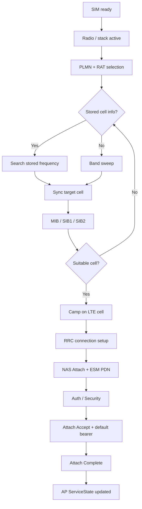

# LTE注册流程


## 定位原则

LTE注册不要只看 `Attach Request -> Attach Accept`。一个完整问题通常要按下面这条链路拆：

```text
SIM ready
-> 协议栈/射频激活
-> PLMN/RAT选择
-> 频点搜索
-> MIB/SIB读取
-> 小区驻留
-> RRC连接建立
-> NAS Attach + ESM PDN请求
-> 默认EPS bearer激活
-> AP ServiceState更新
```

第一目标是找到**第一个坏点**，然后再判断问题属于 SIM、PLMN/RAT策略、RF/小区、RRC、NAS、ESM、RIL/AP上报，还是平台客制化。

参考来源：

- `F:\Codex\Knowledge\lte\lte.md` 中的 UNISOC 平台 LTE 注网流程笔记。
- `F:\Codex\Knowledge\lte\33721__LTE Modem Log分析指南V1.2.pdf` 中的展锐官方 LTE Modem Log 分析指南。

建议使用顺序：

1. 先用“总体流程”和“快速检查表”确认问题停在哪个阶段。
2. 再进入对应分阶段说明，找上一条正常证据和下一条异常证据。
3. 如果是 UNISOC/展锐 log，再查“展锐平台速查”里的私有消息链；如果是 MTK debuglogger，再查“MTK平台速查”里的 mdlog1/AP 对齐口径。
4. 最后按“结论模板”输出事实、推断和待确认项，避免在证据不足时直接归因。

## 关联案例

详细log样例已经沉淀到 Case Library，主流程只保留定位方法和关键口径：

| Case | 场景 | 适合对照什么 |
|---|---|---|
| [[2026-05-14_Registration_UNISOC_LTE开机注册成功]] | 展锐LTE开机注册成功 | 正常Attach、默认承载、AP ServiceState同步 |
| [[2026-05-14_Registration_UNISOC_LTE飞行模式开关回网成功]] | 展锐飞行模式开关后回网 | PS power off/on、re-Attach、默认承载恢复 |
| [[2026-05-14_Registration_UNISOC_LTE手动搜网选网成功]] | 展锐手动搜网并选择46001 | PLMN list、manual selection、TAU/Service Request |
| [[2026-05-14_Registration_MTK_LTE开机注册成功]] | MTK LTE开机注册成功 | debuglogger结构、EMM/ESM attach、AT注册URC、AP ServiceState同步 |
| [[2026-05-14_Registration_LTE第一坏点样例集]] | 注册失败第一坏点样例 | 区分RRC失败、Attach Reject、reject后选网策略 |

## 总体流程



## 快速检查表

| 阶段 | 要回答的问题 | 关键证据 |
|---|---|---|
| SIM前置 | SIM是否ready，IMSI是否可用 | UICC/SIMRecords、IMSI、EF读取 |
| 协议栈激活 | AP/Modem是否开始找网 | radio power、飞行模式、平台激活命令 |
| PLMN/RAT选择 | 目标PLMN/RAT是否合理 | RPLMN、EHPLMN、HPLMN、UPLMN、OPLMN、FPLMN、网络模式 |
| 频点搜索 | 历史频点是否命中，是否进入全band | EARFCN、band list、PCI、search result |
| 系统消息 | 小区是否可驻留 | MIB、SIB1、SIB2、PLMN list、TAC、cellBarred、q-RxLevMin |
| RRC | 是否进入RRC_CONNECTED | RRCConnectionRequest/Setup/SetupComplete |
| NAS | 是否完成Attach | Attach Request、Identity、Authentication、Security Mode、Attach Accept/Reject |
| ESM | 默认承载是否激活 | PDN Connectivity Request、ESM Information、Activate Default EPS Bearer |
| AP上报 | Android是否看到注册成功 | RIL indication、ServiceStateTracker、data/voice registration state |

## 证据对齐与常见误判

LTE注册问题不要把 AP log、modem log、用户操作分开下结论。先把三类证据对到同一条时间线，再判断第一个坏点。

最小采集集：

| 类别 | 至少要有 | 用途 |
|---|---|---|
| 触发信息 | 开机、飞行模式开关、手动搜网、插卡、移动到弱网等动作的准确时间 | 定位入口，避免把前一次注册状态当成本次结果 |
| AP侧log | radio/RIL/Telephony相关log，含 `RILJ`、`RILC`、`ServiceStateTracker`、`TelephonyRegistry` | 看radio power、网络扫描、ServiceState、data profile/APN是否同步 |
| Modem侧log | Logel/armlog/msgflow，含NAS/RRC/AS/Internal Messages | 看PLMN选择、小区选择、RRC、Attach/TAU/ESM真实流程 |
| 配置与环境 | SIM运营商、目标PLMN、网络模式、APN、飞行模式/数据开关、是否双卡 | 排除策略类和配置类误判 |
| 对照复测 | 同卡同地换机、同机换卡、同卡换RAT或换PLMN | 区分终端、SIM签约、网络覆盖和运营商策略 |

对齐方法：

1. 先找唯一锚点，例如 `AT+SFUN=4/5`、`setRadioPower`、`START_NETWORK_SCAN`、`AT+COPS=...`、`ATTACH_REQUEST`、`ATTACH_ACCEPT`。
2. 用锚点前后的相对顺序串起 AP 和 modem，而不是强行要求两边时间戳完全一致。
3. 每个阶段都找“上一条正常证据”和“下一条异常证据”。只有下一跳缺失或失败，才是当前候选坏点。
4. 结论里分开写事实、推断和待确认项，尤其是网络拒绝、AP不上报、ESM失败这类容易跨层误判的问题。

常见误判：

| 看到的现象 | 容易误判 | 正确口径 |
|---|---|---|
| NAS视图出现 `ATTACH_REQUEST` / `PDN_CONNECTIVITY_REQUEST` | 已经完成空口Attach发送 | 真正承载NAS上行通常要看 `RRCConnectionSetupComplete` 或后续上行NAS传输 |
| `RRCConnectionRequest` 后没有 `RRCConnectionSetup` | Attach失败 | 第一坏点仍在RRC/RACH接入，NAS Attach还没有被网络处理 |
| `ATTACH_ACCEPT` 出现 | 数据已经可用 | 还要看默认EPS bearer request/accept、`ATTACH_COMPLETE` 和AP侧data registration |
| `START_NETWORK_SCAN scanError=0` | 手动搜网完成 | 只代表扫描请求被接受，完成要看后续 `UNSOL_NETWORK_SCAN_RESULT scanStatus=2` |
| 同一 `ci/pci/tac/earfcn` 下有多个PLMN | 终端注册到多个运营商 | 可能是共享小区/MOCN广播，多PLMN列表不等于已注册PLMN |
| AP侧 `reasonForDenial=-1` | 网络拒绝注册 | 如果同时是 `REG_HOME` / `IN_SERVICE`，不能机械当成拒绝cause |
| Modem Attach成功但AP无服务 | 网络侧失败 | 第一优先看RIL indication、RILJ解析、ServiceState合成和双卡phoneId |

## 1. PLMN/RAT选择

排查无服务、搜网慢、注册到错误网络时，先确认目标 PLMN 和目标 RAT 是否合理。

| 类型 | 含义 | 排查价值 |
|---|---|---|
| RPLMN | 上次成功注册的PLMN | 开机优先尝试，影响回网速度 |
| EHPLMN | 等效归属PLMN | 归属网络扩展，常见于多PLMN运营商 |
| HPLMN | SIM归属PLMN | 归属网判断基础 |
| UPLMN | 用户控制PLMN | 用户或SIM配置影响选网 |
| OPLMN | 运营商控制PLMN | 漫游优先级常见来源 |
| FPLMN | 禁用PLMN | reject后可能阻止再次尝试 |
| EPLMN | 网络下发等效PLMN | Attach Accept后影响后续选择 |

常用判断：

```text
目标PLMN是否在SIM/网络允许列表中？
目标RAT是否被用户网络模式、平台test mode、项目客制化允许？
FPLMN是否因为历史reject阻止当前PLMN？
如果多个RAT可用，当前策略是否应优先LTE？
```

注意：PLMN/RAT选择受 3GPP、SIM文件、运营商配置、用户设置、modem策略和平台实现共同影响，不要只看 UI 里的“首选网络类型”。

## 2. 找网与驻留

LTE找网一般分两条路径：

| 路径 | 典型场景 | 关注点 |
|---|---|---|
| 有存储信息 | 开机回上次小区、已有历史频点 | NV/历史频点、EARFCN、PCI、sync结果 |
| 无存储信息 | 首次开机、历史频点失效、全新环境 | band sweep、band list、搜索结果 |

找网后不要只看“搜到小区”，还要确认小区是否适合驻留：

```text
PLMN是否匹配
cellBarred是否允许
Srxlev/Squal是否满足
TAC是否允许
是否受FPLMN、禁用TA、CSG白名单影响
```

系统消息检查重点：

- MIB：带宽、SFN、band、PCI。
- SIB1：PLMN list、TAC、cellIdentity、cellBarred、q-RxLevMin。
- SIB2：RACH、功控、上行频点、T300/N310/T310。

## 3. RRC连接建立

RRC连接用于承载后续NAS消息。LTE注册常见三步：

```text
RRCConnectionRequest
RRCConnectionSetup
RRCConnectionSetupComplete
```

关键观察点：

- `establishmentCause` 是否符合场景，注册通常常见 `mo-Signalling`。
- `RRCConnectionSetup` 是否下发 SRB1、MAC、PHY、RLC 等专用配置。
- `RRCConnectionSetupComplete` 是否携带 `dedicatedInfoNAS`。
- `selectedPLMN-Identity` 是否符合预期。
- `registeredMME` 是否与历史GUTI一致或合理。

如果 RRC 失败，优先看无线环境、T300、RACH、目标小区参数和modem内部状态，而不是直接看 AP framework。

## 4. NAS/ESM联合附着

LTE注册常见为 NAS Attach 和 ESM PDN 请求联合进行。成功路径通常可按下面顺序核对：

```text
PDN Connectivity Request
Attach Request
RRCConnectionRequest
RRCConnectionSetup
RRCConnectionSetupComplete
UECapabilityEnquiry / UECapabilityInformation
Identity Request / Identity Response
Authentication Request / Authentication Response
Security Mode Command / Security Mode Complete
ESM Information Request / ESM Information Response
RRCConnectionReconfiguration / Complete
Attach Accept
Activate Default EPS Bearer Context Request / Accept
Attach Complete
```

Attach Request建议记录：

- attach type：EPS attach / combined EPS/IMSI attach。
- mobile identity：GUTI、IMSI、IMEI。
- UE network capability：EEA/EIA、UEA/UIA、A5。
- ESM container：PDN type、request type、APN/PCO。
- PCO请求：DNS IPv4/IPv6、MTU/IPCP等基础数据参数。
- UE usage setting：voice centric / data centric。
- last visited TAI。

Attach Accept建议记录：

- TAI list。
- GUTI reallocation。
- EPS update result。
- periodic TAU timer。
- default EPS bearer QoS。
- IP地址、DNS、PCO参数。
- 是否携带EPLMN或其他会影响后续选网的信息。

### 4.1 Attach Reject / TAU Reject cause速查

`Attach Reject` 和 `TAU Reject` 都是NAS EMM层拒绝，区别在于前者发生在初始注册，后者发生在已经注册后的TA更新、周期TAU或回网更新。定位时不要只记录“被拒”，至少要同步记录：`PLMN`、`TAC/TAI`、`GUTI/IMSI/IMEI`、reject cause、是否写入 `FPLMN`/forbidden TA、是否启动退避定时器，以及后续是继续搜网、换RAT、还是停在无服务。

| Cause | 常见消息 | 快速含义 | 第一优先排查 |
|---|---|---|---|
| `#2 IMSI unknown in HSS` | Attach Reject | HSS/核心网不认识该IMSI | SIM签约、开户状态、HSS/HLR数据 |
| `#3 Illegal UE` | Attach/TAU Reject | 网络认为UE非法 | 签约、SIM状态、运营商侧限制 |
| `#5 IMEI not accepted` | Attach Reject | IMEI未被网络接受 | IMEI备案、白名单、设备库 |
| `#6 Illegal ME` | Attach Reject | 设备非法，常见于IMEI不合法或未备案 | IMEI、运营商设备准入、样机/工程机策略 |
| `#7 EPS services not allowed` | Attach/TAU Reject | EPS业务不允许 | SIM是否开通LTE/EPS、套餐与核心网配置 |
| `#8 EPS and non-EPS services not allowed` | Attach Reject | EPS和非EPS都不允许 | SIM/账号状态、欠费、停机、HLR/HSS配置 |
| `#9 UE identity cannot be derived` | Attach/TAU Reject | 网络无法从旧标识恢复UE身份 | GUTI/TMSI失效，复测是否转IMSI attach |
| `#10 Implicitly detached` | TAU Reject | 网络侧认为UE已经隐式分离 | 触发重新attach，查长时间OOS/核心网上下文丢失 |
| `#11 PLMN not allowed` | Attach/TAU Reject | 当前PLMN不允许 | FPLMN、漫游协议、SIM PLMN列表 |
| `#12 Tracking Area not allowed` | Attach/TAU Reject | 当前TA不允许 | forbidden TA list、TAC、区域签约 |
| `#13 Roaming not allowed in this tracking area` | Attach/TAU Reject | 当前TA漫游不允许 | 漫游开关、漫游协议、TA限制 |
| `#14 EPS services not allowed in this PLMN` | Attach/TAU Reject | 此PLMN不允许EPS | LTE签约、漫游LTE开通、PLMN策略 |
| `#15 No suitable cells in tracking area` | Attach/TAU Reject | 当前TA没有适合该UE的小区 | TAC限制、重选/换TA、禁用TA记录 |
| `#17 Network failure` | Attach/TAU Reject | 网络侧临时异常或策略拒绝 | 重试计数、是否换PLMN/RAT、运营商侧告警 |
| `#19 ESM failure` | Attach Reject | ESM默认承载/PDN流程失败导致Attach失败 | 转到“ESM / 默认承载失败专项” |
| `#22 Congestion` | Attach/TAU Reject | 网络拥塞 | T3346/退避、是否按规范停止重试 |
| `#25 Not authorized for this CSG` | Attach/TAU Reject | CSG小区无权限 | CSG白名单、小区类型、SIM授权 |
| `#40 No EPS bearer context activated` | TAU Reject/Service | 网络侧无可用EPS bearer上下文 | 重新attach、默认承载是否曾建立/丢失 |

判断口径：

- `#6 Illegal ME` 在注册失败样例里很典型：LTE Attach直接被网络拒绝，后续即使换RAT也可能继续因为设备身份被拒，优先走IMEI合法性和运营商备案。
- `#11/#12/#13/#14/#15` 属于PLMN/TA限制类，重点看终端是否把PLMN或TA写入禁用列表，以及后续选网策略是否正确避让。
- `#17 Network failure` 如果连续出现，要看attempt counter和PLMN search策略；参考样例里RAU/LU reject cause 17会触发平台侧异常注册计数和SBP策略判断，LTE TAU也应采用同类思路看“拒绝后怎么走”。
- `TAU Reject` 比 `Attach Reject` 更需要关注“拒绝之后终端状态”：是否本地detach、清GUTI、重新attach、启动T3346，或进入limited service。

### 4.2 ESM / 默认承载失败专项

默认承载失败常见有两类表现：一类是Attach阶段携带的PDN请求失败，网络用 `Attach Reject cause #19 ESM failure` 结束注册；另一类是Attach接近成功，但 `Activate Default EPS Bearer Context` 未完成，导致AP侧有注册态但数据业务不可用。

优先核对下面这条链：

```text
PDN Connectivity Request
-> ESM Information Request / Response
-> Attach Accept
-> Activate Default EPS Bearer Context Request
-> Activate Default EPS Bearer Context Accept
-> Attach Complete
```

关键字段：

| 阶段 | 字段 | 怎么用 |
|---|---|---|
| `PDN Connectivity Request` | `request type`、`PDN type`、`APN`、`PTI` | 判断是initial attach默认APN，还是后续新增PDN；确认IPv4/IPv6/IPv4v6是否匹配签约 |
| `PCO` | DNS、IPCP、MTU等请求 | 数据业务不可用时确认网络是否下发对应参数 |
| `ESM Information Response` | APN、protocol config | 如果网络要求ESM信息，确认UE是否按期望补发APN |
| `Activate Default EPS Bearer Context Request` | EPS bearer id、QCI、APN-AMBR、PDN address、PCO | 这是默认承载真正下发的证据 |
| `Activate Default EPS Bearer Context Accept` | EPS bearer id/PTI是否对应 | 没有Accept不能说默认承载已成功 |
| AP侧 | `SET_DATA_PROFILE`、`SET_INITIAL_ATTACH_APN`、data call bringup | APN配置要和modem/NAS侧看到的APN一致 |

#### 代码侧口径：Initial Attach APN如何下到底层

从 SPRDROID16 代码看，默认Attach APN下发不是只看一条RILJ log，要按“profile选择 -> RIL请求 -> HAL/RIL结构体 -> vendor处理”的链路核对。

| 环节 | 代码依据 | 关键结论 |
|---|---|---|
| Profile选择 | `alps/frameworks/opt/telephony/src/java/com/android/internal/telephony/data/DataProfileManager.java:601` | 先把preferred profile排到前面，再按allowed initial attach APN type选择满足条件的profile；变化或强制更新时才下发 |
| AP data service | `CellularDataService.java:205` | `setInitialAttachApn` 透传到 `mPhone.mCi.setInitialAttachApn` |
| RILJ请求 | `RIL.java:3880` | 生成 `RIL_REQUEST_SET_INITIAL_ATTACH_APN`，RILJ里看到的 `SET_INITIAL_ATTACH_APN` 从这里发起 |
| HAL代理 | `RadioDataProxy.java:264` | 把 `DataProfile` 转成HAL `DataProfileInfo` 后调用 `setInitialAttachApn` |
| native RIL服务 | `ril_service.cpp:2005`、`ril.h:7139` | 转成 `RIL_InitialAttachApn` / `RIL_InitialAttachApn_v15`；字段包括 `apn`、`protocol`、`roamingProtocol`、`authtype`、`username`、`password`、`supportedTypesBitmask`、`bearerBitmask`、`mtu` |

分析口径：

- `SET_DATA_PROFILE` 和 `SET_INITIAL_ATTACH_APN` 是两条不同路径：前者更新数据profile列表，后者决定LTE initial attach时给modem的APN参数。
- AP log里出现 `Initial attach data profile updated as ...`，说明Framework已经选出了initial attach profile；后续还要确认RILJ是否真正发出 `SET_INITIAL_ATTACH_APN`，以及字段是否和NAS侧 `PDN Connectivity Request` 一致。
- 如果modem侧看到ESM默认承载失败，而AP侧没有下发initial attach APN，或下发的APN/protocol/auth与运营商配置不一致，第一坏点优先落在APN profile选择或RIL下发链路。

常见ESM cause速查：

| Cause | 快速含义 | 第一优先排查 |
|---|---|---|
| `#8 Operator Determined Barring` | 运营商策略阻止 | 账号策略、APN权限、漫游策略 |
| `#26 Insufficient resources` | 网络资源不足 | 核心网资源、临时拥塞、是否重试成功 |
| `#27 Missing or unknown APN` | APN缺失或未知 | APN拼写、运营商配置、初始Attach APN |
| `#28 Unknown PDN type` | PDN类型不支持 | IPv4/IPv6/IPv4v6配置与签约 |
| `#29 User authentication failed` | 用户认证失败 | PAP/CHAP、APN用户名密码、企业专网APN |
| `#30 Request rejected by Serving GW or PDN GW` | 网关拒绝 | SGW/PGW策略、APN签约、运营商侧 |
| `#31 Request rejected, unspecified` | 未指定拒绝 | 对比同卡同地、抓核心网或换APN复测 |
| `#32 Service option not supported` | 业务选项不支持 | APN业务类型、PDN type、漫游协议 |
| `#33 Requested service option not subscribed` | 未签约该业务 | SIM套餐、APN权限、专网权限 |
| `#34 Service option temporarily out of order` | 网络临时不可用 | 等待/重试、运营商侧状态 |
| `#38 Network failure` | 网络失败 | 核心网、回程、临时故障 |
| `#50 PDN type IPv4 only allowed` | 只允许IPv4 | APN配置改为IPv4或确认签约 |
| `#51 PDN type IPv6 only allowed` | 只允许IPv6 | APN配置改为IPv6或确认签约 |
| `#52 Single address bearers only allowed` | 不允许IPv4v6双栈 | 改单栈或确认网络能力 |
| `#55 Multiple PDN connections for a given APN not allowed` | 同APN多PDN不允许 | 去重APN/DataProfile，检查重复拨号 |
| `#66 Requested APN not supported in current RAT and PLMN` | 当前RAT/PLMN不支持该APN | 漫游APN策略、LTE/非LTE APN差异 |

结论写法建议：

```text
 LTE小区驻留、RRC建链、NAS鉴权和安全均已通过，但默认承载未完成。
当前第一坏点在ESM默认PDN流程：<ESM消息/cause>。
优先排查APN/PDN type/签约/PCO，而不是RRC或射频。
```

### 4.3 TAU / Service Request / 已注册态恢复

不是所有“回网”都会重新走完整Attach。终端已经有EPS上下文、GUTI和默认承载时，飞行模式短开关、手动选网、空闲态恢复、小区/TA变化，可能表现为TAU或Service Request。分析时要先判断这是“从零Attach”，还是“已注册态恢复”。

TAU常见观察链：

```text
小区选择/重选完成
-> EMM_ESM_TAU_IND 或 TAU触发
-> TRACKING_AREA_UPDATE_REQUEST
-> TRACKING_AREA_UPDATE_ACCEPT
-> TRACKING_AREA_UPDATE_COMPLETE
或 -> TRACKING_AREA_UPDATE_REJECT
```

Service Request常见观察链：

```text
EMM_SERVICE_REQUEST
-> RRCConnectionRequest
-> RRCConnectionSetup
-> RRCConnectionSetupComplete
-> EMM_ESM_EST_CONN_CNF
-> EMM_ESM_DRB_ESTABLISHED_IND
```

关键字段：

| 流程 | 字段/消息 | 怎么判断 |
|---|---|---|
| TAU Request | update type、active flag、old GUTI、last visited TAI | 判断是普通TAU、周期TAU、combined TA/LA update，还是带active恢复 |
| TAU Accept | TAI list、GUTI reallocation、T3412、EPS bearer context status | 判断网络是否接受TA更新、是否保留或变更上下文 |
| TAU Reject | EMM cause、T3346/T3402、后续detach/attach动作 | 判断是否需要重新attach、是否进入退避或禁用TA/PLMN |
| Service Request | service type、KSI、short MAC、EPS bearer context | 判断是空闲态业务恢复、寻呼响应，还是信令触发 |
| RRC恢复 | `RRCConnectionSetupComplete`、`EMM_ESM_EST_CONN_CNF`、`DRB_ESTABLISHED` | 判断无线连接和默认承载承载面是否恢复 |
| AP侧 | `REG_HOME`、`IN_SERVICE`、data registration、data network state | 判断modem恢复是否已经同步到Android |

判断口径：

- 如果已经 `REG_HOME`，后面只看到 `SERVICE_REQUEST`，不能要求它重新出现完整 `ATTACH_REQUEST -> ATTACH_ACCEPT`。
- 如果手动选网后出现 `EMM_ESM_TAU_IND` 和 `GMMREG_USER_SELECT_PLMN_CNF`，优先按“手动选网成功 + TAU/Service Request恢复上下文”判断。
- 如果TAU成功但数据不可用，继续看EPS bearer context、DRB建立、APN/data call，而不是回头怀疑小区选择。
- 如果TAU Reject是 `#10/#40` 等上下文类原因，重点看终端是否清旧上下文并重新attach。

## 5. AP侧状态同步

Modem注册成功不等于 Android 已经正确显示服务状态。AP侧至少确认：

- `ServiceStateTracker` 是否收到 voice/data registration state。
- RAT是否从 unknown/limited 变为 LTE。
- PLMN、TAC、CellIdentity 是否合理。
- 是否反复 `OUT_OF_SERVICE -> IN_SERVICE -> OUT_OF_SERVICE`。
- AP看到的注册状态是否与modem侧Attach结果一致。
- 默认承载成功后，data registration、APN、data call state 是否同步更新。

典型断点：

```text
modem侧Attach成功，但AP侧仍显示无服务
=> 优先查RIL indication、Vendor RIL解析、framework状态同步。
```

### 5.1 AP侧成功上报链（本次展锐开机AP log）

参考log：

```text
F:\Log\流程Log\展锐Lte注册流程\ylog\ap\001-0514_091134--0514_091333_poweron
```

本次PHONE0从radio on到ServiceState稳定为LTE IN_SERVICE，AP侧可以按下面顺序确认：

```text
UNSOL_RESPONSE_RADIO_STATE_CHANGED
UNSOL_RESPONSE_SIM_STATUS_CHANGED
UNSOL_RESPONSE_VOICE_NETWORK_STATE_CHANGED
RILJ -> OPERATOR / VOICE_REGISTRATION_STATE / DATA_REGISTRATION_STATE
RILJ <- RegStateResult{regState: REG_HOME, rat: LTE, ...}
SST combinePsRegistrationStates
USST newDataRegStateInService = true, newVoiceRegStateInService = true
SST Poll ServiceState done
TelephonyRegistry.broadcastServiceStateChanged
SET_DATA_PROFILE
SET_INITIAL_ATTACH_APN
```

本次log里可直接摘的关键字段：

| 时间点 | AP/RIL证据 | 关键字段 | 判断 |
|---|---|---|---|
| `09:12:21.044` | `UNSOL_RESPONSE_RADIO_STATE_CHANGED` | `radioStateChanged: 1 [PHONE0]` | AP侧看到modem radio on |
| `09:12:21.050` | `UNSOL_RESPONSE_SIM_STATUS_CHANGED` | `[PHONE0]` | SIM状态变化触发framework刷新 |
| `09:12:21.065` | `UNSOL_RESPONSE_VOICE_NETWORK_STATE_CHANGED` | `RIL_SOCKET_1` | modem通知AP重新poll注册状态 |
| `09:12:22.397/400` | `DATA/VOICE_REGISTRATION_STATE` | `regState: REG_HOME`、`rat: LTE`、`registeredPlmn: 46001`、`earfcn: 2452`、`bands: [BAND_5]` | PHONE0已上报LTE注册成功 |
| `09:12:24.456` | `SST Poll ServiceState done` | `mVoiceRegState=0(IN_SERVICE)`、`mDataRegState=0(IN_SERVICE)`、`mChannelNumber=2452`、`mCellBandwidths=[10000]` | Framework ServiceState进入服务 |
| `09:12:25.918` | `SST combinePsRegistrationStates` | `mChannelNumber=1650`、`mBands=[3]`、`mBandwidth=20000`、`rRplmn=46001` | AP侧小区信息刷新到Band 3邻/新服务小区 |
| `09:13:00.717/732` | `VOICE/DATA_REGISTRATION_STATE` | `ci=81839670`、`pci=251`、`tac=59018`、`earfcn=1650`、`band=BAND_3`、`lteAttachResultType=0`、`extraInfo=0` | 后续poll仍保持LTE HOME |
| `09:13:10.895` | `SET_DATA_PROFILE` | `3gwap`、`3gnet`、`sos` 等profile | AP把数据profile下发给RIL |
| `09:13:10.910` | `SET_INITIAL_ATTACH_APN` | `3gnet`、`46001`、`default|supl|hipri|xcap`、`IPV4V6`、`preferred=true` | 初始Attach APN与中国联通默认数据APN一致 |

AP侧判断要点：

- `VOICE_REGISTRATION_STATE` 和 `DATA_REGISTRATION_STATE` 都要看；只看voice可能漏掉PS域失败。
- `reasonForDenial` 在voice侧常见为 `NONE`，data侧可能为 `-1`，不能机械当成拒绝原因，要结合 `regState: REG_HOME`。
- `mLteAttachResultType=0`、`mLteAttachExtraInfo=0` 可作为AP侧LTE attach结果补充证据，但最终仍要与modem NAS Attach/ESM默认承载消息交叉确认。
- PHONE1在本次log里存在 `NOT_REG`/`NO_NETWORK_FOUND`，但PHONE1无卡或未注册，不能误判为PHONE0注册失败。
- 如果modem侧已经看到 `ATTACH_ACCEPT` 和默认承载成功，而AP侧没有走到 `SST Poll ServiceState done: IN_SERVICE`，第一断点就在RIL indication、RILJ解析或Telephony Framework状态合成。

### 5.2 代码侧状态同步口径

代码链路统一维护在 [[平台代码与产物速查#LTE注册-平台代码架构速查|LTE注册-平台代码架构速查]]。本流程只保留 AP 侧判读口径：

- AP log 里要同时找 `VOICE_REGISTRATION_STATE` 和 `DATA_REGISTRATION_STATE`。
- `REG_HOME` 是 HAL/RIL 结果转换后的注册态，不是 UI 猜测。
- `reasonForDenial` / `reasonDataDenied` 只有在 `REG_DENIED` 场景才是拒绝原因；`REG_HOME` 下看到 `0`、`NONE` 或 `-1` 不应机械判断为 reject。
- `registeredPlmn/rRplmn` 和 modem NAS 侧 PLMN 不一致时，优先查 RIL 返回结构和 CellIdentity 转换。
- “modem attach 成功但 AP data out of service”要同时看 PS registration、default bearer、data profile 三处。

## 6. 平台参考文档

平台相关细节已拆出去，主流程里只保留入口，避免流程判断和平台资料混在一起。

| 参考内容 | 文件 | 什么时候看 |
|---|---|---|
| 平台代码架构 | [LTE注册-平台代码架构速查](../../50_Platform-Code/Cross-Platform/平台代码与产物速查.md#LTE注册-平台代码架构速查) | 需要从 Android Framework、RIL、vendor RIL 代码反推状态同步或APN下发链路 |
| 平台log/trace字段 | [[LTE注册-平台Log速查]] | 需要查展锐/MTK的trace模块、AT/URC字段、debuglogger结构、字段换算 |
| 成功样例证据 | [[2026-05-14_Registration_UNISOC_LTE开机注册成功]]、[[2026-05-14_Registration_MTK_LTE开机注册成功]] | 需要对照一份完整成功链路 |

使用原则：

- 主文档只判断“LTE注册走到哪一步、第一坏点在哪里”。
- 平台参考文档只回答“这个平台的代码/log入口在哪里”。
- Case Library只沉淀“某次真实log的证据链”。
## LTE注册失败的第一坏点样例

详细样例已迁移到 Case Library：[[2026-05-14_Registration_LTE第一坏点样例集]]。

主流程里保留一个速查表：

| 样例 | 第一坏点 | 判断口径 |
|---|---|---|
| 能搜到小区但RRC建链无响应 | `RRCCONNECTIONREQUEST` 后没有 `RRCCONNECTIONSETUP` | 不是NAS Attach Reject，优先查RACH/RRC接入、T300、RF参数、目标小区接入条件 |
| Attach Reject / Illegal ME | `Attach Reject cause #6 Illegal ME` | 已进入NAS Attach阶段，优先查IMEI合法性、运营商备案、设备白名单 |
| RAU/LU连续Reject cause 17 | 网络连续返回 `Network failure (17)`，终端进入异常注册计数/选网策略 | 参考reject后终端如何重试、换小区、换PLMN或换RAT；LTE遇到cause 17也要看attempt counter和退避 |

结论写法仍按“事实 / 推断 / 待确认”，不要把RRC无响应、NAS Reject和AP不上报混成一个“注册失败”。

## 入口场景差异：开机、飞行模式、手动搜网

| 入口 | 触发方式 | 典型特点 | 重点证据 |
|---|---|---|---|
| 开机注册 | 系统启动、SIM ready、radio/协议栈激活 | 初始化最完整，会经历SIM读取、NV/历史频点、RPLMN/HPLMN策略、APN profile下发 | `SIM_STATUS_CHANGED`、radio on、平台激活命令、PLMN/RAT选择、历史频点/全band、Attach/默认承载、ServiceState |
| 飞行模式关闭后注册 | AP重新打开radio，modem从RF off/协议栈暂停恢复 | SIM通常已ready，历史上下文和缓存更多，回网可能比冷开机短；也可能先做detach/release再重新attach | airplane on/off时间点、radio power、RIL state、是否保留GUTI/RPLMN、是否走存储频点、是否触发TAU还是重新Attach |
| 手动搜网/选网 | 用户触发可用网络扫描并选择PLMN/RAT | 会出现available network scan和manual PLMN selection；策略与自动选网不同，失败要区分“扫不到”“列表有但选不上”“选上后被reject” | `GET_AVAILABLE_NETWORKS`/`COPS=?`、候选PLMN列表、manual selection request、目标PLMN/RAT、selection result、Attach/TAU reject cause |

### 飞行模式开关注册样例（本次展锐log）

详细证据已迁移到 Case Library：[[2026-05-14_Registration_UNISOC_LTE飞行模式开关回网成功]]。

本次样例的关键结论：

- 飞行模式开启时，AP侧先 `setRadioPower false`，modem侧走PS power off、detach、bearer清理和协议栈shutdown。
- 飞行模式关闭后，AP侧 `radioStateChanged=1`，modem侧走PS power on、小区选择、RRC、重新Attach、默认承载建立。
- 本次不是只做TAU恢复，而是明确出现 `EMM_ATTACH_REQUEST`、`EMM_ATTACH_ACCEPT` 和默认EPS bearer request/accept。
飞行模式不回网时，第一层先分清：

```text
AP radio是否打开
-> modem PS power on是否完成
-> 小区选择/MIB/SIB是否成功
-> RRC是否建立
-> Attach或TAU是否成功
-> 默认承载/AP ServiceState是否同步
```

### 手动搜网样例（本次展锐log）

详细证据已迁移到 Case Library：[[2026-05-14_Registration_UNISOC_LTE手动搜网选网成功]]。

本次样例的关键结论：

- AP侧 `START_NETWORK_SCAN scanError=0` 只代表扫描请求被接受，网络列表要看后续 `UNSOL_NETWORK_SCAN_RESULT`。
- modem侧 `APP_MN_PLMN_LIST_CNF` 对应PLMN列表搜索结束并返回。
- 用户选择 `46001` 后，modem侧出现 `AT+COPS=1,2,"46001",7`、`GMMREG_USER_SELECT_PLMN_CNF`、`APP_MN_PLMN_SELECT_CNF`。
- 后续是 `EMM_ESM_TAU_IND` + `SERVICE_REQUEST`，说明这是手动选网成功后通过TAU/Service Request保持或恢复EPS上下文，不是从零Attach。
- 同一物理小区可能广播多个PLMN，相同 `ci/pci/tac/earfcn` 下出现 `46001`、`46011` 等，不等于终端注册到多个运营商。

手动搜网失败时可按四段拆：

| 第一坏点 | 典型证据 | 优先方向 |
|---|---|---|
| 扫描请求失败 | `START_NETWORK_SCAN` error、无RIL请求下发 | AP Framework、RIL接口、radio state、权限/并发扫描限制 |
| 扫不到目标PLMN | scan完成但列表无目标PLMN/RAT，或modem无 `PLMN_LIST_IN_IND` / `APP_MN_PLMN_LIST_CNF` | 覆盖、频段、SIM/RAT限制、PLMN搜索策略、屏蔽箱配置 |
| 列表有但选不上 | 有 `APP_MN_PLMN_LIST_CNF`，但manual selection后无 `GMMREG_USER_SELECT_PLMN_CNF` / `REG_HOME`，或收到Attach/TAU Reject | 目标PLMN是否允许、漫游/签约、FPLMN、TA限制、reject cause |
| 选上但无数据 | `REG_HOME` 已成功但默认承载失败 | APN、PDN type、ESM cause、初始Attach APN、数据开关 |

## 常见异常分叉

| 第一个坏点 | 常见现象 | 优先方向 |
|---|---|---|
| SIM未ready | 不找网、不注册 | SIM、卡槽、UICC、EF读取 |
| 协议栈未激活 | 无选网动作 | radio power、飞行模式、平台激活命令、modem状态 |
| PLMN/RAT选择异常 | 目标网络不符合预期 | SIM列表、FPLMN、用户网络模式、test mode、客制化 |
| 历史频点失败 | 回网慢或不回网 | 频点缓存、搜索策略、平台状态机 |
| 全band扫描失败 | 找不到PLMN | 覆盖、频段、射频、PLMN策略 |
| 系统消息失败 | 搜到小区但不驻留 | MIB/SIB超时、cellBarred、S准则、TAC限制 |
| RRC失败 | Attach前失败 | RACH、T300、无线环境、基站、modem |
| NAS鉴权失败 | Attach中断 | SIM鉴权、密钥、网络侧、modem |
| Attach Reject | 注册被拒 | 签约、漫游、PLMN/TA限制、FPLMN |
| 默认承载失败 | Attach成功但数据不可用 | APN、PDN type、ESM cause、网络策略 |
| AP不上报 | modem成功但UI无服务 | RIL解析、UNSOL丢失、framework状态 |

## 结论模板

```text
LTE注册已经完成小区驻留并进入RRC_CONNECTED，但在NAS Attach阶段收到 Attach Reject cause xx。
AP侧正确上报为 OUT_OF_SERVICE / LIMITED_SERVICE。
当前优先方向是 SIM签约/PLMN策略/漫游限制，而不是 Android framework。
```

```text
modem侧已完成 Attach Accept 和默认EPS bearer激活，但AP侧ServiceState未更新。
当前断点在 vendor RIL indication 到 Android Telephony Framework 的状态同步链路。
```

```text
展锐modem log显示已经触发 OOC_START_IND，随后 OOC timer 超时并上报 NO_COVERAGE_IND。
当前第一异常点在无线覆盖/候选小区重选阶段，后续Attach失败是结果。
```

```text
飞行模式关闭后AP侧已收到 radioStateChanged=1，并在ServiceState中恢复 LTE REG_HOME / IN_SERVICE。
本次入口链路正常；如果用户侧仍感知无网，下一步应看默认承载、数据开关、业务层或UI刷新。
```

```text
手动搜网已返回目标PLMN候选列表，且后续 QUERY_NETWORK_SELECTION_MODE=manual、DATA/VOICE_REGISTRATION_STATE=REG_HOME。
本次手动选网成功；如果失败，应继续区分是scan无目标、manual selection被拒，还是注册成功后的默认承载失败。
```
