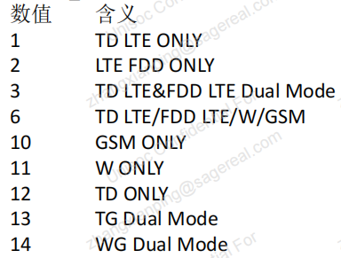
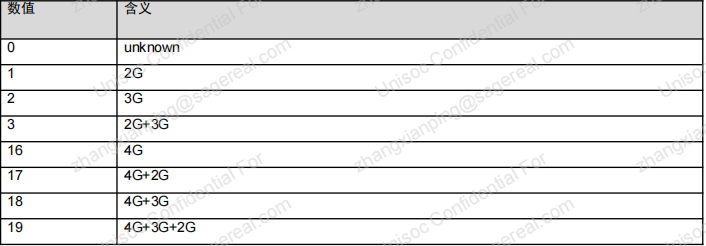
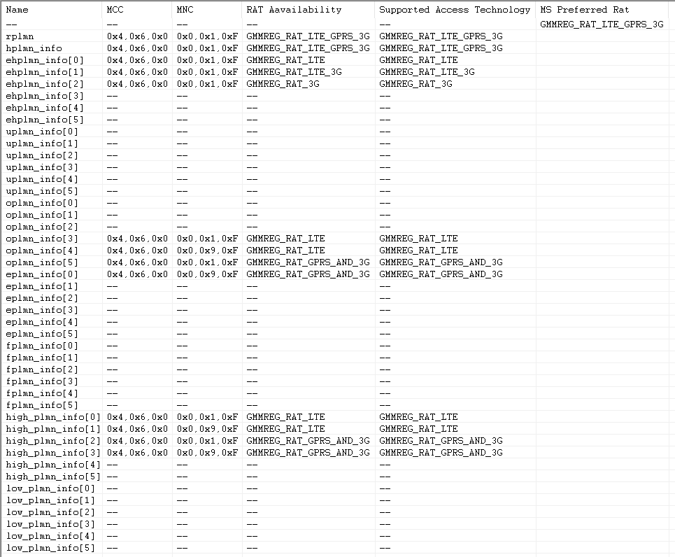
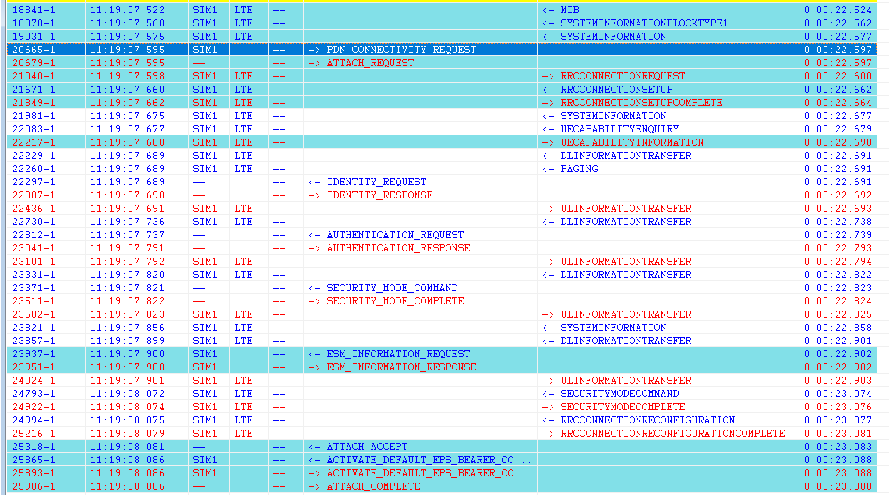

# 注册流程补充资料

## 阅读顺序

- 先看入口触发，再看 AP 到 modem 的消息链路，再看协议层关键消息，最后看状态同步和异常分支。
- 厂商客制化需要记录开关来源、默认值、配置路径、log 关键字和回退条件。
- 本文作为流程补充，主线结论仍优先沉淀到对应业务流程文档。

## 内容索引

| 资料 | 处理方式 | 说明 |
|---|---|---|
| LTE注网流程 | 已整理到本文 | 展锐平台开机找网、PLMN/RAT选择、Attach与状态同步补充 |
| GSM注网流程 | 仅保留来源 | 原页只有目录性内容，暂无可展开正文 |
| WCDMA注网流程 | 仅保留来源 | 原页正文为空 |
| 5G注册流程 | 已拆到 [[NR注册流程]] | 从 PLMN/LTE 小区搜索资料中移出，避免基础概念文档过载 |

## 展锐 LTE 注网流程

## 展锐平台

## 一、开机找网

### 1、总体流程

1.1 AP 通知激活协议栈，trace 如下：

```javascript
Time: 18 ATC: ATC_RecNewLineSig,link_id:2,sim:0,len:10,line:AT+SFUN=4		19429		11:19:07.061
```


> **信息**
> 关键字：AT+SFUN=4
>


1.2 将 PLMN+RAT 组合中的 RAT 与终端当前的工作模式进行匹配，保留当前工作模式支持的 RAT，形成可用的PLMN+RAT 组合，然后按照 SIM 中的优先级添加到对应的选网列表中。选网列表可以查看 Internal Messages 如下：

```javascript
2775-1		Time: 18 MNHPONE: GetLteTestModeEx, testmode[0][1][2][3]=6,6,10,10		19429		11:18:45.705
10884-1		Time: 18 MNPHONE: GetPrefRat,multi_sys=0, ue_prefer_rat=19,user_preferred_rat=2,user_preferred_multimode_rat=16		19429		11:19:07.063

19534-1		MSG_ID_MM_PLMN_INFO_IND		19429		11:19:07.581
	ms_preferred_rat = GMMREG_RAT_LTE_GPRS_3G
```

 

 


> **信息**
> 关键字：**ue_prefer_rat、testmode、MSG_ID_MM_PLMN_INFO_IND**
>


1.3 先确定目标 PLMN，按照协议规定的优先级从 RPLMN（Registered Public Land Mobile Network，已注册的公众陆地移动网络）开始。然后根据已确定的目标 PLMN 在列表中所支持的 RAT，确定目标

RAT。如果支持的目标 RAT 包含多个 RAT 组合，那么按照 4G>3G>2G 的顺序确定第一目标 RAT。

| **英文缩写** | **全称** | **定义与特性** | **存储位置** | **配置方** | **优先级** | **是否允许漫游** | **备注** |
|----|----|----|----|----|----|----|----|
| **HPLMN** | Home PLMN（归属PLMN） | MCC/MNC与SIM卡中的IMSI完全匹配的归属运营商网络 | SIM卡IMSI字段 | 归属运营商 | 最高 | 否 | 无漫游费用 |
| **EHPLMN** | Equivalent HPLMN（等效归属PLMN） | 与HPLMN等效的网络列表，设备视其为"本地网络" | SIM卡EF_EHPLMN文件 | 归属运营商 | 高 | 否 | 用于多国家运营商扩展覆盖（如T-Mobile跨国部署） |
| **RPLMN** | Registered PLMN（已注册PLMN） | 当前设备成功注册的PLMN，可能是共享网络中核心网运营商的标识 | 设备动态记录 | 实际接入的网络 | 动态 | 可能支持 | 反映实际服务的网络（如MVNO场景） |
| **VPLMN** | Visited PLMN（访问PLMN） | 漫游时接入的非归属PLMN，MCC/MNC与IMSI不匹配 | 无固定存储 | 漫游地运营商 | 中等 | 是 | 需运营商间漫游协议，可能产生额外费用 |
| **EPLMN** | Equivalent PLMN（等效PLMN） | 网络下发的等效PLMN列表，允许设备在这些PLMN间无缝切换 | 网络通过Attach Accept下发 | 服务网络核心网 | 高 | 取决于场景 | 优化切换效率（例如同一运营商的不同频段PLMN） |
| **UPLMN** | User Controlled PLMN（用户控制PLMN） | 用户手动配置的优选网络列表 | SIM卡EF_UPLMN文件 | 用户 | 用户指定 | 可能支持 | 用户可手动设置优先级（需设备支持） |
| **OPLMN** | Operator Controlled PLMN（运营商控制PLMN） | 运营商预设的优选网络列表，通常用于国际漫游合作 | SIM卡EF_OPLMMN文件 | 归属运营商 | 较高 | 是 | 引导用户优先选择合作运营商 |
| **FPLMN** | Forbidden PLMN（禁用PLMN） | 因注册失败而被临时禁止接入的PLMN列表（如鉴权失败、无漫游权限） | SIM卡EF_FPLMN文件 | 自动记录（Modem） | 无 | 否 | 重启或手动清除后可移出列表 |

 


> **信息**
> **选网PLMN优先级： RPLMN> EPLMN >EHPLMN>HPLMN>UPLMN>OPLMN（参考协议23.122）**
>


1.4 确定目标 PLMN 和目标 RAT 后发起选网。Internal Messages 如下：

发起找网：

```javascript
13845-1		MSG_ID_PLM_AS_3G_PLMN_SEL_REQ		19429		11:19:07.256
13846-1		MSG_ID_PLM_AS_GPRS_PLMN_SEL_REQ		19429		11:19:07.256
13888-1		MSG_ID_CMD_ASM_SELECT_CELL_REQUEST		19429		11:19:07.256
19461-1		MSG_ID_RR_PLM_SYS_INFO_IND		19429		11:19:07.580
25646-1		MSG_ID_PLM_AS_3G_PLMN_SEL_REQ		19429		11:19:08.083
44540-1		MSG_ID_RR_PLM_SYS_INFO_IND		19429		11:19:10.222
```


> **信息**
> 关键字：MSG_ID_PLM_AS_3G_PLMN_SEL_REQ（3G）、MSG_ID_PLM_AS_GPRS_PLMN_SEL_REQ（2G）、MSG_ID_CMD_ASM_SELECT_CELL_REQUEST（4G）
MSG_ID_RR_PLM_SYS_INFO_IND   //选网成功
>
> MSG_ID_RR_PLM_PLMN_SEL_FAILURE_IND   //选网失败
>


### 2、LTE 找网流程

2.1 发起选网请求

```javascript
13888-1		MSG_ID_CMD_ASM_SELECT_CELL_REQUEST		19429		11:19:07.256
```


> **信息**
> 如果选网请求中带的 selected_type=1，或 selected_type=0 并有历史频点
>


2.2 发起历史频点找网

```javascript
16384-1		MSG_ID_LTE_CPHY_FREQ_SEARCH_CELL_REQ		19429		11:19:07.345
```

历史频点找网结果：

```javascript
17583-1		MSG_ID_LTE_CPHY_FREQ_SEARCH_CELL_CNF		19429		11:19:07.412
```

关键参数解析

2.2.1 请求消息（REQ）

* 载波频点（carrierFreq）：0x672（十进制1650），对应 LTE Band 3（1800MHz）。
* 过程类型（processType）：PAL_LTE_PROCESS_TYPE_NO_CAMP_WITHOUT_STORE_INFO（设备未被存储的频点信息触发搜索）。
* 物理小区ID（physCellId）：未指定（0x0）

2.2.2 确认消息（CNF）

* 发现的小区：
  * 唯一有效条目：physCellId = 0x1ba（十六进制0x1ba，十进制442）


2.3 发起全 band 找网

如果没有历史频点或历史频点没有找到合适的小区，才会发起


> **信息**
> 关键字：
>
> MSG_ID_LTE_CPHY_BAND_SWEEP_REQ   //发起全band找网
>
> MSG_ID_LTE_CPHY_FREQ_SEARCH_CELL_CNF   //全 band 找网结果
>


关键参数解析

2.3.1 请求消息 （REQ）

* 请求原因：sweepCause = 0x1（常规扫描，非紧急）
* 扫描状态：ongoing_searchflag = 0x0（无进行中的扫描）
* 处理类型：PAL_LTE_PROCESS_TYPE_NO_CAMP_WITHOUT_STORE_INFO → 设备未驻留小区且无存储信息（需全频段搜索）
* 有效频段数：band_num = 0xA（10个频段）
* 待扫描频段列表：band_list
* 具体频段映射：band_Ind（十六进制转十进制）

2.3.2确认消息（CNF）

* carrierFreq：EARFCN 1300（对应LTE频段）
* syncCnfCells\[0\].physCellId：PCI 398（物理小区ID）


2.4 同步系统消息

判断 PLMN 是否匹配，S>0 是否满足

MIB\\SIB1\\SIB2

```javascript
18841-1		<- MIB		19429		11:19:07.522
18878-1		<- SYSTEMINFORMATIONBLOCKTYPE1		19429		11:19:07.560
19031-1		<- SYSTEMINFORMATION		19429		11:19:07.575
```

2.4.1 **MIB（Master Information Block，主信息块）**

```javascript
[PEER] BCCH-BCH-Message
  dl-Bandwidth = n100               // 下行带宽：10MHz
  phich-Config                      // PHICH信道配置
    phich-Duration = normal         // PHICH持续时间：normal（1符号）
    phich-Resource = one            // PHICH资源占比：1/6
  systemFrameNumber = '00100010'B   // 系统帧号（SFN）二进制值：34（十进制）
  freqBandIndicator = 3             // 频段指示：Band 3（1800MHz）
  phycellid = 0x45                  // 物理小区ID（PCI）：69
```

2.4.2 **SIB1（System Information Block Type 1）**

```javascript
[PEER] BCCH-DL-SCH-Message
  plmn-IdentityList                // PLMN列表
    plmn-Identity
      mcc = 4, 6, 0               // MCC：460（中国）
      mnc = 1, 1                  // MNC：11 → PLMN ID: 460-11（参考：中国联通可扩展PLMN）
    plmn-Identity
      mcc = 4, 6, 0               // MCC：460
      mnc = 0, 1                  // MNC：01 → PLMN ID: 460-01（中国联通标准PLMN）
  trackingAreaCode = 0xe68a        // 跟踪区码（TAC）：59018
  cellIdentity = 0x4e4c537        // 小区ID：82130103（核心网层级唯一标识）
  cellBarred = notBarred           // 小区未受限
  q-RxLevMin = -60                // 最小接收电平：-60dBm（需要RSRP≥-60dBm才能驻留）

cellBarred: notBarred (1)         //小区未被禁止接入
intraFreqReselection: allowed (0) //允许同频重选
```

2.4.3 **SIB2（系统信息块2）与无线资源配置**

```javascript
[PEER] BCCH-DL-SCH-Message (SIB2)
  rach-ConfigCommon               // 随机接入配置
    preambleTransMax = n8         // 前导码最大重传次数：8
    powerRampingStep = dB2        // 功率攀升步长：2dB
    preambleInitialRxPower = dBm-100 // 初始接收目标功率：-100dBm
  pdsch-ConfigCommon              // 下行共享信道配置
    referenceSignalPower = 13     // 参考信号功率：13dBm
  pusch-ConfigCommon              // 上行共享信道配置
    enable64QAM = FALSE           // 禁用64QAM调制（仅支持QPSK/16QAM）
  ul-CarrierFreq = 19850          // 上行频点（对应EARFCN），需验证实际频段。
  uplinkPowerControlCommon        // 上行功率控制
    p0-NominalPUSCH = -75         // 标称PUSCH功率：-75dBm

定时器与计数器
T300=2000ms：RRC连接建立超时时间。
N310=20次：检测无线链路失败的次数。
T310=1000ms：触发RLF的持续时间。
```


2.5 选网成功

```javascript
19461-1		MSG_ID_RR_PLM_SYS_INFO_IND		19429		11:19:07.580
```

## 二、LTE注册

 

### 1、网络接入初始化

PDN_CONNECTIVITY_REQUEST：设备发起分组数据网络连接请求


> **提示**
> 关键字：
>
> * PDN类型：IPv4v6（双栈IP支持）
> * 请求类型：Initial request（初始连接请求）
> * ESM信息传输标志：要求安全保护传输
> * P-CSCF IPv4/IPv6 Address Request：请求IMS的代理服务器地址
> * DNS Server IPv4/IPv6 Address Request：显式请求DNS服务器地址
>


ATTACH_REQUEST：同时发起网络附着请求（联合流程）


> **提示**
> 关键字：
>
> * **基础信息**
>
>   消息类型：Attach request (0x41)（附着请求）
>
>   安全状态：Plain NAS message（明文传输，未加密）
>
>   附着类型：Combined EPS/IMSI attach（EPS与CS域联合附着）
>
>   终端标识：GUTI (460-01-35331-150-3440362028)（中国联通网络）
> * **加密算法支持**：
>   * LTE：EEA0/EEA1/EEA2/EEA3（空加密/AES-128/Snow3G/ZUC）
>   * 3G：UEA0/UEA1/UEA2（空加密/Kasumi/UIA2）
>   * 2G：A5/1, A5/3（支持基础加密）
>
>
> * **关键能力**：
>   * SRVCC（语音业务连续性）
>   * ISR（空闲态信令缩减）
>   * EPC（EPC网络支持）
>   * LTE Positioning Protocol（定位服务）
>
>
> * **关键配置**：
>   * DNSv4/v6 Address Request（显式请求DNS地址）
>   * P-CSCF IPv4/v6 Request（IMS代理服务器请求）
>   * PS Data Off Status = Deactivated（数据业务开启）
> * **语音业务配置**
>   * **语音域偏好**：IMS PS voice preferred, CS Voice as secondary（优先VoLTE，次选CS回落）
>   * **编解码支持**：
>   * GSM：FR/HR/EFR/AMR
>   * UMTS：UMTS AMR/AMR-WB
>   * **终端模式**：Voice centric（语音中心型设备）
>


### 2、RRC层连接建立

**先建立RRC连接，再传输NAS消息**

RRCCONNECTIONREQUEST -> RRCCONNECTIONSETUP -> RRCCONNECTIONSETUPCOMPLETE：完成无线资源控制连接建立

2.1 RRC Request：设备发送RRCConnectionRequest（原因可能是mobileOriginatedCall或attach）


> **提示**
> 关键字：
>
> * criticalExtensions：rrcConnectionRequest-r8遵循R8版本协议
> * randomValue：在未分配正式ID前，用于冲突解决的临时标识
> * mo-Signalling：终端主动发起信令传输（与前次附着请求逻辑一致）
>


2.2 RRC Setup：基站回复RRCConnectionSetup（分配C-RNTI、物理层参数）


> **提示**
> 关键字：
>
> **rrc-TransactionIdentifier: RRC事务标识符，用于匹配后续的RRC连接建立完成消息**（RRCConnectionSetupComplete）
>
>
> **radioResourceConfigDedicated：专用无线资源配置**
>
> * srb-ToAddModList：信令无线承载（SRB）的添加或修改列表。这里配置了一个SRB（SRB1）。
>   * srb-Identity: 1：SRB的标识，SRB1用于传输RRC消息和NAS消息。
>   * rlc-Config: explicitValue -> am：RLC层配置为确认模式（AM）。
>   * ul-AM-RLC：上行AM RLC配置
>   * dl-AM-RLC：下行AM RLC配置
>   * logicalChannelConfig: explicitValue：逻辑信道配置
>   * ul-SpecificParameters：上行特定参数
>
>
> **mac-MainConfig: explicitValue：MAC主配置**
>
> * ul-SCH-Config：上行共享信道配置
> * timeAlignmentTimerDedicated: infinity (7) - 专用时间对齐定时器为无限（即一直保持上行时间对齐）
> * phr-Config: setup - 功率余量报告（PHR）配置为建立
>
>
> **physicalConfigDedicated：专用物理层配置**
>
> * pdsch-ConfigDedicated：下行共享信道专用配置
> * pusch-ConfigDedicated：上行共享信道专用配置
> * uplinkPowerControlDedicated：上行功率控制专用配置
> * cqi-ReportConfig：CQI报告配置
> * antennaInfo: explicitValue：天线信息
> * schedulingRequestConfig: setup：调度请求配置
>


2.3 RRC Setup Complete：设备确认配置完成，进入RRC_CONNECTED状态


> **提示**
> 关键字：
>
> **RRC层关键信息：**
>
> * rrc-TransactionIdentifier: 事务标识符，与之前基站下发的RRCConnectionSetup中的事务ID匹配。
> * selectedPLMN-Identity: 终端选择的PLMN ID（公共陆地移动网络标识）
> * registeredMME：终端注册的MME信息：
>   * mmegi: 35331 (0x8a03)MME组ID，与之前附着请求中的GUTI中的MME组ID一致。
>   * mmec: 150 (0x96)MME码，与之前GUTI中的MME码一致。
> * dedicatedInfoNAS携带的NAS消息（即加密后的附着请求消息
>
>
> **NAS层关键信息（dedicatedInfoNAS内）：**
>
> NAS消息是经过完整性保护的附着请求（Attach Request），但尚未加密（因为安全模式尚未激活）。
>
> * Security header type: Integrity protected (1) 表示该NAS消息启用了完整性保护（MAC校验），但未加密。
> * Message authentication code: 0xdf373419 完整性保护的消息认证码（MAC），用于验证消息完整性。
> * Sequence number: 序列号，用于防重防攻击。
> * NAS EPS Mobility Management Message Type: Attach request (0x41) 消息类型为附着请求。
> * EPS attach type: Combined EPS/IMSI attach 附着类型为联合附着（EPS和CS域）。
> * EPS mobile identity: GUTI (460-01-35331-150-3440362028) 终端使用GUTI标识自己（中国联通网络）。
> * UE network capability：终端支持的加密和完整性算法（与之前一致）：
>   * 支持EEA0/EEA1/EEA2/EEA3（加密）
>   * 支持EIA0/EIA1/EIA2/EIA3（完整性）
>   * 支持UMTS的UEA0/UEA1/UEA2（加密）和UIA1/UIA2（完整性）
>   * 支持GSM的A5/1和A5/3加密算法
> * **ESM message container**
内嵌的ESM消息（PDN连接请求）：
>   * **PDN type: IPv4v6**  请求IPv4v6双栈PDN连接。
>   * **Request type: Initial request**  初始请求。
>   * **Protocol Configuration Options** 请求网络分配DNS服务器地址（IPv4和IPv6）和P-CSCF地址（用于IMS业务）。
>   * **3GPP PS data off UE status: Deactivated (1)** 终端的数据业务处于激活状态。
> * **Tracking area identity - Last visited registered TAI** 最后访问的TAI：460-01-59018（中国联通）。
> * **Voice Domain Preference**
>   * **UE's usage setting: Voice centric**语音中心型终端。
>   * **Voice domain preference for E-UTRAN: IMS PS voice preferred, CS Voice as secondary** 优先使用IMS语音（VoLTE），次选CS语音回落。
>


### 3、能力协商与鉴权

* UECAPABILITY ENQUIRY/INFORMATION：基站查询/设备上报能力集
* IDENTITY_REQUEST/RESPONSE：IMSI身份验证
* AUTHENTICATION_REQUEST/RESPONSE：双向鉴权流程
* SECURITY_MODE_COMMAND/COMPLETE：安全模式协商，选择加密算法

### 4、网络信息配置

* SYSTEMINFORMATION广播：接收基站系统信息
* ESM_INFORMATION_REQUEST/RESPONSE：EPS会话管理参数配置，获取APN信息

### 5、资源重配与承载激活

* RRCCONNECTIONRECONFIGURATION：无线参数重配置
* ATTACH_ACCEPT：网络接受附着请求，网络分配IP地址，携带TAU周期、默认承载QoS参数
* ACTIVATE_DEFAULT_EPS_BEARER_CONTEXT_REQUEST/ACCEPT：激活默认数据承载
* Attach Complete：设备确认激活默认承载


## 三、LTE去激活


## 四、小区重选


## 五、LTE重建

## GSM/WCDMA来源摘要

GSM 原页正文只有以下目录性提示，后续需要结合实际 log 再补：

```text
前言


ZR AP LOG


ZR MODEM LOG
```

WCDMA 原页正文为空，暂不展开。

## 来源记录

- [LTE注网流程](http://192.168.3.94:8888/doc/lte-U8bRVaWj55) (`U8bRVaWj55`)
- [GSM注网流程](http://192.168.3.94:8888/doc/gsm-cKBvQneJG6) (`cKBvQneJG6`)
- [WCDMA注网流程](http://192.168.3.94:8888/doc/wcdma-zw936hWjCe) (`zw936hWjCe`)
