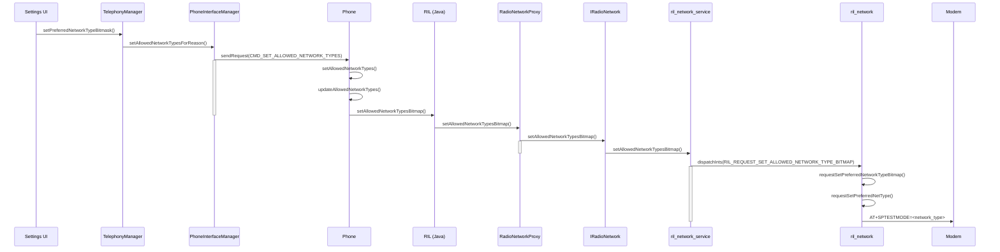
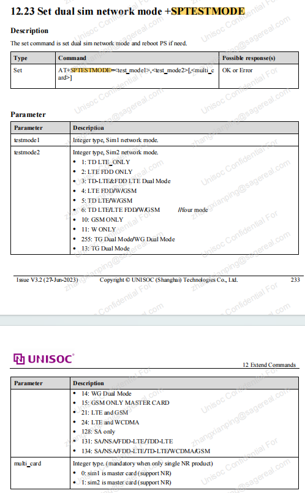

# 网络模式更新流程

## 阅读顺序

- 先看入口触发，再看 AP 到 modem 的消息链路，再看协议层关键消息，最后看状态同步和异常分支。
- 厂商客制化需要记录开关来源、默认值、配置路径、log 关键字和回退条件。
- 本文作为流程补充，主线结论仍优先沉淀到对应业务流程文档。

Android AP 到 modem 的 preferred network type 更新链路补充。

> 图片已保存为本地附件；非图片附件仍保留原 Outline 链接作为资料索引。

## 更新支持网络流程

## AP→Modem流程

步骤概述：


 1. 用户在Settings界面选择网络模式，触发`UniEnabledNetworkModePreferenceController.onPreferenceChange`。
 2. 调用`TelephonyManager.setPreferredNetworkTypeBitmask`。
 3. 通过AIDL调用到`PhoneInterfaceManager.setAllowedNetworkTypesForReason`。
 4. 发送消息`CMD_SET_ALLOWED_NETWORK_TYPES_FOR_REASON`到`Phone`对象。
 5. 在`Phone`对象中调用`setAllowedNetworkTypes`，然后调用`updateAllowedNetworkTypes`。
 6. 通过`CommandsInterface.setAllowedNetworkTypesBitmap`调用到RIL层。
 7. RIL实现CommandsInterface处理请求，通过`RadioNetworkProxy`调用HAL接口。
 8. setAllowedNetworkTypesBitmap在IRadioNetwork.aidl中声明
 9. HAL接口（`IRadioNetwork.aidl`）的实现在`ril_network_service.cpp`中，接着调用`dispatchInts`。
10. 在RIL的impl层（`ril_network.c`）处理`RIL_REQUEST_SET_ALLOWED_NETWORK_TYPE_BITMAP`请求，转换为AT命令。
11. 发送AT命令到Modem



## 一、AP层

1、用户在Settings界面选择网络模式，触发`UniEnabledNetworkModePreferenceController.onPreferenceChange`

```java
A15/alps/vendor/sprd/platform/packages/apps/Settings/src_unisoc_tele/com/unisoc/settings/network/telephony/UniEnabledNetworkModePreferenceController.java
@Override
    public boolean onPreferenceChange(Preference preference, Object object) {
        ...
            ThreadUtils.postOnBackgroundThread(() -> {
                Log.d(LOG_TAG, "set preferred network type in backgroud: " + newPreferredNetworkMode);
                boolean isSucceed = mTelephonyManager.setPreferredNetworkTypeBitmask(
                        MobileNetworkUtils.getRafFromNetworkType(newPreferredNetworkMode));
                mUiHandler.post(() -> {
                    listPreference.setEnabled(true);
                    if (isSucceed) {
                        mBuilder.setPreferenceValueAndSummary(newPreferredNetworkMode);
                        listPreference.setValue(Integer.toString(mBuilder.getSelectedEntryValue()));
                        listPreference.setSummary(mBuilder.getSummary());
                        Intent intent = new Intent(ACTION_NETWORK_MODE_CHANGED);
                        int phoneId = SubscriptionManager.getPhoneId(mSubId);
                        SubscriptionManager.putPhoneIdAndSubIdExtra(intent, phoneId);
                        intent.setPackage(SELFREG_PACKAGE);
                        intent.addFlags(Intent.FLAG_RECEIVER_INCLUDE_BACKGROUND);
                        mContext.sendBroadcast(intent);
                    }
                });
                return true;
            });
        }
        return false;
    }
```

2、调用`TelephonyManager.setPreferredNetworkTypeBitmask`

```javascript
A15/alps/frameworks/base/telephony/java/android/telephony/TelephonyManager.java
    /**
     * Set the preferred network type.
     *
     * <p>Requires Permission:
     * {@link android.Manifest.permission#MODIFY_PHONE_STATE MODIFY_PHONE_STATE} or that the calling
     * app has carrier privileges (see {@link #hasCarrierPrivileges}).
     * <p>
     * If {@link android.telephony.TelephonyManager#isRadioInterfaceCapabilitySupported}
     * ({@link TelephonyManager#CAPABILITY_USES_ALLOWED_NETWORK_TYPES_BITMASK}) returns true, then
     * setAllowedNetworkTypesBitmap is used on the radio interface.  Otherwise,
     * setPreferredNetworkTypesBitmap is used instead.
     *
     * @param subId the id of the subscription to set the preferred network type for.
     * @param networkType the preferred network type
     * @return true on success; false on any failure.
     * @hide
     * @deprecated Use {@link #setAllowedNetworkTypesForReason} instead.
     */

    @Deprecated
    @UnsupportedAppUsage(maxTargetSdk = Build.VERSION_CODES.R, trackingBug = 170729553)
    public boolean setPreferredNetworkType(int subId, @PrefNetworkMode int networkType) {
        try {
            ITelephony telephony = getITelephony();
            if (telephony != null) {
                return telephony.setAllowedNetworkTypesForReason(subId,
                        TelephonyManager.ALLOWED_NETWORK_TYPES_REASON_USER,
                        RadioAccessFamily.getRafFromNetworkType(networkType));
            }
        } catch (RemoteException ex) {
            Rlog.e(TAG, "setPreferredNetworkType RemoteException", ex);
        }
        return false;
    }
```

3、通过AIDL调用到`PhoneInterfaceManager.setAllowedNetworkTypesForReason`

setAllowedNetworkTypesForReason在ITelephony.aidl只有声明

```javascript
A15/alps/frameworks/base/telephony/java/com/android/internal/telephony/ITelephony.aidl
    /**
     * Set the allowed network types and provide the reason triggering the allowed network change.
     *
     * @param subId the id of the subscription.
     * @param reason the reason the allowed network type change is taking place
     * @param allowedNetworkTypes the allowed network types.
     * @return true on success; false on any failure.
     */
    boolean setAllowedNetworkTypesForReason(int subId, int reason, long allowedNetworkTypes);
```

PhoneInterfaceManager通过继承ITelephony，从而实现setAllowedNetworkTypesForReason

```javascript
  A15/alps/packages/services/Telephony/src/com/android/phone/PhoneInterfaceManager.java
    ...
    public class PhoneInterfaceManager extends ITelephony.Stub {
    ...
```

```java
    A15/alps/packages/services/Telephony/src/com/android/phone/PhoneInterfaceManager.java
    /**
     * Set the allowed network types of the device and
     * provide the reason triggering the allowed network change.
     *
     * @param subId the id of the subscription.
     * @param reason the reason the allowed network type change is taking place
     * @param allowedNetworkTypes the allowed network types.
     * @return true on success; false on any failure.
     */
    @Override
    public boolean setAllowedNetworkTypesForReason(int subId,
            @TelephonyManager.AllowedNetworkTypesReason int reason,
            @TelephonyManager.NetworkTypeBitMask long allowedNetworkTypes) {
        ...
        try {
            Boolean success = (Boolean) sendRequest(
                    CMD_SET_ALLOWED_NETWORK_TYPES_FOR_REASON,
                    new Pair<Integer, Long>(reason, allowedNetworkTypes), subId);

            if (DBG) log("setAllowedNetworkTypesForReason: " + (success ? "ok" : "fail"));
            return success;
        } finally {
            Binder.restoreCallingIdentity(identity);
        }
    }
```

4、发送消息`CMD_SET_ALLOWED_NETWORK_TYPES_FOR_REASON`到`Phone`对象

```javascript
A15/alps/packages/services/Telephony/src/com/android/phone/PhoneInterfaceManager.java
case CMD_SET_ALLOWED_NETWORK_TYPES_FOR_REASON:
     request = (MainThreadRequest) msg.obj;
     onCompleted = obtainMessage(EVENT_SET_ALLOWED_NETWORK_TYPES_FOR_REASON_DONE,
             request);
     Pair<Integer, Long> reasonWithNetworkTypes =
             (Pair<Integer, Long>) request.argument;
     getPhoneFromRequest(request).setAllowedNetworkTypes(
             reasonWithNetworkTypes.first,
             reasonWithNetworkTypes.second,
             onCompleted);
     break;
```

5、在`Phone`对象中调用`setAllowedNetworkTypes`，然后调用`updateAllowedNetworkTypes`

```javascript
A15/alps/frameworks/opt/telephony/src/java/com/android/internal/telephony/Phone.java
	/**
     * Requests to set the allowed network types for a specific reason
     *
     * @param reason reason to configure allowed network type
     * @param networkTypes one of the network types
     * @param response callback Message
     */
    public void setAllowedNetworkTypes(@TelephonyManager.AllowedNetworkTypesReason int reason,
            @TelephonyManager.NetworkTypeBitMask long networkTypes, @Nullable Message response) {
        ...

        updateAllowedNetworkTypes(response);
        notifyAllowedNetworkTypesChanged(reason);
    }
```

updateAllowedNetworkTypes中会执行mCi.setAllowedNetworkTypesBitmap

```javascript
protected void updateAllowedNetworkTypes(Message response) {
        ...
        UniTeleSimManager uniTeleSimManager = UniTeleSimManager.getInstance();
        if (uniTeleSimManager.isVendorOptimizedNetworkTypeSupport()
                && uniTeleSimManager.isSupportRadioBitmaskNrLte(mPhoneId, mContext)) {
            if (mOldFilteredType == RadioAccessFamily.getNetworkTypeFromRaf(filteredRaf)) {
                Rlog.d(mLogTag, "OldFilteredType is the same as New, return.");
                if (response != null) {
                    AsyncResult.forMessage(response, true, null);
                    response.sendToTarget();
                }
                return;
            }
            // check whether tansmit satisfy options
            if (uniTeleSimManager.isNetTransSatisfyOpti(mOldFilteredType, filteredRaf)) {
                uniTeleSimManager.setOptimizedNetworkTypesBitmap(
                        filteredRaf, mPhoneId, mContext, response);
            } else {
                mCi.setAllowedNetworkTypesBitmap(filteredRaf, response);
            }
        } else {
            mCi.setAllowedNetworkTypesBitmap(filteredRaf, response);
        }
        ...
    }
```

6、通过`CommandsInterface.setAllowedNetworkTypesBitmap`调用到RIL层

```javascript
A15/alps/frameworks/opt/telephony/src/java/com/android/internal/telephony/CommandsInterface.java
    /**
     * Requests to set the allowed network types for searching and registering.
     *
     * @param networkTypeBitmask {@link TelephonyManager.NetworkTypeBitMask}
     * @param response is callback message
     */
    void setAllowedNetworkTypesBitmap(
            @TelephonyManager.NetworkTypeBitMask int networkTypeBitmask, Message response);
```

## 二、RIL层

在RIL.java中实现了CommandsInterface

```javascript
A15/alps/frameworks/opt/telephony/src/java/com/android/internal/telephony/RIL.java
	public class RIL extends BaseCommands implements CommandsInterface {
```

7、RIL层（`RIL`类）处理请求，通过`RadioNetworkProxy`调用HAL接口

```javascript
    public void setAllowedNetworkTypesBitmap(
            @TelephonyManager.NetworkTypeBitMask int networkTypeBitmask, Message result) {
        ...

        RILRequest rr = obtainRequest(RIL_REQUEST_SET_ALLOWED_NETWORK_TYPES_BITMAP, result,
                mRILDefaultWorkSource);

        if (RILJ_LOGD) {
            riljLog(rr.serialString() + "> " + RILUtils.requestToString(rr.mRequest));
        }
        mAllowedNetworkTypesBitmask = networkTypeBitmask;

        radioServiceInvokeHelper(HAL_SERVICE_NETWORK, rr, "setAllowedNetworkTypesBitmap", () -> {
            networkProxy.setAllowedNetworkTypesBitmap(rr.mSerial, mAllowedNetworkTypesBitmask);
        });
    }
```

```javascript
A15/alps/frameworks/opt/telephony/src/java/com/android/internal/telephony/RadioNetworkProxy.java
    /**
     * Call IRadioNetwork#setAllowedNetworkTypesBitmap
     * @param serial Serial number of request
     * @param networkTypeBitmask Network type bitmask to set
     * @throws RemoteException
     */
    public void setAllowedNetworkTypesBitmap(int serial, int networkTypeBitmask)
            throws RemoteException {
        if (isEmpty() || mHalVersion.less(RIL.RADIO_HAL_VERSION_1_6)) return;
        if (isAidl()) {
            mNetworkProxy.setAllowedNetworkTypesBitmap(serial,
                    RILUtils.convertToHalRadioAccessFamilyAidl(networkTypeBitmask));
        } else {
            ((android.hardware.radio.V1_6.IRadio) mRadioProxy).setAllowedNetworkTypesBitmap(
                    serial, RILUtils.convertToHalRadioAccessFamily(networkTypeBitmask));
        }
    }
```

8、setAllowedNetworkTypesBitmap在IRadioNetwork.aidl中声明

```javascript
 A15/alps/hardware/interfaces/radio/aidl/android/hardware/radio/network/IRadioNetwork.aidl
    /**
     * Requests to set the network type for searching and registering. Instruct the radio to
     * *only* accept the types of network provided. In case of an emergency call, the modem is
     * authorized to bypass this restriction.
     *
     * @param serial Serial number of request.
     * @param networkTypeBitmap a 32-bit bearer bitmap of RadioAccessFamily
     *
     * Response function is IRadioNetworkResponse.setAllowedNetworkTypesBitmapResponse()
     */
    void setAllowedNetworkTypesBitmap(in int serial, in int networkTypeBitmap);
```

这个XML文件是Android HAL的清单文件，声明设备支持IRadioNetwork接口服务

```javascript
SPRDROID13_VND_RLS_23A/alps/vendor/sprd/modules/rild/rild/manifest_dualsim.xml
    <hal format="aidl">
        <name>android.hardware.radio.network</name>
        <interface>
            <name>IRadioNetwork</name>
            <instance>slot1</instance>
            <instance>slot2</instance>
        </interface>
    </hal>
```

9、HAL接口（`IRadioNetwork.aidl`）的实现在`ril_network_service.cpp`中，接着调用`dispatchInts`

```javascript
SPRDROID13_VND_RLS_23A/alps/vendor/sprd/modules/rild/libril/ril_network_service.cpp
ScopedAStatus RadioNetwork::setAllowedNetworkTypesBitmap(int32_t serial,
                                        int32_t networkTypeBitmap) {
#if VDBG
    RLOGD("setAllowedNetworkTypesBitmap: serial %d", serial);
#endif
    dispatchInts(serial, mSlotId, RIL_REQUEST_SET_ALLOWED_NETWORK_TYPE_BITMAP,
            1, (int)networkTypeBitmap);
    return ok();
}
```

10、在RIL的impl层（`ril_network.c`）处理`RIL_REQUEST_SET_ALLOWED_NETWORK_TYPE_BITMAP`请求，转换为AT命令

```javascript
SPRDROID13_VND_RLS_23A/alps/vendor/sprd/modules/rild/impl-ril/ril_network.c
int processNetworkRequests(int request, void *data, size_t datalen,
                           RIL_Token t, RIL_SOCKET_ID socket_id) {
    int err = -1;

    switch (request) {
		...
        case RIL_REQUEST_SET_ALLOWED_NETWORK_TYPE_BITMAP:
            requestSetPreferredNetworkTypeBitmap(socket_id, data, datalen, t);
            break;
		...
```

requestSetPreferredNetworkTypeBitmap中执行requestSetPreferredNetType

```javascript
SPRDROID13_VND_RLS_23A/alps/vendor/sprd/modules/rild/impl-ril/ril_network.c
static void requestSetPreferredNetworkTypeBitmap(RIL_SOCKET_ID socket_id, void *data,
                                                 size_t datalen, RIL_Token t) {
    RIL_UNUSED_PARM(datalen);

    int err = -1;
#if (SIM_COUNT == 2)
    pthread_mutex_lock(&s_radioPowerMutex[RIL_SOCKET_1]);
    pthread_mutex_lock(&s_radioPowerMutex[RIL_SOCKET_2]);
#endif
    int networkMode = getNetworkModeFromRadioAccessFamily(((int *)data)[0], socket_id);
    RLOGD("raf = %d, networkMode = %d", ((int *)data)[0], networkMode);
    err = requestSetPreferredNetType(socket_id, (void *)(&networkMode), datalen, t);
    if (err < 0) {
#if (SIM_COUNT == 2)
    pthread_mutex_unlock(&s_radioPowerMutex[RIL_SOCKET_1]);
    pthread_mutex_unlock(&s_radioPowerMutex[RIL_SOCKET_2]);
#endif
    }
}
```

最终通过发送AT+SPTESTMODE到modem设置网络模式

```javascript
SPRDROID13_VND_RLS_23A/alps/vendor/sprd/modules/rild/impl-ril/ril_network.c
static int requestSetPreferredNetType(RIL_SOCKET_ID socket_id, void *data,
                                      size_t datalen, RIL_Token t) {
    RIL_UNUSED_PARM(datalen);

    ...

#if defined (ANDROID_MULTI_SIM)
#if (SIM_COUNT == 2)
    if (socket_id == RIL_SOCKET_1) {
        snprintf(numToStr, sizeof(numToStr), "%d,%d", type,
                s_workMode[RIL_SOCKET_2]);
    } else if (socket_id == RIL_SOCKET_2) {
        snprintf(numToStr, sizeof(numToStr), "%d,%d", s_workMode[RIL_SOCKET_1],
                type);
    }
#endif
#else
     snprintf(numToStr, sizeof(numToStr), "%d,10", type);
#endif
    RLOGD("set network type workmode:%s", numToStr);
    if (s_modemConfig == NRLWG_LWG) {
        snprintf(cmd, sizeof(cmd), "AT+SPTESTMODE=%s,%d", numToStr, s_multiModeSim);
    } else {
        snprintf(cmd, sizeof(cmd), "AT+SPTESTMODE=%s", numToStr);
    }

    const char *respCmd = "+SPTESTMODE:";
    int retryTimes = 0;
```

## 三、Modem层

1. 接收`AT+SPTESTMODE=<network_type>`指令
2. 解析网络类型位掩码
3. 更新射频参数配置
4. 返回操作结果：
   * 成功：`OK`
   * 失败：`ERROR <code>`

 

## 四、相关log打印

AP端

```java
R0141D6  06-30 09:50:55.117  1390  5705 D Phone-1 : [1] SubId1,get allowed network types user: value = GPRS|EDGE|UMTS|HSDPA|HSUPA|HSPA|LTE|HSPA+|GSM|LTE_CA
R0141D9  06-30 09:50:55.119  1390  1390 D SMSVC   : setSubscriptionProperty: subId=1, columnName=allowed_network_types_for_reasons, value=user=32771,enable_2g=54223, calling package=com.android.phone
R0141DB  06-30 09:50:55.120  1390  1390 D Phone-1 : [1] setAllowedNetworkTypes: SubId1,setAllowedNetworkTypes user=32771,enable_2g=54223
R0141DD  06-30 09:50:55.120  1390  1390 D Phone-1 : [1] SubId1,getEffectiveAllowedNetworkTypes: GPRS|EDGE|GSM
R0141DF  06-30 09:50:55.120  1390  1390 D Phone-1 : [1] setAllowedNetworkTypes: modemRafBitMask = 316295 ,modemRaf = GPRS|EDGE|UMTS|HSDPA|HSUPA|HSPA|LTE|HSPA+|GSM|LTE_CA ,filteredRafBitMask = 32771 ,filteredRaf = GPRS|EDGE|GSM
R0141E1  06-30 09:50:55.125  1390  1390 D RILJ    : [2012]> SET_ALLOWED_NETWORK_TYPES_BITMAP [PHONE1]
R0141E2  06-30 09:50:55.125   690   690 D RILC    : setAllowedNetworkTypesBitmap: serial 2012
R0141E3  06-30 09:50:55.125   690   721 D RIL_REQ_THDS: dequeue msg
R0141E4  06-30 09:50:55.125   690   721 D RIL_REQ_THDS: handleMessage 165
R0141E5  06-30 09:50:55.126   690   721 D RIL     : onRequest: SET_ALLOWED_NETWORK_TYPE_BITMAP radioState = RADIO_ON
R0141E6  06-30 09:50:55.126   690   721 D RIL     : raf = 65542, networkMode = 1
R0141E7  06-30 09:50:55.126   690   721 D RIL     : ENGTEST_ENABLE_PROP is false, current s_workMode[1] is 6
R0141E8  06-30 09:50:55.126   690   721 D RIL     : set network type workmode:6,10
```

Modem端

 

## 客制化网络模式影响UE能力

运营商客制化可能在用户未手动切换网络模式时，也通过 CarrierConfig / 项目逻辑触发 `setPreferredNetworkType`，最终下发到 modem 的 workmode 会影响后续 RRC `UECapabilityInformation`。

典型配置：

```xml
<string name="key_oem_pref_network_mode">0,1,0,0,0,0</string>
```

典型链路：

```text
CarrierConfig key_oem_pref_network_mode
-> updateOemAllowedNetworkMode()
-> TelephonyManager.setPreferredNetworkType()
-> RIL_REQUEST_SET_ALLOWED_NETWORK_TYPE_BITMAP
-> AT+SPTESTMODEM=24,6
-> 后续 LTE UECapabilityInformation 不再携带 2G/GSM 能力
```

排查时要同时记录：

| 证据 | 作用 |
|---|---|
| `key_oem_pref_network_mode` | 判断是否存在运营商默认网络模式客制 |
| `first_set_preferred_networkmode{subId}` | 判断是否首次插卡触发 |
| SIM PIN/PUK/SimLock 状态 | 异常卡状态下可能读取默认 CC 或跳过客制逻辑 |
| `AT+SPTESTMODEM` | modem 最终 workmode |
| `UECapabilityInformation` | 空口最终能力上报结果 |

参考案例：[[../../40_Case-Library/Registration/2025-07-16_Registration_UNISOC_UECapability缺少2G能力_网络模式客制化]]。

## Modem→AP流程

## 来源记录

- [更新支持网络流程](http://192.168.3.94:8888/doc/5pu05paw5psv5oyb572r57uc5rwb56il-5m5xR2Yz3C) (`5m5xR2Yz3C`)
