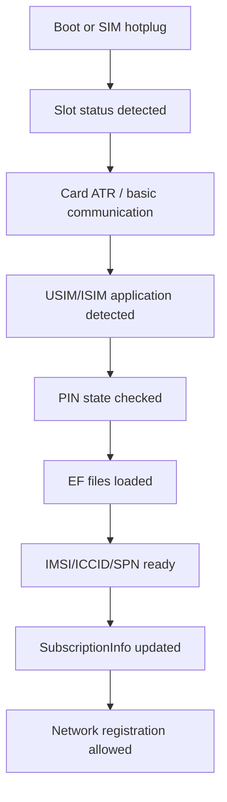
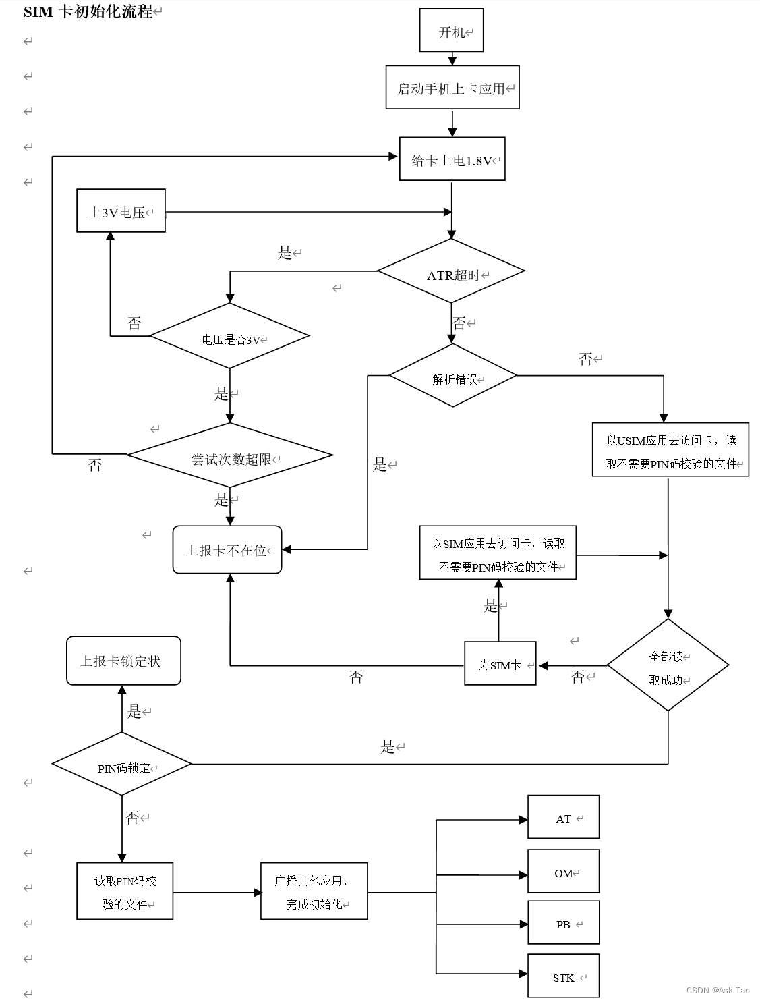

# SIM业务流程

## 阅读入口

- 本文是迁入/补充资料，先按本节入口定位，再看正文和来源记录。
- 可复用结论应沉淀到主流程/配置/排障/case；本文只保留溯源材料和操作细节。

SIM 域流程统一放在这里：卡识别、UICC 状态、SIM READY、初始化 AP/modem log 证据。

## SIM识别流程

---
domain: SIM
layer: AP/UICC/Modem/SIMCard
status: draft
---

### 正常路径



### AP侧观察点

- slot status 是否从 absent 变为 present。
- `UiccController` 是否创建 card/application/records。
- `IccCardProxy` 对外状态是否 READY。
- `SIMRecords` 是否读出 IMSI、ICCID、SPN。
- `SubscriptionInfoUpdater` 是否创建 subscription。

### Modem/SIM侧观察点

- 卡物理通信是否正常。
- ATR是否成功。
- USIM/ISIM application是否可用。
- PIN/PUK/LOCK状态。
- EF读取失败原因。

### 常见异常分叉

| 阶段 | 异常 | 可能方向 |
|---|---|---|
| 物理检测 | absent | 卡座、热插拔、硬件、modem |
| ATR | 卡通信失败 | SIM卡、电气、modem |
| 应用选择 | 无USIM/ISIM | 卡类型、应用状态 |
| PIN | locked | PIN/PUK、锁卡策略 |
| EF读取 | IMSI/ICCID为空 | EF读取失败、卡异常、RIL解析 |
| 订阅更新 | 没有subId | framework更新链路 |

### ATR / 热插拔判断

SIM 不识别问题先分三类：没有插入事件、插入后没有 ATR、ATR 后 EF/应用读取失败。

| 现象 | 优先判断 | 关键证据 |
|---|---|---|
| 插卡后 AP/Modem 都没有 SIM 流程 | 热插拔中断未触发、卡座/硬件、驱动配置 | 插入时间点没有 SIM driver log，没有 `ACTION_SIM_STATE_CHANGED` |
| 有上电流程但 `No ATR` | 卡接触、卡磨损、卡座、电气波形 | MTK `SIM_DRV: [ERR] No ATR`，展锐 `USIMDRV` reset 后无完整 ATR |
| ATR 成功后又 plug out | 热插拔极性/防抖/中断配置异常 | ATR 后很快出现 plug out indication |
| ATR 正常但 EF 失败 | 卡文件读取、RIL 解析、卡应用状态 | EF_IMSI/ICCID/SPN 读取失败或 records 不完整 |
| 重启后正常，热插拔不正常 | 插拔中断或上电路径问题 | 冷启动可识别，热插拔流程没有完整执行 |

### SIM PLMN列表能力

客户要求终端支持一定数量的 PLMN 列表时，要先确认指的是哪类 SIM EF 文件，而不是只看 UI 手动搜网列表。CQWeb 历史问题 `SPCSS01630213` 中确认过：`EF_PLMNwACT + EF_OPLMNwACT >= 50` 这一类容量要求当前平台口径为支持。

SIM/USIM 常见 EF 文件基础含义统一见 [[../../10_Basics/SIM-USIM-EF文件速查]]。

核对项：

| 文件 | 含义 | 常见用途 |
|---|---|---|
| `EF_PLMNwACT` | 用户/卡侧优选 PLMN 及接入技术 | PLMN 选择优先级 |
| `EF_OPLMNwACT` | Operator controlled PLMN 及接入技术 | 运营商控制的优选 PLMN |
| `FPLMN` | forbidden PLMN | reject 后禁止/避让判断 |

验证时需要记录：

1. SIM 卡内实际 EF 记录数量。
2. 平台读取/缓存后的数量。
3. PLMN 选择时是否按预期使用这些列表。
4. 如果是需求支持确认，明确“支持容量”和“当前 SIM 是否写入”是两个不同问题。

典型关键字：

```text
MTK:
[SIM_DRV:0][ERR]No ATR
[SIM_DRV][GPIO]
MOD_SIM_HISR / MSG_ID_SIM_PLUG_OUT_IND

UNISOC:
USIMDRV[0]: SIM_InitDriver
USIMDRV[0]: [ResetDriver]
USIMDRV[0]: [CheckReceiveBuf] ALL ATR received
USIMCHIP_SetSIMHotPlugCfg
```

结论写法建议：

```text
插卡后无 SIM driver 流程，不能直接判定 framework 问题；优先检查热插拔中断/驱动/硬件。
SIM driver 已上电但 No ATR，优先检查卡接触、电气波形、卡座或卡片磨损。
ATR 和 EF 读取均正常但 AP 无 subscription，再进入 UiccController / SubscriptionInfoUpdater。
```

## SIM初始化流程补充资料

### 阅读顺序

- 先看入口触发，再看 AP 到 modem 的消息链路，再看协议层关键消息，最后看状态同步和异常分支。
- 厂商客制化需要记录开关来源、默认值、配置路径、log 关键字和回退条件。
- 本文作为流程补充，主线结论仍优先沉淀到对应业务流程文档。

迁入 SIM 初始化 AP log / modem log 资料补充。

> 图片已保存为本地附件；非图片附件仍保留原 Outline 链接作为资料索引。

### 前言

流程如下：

 

### ZR

#### AP LOG

**//信号质量**

R0071D8  07-11 13:04:10.377   646   743 D RIL   : newLine = +CESQ: 99,99,255,255,22,101(rxlev, ber, rscp, ecno, rsrq, rsrp)

**//sim卡状态和数量**

R0071FA  07-11 13:04:10.573   646   669 D RIL   : setSimPresent\[1\] hasSim = 1

**//sim卡加载**

R00788B  07-11 13:04:11.870  1302  1302 D DNC-0   : onCarrierConfigUpdated: config is not carrier specific. mSimState=LOADED

R00788C  07-11 13:04:11.870  1302  1302 D DNC-0   : Re-evaluating 0 unsatisfied network requests in 0 groups,  due to DATA_CONFIG_CHANGED

#### MODEM LOG

**//上报插卡**

USIMCHIP\[0\]: USIMCHIP_EICIntHandlerforSIMHotswap, eic_id:4, volt_level:16, is_plug_in:1	 13:04:18.149

**//通知 MN 有卡槽插入**

MSG_ID_SIM_PLUG_IN_IND	 13:04:18.947

**//MN 模块发起开卡请求**

MSG_ID_MN_PHONE_SIM_POWER_ON_REQ	13:04:18.948

USIMDRV\[1\]:USIMDRV_ATRTimerExpiredHdlr ATR Wait timer expired	13:04:19.311

**//上电**

USIMDRV\[1\]:\[GetNextSupplyVoltage\] 1.8V -> 3V  13:04:19.311		 USIMDRV\[1\]:USIMDRV_ATRTimerExpiredHdlr ATR Wait timer expired  13:04:19.658				 USIMDRV\[1\]:SIM_PowerOffSIM	13:04:19.720

ATC: ATC: BuildInfoRsp, link_id:2, sim:0, len:47, string: +SPATR:3B9D96801FC78031E073FE2113651509638683A2	13:04:20.135

**//检测到sim卡**

MSG_ID_MNM_SIM_INSERT_IND	13:04:20.970

ATC: APP_MN_SIM_READY_IND: cust_type\[50\],prdct_type\[0\],g_is_ps_deactivate\[0\]  13:04:21.012

ATC: ATC_RecNewLineSig,link_id:3,sim:0,len:9,line:AT+CPIN?	13:04:21.113

**//PIN 码验证成功后，上报 SIM READY**

ATC: ATC: BuildInfoRsp, link_id:3, sim:0, len:12, string: +CPIN: READY  13:04:21.113

### MTK

#### AP LOG

**//插卡**

07-07 15:00:05.985208  1353  1365 I AT   : \[0\] AT< +ESIMS: 1,12 (RIL_URC_READER, tid:48291731968)

```
路径：alps/vendor/mediatek/proprietary/hardware/ril/fusion/mtk-ril/telcore/phb/RtcPhbController.cpp
void RtcPhbController::onSimPlugOut(RfxStatusKeyEnum key,
    RfxVariant oldValue, RfxVariant newValue) {
    RFX_UNUSED(key);
    RFX_UNUSED(oldValue);
    logI(RFX_LOG_TAG, "[%s] newValue %d", __FUNCTION__, newValue.asInt());
    // 11: SIM plug out
    if (newValue.asInt() == 11) {
        setMSimProperty(m_slot_id, (char*)PROPERTY_RIL_PHB_READY, (char*)"false");
    }
}
```

07-07 15:00:05.987597  1353  1359 I RtcPhb  : \[0\] \[onSimPlugOut\] newValue 12

07-07 15:00:05.987890  1353  1359 D RtcSuppServController: \[0\] onSimIccidChanged: ICCID is not valid return directly

**//sim load**

```
路径：alps/vendor/mediatek/proprietary/hardware/ril/fusion/mtk-ril/telcore/ims/config/RtcImsConfigController.cpp
RtcImsConfigController::onSimStateChanged(RfxStatusKeyEnum key, RfxVariant old_value,
        RfxVariant value) {
    RFX_UNUSED(key);
    RFX_UNUSED(old_value);

    int simState = value.asInt();
    logI(RFX_LOG_TAG, "onSimStateChanged, simState = %d", simState);

    if (simState ` RFX_SIM_STATE_ABSENT || simState ` RFX_SIM_STATE_PIN_REQUIRED || simState ==
            RFX_SIM_STATE_PUK_REQUIRED || simState == RFX_SIM_STATE_NETWORK_LOCKED) {
        mECCAllowSendCmd = true;

        int slot_id = getSlotId();
        int volte = ImsConfigUtils::getFeaturePropValue(ImsConfigUtils::PROPERTY_VOLTE_ENALBE,
                                                        slot_id);
        int vilte = ImsConfigUtils::getFeaturePropValue(ImsConfigUtils::PROPERTY_VILTE_ENALBE,
                                                        slot_id);
        int wfc = ImsConfigUtils::getFeaturePropValue(ImsConfigUtils::PROPERTY_WFC_ENALBE, slot_id);
        if (volte ` 1 && vilte ` 1 && wfc == 1) {
            mECCAllowNotify = true;
        }
    }

    if(simState ` RFX_SIM_STATE_ABSENT || simState ` RFX_SIM_STATE_NOT_READY || simState ==
            RFX_SIM_STATE_PIN_REQUIRED || simState ` RFX_SIM_STATE_PUK_REQUIRED || simState `
            RFX_SIM_STATE_NETWORK_LOCKED) {
        resetFeatureSendCmd();
    }

    if(simState != RFX_SIM_STATE_READY) {
        // For SIM state ready, will wait for onCarrierConfigChanged()
        processDynamicImsSwitch();
    }
}
```

07-07 15:00:12.181217  1353  1359 I RtcImsConfigController: \[0\] onSimStateChanged, simState = 5

**//query sim info**

```
路径：alps/vendor/mediatek/proprietary/hardware/ril/gsm/mtk-ril/ril_sim.c
void requestSIM_GetATR(void data, size_t datalen, RIL_Token t) { ATResponse p_response = NULL; int err; const char    strings = (const char**)data; char *line, *tmp; char *atr; RIL_SOCKET_ID rid = getRILIdByChannelCtx(getRILChannelCtxFromToken(t));
RIL_SIM_UNUSED_PARM(datalen);

err = at_send_command_singleline("AT+ESIMINFO=0", "+ESIMINFO:", &p_response, SIM_CHANNEL_CTX);

if (err < 0 || NULL == p_response) {
    LOGE("requestSIM_GetATR Fail");
    goto error;
}

if (p_response->success == 0) {
    goto error;
}

// +ESIMINFO:<mode>, <data> => if<mode>=0,<data>=ATR Hex String
line = p_response->p_intermediates->line;
err = at_tok_start (&line);
if (err < 0) goto error;

err = at_tok_nextstr(&line, &tmp);
if(err < 0) goto error;

err = at_tok_nextstr(&line, &atr);
if (err < 0) goto error;

LOGD("requestSIM_GetATR: strlen of response is %zu", strlen(atr) );
RIL_onRequestComplete(t, RIL_E_SUCCESS, atr, strlen(atr));


at_response_free(p_response);
return;
error: RIL_onRequestComplete(t, RIL_E_GENERIC_FAILURE, NULL, 0); at_response_free(p_response); }
```

07-07 15:00:12.190592  1353  1378 I AT   : \[0\] AT< +ESIMINFO: 0,"3B9D96801FC7**8031E073**FE2113651509638683A2" (RIL_CMD_RT_7, tid:482903850224)

**//当前注册的运营商以及接入的网络类型(7:LTE)**

07-07 15:00:12.281877  1353  1378 I AT   : \[0\] AT< +EOPS: 0,2,"46001",1 (RIL_CMD_RT_7, tid:482903850224)

#### MODEM LOG

| Type | Index | Time | Local Time | Module | Message | Comment | Time Differences |
|----|----|----|----|----|----|----|----|
| PS | 23541 | 235778567 | 15:00:05:852 | SIM_DRV | vsim1:1.8V | 上电 |    |
| PS | 23545 | 235778569 | 15:00:05:852 | SIM | SIM PLUG IN(0) -> PS(0) |    |    |
| PS | 23546 | 235778569 | 15:00:05:852 | SIM_HISR - SIM | MSG_ID_SIM_PLUG_IN_IND |    |    |
| PS | 23556 | 235778571 | 15:00:05:852 | SIM - L4C | MSG_ID_SIM_ERROR_IND | cause = SIM_PLUG_IN |    |
| PS | 23561 | 235778571 | 15:00:05:852 | L4C | Active RAT: RAT_UMTS |    |    |
| SYS | 23842 | 235778592 | 15:00:05:852 | NIL | \[AT_URC p59,ch1\]+ESIMS: 1,12 | 获取sim卡状态，插卡 |    |
| PS | 24280 | 235780299 | 15:00:06:052 | SIM_DRV | vsim1:3.0V |    |    |
| PS | 24499 | 235781628 | 15:00:06:052 | SIM_DRV | \[SIM_DRV:0\]SIM ATR= 3B9D96801FC78031E073FE2113651509638683A2 |    |    |
| PS | 24501 | 235781628 | 15:00:06:052 | SIM_DRV | \[SIM_DRV:0\]L1usim_Reset OK voltage:4, T:0, app:1, speed:3 |    |    |
| PS | 24510 | 235781630 | 15:00:06:052 | SIM | SIM Reset Method: SIM_RESET_USIM_PREFER | 优先作为USIM卡来初始化 |    |
| PS | 24969 | 235782967 | 15:00:06:252 | SIM_DRV | \[SIM_DRV:1\]\[ERR\]No ATR |    |    |
| PS | 25857 | 235787121 | 15:00:06:452 | SIM | APDU_rx:len=34 |    |    |
| PS | 25858 | 235787122 | 15:00:06:452 | SIM | APDU_rx 0: 62 20 82 02 78 21 83 02 3F 00 A5 03 80 01 71 8A |    |    |
| PS | 25859 | 235787122 | 15:00:06:452 | SIM | APDU_rx 1: 01 05 8B 03 2F 06 0C C6 09 90 01 40 83 01 01 83 |    |    |
| PS | 25860 | 235787122 | 15:00:06:452 | SIM | APDU_rx 2: 01 0A |    |    |
| PS | 25861 | 235787122 | 15:00:06:452 | SIM | SIM_CMD_SUCCESS |    |    |
| PS | 25863 | 235787122 | 15:00:06:452 | SIM | SELECT:FILE_MF_IDX => 90 00 | 命令正常完成 |    |
| PS | 32543 | 235815774 | 15:00:08:252 | SIM | ISIM startup ready |    |    |
| PS | 32546 | 235815775 | 15:00:08:252 | SIM | USIM startup ready |    |    |
| PS | 32601 | 235815782 | 15:00:08:252 | SMU - L4C | MSG_ID_L4CSMU_START_CNF | response = SMU_RES_FALSE |    |
| PS | 46467 | 235874561 | 15:00:11:955 | SIM - NAS_SV | MSG_ID_SIM_MM_READY_IND | sim ready |    |
| PS | 48359 | 235874624 | 15:00:11:955 | SIM - SMU | MSG_ID_SIM_MMRR_READY_IND | 搜索normal cell |    |
| PS | 53021 | 235875316 | 15:00:12:155 | SIM - SMU | MSG_ID_SIM_MMI_READY_IND | SIM初始化完成 |    |

### 来源记录

- [SIM卡初始化流程](http://192.168.3.94:8888/doc/sim-jSWLgiJdc5) (`jSWLgiJdc5`)
