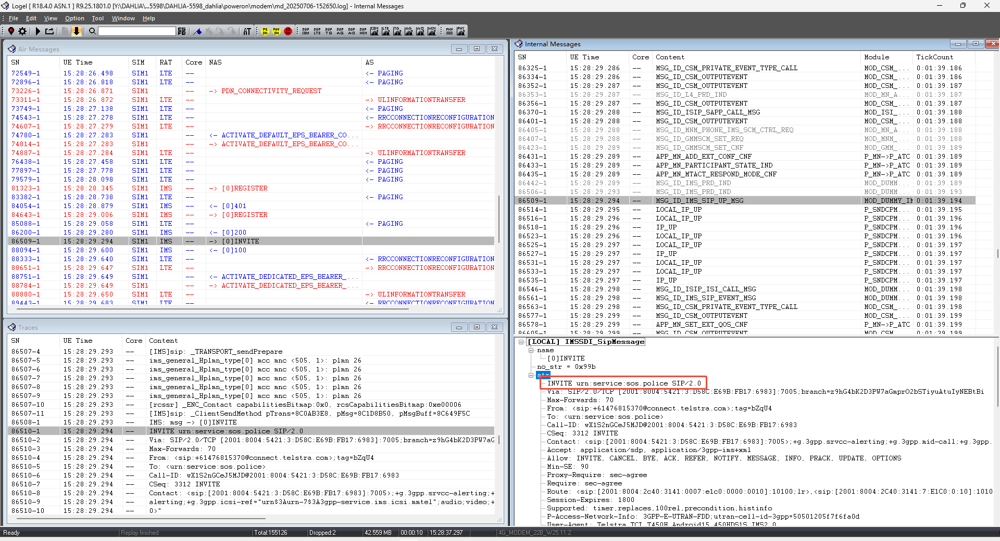
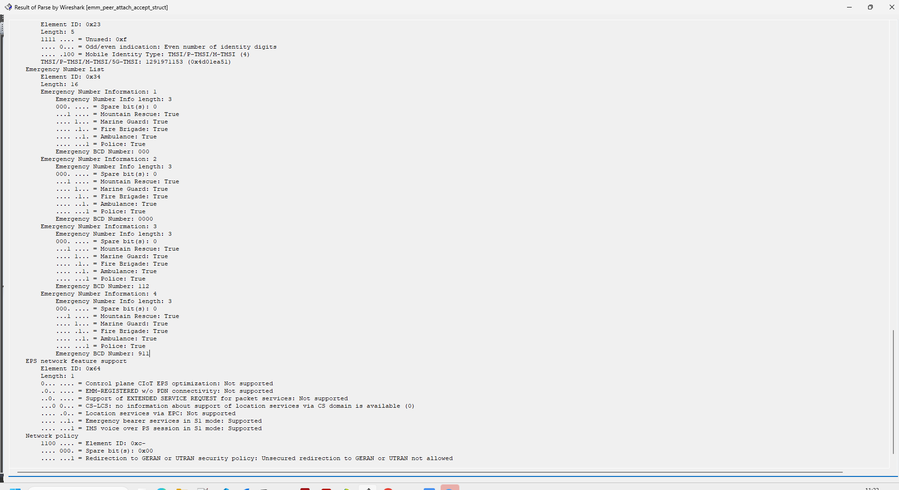
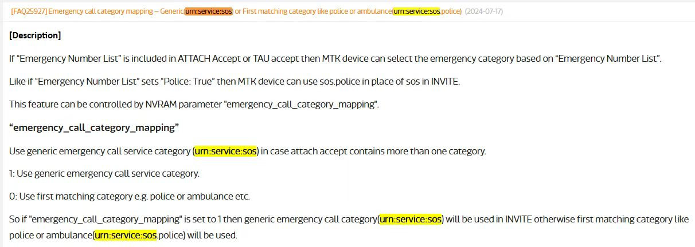

# urn:service:sos.police问题

## 阅读入口

本 case 从旧 Outline 案例集合拆出，已提炼为 ECC category 到 SIP emergency URN 映射问题。原始截图和文字保留在后文，便于追溯。

## 用户现象
urn:service:sos.police问题

## 结论

首坏点在 ECC category 到 SIP emergency URN 的映射。网络下发的紧急号码携带 `category:31`，按 bitmask 表示多个紧急服务类型；终端默认取最低有效 bit 后生成 `urn:service:sos.police`。AU 运营商期望多类型紧急号码统一使用 `urn:service:sos`。

处理方向是打开“多类型紧急 URN 走 generic URN”的配置：UNISOC 侧使用 `sip_emerg_urn_generic[0]=1`，MTK 项目使用 `emergency_call_category_mapping = 1`。

## 关键证据

- 原始分类：一、紧急通话
- 来源：通话问题案例补充.md
- 拆分序号：1
- RIL 上报网络 ECC：`sendUnsolEccList, network: category:31, number:112/911/...`
- `category:31` 是多 bit，有 police / ambulance / fire 等多类型含义。
- 网络下发 ECC 需要解析 Attach Accept / TAU Accept 中的 Emergency Number List 交叉确认。

## 定位口径

| 检查项 | 判断 |
|---|---|
| 号码来源 | 先区分本地 `eccdata`、SIM EF_ECC、网络下发 ECC |
| category | `31` 这类多 bit category 不能简单等同 police 单一类型 |
| SIP INVITE | 看 Request-URI / To / P-Asserted 等紧急 URN 是否为 `urn:service:sos.police` |
| UNISOC 配置 | `OPERATOR_NV_IMS\ims_emg_urn_generic\sip_emerg_urn_generic\sip_emerg_urn_generic[0]=1` |
| MTK 配置 | `emergency_call_category_mapping = 1` |

## 复用边界

- 只适用于“号码已经被识别为 ECC，但 SIP emergency URN 类型不符合运营商要求”的场景。
- 如果拨号失败发生在 IMS 注册、P-CSCF、SIP 403/408 或媒体建立阶段，应转 IMS/ECC 建呼链路，不要只改 URN 映射。

## 原始案例内容

### 案例1：urn:service:sos.police问题

分析：AU运营商期望拨打紧急号码时，SIP INVITE中携带的是urn:service:sos，而不是urn:service:sos.police

 

首先要分析，紧急号码是AP配置的，还是网络下发的。如果是本地配置的，参考FAQ202274709，修改eccdata

```java
	行  80667: R0114D6  07-07 17:23:16.316   696   731 D RIL     : sendUnsolEccList, network: category:31, number:000,
	行  80668: R0114D7  07-07 17:23:16.316   696   731 D RIL     : sendUnsolEccList, network: category:31, number:0000,
	行  80669: R0114D8  07-07 17:23:16.316   696   731 D RIL     : sendUnsolEccList, network: category:31, number:112,
	行  80670: R0114D9  07-07 17:23:16.316   696   731 D RIL     : sendUnsolEccList, network: category:31, number:911,
```

category：31（二进制 11111），IMS默认取最低bit有效位 police（绝大多数网络也都是如此）

是否是网络下发的ECC，可以解析ATTACH_ACCEPT，查看是否有Emergency Mumber List

 

根本原因：当前问题就是网络下发的ECC中有携带category，所以按照最低bit有效位显示了police

方案：when the emergency urn corresponds to multipe types, use the generic type

```java
OPERATOR_NV_IMS\ims_emg_urn_generic\sip_emerg_urn_generic\sip_emerg_urn_generic[0]=1
```


> **信息**
> 此NV随卡配置的，无卡如果也有此需求的话，需要再咨询一下展锐，看看能不能配置成随网的
>


MTK项目修改方案：

 

```java
emergency_call_category_mapping = 1
```

## 原始资料边界

- 本 case 来自旧 Outline 迁入资料，已提炼为 ECC URN 映射案例。
- 复用到新项目时仍需确认运营商是否明确要求 generic `urn:service:sos`。
