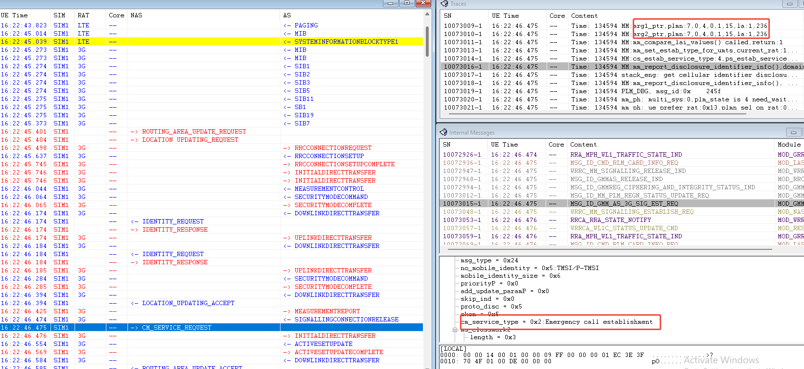
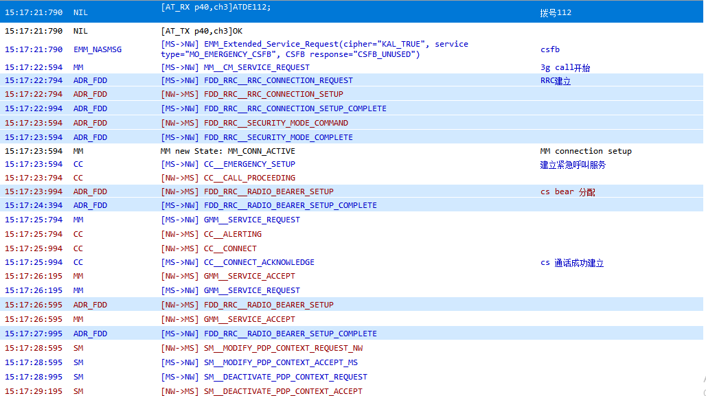
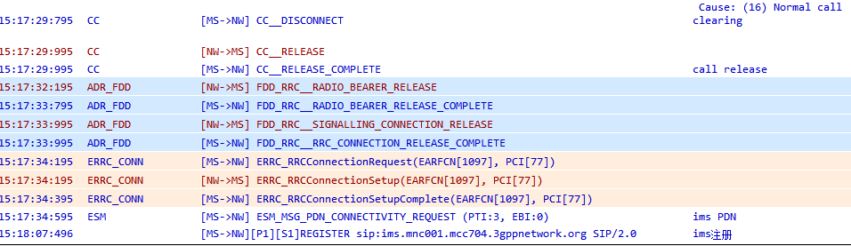

# ECC csfb cs后重回LTE时间过长问题

## 阅读入口

本 case 从旧 Outline 案例集合拆出，已提炼为 ECC 域选配置导致“非 CSFB 入 3G，通话后不快速回 LTE”的问题。原始截图和文字保留在后文，便于追溯。

## 用户现象
ECC csfb cs后重回LTE时间过长问题

## 结论

首坏点在 ECC 域选配置语义。DUT 拨打 `112` 时直接按本地 ECC RAT 策略选择 CS，并把 LTE 放进 `forbidden_rat_list`，随后通过选网流程进入 3G 完成紧急呼叫。因为不是标准 CSFB 进入 3G，通话结束后不会触发 fast return 回 LTE，只能等待网络侧调度或后续重选。

处理方向：还原已废弃的 `ecc_cs_prefer` 修改，若运营商要求 ECC 不走 VoLTE，应使用 `ecc_cs_only=1` 控制域选。

## 关键证据

- 原始分类：一、紧急通话
- 来源：通话问题案例补充.md
- 拆分序号：2
- `MSG_ID_MNM_PHONE_ECC_STATUS_SET` 后 `forbidden_rat_list[0] = GMMREG_RAT_LTE`。
- `MSG_ID_PLM_AS_3G_HANDSHAKE_REQ` 显示 `LTE RAT TO 3G RAT`。
- 3G 上完成 `LOCATION_UPDATING_ACCEPT` 后发起 `CM_SERVICE_REQUEST` / `EMERGENCY_SETUP`。
- 参考机按 CSFB 进入 3G，约 1 秒回 LTE；DUT 约 2 分钟后才回 LTE。

## 定位口径

| 检查项 | 判断 |
|---|---|
| 是否真正 CSFB | 看进入 3G 的原因，不能只看“LTE 到 3G”现象 |
| ECC 域选配置 | `ecc_cs_prefer` 属于废弃/不推荐路径；优先使用 `ecc_cs_only` |
| forbidden RAT | ECC status 设置后若 LTE 被禁用，后续 fast return 逻辑可能不成立 |
| 通话结束回 LTE | 先判断进入 3G 的原因，再看 fast return / 网络重选 |
| 对比机 | 同卡同网同地点 pass 机能帮助区分平台策略和网络调度 |

## 复用边界

- 适用于“ECC 后长时间停留 3G/2G”的场景，尤其是客户描述成 CSFB 但 log 显示不是 CSFB 的情况。
- 如果确实是标准 CSFB 后不能回 LTE，应另查 CSFB return timer、RRC release redirection、LTE 小区重选和网络策略。

## 原始案例内容

### 案例2：ECC csfb cs后重回LTE时间过长问题

分析：GT运营商拨打紧急电话112 掉到3g

**DUT**

 

从log中可以看到，拨打ecc，DUT 掉到到3g，大概两分钟后才回到4g。根据展锐分析，电话在域选阶段直接选择了CS，首先先把VOLTE给disable掉了（MSG_ID_MNM_PHONE_ECC_STATUS_SET）， 后续发起选网到CS，然后才继续电话；  并不会走CSFB流程；3G模式是选网进入，并不是CSFB进入；当在3G上电话完成后判断进入3G模式的是选网搜网进入的，就不会发起fast return 回LTE，会一直呆在3G上，等待网络调度回LTE；

```java
ATC: ATC_RecNewLineSig,link_id:2,sim:0,len:12,line:ATD112@,#i;		lg		16:22:44.979		拨打112
MSG_ID_MN_CALL_VOICE_CALL_SETUP_REQ		lg		16:22:44.979		call_type = MN_CALL_TYPE_EMERGENCY
MSG_ID_MNM_PHONE_FIRST_CALL_START		lg		16:22:44.979
MSG_ID_GMMREG_FIRST_CALL_START		lg		16:22:44.979
MSG_ID_MM_PLM_CALL_START_IND		lg		16:22:44.979
mm_ph: rplmn id is 70401f,rplmn_srch_rat:0x0,rplmn_avai:0x13,rplmn_rat_present:0,rplmn_rat:0x10		16:22:44.979
mnphone_volte: local ecc rat set, ecc state:1		lg		16:22:44.979
MSG_ID_MNM_PHONE_ECC_STATUS_SET		16:22:44.979
    ecc_status = 0x1
    ecc_plmn_preference = GMM_ECC_PLMN_PREFER_NONE
    forbidden_rat_list
        [0] = GMMREG_RAT_LTE
        [1] = GMMREG_RAT_UNKNOWN
        [2] = GMMREG_RAT_UNKNOWN
        [3] = GMMREG_RAT_UNKNOWN
        [4] = GMMREG_RAT_UNKNOWN
MSG_ID_PLM_AS_3G_HANDSHAKE_REQ		16:22:45.046		LTE RAT TO 3G RAT
-> LOCATION UPDATING_REQUEST		16:22:45.404		cs注册请求
<- LOCATION_UPDATING_ACCEPT		16:22:46.394		cs注册成功
MSG_ID_PLM_AS_3G_PLMN_SEL_REQ		lg		16:22:46.396		plmn_sel_mode = MANUAL_MODE
-> CM_SERVICE_REQUEST		lg		16:22:46.475		cm_service_type = 0x2:Emergency call establishment
-> EMERGENCY_SETUP		lg		16:22:46.807
<- MODIFY_PDP_CONTEXT_REQUEST		lg		16:22:47.879
<- MODIFY_PDP_CONTEXT_REQUEST		lg		16:22:47.879
-> MODIFY_PDP_CONTEXT_ACCEPT		lg		16:22:47.879
-> MODIFY_PDP_CONTEXT_ACCEPT		lg		16:22:47.880
-> CM_SERVICE_REQUEST		lg		16:24:40.857		cm_service_type = 0x1:Normal call establishment
-> SETUP		lg		16:24:42.385
<- CALL_PROCEEDING		lg		16:24:44.222
-> DISCONNECT		lg		16:24:51.378
MSG_ID_MM_PLM_CALL_END_IND		lg		16:24:51.585
-> RRCCONNECTIONREQUEST		lg		16:24:56.470		LTE RRC请求
<- RRCCONNECTIONSETUP		lg		16:24:56.494
-> RRCCONNECTIONSETUPCOMPLETE		lg		16:24:56.497
```

查看NV配置，ecc 走cs，该配置已经废弃，如果想在该网络上拨打紧急电话不走VOLTE，去CS拨打，直接配置 ecc_cs_only =1 即可

OPERATOR_NV_MN\\mn_ecc_cs_prefer\\ecc_cs_prefer\\ecc_cs_prefer\[0\]=1

**REF**

从log来看，REF拨打ecc，csfb到3G，并且在1秒左右就回到lte

 

 

方案：还原ecc_cs_prefer修改，使其保持默认；通过ecc_cs_only来控制ecc域选

## 原始资料边界

- 本 case 来自旧 Outline 迁入资料，已提炼为 ECC 域选配置导致非 CSFB 入 3G 的案例。
- 新项目复用时必须重新核对当前分支是否仍支持 `ecc_cs_prefer`，以及运营商真实要求是 CS only 还是 CS preferred。
