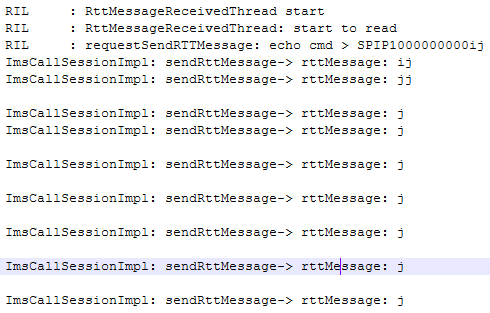
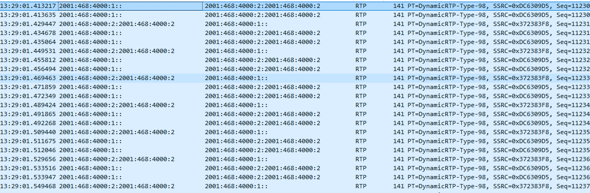

# RTT 通话

## 阅读入口

本 case 从旧 Outline 案例集合拆出，已提炼为 RTT over VoWiFi 的能力边界案例。RTT 属 IMS/VoWiFi 通话能力，不归 LTE 注册。

## 用户现象
RTT 通话

## 结论

展锐 Dialer 侧 RTT 功能入口不完善，不支持直接拨打 RTT 通话；但使用 Google Dialer 时，VoWiFi 注册、SIP 建呼、RTT `INFORMATION` message 和 netlog 收发均正常。因此该资料的首坏点更接近 AP Dialer 能力/入口限制，不是 IWLAN、IMS 注册或 modem 承载失败。

## 关键证据

- 原始分类：二、RTT通话
- 来源：通话问题案例补充.md
- 拆分序号：5
- AP 普通 VoWiFi call：`CALL_VOWIFI`，通话进入 ACTIVE。
- AP RTT call：`prop=[ wifi rtt ]`，`updateHasActiveRttCall false -> true`。
- Modem：IKE / REGISTER / INVITE / 183 / 180 / 200 流程正常。
- RTT message：SIP `INFORMATION` 发出并收到响应，netlog 显示消息收发正常。

## 定位口径

| 判断点 | 结论 |
|---|---|
| Google Dialer RTT 正常 | 底层 IMS/VoWiFi/RTT 承载具备基础能力 |
| 平台 Dialer 无 RTT 入口 | 优先查 Dialer feature、UI、Telecom RTT capability |
| RTT message 无收发 | 再查 SIP `INFORMATION`、网络 RTT 支持和 IMS profile |
| VoWiFi 未注册 | 转 IMS/VoWiFi 注册流程，不在 RTT 层定责 |

## 复用边界

- 本 case 适合作为 RTT 能力边界样例，不适合作为“RTT 网络失败”结论模板。
- 后续若遇到 RTT 业务失败，需要补充 AP Dialer、Telecom、IMS SIP 和 netlog 全链路。

## 原始案例内容

### 案例1：**RTT 通话**

**前言**

分析：目前展锐dialer RTT功能不完善，不支持直接拨打RTT通话。下面google dialer log，
观察log可以发现，vowifi注册成功，整个通话流程都是正常的

**AP LOG,**
**//vowifi call**
01-01 02:28:44.310  1942  2149 D ImsServiceCallTracker: **setCallRatType->ratType: 18**
01-01 02:28:44.312  1942  2149 I ImsServiceImpl: \[1\]  **setCallRatType->okCALL_VOWIFI**
01-01 02:28:44.802   820  2863 I Telecom : CallsManager: setCallState CONNECTING -> DIALING, call: \[Call id=TC@21, state=CONNECTING,
01-01 02:28:45.222   820  5795 I Telecom : CallsManager: setCallState DIALING -> ACTIVE, call: \[Call id=TC@21, state=DIALING,**prop=\[ HD wifi\]\]**, voip=false: [CSW.sA](http://CSW.sA)(cap)@Iac
**//vowifi rtt call**
01-01 02:28:59.648   820  5795 I Telecom : CallsManager: setCallState CONNECTING -> DIALING, call: \[Call id=TC@22, state=CONNECTING,
01-01 02:29:00.088   820  1105 I Telecom : CallsManager: setCallState DIALING -> ACTIVE, call: \[Call id=TC@22, state=DIALING,**prop=\[ wifi rtt\]\]**
01-01 02:29:00.090   820  1105 I Telecom : CallsManager: updateHasActiveRttCall false -> true: [CSW.sA](http://CSW.sA)(cap)@IoM

**MODEM LOG,**
-> \[0\]IKE_SA_INIT		lg		02:28:17.076		vowifi注册
<- \[0\]IKE_SA_INIT		lg		02:28:17.106
-> \[0\]IKE_AUTH		lg		02:28:17.257
<- \[0\]IKE_AUTH		lg		02:28:17.270
<- \[0\]EAP_AKA		lg		02:28:17.270
-> \[0\]EAP_AKA		lg		02:28:17.313
<- \[0\]EAP_SUCCESS		lg		02:28:17.319
-> \[0\]REGISTER		lg		02:28:18.485
<- \[0\]401		lg		02:28:18.509
-> \[0\]REGISTER		lg		02:28:18.565
<- \[0\]200		lg		02:28:18.596
-> \[0\]SUBSCRIBE		lg		02:28:18.601
<- \[0\]200		lg		02:28:18.672
<- \[0\]NOTIFY		lg		02:28:18.682
-> \[0\]200		lg		02:28:18.685
-> \[0\]INVITE		lg		02:28:48.344		vowifi普通电话
<- \[0\]183		lg		02:28:48.420
<- \[0\]180		lg		02:28:48.442
<- \[0\]200		lg		02:28:48.449
-> \[0\]INVITE		lg		02:29:03.274		VOWIFI RTT
<- \[0\]183		lg		02:29:03.320
<- \[0\]180		lg		02:29:03.346
<- \[0\]200		lg		02:29:03.353
-> \[0\]INFORMATION		lg		02:29:17.078		发送message
<- \[0\]INFORMATION		lg		02:29:17.087

发送的信息都可以在ap log看见

 
 

观察netlog，rtt 消息收发正常,
 

综上，目前展锐设备平台方已提供底层支持，因google dialer通过集成apk，无法看到更加详细的流程；将来若出现问题，优先确认运营商网络侧是否支持，并且提供对比机pass log。
