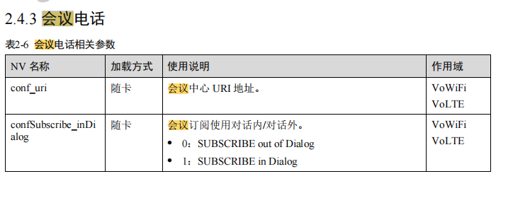
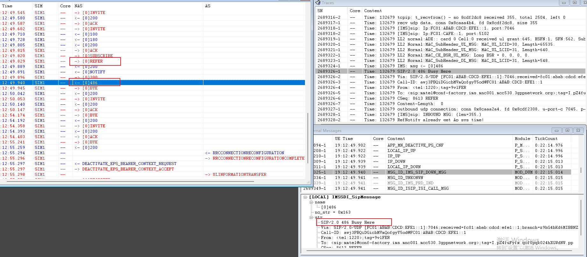
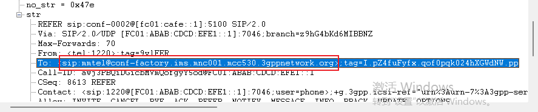
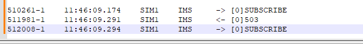
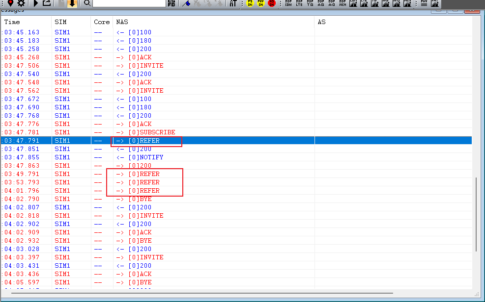

# 会议通话无法合并

<!-- IMPORTED_CASE_BOUNDARY_START -->
> 使用口径：本页已整理出可复用 Case 卡片。排查时优先看“用户现象 / 结论 / 关键证据 / 定位口径”；“原始案例内容”只用于回溯来源，不作为单独结论引用。
<!-- IMPORTED_CASE_BOUNDARY_END -->


## 阅读入口

本 case 从旧 Outline 案例集合拆出，已整理为 IMS 会议通话合并失败的分诊模板。

## 用户现象
会议通话无法合并

## 结论

会议通话无法合并不能只看 UI 上“合并失败”。第一轮先看 SIP `REFER` 之后网络是否返回 `202 Accepted`。若返回 `486 Busy Here`，优先按网络/测试手法/签约确认；若没有 202 或订阅被拒，再查 `conf_uri`、`confRefer_inDialog`、`confSubscribe_inDialog` 等运营商 NV。

## 关键证据

- 原始分类：三、会议通话
- 来源：通话问题案例补充.md
- 拆分序号：6
- 正常流程：发送 `REFER` 后网络返回 `202 Accepted`。
- 网络/测试手法方向：实际收到 `SIP/2.0 486 Busy Here`。
- 配置方向：`conf_uri` 不建议固定写死 mcc/mnc，应按 SIM/运营商加载。
- 订阅方向：`confSubscribe_inDialog` 控制 SUBSCRIBE in-dialog/out-of-dialog。
- REFER 方向：`confRefer_inDialog` 默认通常为 1；配置为 0 可能导致网络不接受。

## 定位口径

| 判断点 | 结论 |
|---|---|
| `REFER` 后收到 `202` | 网络已接受合并请求，后续查媒体/状态同步 |
| `REFER` 后收到 `486 Busy Here` | 优先查网络、签约、测试手法和对比机 |
| `conf_uri` 异常 | 查运营商 NV 是否写死或格式不符合协议 |
| `SUBSCRIBE` 被拒 | 查 `confSubscribe_inDialog` 和运营商能力 |
| 多次 `REFER` 无 202 | 查 `confRefer_inDialog` 和网络兼容性 |

## 复用边界

- 本 case 是会议通话分诊模板，不是单一 root cause case。
- 必须提供同 SIM、同地点、同时间、同步骤的对比机 log，避免把网络/签约问题误写成平台问题。

## 原始资料边界

- 原始内容保留用于回溯旧知识库、日志片段和历史结论。
- 如原始描述与前文 Case 卡片冲突，默认以前文“结论 / 关键证据 / 定位口径”为阅读入口。
- 复用到新问题时必须重新核对平台、版本、运营商、log 和第一坏点。

## 原始案例内容

### 案例1：会议通话无法合并

在分析会议电话类的问题时，最好让测试一并提供对比机的log

目前展锐文档提到的会议电话相应nv：


 补充：confRefer_inDialog，这项参数的含义是ref请求对话外还是对话内，1：对话内，0：对话外


①网络问题或测试手法问题导致无法合并


 


可以从log里看到，正常流程是发送refer消息后，收到网络回复的202消息

但是实际收到的是

```
	SIP/2.0 486 Busy Here
```

**解决方案**：

使用同一张sim卡插入测试机和对比机同时段同地点进行测试，测试相同的步骤，提供测试机和对比机从开机驻网到业务测试的log和视频，以确实是否是网络问题或者测试手法的问题


②conf_uri配置错误

该nv若需求符合协议标准格式，则无需添加额外配置（mnc/mcc值终端加载运营商NV时会适配为对应SIM卡mnc/mcc，不建议在NV中写固定值 sip:mmtel@conf-factory.ims.mnc\*\*\*.mcc###.3gppnetwork.org


 


**解决方案**：

在refer消息里查看conf_uri地址确认是否符合协议规范，确认nv是否有做额外配置，正常情况不配置该nv，修改后复测


③会议电话订阅被拒导致合并失败

终端当前订阅方式与网络不兼容，被网络拒绝。

 


**解决方案**：

提供运营商参数配置文档或者同 SIM 卡在对比机上进行对比测试，对比信令内容进行修改，查看是否修改订阅方式。

nv：confSubscribe_inDialog

会议订阅使用对话内/对话外。

0：SUBSCRIBE out of Dialog

1：SUBSCRIBE in Dialog


④confRefer_inDialog的nv配置错误导致合并失败


 可以看到多次发送refer消息，但是未收到202，不符合正常流程


**解决方案：**

检查对应运营商的nv配置中是否将这一项配置成了0，默认值是1，1：对话内，0：对话外


⑤当前号码不支持会议电话

会议电话需要当前号码开通该服务才能支持，可以使用同一张sim卡插入对比机中查看是否现象一致
