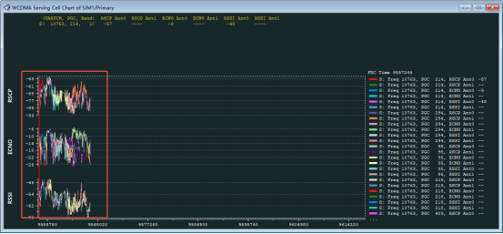

# CS通话杂音

## 阅读入口

本 case 从旧 Outline 案例集合拆出，已提炼为 CSFB 后 3G 弱场导致通话质量差案例。

## 用户现象
CS通话杂音

## 结论

首坏点是 CSFB 后实际承载通话的 3G 小区质量差。log 显示网络不支持 IMS，设备回落 3G 建立 CS 通话；通话时 serving cell `ECNO=-21`、`RSCP=-63`，这类 3G 质量容易导致杂音、断续和掉话。

该问题优先归覆盖 / RF / 天线 / 运营商 3G 网络质量，不应只从 AP 通话流程或 IMS 开关分析。

## 关键证据

- 原始分类：四、语音通话
- 来源：通话问题案例补充.md
- 拆分序号：9
- 拨号后触发 `EXTENDED_SERVICE_REQUEST`，按 CSFB 进入 3G。
- 3G serving cell：`UARFCN 10763`、`PGC 214`。
- 质量指标：`ECNO = -21`、`RSCP = -63`。
- CS call setup / alerting / connect 流程存在，问题点在通话质量而不是建呼失败。

## 定位口径

| 判断点 | 结论 |
|---|---|
| CSFB 后通话能接通 | 不按建呼失败处理 |
| 3G ECNO 很差 | 优先查覆盖、干扰、天线/RF |
| 仅某运营商复现 | 查该运营商是否保留 3G、目标频点覆盖和网络质量 |
| 优化 RF 参数 | 需要评估功耗、SAR 和其它频段影响 |

## 复用边界

- 适用于“CS 通话接通但杂音/断续”的弱场分析。
- 如果通话未建立，需要另查 CSFB、3G RRC、CM Service 和 Q.850 release cause。

## 原始案例内容

### 案例3：CS通话杂音

**分析**：确认sim注册的网络，以及信号强度和质量

从log来看，拨打电话时，因网络侧不支持ims，设备发生csfb，回落到3G，且通话过程中的3G信号质量较差，会影响通话质量，可能会出现断断续续、掉话等现象。

MSG_ID_MM_PLMN_INFO_IND 11:35:38.170 sim 60303

ATC: ATC_RecNewLineSig,link_id:2,sim:0,len:15,line:ATD0674296569; 11:35:38.349

\-> EXTENDED_SERVICE_REQUEST lg 11:35:38.349 csfb

WL1C_WRCC_INIT_MEAS_REQ lg 11:35:38.514

WL1C_WRCC_INIT_MEAS_IND lg 11:35:38.716

<- SIB18 lg 11:35:39.207 60302

\[IMS\]:ims_general_Hplmn_type\[1\] mcc mnc <603, 3>: plmn 130 lg 11:35:39.308

WRCC:CR Calc Serv_Cell UARFCN is 10763,PGC is 214,Meas ECNO Value is -21, Meas RSCP Value is -63 lg 11:35:39.596

WRCC:ServingCell meas result **ECNO = -21, RSCP = -63** lg 11:35:39.596

\-> SETUP lg 11:35:40.004 3g call

<- CALL_PROCEEDING lg 11:35:40.275

<- ALERTING lg 11:35:46.068

<- CONNECT lg 11:35:51.547

\-> CONNECT_ACKNOWLEDGE lg 11:35:51.547

<- DISCONNECT lg 11:36:20.025 end call

\-> RELEASE lg 11:36:20.025

<- RELEASE_COMPLETE lg 11:36:20.505

 

**优化方案:**

网络问题一般和网络环境以及设备本身硬件能力强相关

1. 网络环境所限，需联系运营商。在相同地点，运营商A的3g信号不好(基站覆盖范围有限)，运营商B可以，例如中国现在只有联通保留3G，其他两家已经退网。

2. 调整射频参数，但会提高功耗且会影响SAR。

3. 更换更好的天线，但成本更高。
