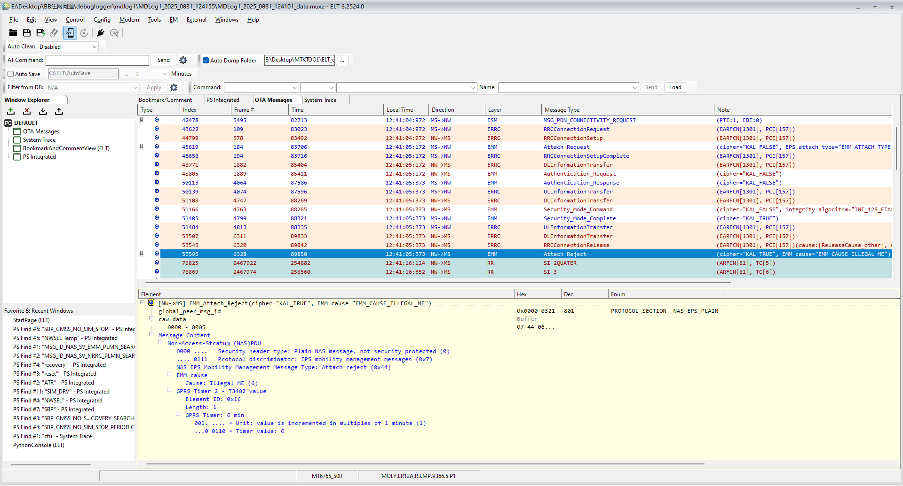

# BB印度实网反馈，无法注册网络

## 阅读入口

本 case 从旧 Outline 案例集合拆出，当前保留原始内容和初步 frontmatter。复用前需要核对平台、版本、运营商和完整 log。

## 用户现象
BB印度实网反馈，无法注册网络

## 结论

首坏点在网络侧 NAS 拒绝：Attach Reject 指向 ME/IMEI 非法或未授权。此类问题优先让前方确认 IMEI 是否完成运营商备案，终端侧不应先改 PLMN / RF / APN 策略。

## 关键证据

- 原始分类：二、网络Reject
- 来源：注网问题案例补充.md
- 拆分序号：2
- 原始分析记录：`NAS EPS Mobility Management Message Type: Attach reject (0x44)`。
- 原始结论：网络认为 ME 标识非法或未授权。

## 定位口径

| 检查项 | 判断 |
|---|---|
| NAS 消息 | 先确认是否为 `Attach reject`，再看 EMM cause |
| IMEI / ME | `Illegal ME`、ME not authorized 一类 cause 优先查 IMEI 白名单 / 备案 |
| 对比验证 | 同卡插入已备案设备，或同设备写入可注册 IMEI 进行对照 |
| 处理动作 | 由前方与运营商确认 IMEI 备案，不作为终端注册策略问题处理 |

## 原始案例内容

### 案例：BB印度实网反馈，无法注册网络

分析：Attach被网络拒绝

```java
NAS EPS Mobility Management Message Type: Attach reject (0x44)
```

根本原因：这表示网络认为移动设备（ME）的标识（如IMEI）非法或未授权

解决方案：还请前方与运营商网络沟通确认IMEI备案事宜，谢谢！

 

## 复用边界

- 本 case 来自旧 Outline 迁入资料，状态为 partial。
- 复用时需要重新核对平台、项目、运营商、版本、log 时间窗和第一坏点。
- 如果后续补齐完整证据链，再把 status 改为 summarized 或 closed。
