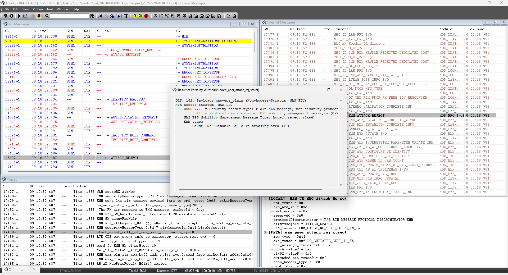
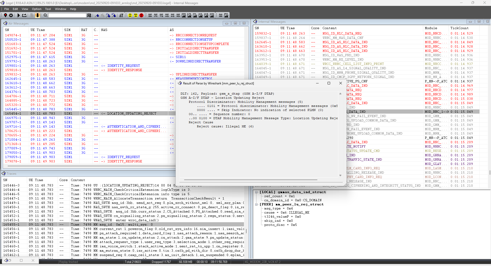
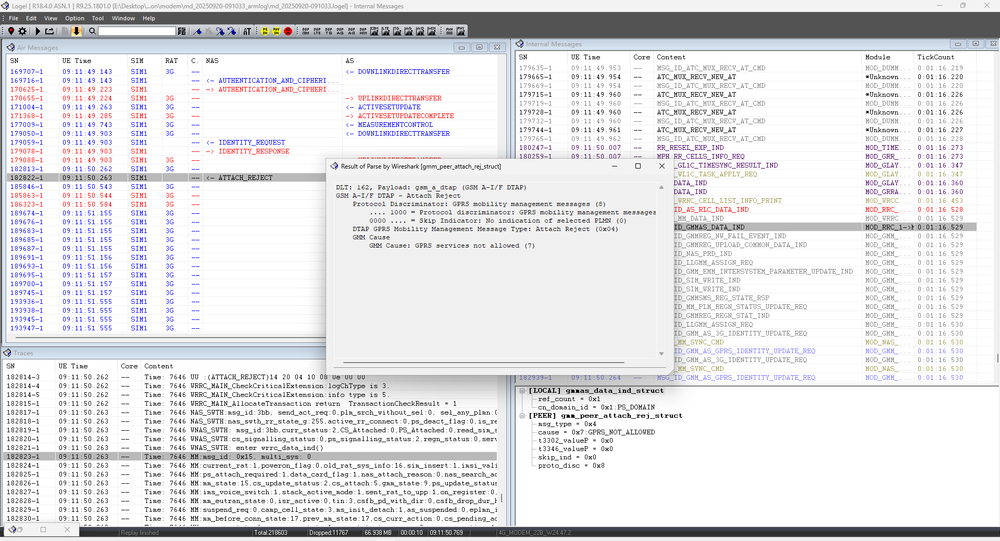

# MTN Uganda售后反馈，无法注册网络

<!-- IMPORTED_CASE_BOUNDARY_START -->
> 使用口径：本页已整理出可复用 Case 卡片。排查时优先看“用户现象 / 结论 / 关键证据 / 定位口径”；“原始案例内容”只用于回溯来源，不作为单独结论引用。
<!-- IMPORTED_CASE_BOUNDARY_END -->

## 阅读入口

本 case 从旧 Outline 案例集合拆出，当前保留原始内容和初步 frontmatter。复用前需要核对平台、版本、运营商和完整 log。

## 用户现象
MTN Uganda售后反馈，无法注册网络

## 结论

首坏点是网络返回 `Illegal ME`。原始复测记录显示，客户重新写入一个可正常注网的 IMEI 后可以正常驻网，因此该问题优先归因到 IMEI 非法/未授权/未备案。

## 关键证据

- 原始分类：二、网络Reject
- 来源：注网问题案例补充.md
- 拆分序号：3
- 注册失败原因值：`0x6: ILLEGAL_ME`。
- 处理验证：重新写入一个可正常注网的 IMEI 后，测试结果能正常驻网。

## 定位口径

| 检查项 | 判断 |
|---|---|
| NAS reject | 看到 `Illegal ME` 时先停止 RF / PLMN 方向发散 |
| IMEI 对照 | 可用 IMEI 能驻网、原 IMEI 不能驻网，基本锁定网络侧授权 |
| 运营商动作 | 需要前方确认 IMEI 备案 / 白名单，不应在 APN 或 modem 选网策略上绕 |
| 文档回填 | 可和 Attach Reject / TAU Reject cause 速查中的 `Illegal ME` 互链 |

## 原始资料边界

- 原始内容保留用于回溯旧知识库、日志片段和历史结论。
- 如原始描述与前文 Case 卡片冲突，默认以前文“结论 / 关键证据 / 定位口径”为阅读入口。
- 复用到新问题时必须重新核对平台、版本、运营商、log 和第一坏点。

## 原始案例内容

### 案例：MTN Uganda售后反馈，无法注册网络

分析：432g上注册网络都回复注册失败。从其中一个明显的原因值：0x6:ILLEGAL_ME看，imei不合法

 

 

 

让客户重新写一个可以正常注网的IMEI，测试结果：能正常驻网

根本原因：这表示网络认为移动设备（ME）的标识（如IMEI）非法或未授权

解决方案：还请前方与运营商网络沟通确认IMEI备案事宜，谢谢！

## 复用边界

- 本 case 来自旧 Outline 迁入资料，状态为 partial。
- 复用时需要重新核对平台、项目、运营商、版本、log 时间窗和第一坏点。
- 如果后续补齐完整证据链，再把 status 改为 summarized 或 closed。
