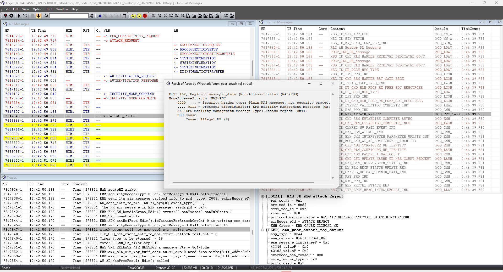
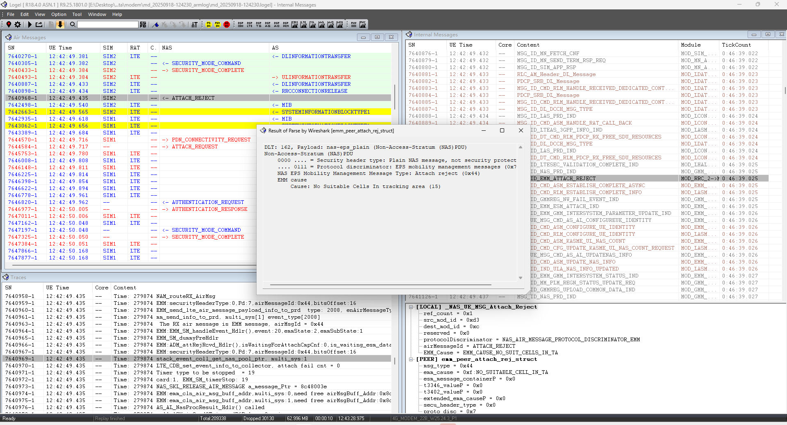
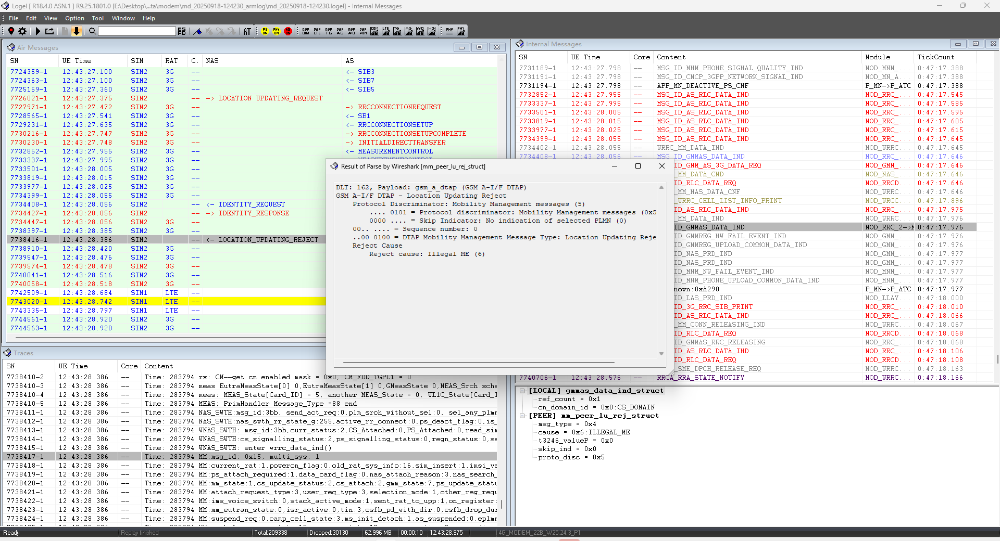

# GH67M1_OMEGA无法注册网络

<!-- IMPORTED_CASE_BOUNDARY_START -->
> 使用口径：本页已整理出可复用 Case 卡片。排查时优先看“用户现象 / 结论 / 关键证据 / 定位口径”；“原始案例内容”只用于回溯来源，不作为单独结论引用。
<!-- IMPORTED_CASE_BOUNDARY_END -->

## 阅读入口

本 case 从旧 Outline 案例集合拆出，当前保留原始内容和初步 frontmatter。复用前需要核对平台、版本、运营商和完整 log。

## 用户现象
GH67M1_OMEGA无法注册网络

## 结论

首坏点为网络侧注册拒绝，卡1 LTE 和卡2 LTE/3G 均出现 `Illegal ME (6)`。多卡、多 RAT 都被同类 cause 拒绝时，优先判断设备标识未授权，而不是单卡、单频段或单 RAT 问题。

## 关键证据

- 原始分类：二、网络Reject
- 来源：注网问题案例补充.md
- 拆分序号：4
- 卡1 LTE 直接被网络拒绝：`Cause: Illegal ME (6)`。
- 卡2 LTE 直接被网络拒绝，3G 也返回 `Cause: Illegal ME (6)`。

## 定位口径

| 检查项 | 判断 |
|---|---|
| 多卡一致性 | 多卡同 cause 拒绝，优先查设备标识 / 网络授权 |
| 多 RAT 一致性 | LTE 和 3G 都是 `Illegal ME`，不优先怀疑 LTE 单栈 |
| 处理动作 | 前方确认 IMEI 备案或换可授权 IMEI 对照 |
| 边界 | 只有在 reject cause 不一致时才继续分 RF / SIM / PLMN 方向 |

## 原始资料边界

- 原始内容保留用于回溯旧知识库、日志片段和历史结论。
- 如原始描述与前文 Case 卡片冲突，默认以前文“结论 / 关键证据 / 定位口径”为阅读入口。
- 复用到新问题时必须重新核对平台、版本、运营商、log 和第一坏点。

## 原始案例内容

### 案例：GH67M1_OMEGA无法注册网络

分析：卡1 LTE直接被网络拒绝，Cause: Illegal ME (6) 设备非法

 

卡2 LTE直接被网络拒绝，3G被拒理由Cause: Illegal ME (6) 设备非法

 

 

根本原因：这表示网络认为移动设备（ME）的标识（如IMEI）非法或未授权

解决方案：还请前方与运营商网络沟通确认IMEI备案事宜，谢谢！

## 复用边界

- 本 case 来自旧 Outline 迁入资料，状态为 partial。
- 复用时需要重新核对平台、项目、运营商、版本、log 时间窗和第一坏点。
- 如果后续补齐完整证据链，再把 status 改为 summarized 或 closed。
