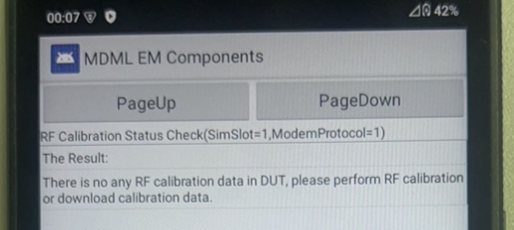
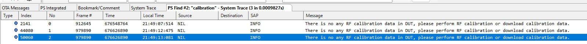

# WM58 使用物联网卡，无法注册上网络

<!-- IMPORTED_CASE_BOUNDARY_START -->
> 使用口径：本页已整理出可复用 Case 卡片。排查时优先看“用户现象 / 结论 / 关键证据 / 定位口径”；“原始案例内容”只用于回溯来源，不作为单独结论引用。
<!-- IMPORTED_CASE_BOUNDARY_END -->

## 阅读入口

本 case 从旧 Outline 案例集合拆出，当前保留原始内容和初步 frontmatter。复用前需要核对平台、版本、运营商和完整 log。

## 用户现象
WM58 使用物联网卡，无法注册上网络

## 结论

首坏点在 RF 校准参数。物联网卡只能注册 3G，同卡插其他手机可注册；换联通卡并锁 3G 也无法注册，排除单卡/单运营商后，检查校准参数发现未校准。

## 关键证据

- 原始分类：三、RF参数未校准
- 来源：注网问题案例补充.md
- 拆分序号：6
- 同张物联网卡插其他手机可以注册网络。
- 换联通卡并锁 3G 仍无法注册，说明不是单运营商策略。
- 校准方法文档检查显示 RF 校准参数未校准。

## 定位口径

| 检查项 | 判断 |
|---|---|
| 卡对比 | 同卡在对比机可注册，DUT 不可注册时优先查 DUT 侧 |
| RAT 锁定 | 换卡锁 3G 仍失败，可排除单运营商策略 |
| RF 校准 | RF 参数未校准时，先补校准再讨论 NAS/RRC |
| 边界 | “多等一会能注册”不能证明网络正常，应结合 RF 校准状态判断 |

## 原始资料边界

- 原始内容保留用于回溯旧知识库、日志片段和历史结论。
- 如原始描述与前文 Case 卡片冲突，默认以前文“结论 / 关键证据 / 定位口径”为阅读入口。
- 复用到新问题时必须重新核对平台、版本、运营商、log 和第一坏点。

## 原始案例内容

### 案例：WM58 使用物联网卡，无法注册上网络

分析：物联网卡只能注册上3G，使用Cellular查看，搜不到小区

同张卡，插到其他手机上可以注册网络。换了联通卡，锁到3G，也无法注册上网络

根据查看校准方法文档，排查射频校准参数，均显示未校准

 

 根本原因：射频参数未校准导致无法注册上网络(多等一会似乎也能注册上)

解决方案：找射频帮忙校准射频参数
