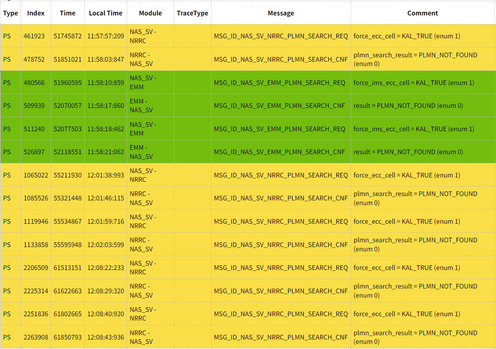

# CM52在宁波实验室测试，待机功耗高

<!-- IMPORTED_CASE_BOUNDARY_START -->
> 使用口径：本页已整理出可复用 Case 卡片。排查时优先看“用户现象 / 结论 / 关键证据 / 定位口径”；“原始案例内容”只用于回溯来源，不作为单独结论引用。
<!-- IMPORTED_CASE_BOUNDARY_END -->

## 阅读入口

本 case 从旧 Outline 案例集合拆出，当前保留原始内容和初步 frontmatter。复用前需要核对平台、版本、运营商和完整 log。

## 用户现象
CM52在宁波实验室测试，待机功耗高

## 结论

首坏点是紧急搜网策略导致的待机功耗升高。宁波测试环境没有支持 ECC 的小区，modem 持续执行搜网动作；MTK 提供降低紧急搜网频率的 modem patch 后，功耗下降到 13.4 mA。

## 关键证据

- 原始分类：五、搜网功耗高
- 来源：注网问题案例补充.md
- 拆分序号：9
- 问题只在宁波环境复现，奉化功耗测试没有同样问题。
- 原始分析：当前测试环境没有支持 ECC 的小区，导致 modem 一直执行搜网动作。
- 临时 patch 验证后功耗下降到 `13.4 mA`。

## 定位口径

| 检查项 | 判断 |
|---|---|
| 测试环境 | 先确认当地小区是否支持 ECC / emergency service |
| 搜网行为 | 待机功耗高时看 modem 是否持续 emergency search / PLMN search |
| patch 方向 | 不能直接关闭搜网，只能客制化搜网间隔或降低紧急搜网频率 |
| 对比环境 | 同版本不同地点功耗差异明显时，要优先排查网络环境差异 |

## 原始资料边界

- 原始内容保留用于回溯旧知识库、日志片段和历史结论。
- 如原始描述与前文 Case 卡片冲突，默认以前文“结论 / 关键证据 / 定位口径”为阅读入口。
- 复用到新问题时必须重新核对平台、版本、运营商、log 和第一坏点。

## 原始案例内容

### 案例：CM52在宁波实验室测试，待机功耗高

**问题分析：**

奉化功耗测试没有这个问题，只有宁波那边有。后续宁波也有其他项目反馈了此问题。

提CR:ALPS10257944咨询

开始怀疑是校准导致的问题，后面对log分析得到以下结论：当前测试环境没有支持ECC的小区，这导致modem一直在执行搜网动作，造成功耗升高

合入临时patch验证：功耗下降到13.4mA

 

根本原因：测试环境没有支持ECC的小区，这导致modem一直在执行搜网动作，造成功耗升高

解决方案：不能直接关闭搜网功能，但是可以客制化搜网间隔，如果设置的比较大应该就可以降低功耗

MTK 提供modem patch，降低紧急搜网频率

<http://192.168.3.81:8085/c/S0_MP1/alps-release-s0.mp1.rc-tb-8791_modem/+/110271>
