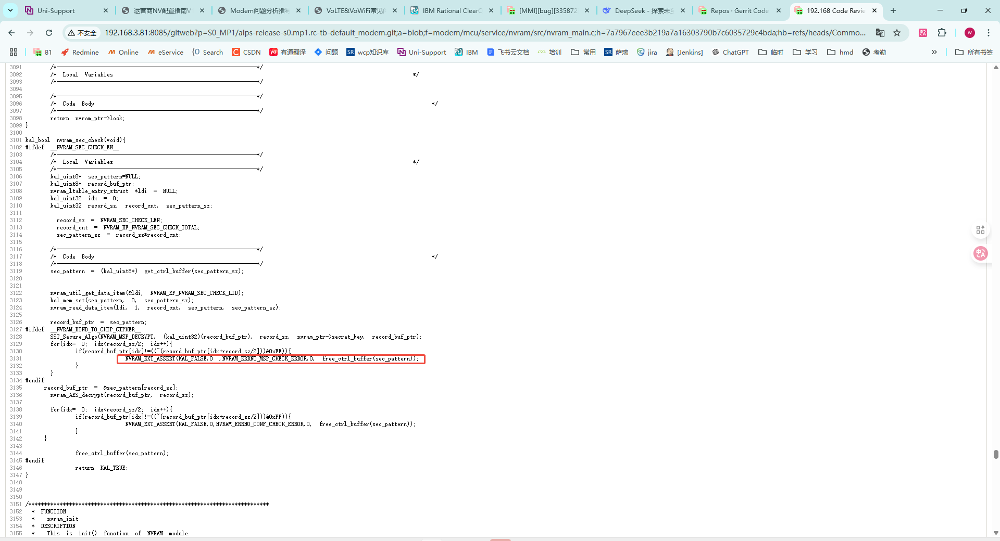
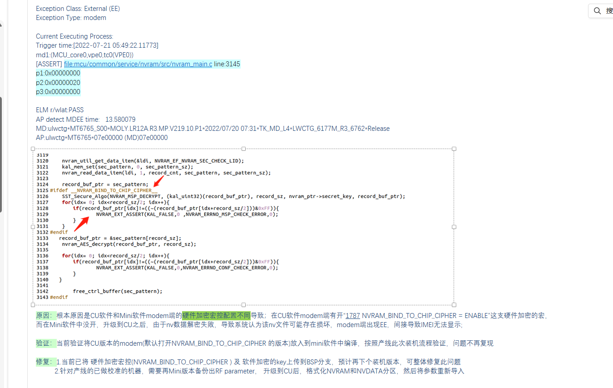

# WM58使用工厂工具刷机后，不识卡

## 阅读入口

本 case 从旧 Outline 案例集合拆出，当前保留原始内容和初步 frontmatter。复用前需要核对平台、版本、运营商和完整 log。

## 用户现象
WM58使用工厂工具刷机后，不识卡

## 结论

当前只能定位到工厂工具刷机后 modem 在 `nvram_main.c` assert，导致不识卡；原始资料没有保留最终根因和修复动作，不能直接写成 SIM 卡问题。

后续复现应按 NVRAM / 产物 / 分区一致性补证：刷机工具、download 选项、modem image、NVRAM/fixnv/custnv、校准写码流程必须一起核对。

## 关键证据

- 原始分类：一、Modem 崩溃
- 来源：SIM问题案例补充.md
- 拆分序号：4
- assert 文件：`mcu/service/nvram/src/nvram_main.c`。
- assert 参数：`para1 = 0x00000020`。
- 证据缺口：原始“根本原因 / 解决方案”未保留文本。

## 下次复现补证清单

| 必抓证据 | 具体内容 | 能证明什么 |
|---|---|
| 工厂工具信息 | 工具版本、download 选项、是否 format、是否保留校准/NVRAM | 判断是否擦写或覆盖关键分区 |
| 产物清单 | AP image、modem image、MDDB/DB、NVRAM template、custnv/fixnv 版本 | 判断 AP/modem/NV 是否跨版本错配 |
| 完整 modem dump | assert 文件、行号、para0/1/2、call stack、current LID | 定位 `nvram_main.c` 对应的 NV item 或错误码 |
| 刷机前后 NV 回读 | IMEI、SML、RF 校准、SIM/NV 相关 LID | 判断是否缺项、损坏或格式不兼容 |
| SIM 基础链路 | 插卡中断、VSIM、ATR、UICC app state | 区分 modem assert 后果和真实 SIM 硬件问题 |
| 可复现步骤 | 原版本、刷入版本、首次开机、插卡时机、是否写码 | 判断是否由升级/降级/写码顺序触发 |

判定口径：

- 看到 `nvram_main.c` assert 时，不要直接写“不识卡根因在 SIM”。
- 如果 modem boot 前就 assert，SIM 不识别多半是结果，要先闭合 NV/产物链路。
- 没有刷机选项和 NV 回读时，只能保留为产物/NVRAM 证据缺口。

## 原始案例内容

### 案例：WM58使用工厂工具刷机后，不识卡

分析：

```javascript
<5>[   11.015998][T600449] [ccci1/fsm]filename = mcu/service/nvram/src/nvram_main.c
<5>[   11.016003][T600449] [ccci1/fsm]line = 3131
<5>[   11.016006][T600449] [ccci1/fsm]assert para0 = 0x00000000, para1 = 0x00000020, para2 = 0x00000000
```

 根本原因：

 

## 复用边界

- 本 case 来自旧 Outline 迁入资料，当前状态为 `summarized_with_log_gap`。
- 复用时需要重新核对平台、项目、刷机工具、产物版本、NV 回读和 modem dump。
- 如果后续补齐完整证据链，再把 status 改为 `summarized` 或 `closed`。
