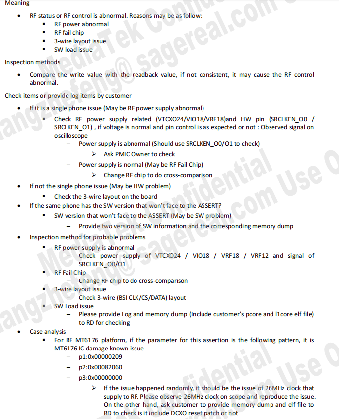

# GH66B2Astech售后反馈不识卡

<!-- IMPORTED_CASE_BOUNDARY_START -->
> 使用口径：本页已整理出可复用 Case 卡片。排查时优先看“用户现象 / 结论 / 关键证据 / 定位口径”；“原始案例内容”只用于回溯来源，不作为单独结论引用。
<!-- IMPORTED_CASE_BOUNDARY_END -->


## 阅读入口

本 case 从旧 Outline 案例集合拆出，当前保留原始内容和初步 frontmatter。复用前需要核对平台、版本、运营商和完整 log。

## 用户现象
GH66B2Astech售后反馈不识卡

## 结论

首坏点是 RF 芯片版本检查失败触发 modem assert，不识卡是 modem 异常后的表现。遇到售后不识卡但 log 中已有 modem assert，应先处理 modem / RFIC 启动链路，而不是只查 SIM ATR。

## 关键证据

- 原始分类：一、Modem 崩溃
- 来源：SIM问题案例补充.md
- 拆分序号：5
- `ccci1/fsm` 上报 modem assert。
- 原始根因：射频芯片版本检查失败。

## 定位口径

| 检查项 | 判断 |
|---|---|
| 不识卡现象 | 先看 radio / modem 是否存活 |
| RFIC 检查 | RFIC version check fail 时优先查 RFIC 型号、焊接、BOM、驱动配置 |
| SIM 方向边界 | modem assert 未解决前，SIM READY / ATR 结果不可靠 |
| 复测动作 | 处理 RFIC 后确认 modem 不 assert，再验证 SIM 识别 |

## 原始资料边界

- 原始内容保留用于回溯旧知识库、日志片段和历史结论。
- 如原始描述与前文 Case 卡片冲突，默认以前文“结论 / 关键证据 / 定位口径”为阅读入口。
- 复用到新问题时必须重新核对平台、版本、运营商、log 和第一坏点。

## 原始案例内容

### 案例：GH66B2Astech售后反馈不识卡

分析：

```java
<5>[    9.443147][T100492] [ccci1/fsm]filename = mcu/l1/mml1/mml1_rf/src/mmrf/gen95/mml1_rf_error_check.c
<5>[    9.443157][T100492] [ccci1/fsm]line = 156
<5>[    9.443165][T100492] [ccci1/fsm]assert para0 = 0x00000002, para1 = 0x00000000, para2 = 0x00000000
```

根本原因：射频芯片版本检查失败

方案：做交叉验证，查看是哪个硬件有问题

 

## 复用边界

- 本 case 来自旧 Outline 迁入资料，状态为 partial。
- 复用时需要重新核对平台、项目、运营商、版本、log 时间窗和第一坏点。
- 如果后续补齐完整证据链，再把 status 改为 summarized 或 closed。
