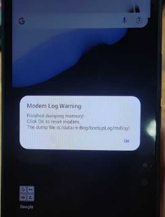
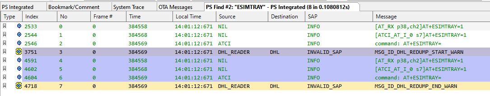
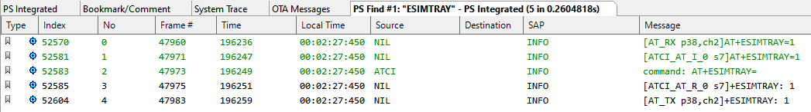

# WM58卡托检查代码修改问题，导致Modem Assert

<!-- IMPORTED_CASE_BOUNDARY_START -->
> 使用口径：本页已整理出可复用 Case 卡片。排查时优先看“用户现象 / 结论 / 关键证据 / 定位口径”；“原始案例内容”只用于回溯来源，不作为单独结论引用。
<!-- IMPORTED_CASE_BOUNDARY_END -->


## 阅读入口

本 case 从旧 Outline 案例集合拆出，当前保留原始内容和初步 frontmatter。复用前需要核对平台、版本、运营商和完整 log。

## 用户现象
WM58卡托检查代码修改问题，导致Modem Assert

## 结论

这是 AP 与 modem 能力不匹配导致的 SIM tray detect assert。SystemUI 增加 `AT+ESIMTRAY` 卡托检查命令，但 modem 端卡托检查代码/宏未合入，命令无法正常响应，触发 modem 保护机制。

## 关键证据

- 原始分类：一、Modem 崩溃
- 来源：SIM问题案例补充.md
- 拆分序号：12
- assert 文件：`mcu/protocol/layer4/sim/src/sim_handler.c`。
- 触发动作：SystemUI 下发 `AT+ESIMTRAY`。
- 解决方案：modem 端合入 `CUSTOM_OPTION += __SIM_GET_CARD_DETECT_STATUS_SUPPORT__`。

## 定位口径

| 检查项 | 判断 |
|---|---|
| 新增 AT 命令 | AP 新增命令前必须确认 modem 支持宏和处理分支 |
| 只开 modem log 才复现 | 仍应按真实 assert 处理，不能归因日志工具 |
| 修复动作 | 合入 modem 卡托检查支持宏后复测 AT 命令响应 |
| 复用边界 | 这类问题属于 AP/Modem feature 对齐，不是 SIM 卡质量问题 |

## 原始资料边界

- 原始内容保留用于回溯旧知识库、日志片段和历史结论。
- 如原始描述与前文 Case 卡片冲突，默认以前文“结论 / 关键证据 / 定位口径”为阅读入口。
- 复用到新问题时必须重新核对平台、版本、运营商、log 和第一坏点。

## 原始案例内容

### 案例：WM58卡托检查代码修改问题，导致Modem Assert

分析：开机阶段Modem assert，需要reset modem。只有开启modem log，才会复现

报错路径是闭源的，找不到具体逻辑。之前版本没有问题，使用二分法定位修改点

```java
<5>[   70.084418][T700620] [ccci1/fsm]filename = mcu/protocol/layer4/sim/src/sim_handler.c
<5>[   70.084422][T700620] [ccci1/fsm]line = 29346
<5>[   70.084426][T700620] [ccci1/fsm]assert para0 = 0x00000000, para1 = 0x00000000, para2 = 0x00000000
```

 定位到是以下修改点造成的：在systemui下添加AT+ESIMTRAY指令发送，用于卡托检查代码

<http://192.168.3.81:8085/c/V0_MP1/alps-release-v0.mp1.rc-tb/+/96769>

根本原因：AT+ESIMTRAY发到modem后，Modem端没正常相应，触发modem保护机制

无法处理原因是Modem端卡托检查代码没合入

<https://online.mediatek.com/apps/faq/detail?faqid=FAQ29019&list=Modem>

 方案：Modem端合入卡托检查代码的宏

```java
CUSTOM_OPTION += __SIM_GET_CARD_DETECT_STATUS_SUPPORT__
```

<http://192.168.3.81:8085/c/S0_MP1/alps-release-s0.mp1.rc-tb-default_modem/+/97672>

 

## 复用边界

- 本 case 来自旧 Outline 迁入资料，状态为 partial。
- 复用时需要重新核对平台、项目、运营商、版本、log 时间窗和第一坏点。
- 如果后续补齐完整证据链，再把 status 改为 summarized 或 closed。
