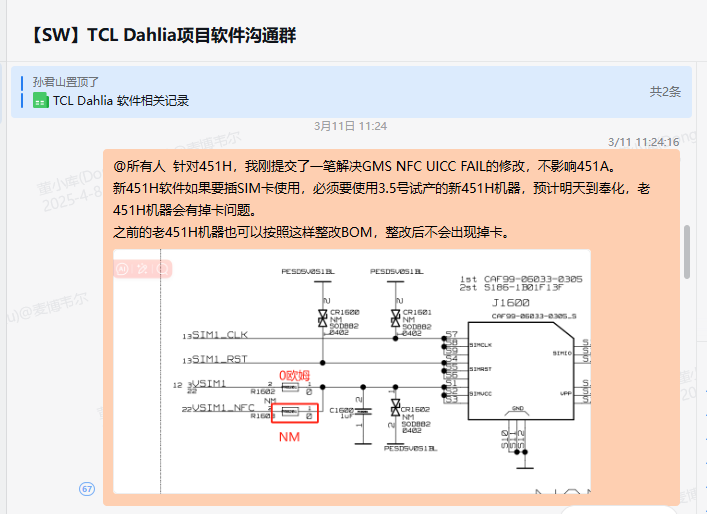

# Dahlia 451H，卡二识卡后，会自动掉卡

<!-- IMPORTED_CASE_BOUNDARY_START -->
> 使用口径：本页已整理出可复用 Case 卡片。排查时优先看“用户现象 / 结论 / 关键证据 / 定位口径”；“原始案例内容”只用于回溯来源，不作为单独结论引用。
<!-- IMPORTED_CASE_BOUNDARY_END -->

## 阅读入口

本 case 从旧 Outline 案例集合拆出，当前保留原始内容和初步 frontmatter。复用前需要核对平台、版本、运营商和完整 log。

## 用户现象
Dahlia 451H，卡二识卡后，会自动掉卡

## 结论

这是 SIM2 供电/硬件适配问题。log 和示波器都显示卡二识卡后会掉卡，原始根因指向 NFC UICC 导致 SIM 卡供电异常，处理动作是 NFC 固件适配和 BOM 整改。

## 关键证据

- 原始分类：二、硬件配置问题
- 来源：SIM问题案例补充.md
- 拆分序号：16
- 示波器确认 SIM 电源 / IO / RST / CLK 四路波形存在掉卡。
- 原始根因：NFC UICC 导致 SIM 卡供电问题，属于 NFC 固件适配和硬件 BOM 共同问题。
- 解决方案：NFC 厂适配固件；SIM2 添加 0 欧姆电阻。

## 定位口径

| 检查项 | 判断 |
|---|---|
| 掉卡时间点 | 对齐 AP SIM state、modem SIM event 和示波器波形 |
| SIM2 特异性 | 只卡二异常时优先查 SIM2 供电、卡座、NFC/UICC 共用链路 |
| 硬件证据 | 电源/IO/RST/CLK 波形异常比 AP 状态更接近首坏点 |
| 修复验证 | 固件适配 + BOM 整改后复测热插拔、PIN 解锁和长时间待机 |

## 原始资料边界

- 原始内容保留用于回溯旧知识库、日志片段和历史结论。
- 如原始描述与前文 Case 卡片冲突，默认以前文“结论 / 关键证据 / 定位口径”为阅读入口。
- 复用到新问题时必须重新核对平台、版本、运营商、log 和第一坏点。

## 原始案例内容

### 案例：Dahlia 451H，卡二识卡后，会自动掉卡

分析：log分析有掉卡、用示波器测试下sim 电源/IO/RST/CLK  4个信号波形也存在掉卡

软件排查，是NFC修改导致的。

根本原因：NFC UICC导致SIM卡供电有问题，NFC固件适配问题

方案：NFC厂适配，提供固件。BOM整改，SIM2上添加0欧姆电阻

 

## 复用边界

- 本 case 来自旧 Outline 迁入资料，状态为 partial。
- 复用时需要重新核对平台、项目、运营商、版本、log 时间窗和第一坏点。
- 如果后续补齐完整证据链，再把 status 改为 summarized 或 closed。
