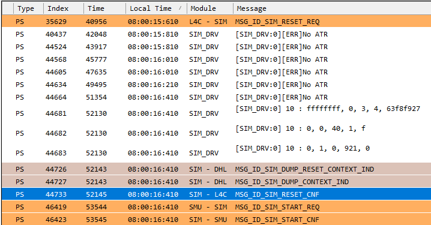
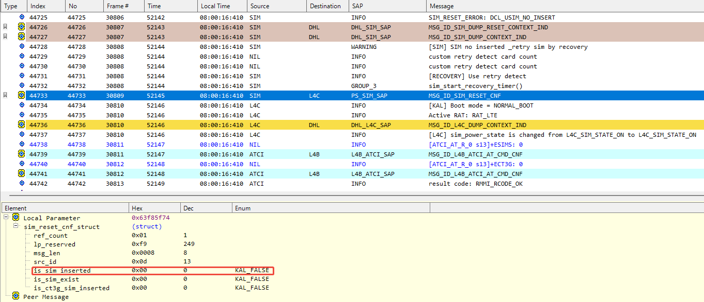
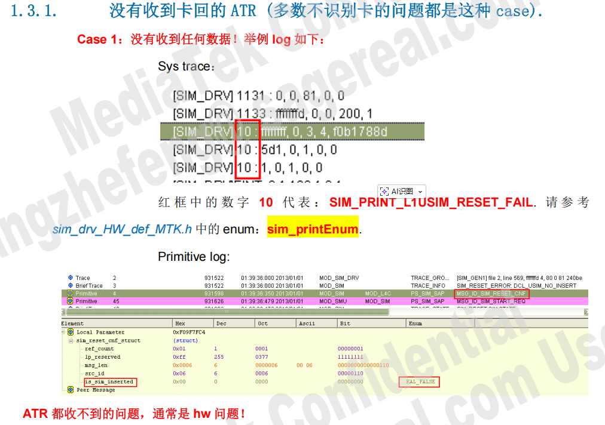
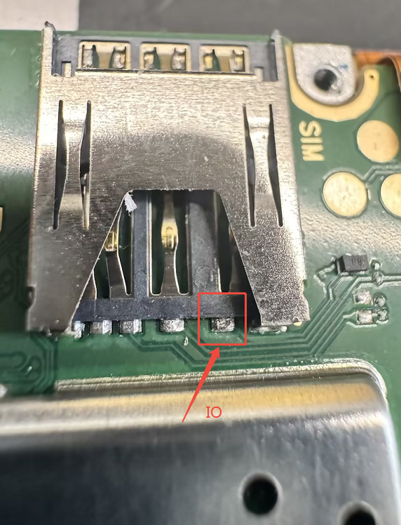

# 6601 蓝鸟售后反馈不识卡

<!-- IMPORTED_CASE_BOUNDARY_START -->
> 使用口径：本页已整理出可复用 Case 卡片。排查时优先看“用户现象 / 结论 / 关键证据 / 定位口径”；“原始案例内容”只用于回溯来源，不作为单独结论引用。
<!-- IMPORTED_CASE_BOUNDARY_END -->

## 阅读入口

本 case 从旧 Outline 案例集合拆出，当前保留原始内容和初步 frontmatter。复用前需要核对平台、版本、运营商和完整 log。

## 用户现象
6601 蓝鸟售后反馈不识卡

## 结论

当前只能定位到 No ATR / 硬件链路方向。原始资料确认没有收到卡返回的 ATR，贴纸垫高后仍不识卡，但没有保留最终根因和修复动作。

后续复现时按 SIM 不识别“三段式”处理：先确认插卡事件，再看上电/ATR，最后才看 EF / AP subscription。

## 关键证据

- 原始分类：二、硬件配置问题
- 来源：SIM问题案例补充.md
- 拆分序号：17
- 原始分析：没有收到卡返回的 ATR。
- 卡片后面贴纸片仍不识卡。
- 建议动作：拆机检查明显故障，测量检卡时的 `vsim/rst/io` 波形。

## 下次复现补证清单

| 必抓证据 | 具体内容 | 能证明什么 |
|---|---|
| AP UICC/radio log | SIM state、slot state、card absent/present、ATR timeout | AP 是否收到插卡和 modem 上报 |
| modem SIM log | SIM detect、power on、reset、ATR wait/timeout、voltage class | SIM 协议栈卡在哪一步 |
| 硬件波形 | VSIM、RST、CLK、IO，从插卡到 ATR timeout 的完整波形 | 判断供电、复位、时钟、IO 是否异常 |
| 交叉验证 | 同卡换机、同机换卡、压卡/垫高、拆机后复测 | 区分卡片、卡座、焊接和主板问题 |
| 外观/显微检查 | 卡座焊点、弹片、ESD 器件、SIM 走线 | 确认虚焊、脱焊或结构接触问题 |
| 修复后复测 | 补焊/更换卡座前后同一套 log 和波形 | 证明硬件修复与 No ATR 消失有因果关系 |

判定口径：

- No ATR 只能说明卡未返回有效 ATR，不能单独区分卡片坏、卡座接触、供电或 IO 问题。
- 贴纸垫高后仍失败时，应继续看波形和焊点，不要只凭接触改善动作下结论。
- 没有波形时，硬件结论只能写“疑似”，不能写成确定虚焊。

## 原始资料边界

- 原始内容保留用于回溯旧知识库、日志片段和历史结论。
- 如原始描述与前文 Case 卡片冲突，默认以前文“结论 / 关键证据 / 定位口径”为阅读入口。
- 复用到新问题时必须重新核对平台、版本、运营商、log 和第一坏点。

## 原始案例内容

### 案例：6601 蓝鸟售后反馈不识卡

**问题分析：**

没有收到卡回的ATR，卡片后面贴纸片也是不识卡。需要拆机查看有无明显故障，并测量检卡时的 vsim,rst,io 的波形

  

 

**根本原因：**

引脚脱焊或虚焊导致

 

**解决方案：**
