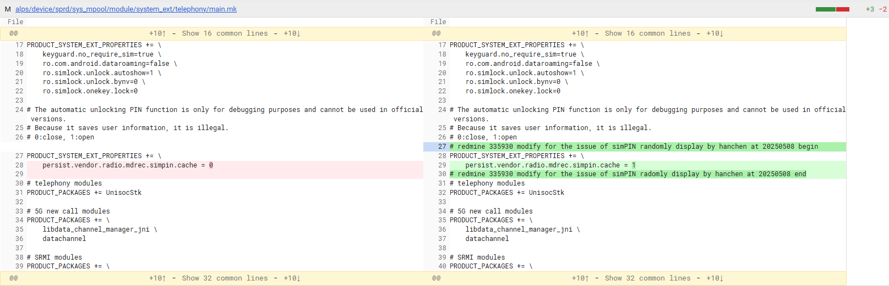

# GH6683 sunking sim pin issue report

## 阅读入口

本 case 从旧 Outline 案例集合拆出，当前保留原始内容和初步 frontmatter。复用前需要核对平台、版本、运营商和完整 log。

## 用户现象
GH6683 sunking sim pin issue report

## 结论

首坏点不是 SIM PIN 本身，而是数据连通性检测失败后触发 Data Stall Recovery。恢复动作逐步从 `GET_DATA_CALL_LIST`、`CLEANUP`、`RADIO_RESTART` 升级到 `RESET_MODEM`；modem reset 后 SIM 状态重新加载，最终重新进入 `PIN_REQUIRED`，表现为 SIM PIN 解锁页面弹出。

历史规避方向是配置 SIM PIN cache，在 modem reset 后从内存读取 PIN 数据，减少重新弹框。

## 关键证据

- 原始分类：四、软件机制
- 来源：SIM问题案例补充.md
- 拆分序号：19
- SIM 状态链：`UNKNOWN -> NOT_READY -> PIN_REQUIRED -> READY -> LOADED`
- RIL：`RADIO_NOT_AVAILABLE`、`Modem Reset`
- DSRM：`RECOVERY_ACTION_GET_DATA_CALL_LIST -> CLEANUP -> RADIO_RESTART -> RESET_MODEM`
- validation：`validation status=INVALID`

## 定位口径

| 检查项 | 判断 |
|---|---|
| SIM PIN 弹框前有 modem reset | 不按 SIM 卡主动掉卡处理 |
| Data Stall Recovery 逐级升级 | 先查网络连通性、APN、HTTP probe、运营商阻断 |
| `RESET_MODEM` 后 SIM 重载 | PIN_REQUIRED 是 modem reset 的后果 |
| 规避 | SIM PIN cache 属体验规避，不等于修复网络连通性失败 |

## 原始案例内容

### 案例：**GH6683 sunking sim pin issue report**

#### Log分析

**为什么会出现SIM PIN解锁页面？→ 因为SIM卡有重新加载**

Log中可以看到SIM卡状态变换

```javascript
行 1177255: RDDD574  04-24 20:00:34.376  1401  1401 D UiccController: updateSimState: phoneId=0, state=UNKNOWN, reason=null
行 1181078: RDDE402  04-24 20:00:35.881  1401  1401 D UiccController: updateSimState: phoneId=0, state=NOT_READY, reason=null
行 1186076: RDDF6C0  04-24 20:00:39.062  1401  1401 D UiccController: updateSimState: phoneId=0, state=PIN_REQUIRED, reason=PIN
行 1203811: RDE35DC  04-24 20:17:31.491  1401  1401 D UiccController: updateSimState: phoneId=0, state=READY, reason=null
行 1211983: RDE545F  04-24 20:17:37.825  1401  1401 D UiccController: updateSimState: phoneId=0, state=LOADED, reason=null
```


**为什么SIM卡会重新加载？→ 因为Modem reset了**

蜂窝调制解调器（Modem/RIL层）未响应或处于不可用状态，导致无法获取 SIM 卡状态（ICC status）

```javascript
RDDD511  04-24 20:00:34.310  1401  1401 E UiccController: Error getting ICC status. RIL_REQUEST_GET_ICC_STATUS should never return an error
RDDD511  04-24 20:00:34.310  1401  1401 E UiccController: com.android.internal.telephony.CommandException: RADIO_NOT_AVAILABLE
RDDD511  04-24 20:00:34.310  1401  1401 E UiccController: 	at com.android.internal.telephony.RILRequest.onError(RILRequest.java:236)
RDDD511  04-24 20:00:34.310  1401  1401 E UiccController: 	at com.android.internal.telephony.RIL.processResponseDoneInternal(RIL.java:6282)
RDDD511  04-24 20:00:34.310  1401  1401 E UiccController: 	at com.android.internal.telephony.RIL.processResponseDone(RIL.java:6267)
RDDD511  04-24 20:00:34.310  1401  1401 E UiccController: 	at com.android.internal.telephony.SimResponse.getIccCardStatusResponse(SimResponse.java:194)
RDDD511  04-24 20:00:34.310  1401  1401 E UiccController: 	at android.hardware.radio.sim.IRadioSimResponse$Stub.onTransact(IRadioSimResponse.java:299)
RDDD511  04-24 20:00:34.310  1401  1401 E UiccController: 	at android.os.Binder.execTransactInternal(Binder.java:1344)
RDDD511  04-24 20:00:34.310  1401  1401 E UiccController: 	at android.os.Binder.execTransact(Binder.java:1275)
```

继续分析log发现Modem 重置了，导致重新获取SIM卡状态

```javascript
RDDD2AD  04-24 20:00:32.463  1401  1416 D RILJ    : [7456]< NV_RESET_CONFIG  [PHONE0]
RDDD2C9  04-24 20:00:33.936   602   673 E RIL     : Modem Reset
RDDD2CA  04-24 20:00:33.939   602   673 E RIL     : Modem Reset, Info readerLoop to get out of select
RDDD2CB  04-24 20:00:33.939   602  4149 E RIL-AT  : Modem Abnormal, stop sim1 readerLoop
RDDD2CC  04-24 20:00:33.939   602  4149 D RIL-AT  : onReaderClosed
RDDD2CD  04-24 20:00:33.939   602  4150 E RIL-AT  : Modem Abnormal, stop sim0 readerLoop
RDDD2CE  04-24 20:00:33.939   602  4150 D RIL-AT  : onReaderClosed
RDDD2CF  04-24 20:00:33.940   602   673 D RILC_EXT: modemStateChangedInd state: 3, info: Modem Reset
```


**为什么Modem reset？→ 因为触发了Data Stall Recovery**

触发了Data Stall Recovery，执行doRecovery机制，主动执行了Modem重置操作

```javascript
RDD74B4  04-24 19:51:29.829  1401  1401 D DSRM-0  : getRecoveryAction: RECOVERY_ACTION_GET_DATA_CALL_LIST
RDD74B8  04-24 19:51:29.834  1401  1401 D DSRM-0  : doRecovery(): get data call list
RDD853C  04-24 19:54:30.766  1401  1401 D DSRM-0  : getRecoveryAction: RECOVERY_ACTION_CLEANUP
RDD8540  04-24 19:54:30.771  1401  1401 D DSRM-0  : doRecovery(): cleanup all connections
RDD92D3  04-24 19:57:31.415  1401  1401 D DSRM-0  : getRecoveryAction: RECOVERY_ACTION_RADIO_RESTART
RDD92D7  04-24 19:57:31.419  1401  1401 D DSRM-0  : doRecovery(): restarting radio
RDDD288  04-24 20:00:32.447  1401  1401 D DSRM-0  : getRecoveryAction: RECOVERY_ACTION_RESET_MODEM
RDDD28C  04-24 20:00:32.452  1401  1401 D DSRM-0  : doRecovery(): modem reset
```

```javascript
alps/frameworks/opt/telephony/src/java/com/android/internal/telephony/data/DataStallRecoveryManager.java
    /** Perform a series of data stall recovery actions. */
    private void doRecovery() {
        @RecoveryAction final int recoveryAction = getRecoveryAction();
        final int signalStrength = mPhone.getSignalStrength().getLevel();

        TelephonyMetrics.getInstance()
                .writeSignalStrengthEvent(mPhone.getPhoneId(), signalStrength);
        TelephonyMetrics.getInstance().writeDataStallEvent(mPhone.getPhoneId(), recoveryAction);
        mLastAction = recoveryAction;
        mLastActionReported = false;
        mNetworkCheckTimerStarted = false;
        mTimeElapsedOfCurrentAction = SystemClock.elapsedRealtime();

        switch (recoveryAction) {
            case RECOVERY_ACTION_GET_DATA_CALL_LIST:
                logl("doRecovery(): get data call list");
                getDataCallList();
                setRecoveryAction(RECOVERY_ACTION_CLEANUP);
                break;
            case RECOVERY_ACTION_CLEANUP:
                logl("doRecovery(): cleanup all connections");
                cleanUpDataNetwork();
                setRecoveryAction(RECOVERY_ACTION_RADIO_RESTART);
                break;
            case RECOVERY_ACTION_RADIO_RESTART:
                logl("doRecovery(): restarting radio");
                setRecoveryAction(RECOVERY_ACTION_RESET_MODEM);
                powerOffRadio();
                break;
            case RECOVERY_ACTION_RESET_MODEM:
                logl("doRecovery(): modem reset");
                rebootModem();
                resetAction();
                mIsAttemptedAllSteps = true;
                break;
            default:
                throw new RuntimeException(
                        "doRecovery: Invalid recoveryAction = "
                                + recoveryActionToString(recoveryAction));
        }

        startNetworkCheckTimer(mLastAction);
    }
```


**为什么触发了Data Stall Recovery？→ 因为连通性检测fail**

设备连通性检测fail（HTTP 检测未通过/INVALID状态），触发Data Stall Recovery

```javascript
RDD7443  04-24 19:51:28.959  1401  1401 D DNC-0   : onDataNetworkValidationStatusChanged: [DataNetwork: DN-226-C, safaricom, state=ConnectedState], validation status=INVALID, http://safaricom.zerod.live/?c=77
RDD7444  04-24 19:51:28.959  1401  1401 D DNC-0   : Notify carrier signal receivers with redirectUri: http://safaricom.zerod.live/?c=77
RDD7445  04-24 19:51:28.959  1401  1401 D DSRM-0  : onInternetValidationStatusChanged: INVALID
RDD7446  04-24 19:51:28.960  1401  1401 D DSRM-0  : data stall: start time = 19:51:28.960
RDD7447  04-24 19:51:28.960  1401  1401 D DSRM-0  : getRecoveryAction: RECOVERY_ACTION_GET_DATA_CALL_LIST
RDD7448  04-24 19:51:28.963  1401  1401 D DSRM-0  : data stall: start, lastaction=RECOVERY_ACTION_GET_DATA_CALL_LIST, isRecovered=false, reason=RECOVERED_REASON_NONE, isFirstValidationAfterDoRecovery=false, TimeDuration=0, TimeDurationForCurrentRecoveryAction=0
RDD7449  04-24 19:51:28.964  1401  1401 D Uni-DNC-0: isInternetDataAllowed: allowed=true,isVendorDataEnabled=true,isAutoSwitchEnabled=false,defaultDataSubId=2,currentSubId=2
RDD744A  04-24 19:51:28.964  1401  1401 D DSRM-0  : trigger data stall recovery
```


**为什么连通性检测fail？→ 因为SIM 卡鉴权限制、运营商服务稳定性等原因**

网络侧问题（高概率）

* **运营商服务稳定性**：HTTP 验证 URL 持续不可达，可能因运营商维护、服务器故障或区域网络中断。
* **SIM 卡鉴权限制**：SIM 卡被运营商标记为不可用（如欠费、绑定设备更换），触发网络重定向或阻断。

设备配置异常（中概率）

* **APN 参数错误**：当前 APN 配置（如 APN 类型、鉴权方式）与运营商要求不匹配，导致数据信道无法访问特定 URL。
* **无效 DNS 缓存**：DNS 解析异常导致验证 URL 无法被正确解析。


---

#### **Modem 重启原因总结**

结合所有日志，**Modem 重启的直接原因**是设备检测到多次数据停滞（Data Stall）后，系统触发**Data Stall Recovery**，最终执行 `RECOVERY_ACTION_RESET_MODEM` 操作强制重启 Modem。

**数据停滞检测（Data Stall）**

* **HTTP 验证连续失败**： 设备通过运营商预设的 URL `http://safaricom.zerod.live/?c=77` 定期校验网络连通性。多个时间点（如 19:51:28、19:57:40）记录的 `validation status=INVALID` 表明 HTTP 请求未成功（响应码非 200 或超时）。

**恢复机制升级**

* **恢复动作分阶段执行**： 系统按预设优先级逐步增强恢复力度，日志显示以下升级链：

  ```log
  RECOVERY_ACTION_GET_DATA_CALL_LIST → CLEANUP → RADIO_RESTART → RESET_MODEM
  ```
  * **低级动作（GET_DATA_CALL_LIST）**：刷新当前数据连接列表（未生效）。
  * **中级动作（RADIO_RESTART）**：重启基带（RIL 层）服务（未修复）。
  * **高级动作（RESET_MODEM）**：强制 Modem 芯片重启（最终执行）。


---

#### **结论**


1. **主要原因**： 运营商网络侧的服务不可达（HTTP 验证失败），迫使系统按预设策略逐步升级恢复动作，最终触发 Modem 强制重启以尝试恢复数据连接。
2. **直接结果**： Modem 的重置导致 SIM 卡状态临时丢失（需重新初始化），但最终在 Modem 重启完成后恢复至正常状态（`LOADED`）。
3. **解决方案**：此机制是AOSP原生的机制,主要发生在 欠费或者没流量情况下，连通性检测失败后，会触发激活，重启协议栈和modem reset，导致重新识卡，出现sim pin弹框。
目前的方案是配置sim pin cache, 在重启modem时，从内存中直接读取sim pin数据，规避掉这个弹框的动作

   

## 复用边界

- 本 case 来自旧 Outline 迁入资料，状态为 partial。
- 复用时需要重新核对平台、项目、运营商、版本、log 时间窗和第一坏点。
- 如果后续补齐完整证据链，再把 status 改为 summarized 或 closed。
