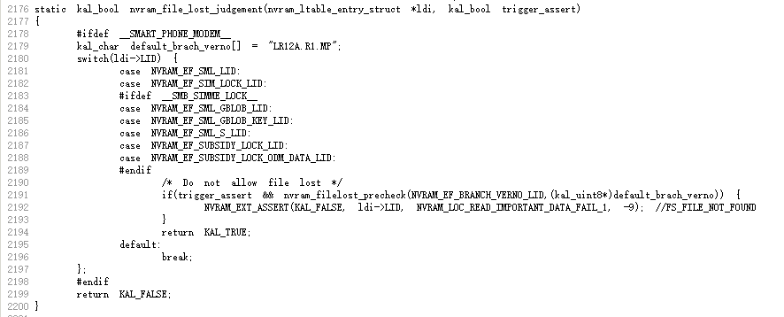

# WM58从有锁网升级下载到无锁网，Modem Assert

<!-- IMPORTED_CASE_BOUNDARY_START -->
> 使用口径：本页已整理出可复用 Case 卡片。排查时优先看“用户现象 / 结论 / 关键证据 / 定位口径”；“原始案例内容”只用于回溯来源，不作为单独结论引用。
<!-- IMPORTED_CASE_BOUNDARY_END -->


## 阅读入口

本 case 从旧 Outline 案例集合拆出，当前保留原始内容和初步 frontmatter。复用前需要核对平台、版本、运营商和完整 log。

## 用户现象
WM58从有锁网升级下载到无锁网，Modem Assert

## 结论

该问题应归 Stability / NVRAM / SML 保护机制，不是 SIM 识别问题。升级链路从有锁网切到无锁网后，modem 在 `nvram_main.c` 触发 assert，参数 `0x0000ef11` 指向 SML 相关 LID。历史处理方向是 MTK 平台保护机制补丁。

## 关键证据

- 原始分类：一、Modem 崩溃
- 来源：SIM问题案例补充.md
- 拆分序号：3
- assert：`mcu/service/nvram/src/nvram_main.c line=2192`
- 参数：`para0 = 0x0000ef11`

## 定位口径

| 检查项 | 判断 |
|---|---|
| 升级路径 | 有锁网 -> 无锁网属于高风险 NVRAM/SML 迁移 |
| assert 文件 | `nvram_main.c` 优先归 NV/SML，不归 SIM AP 状态 |
| `0x0000ef11` | 结合其它 case 看 SML LID、LID size、保护机制 |
| 修复 | 需要确认 MTK patch、NVRAM 迁移策略和已出机器处理方案 |

## 原始资料边界

- 原始内容保留用于回溯旧知识库、日志片段和历史结论。
- 如原始描述与前文 Case 卡片冲突，默认以前文“结论 / 关键证据 / 定位口径”为阅读入口。
- 复用到新问题时必须重新核对平台、版本、运营商、log 和第一坏点。

## 原始案例内容

### 案例：WM58从有锁网升级下载到无锁网，Modem Assert

分析：

```javascript
<5>[   13.630262][T600447] [ccci1/fsm]filename = mcu/service/nvram/src/nvram_main.c
<5>[   13.630267][T600447] [ccci1/fsm]line = 2192
<5>[   13.630270][T600447] [ccci1/fsm]assert para0 = 0x0000ef11, para1 = 0x00000c41, para2 = 0xfffffff7
```

 

根本原因：MTK平台保护机制

方案：<http://192.168.3.81:8085/c/S0_MP1/alps-release-s0.mp1.rc-tb-default_modem/+/96991>

## 复用边界

- 本 case 来自旧 Outline 迁入资料，状态为 partial。
- 复用时需要重新核对平台、项目、运营商、版本、log 时间窗和第一坏点。
- 如果后续补齐完整证据链，再把 status 改为 summarized 或 closed。
