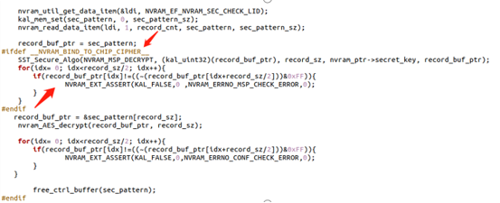

# civic项目BSP生成的Mini软件使用MBW开发的工具写入IMEI后，升级到CU软件，IMEI无法显示

<!-- IMPORTED_CASE_BOUNDARY_START -->
> 使用口径：本页已整理出可复用 Case 卡片。排查时优先看“用户现象 / 结论 / 关键证据 / 定位口径”；“原始案例内容”只用于回溯来源，不作为单独结论引用。
<!-- IMPORTED_CASE_BOUNDARY_END -->


## 阅读入口

本 case 从旧 Outline 案例集合拆出，当前保留原始内容和初步 frontmatter。复用前需要核对平台、版本、运营商和完整 log。

## 用户现象
civic项目BSP生成的Mini软件使用MBW开发的工具写入IMEI后，升级到CU软件，IMEI无法显示

## 结论

首坏点是 Mini 和 CU 软件的 modem NVRAM 加密宏控不一致。CU 版本打开 `NVRAM_BIND_TO_CHIP_CIPHER`，Mini 版本未打开；产线先在 Mini 写 IMEI/RF 参数，再升级到 CU 后，NV 解密失败，modem 认为 NV 文件损坏并 EE，最终表现为 IMEI 无法显示。

验证方向是把 CU modem 放入 Mini 软件编译并按产线流程复测；历史记录显示该方向可规避复现。

## 关键证据

- 原始分类：一、Modem 崩溃
- 来源：SIM问题案例补充.md
- 拆分序号：6
- assert：`mcu/common/service/nvram/src/nvram_main.c line=3145`
- 宏控：`NVRAM_BIND_TO_CHIP_CIPHER = ENABLE`
- 处理：同步硬件加密宏控和软件加密 key；已校准机器需备份 RF parameter，格式化 NVRAM/NVDATA 后重新导入。

## 定位口径

| 检查项 | 判断 |
|---|---|
| 写码软件与最终量产软件 | 必须确认 modem 加密宏控一致 |
| IMEI unknown | 不先按 SIM/卡问题处理，先查 modem EE 和 NV 解密 |
| 已出机器 | 先备份 RF/IMEI 参数，再格式化相关 NV 分区 |
| 版本验证 | 用同一 modem 加密策略覆盖 Mini/CU 产线链路 |

## 原始资料边界

- 原始内容保留用于回溯旧知识库、日志片段和历史结论。
- 如原始描述与前文 Case 卡片冲突，默认以前文“结论 / 关键证据 / 定位口径”为阅读入口。
- 复用到新问题时必须重新核对平台、版本、运营商、log 和第一坏点。

## 原始案例内容

### 案例：civic项目BSP生成的Mini软件使用MBW开发的工具写入IMEI后，升级到CU软件，IMEI无法显示

分析：抓log出现了modem EE

```java
[ASSERT] file:mcu/common/service/nvram/src/nvram_main.c
line:3145

p1:0x00000000
p2:0x00000020
p3:0x00000000
```

 根本原因：是CU软件和Mini软件modem端的硬件加密宏控配置不同导致； 在CU软件modem端有开"1787 NVRAM_BIND_TO_CHIP_CIPHER = ENABLE"这支硬件加密的宏， 而在Mini软件中没开，升级到CU之后，由于nv数据解密失败，导致系统认为该nv文件可能存在损坏，modem端出现EE，间接导致IMEI无法显示;

验证： 当前验证将CU版本的modem(默认打开NVRAM_BIND_TO_CHIP_CIPHER 的版本)放入到mini软件中编译，按照产线此次装机流程验证，问题不再复现

修复： 1.当前已将硬件加密宏控(NVRAM_BIND_TO_CHIP_CIPHER ) 及 软件加密的key上传到BSP分支，预计再下个装机版本，可整体修复此问题 2.针对产线的已做校准的机器，需要再Mini版本备份出RF parameter， 升级到CU后，格式化NVRAM和NVDATA分区，然后将参数重新导入

## 复用边界

- 本 case 来自旧 Outline 迁入资料，状态为 partial。
- 复用时需要重新核对平台、项目、运营商、版本、log 时间窗和第一坏点。
- 如果后续补齐完整证据链，再把 status 改为 summarized 或 closed。
