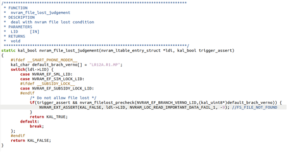
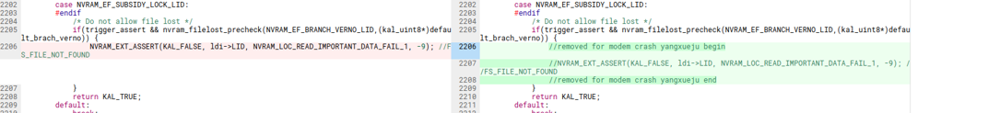

# civic项目，CU刷回Mini软件，IMEI显示unknown

## 阅读入口

本 case 从旧 Outline 案例集合拆出，当前保留原始内容和初步 frontmatter。复用前需要核对平台、版本、运营商和完整 log。

## 用户现象
civic项目，CU刷回Mini软件，IMEI显示unknown

## 结论

首坏点仍在 SML/NVRAM 链路。当前资料显示 `nvram_main.c` assert，参数 `0x0000ef11`，分析认为是 SML file 丢失；但缺少完整代码 diff 和最终补丁说明，因此保留为证据缺口 case。它应归到 Mini/CU 跨版本 NV/SML 兼容专题，不应按 SIM 卡或 AP 读卡问题处理。

## 关键证据

- 原始分类：一、Modem 崩溃
- 来源：SIM问题案例补充.md
- 拆分序号：8
- assert：`mcu/common/service/nvram/src/nvram_main.c line=2206`
- 参数：`para0=0x0000ef11`
- 当前判断：SML file 丢失或注释，可能和前述 LID size 异常有关。

## 补证要求

| 证据 | 用途 |
|---|---|
| Mini/CU 的 SML 文件清单 | 确认是否真的缺失 |
| 相关代码注释 diff | 确认谁移除了 SML file |
| LID size / LID verno 对比 | 判断是否和同系列问题同源 |
| 修复后 IMEI / modem boot log | 证明链路闭环 |

## 原始案例内容

### 案例：civic项目，CU刷回Mini软件，IMEI显示unknown

分析：

```java
<5>[   29.419741] .(4)[297:ccci_fsm1][ccci1/fsm]filename = mcu/common/service/nvram/src/nvram_main.c

<5>[   29.419748] .(4)[297:ccci_fsm1][ccci1/fsm]line = 2206
<5>[   29.419756] .(4)[297:ccci_fsm1][ccci1/fsm]assert para0 = 0x0000ef11, para1 = 0x00000c41, para2 = 0xfffffff7
```

 

根本原因： 代码看是 sml file丢失，与TCL check，他们内部把这个注释掉了，至于原因，大概率与上边lid size 异常导致的modem crash 有关

方案：

 

## 复用边界

- 本 case 来自旧 Outline 迁入资料，状态为 partial。
- 复用时需要重新核对平台、项目、运营商、版本、log 时间窗和第一坏点。
- 如果后续补齐完整证据链，再把 status 改为 summarized 或 closed。
