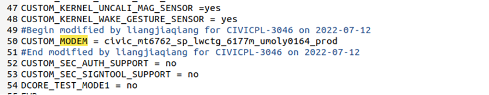

# Civic Plus VK7L版本升级Vk1J版本后，IMEI显示unknown

<!-- IMPORTED_CASE_BOUNDARY_START -->
> 使用口径：本页已整理出可复用 Case 卡片。排查时优先看“用户现象 / 结论 / 关键证据 / 定位口径”；“原始案例内容”只用于回溯来源，不作为单独结论引用。
<!-- IMPORTED_CASE_BOUNDARY_END -->


## 阅读入口

本 case 从旧 Outline 案例集合拆出，当前保留原始内容和初步 frontmatter。复用前需要核对平台、版本、运营商和完整 log。

## 用户现象
Civic Plus VK7L版本升级Vk1J版本后，IMEI显示unknown

## 结论

首坏点是产物链路取错 modem image。虽然 assert 表面仍是 `nvram_main.c line=2362` 和 SML LID size 类参数，但对比编译服务器、本地 build 和机器中的 `md1img` 时间戳后，发现下载到机器的 modem 并不是当前编译产物；反查代码确认 `custom_modem` 配置指到了 civic 的 modem。

## 关键证据

- 原始分类：一、Modem 崩溃
- 来源：SIM问题案例补充.md
- 拆分序号：9
- assert：`mcu/common/service/nvram/src/nvram_main.c line=2362`
- 参数：`para0=0x0000ef11, para1=0x00000644, para2=0x00000a28`
- 关键证据：机器中 `md1img` build 时间戳与编译产物不一致。
- 根因：`custom_modem` 定义错误，取到 civic modem。

## 定位口径

| 检查项 | 判断 |
|---|---|
| assert 与旧问题一致 | 不代表同一 root cause，先查产物 |
| `md1img` 时间戳不一致 | 说明下载产物不是当前编译 modem |
| `custom_modem` 配置 | 需要检查项目继承和 modem 选择 |
| IMEI unknown | 表象来自 modem/NV 异常，不按 SIM 读卡处理 |

## 原始资料边界

- 原始内容保留用于回溯旧知识库、日志片段和历史结论。
- 如原始描述与前文 Case 卡片冲突，默认以前文“结论 / 关键证据 / 定位口径”为阅读入口。
- 复用到新问题时必须重新核对平台、版本、运营商、log 和第一坏点。

## 原始案例内容

### 案例：Civic Plus VK7L版本升级Vk1J版本后，IMEI显示unknown

分析：抓取开机kernel log发现modem EE

```java
<5>[   29.419741] .(4)[297:ccci_fsm1][ccci1/fsm]filename = mcu/common/service/nvram/src/nvram_main.c
<5>[   29.419748] .(4)[297:ccci_fsm1][ccci1/fsm]line = 2362
<5>[   29.419756] .(4)[297:ccci_fsm1][ccci1/fsm]assert para0 = 0x0000ef11, para1 = 0x00000644, para2 = 0x00000a28
```

查看报错log，与之前lid size不匹配问题一致，本身jenkins上调用的tclmake 这支脚本来编译的， 这个脚本默认会先做modem 的编译， 但check了编译服务器及本地build的版本，mode lid size都与CU版本一致 modem_6762/mcu/build/TK_MD_L4/LWCTG_6177M_R3_6762/nvram_auto_gen/\~nvram_lid_size.log 怀疑下载到机器中的modem根本就不是编译出来的， 所以对比了md1img中的build时间戳，发现不一致 反查代码，发现civic plus中custome_modem定义的是civic 的modem

 

根本原因：使用的modem不正确

## 复用边界

- 本 case 来自旧 Outline 迁入资料，状态为 partial。
- 复用时需要重新核对平台、项目、运营商、版本、log 时间窗和第一坏点。
- 如果后续补齐完整证据链，再把 status 改为 summarized 或 closed。
