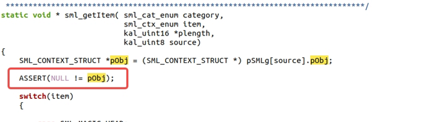

# Model3 Proto试产，出现E配置机器meta无法连接

<!-- IMPORTED_CASE_BOUNDARY_START -->
> 使用口径：本页已整理出可复用 Case 卡片。排查时优先看“用户现象 / 结论 / 关键证据 / 定位口径”；“原始案例内容”只用于回溯来源，不作为单独结论引用。
<!-- IMPORTED_CASE_BOUNDARY_END -->


## 阅读入口

本 case 从旧 Outline 案例集合拆出，当前保留原始内容和初步 frontmatter。复用前需要核对平台、版本、运营商和完整 log。

## 用户现象
Model3 Proto试产，出现E配置机器meta无法连接

## 结论

首坏点在 modem 侧 SML/NVRAM 读取链路。assert 位于 `custom_nvram_extra.c`，历史分析认为 SML data 取出为空，导致 E 配置机器 META 无法连接。当前资料缺少 SML 侧最终 root cause 和修复补丁，因此保留为证据缺口 case。

## 关键证据

- 原始分类：一、Modem 崩溃
- 来源：SIM问题案例补充.md
- 拆分序号：10
- assert：`mcu/pcore/custom/modem/common/ps/custom_nvram_extra.c line=11520`
- 参数：`para0/para1/para2 = 0`
- 分析方向：SML data 为空。

## 下次复现补证清单

| 必抓证据 | 具体内容 | 能证明什么 |
|---|---|
| META 连接日志 | META tool 版本、连接阶段、失败码、AP/modem 侧握手日志 | 判断失败发生在工具、端口、modem boot 还是 NV 读取 |
| modem full dump | `custom_nvram_extra.c line=11520`、call stack、para、current operation | 确认是否每次卡在 SML data 读取 |
| SML 数据来源 | 产线写入记录、默认 SML 文件、NVTool/Meta 写码日志 | 判断 SML data 为空是未写入、读不到还是格式错 |
| 代码/配置 diff | SML 读取函数、LID 定义、编译宏、项目差异 | 确认空数据来源 |
| 产物和 NV 回读 | AP/modem image、DB、NVRAM template、SML LID 回读 | 判断产物错配或 NV layout 问题 |
| 修复前后复测 | META 连接、modem boot、SML 读取、IMEI/SIM 状态 | 证明修复闭环 |

判定口径：

- META 连不上只是现象，若 modem 已 assert，优先按 stability/NVRAM 处理。
- `para0/1/2 = 0` 不足以定位 root cause，必须结合 call stack 和 SML 数据来源。
- 没有产线写入记录时，不要直接判断“产线未写”。

## 原始资料边界

- 原始内容保留用于回溯旧知识库、日志片段和历史结论。
- 如原始描述与前文 Case 卡片冲突，默认以前文“结论 / 关键证据 / 定位口径”为阅读入口。
- 复用到新问题时必须重新核对平台、版本、运营商、log 和第一坏点。

## 原始案例内容

### 案例：Model3 Proto试产，出现E配置机器meta无法连接

分析：此部分打到了SML部分，看起来sml data数据拿出来为空， 需要SML那边协助排查一下原因

```java
<5>[   92.575090]  (4)[310:ccci_fsm1][ccci1/fsm]filename = mcu/pcore/custom/modem/common/ps/custom_nvram_extra.c
<5>[   92.575101]  (4)[310:ccci_fsm1][ccci1/fsm]line = 11520

<5>[   92.575110]  (4)[310:ccci_fsm1][ccci1/fsm]assert para0 = 0x00000000, para1 = 0x00000000, para2 = 0x00000000
```

 

## 复用边界

- 本 case 来自旧 Outline 迁入资料，当前状态为 `summarized_with_log_gap`。
- 复用时需要重新核对 META 工具、产物版本、SML 数据来源、NV 回读和 modem dump。
- 如果后续补齐完整证据链，再把 status 改为 `summarized` 或 `closed`。
