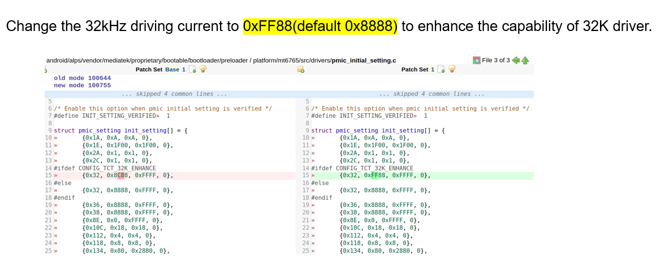

# Model3 生产，出现音频无声及卡logo问题

## 阅读入口

本 case 从旧 Outline 案例集合拆出，当前保留原始内容和初步 frontmatter。复用前需要核对平台、版本、运营商和完整 log。

## 用户现象
Model3 生产，出现音频无声及卡logo问题

## 结论

当前可复用结论有限：多组 assert 记录里，`Current status` 指向 `nvram_main.c line=2520`，`para0=0x0000ef31`。由于原始资料只保留了截图方案，没有文字化 root cause，本 case 只能作为 NVRAM/LID 证据缺口样例，不能直接沉淀为音频或 SIM 卡 logo 的确定根因。

## 关键证据

- 原始分类：一、Modem 崩溃
- 来源：SIM问题案例补充.md
- 拆分序号：11
- 早期 assert：`MD_TOPSM.c line=1316`、`ccci_error_code.c line=152`
- Current status：`nvram_main.c line=2520`
- 关键参数：`para0=0x0000ef31, para1=0x00000644, para2=0x000028f0`

## 补证要求

| 证据 | 用途 |
|---|---|
| 原始方案截图对应 CR/patch | 还原真实 root cause |
| EF31 LID 含义和 size 对比 | 判断是否仍是 NV layout 问题 |
| 音频无声与卡 logo 的 AP log | 区分 modem assert 后果和独立 AP 问题 |
| 修复前后 full dump | 证明 assert 消失 |

## 原始案例内容

### 案例：Model3 生产，出现音频无声及卡logo问题

分析：

```java
<5>[36281.904534]  (4)[314:ccci_fsm1][ccci1/fsm]filename = mcu/common/driver/sleep_drv/internal/src/MD_TOPSM.c

<5>[36281.904588]  (4)[314:ccci_fsm1][ccci1/fsm]line = 1316
<5>[36281.904619]  (4)[314:ccci_fsm1][ccci1/fsm]assert para0 = 0x00000000, para1 = 0x00000000, para2 0x00000000

<5>[ 2740.997826]  (6)[227:ccci_fsm1][ccci1/fsm]filename = mcu/service/hif/nccci/src/ccci_error_code.c
<5>[ 2740.997838]  (6)[227:ccci_fsm1][ccci1/fsm]line = 152

<5>[ 2740.997848]  (6)[227:ccci_fsm1][ccci1/fsm]assert para0 = 0x00000100, para1 = 0x00000000, para2 = 0x00000000

[Current status]
<5>[   27.733231]  (7)[221:ccci_fsm1][ccci1/fsm]filename = mcu/service/nvram/src/nvram_main.c
<5>[   27.733235]  (7)[221:ccci_fsm1][ccci1/fsm]line = 2520
<5>[   27.733239]  (7)[221:ccci_fsm1][ccci1/fsm]assert para0 = 0x0000ef31, para1 = 0x00000644, para2 = 0x000028f0
```

方案：

 

## 复用边界

- 本 case 来自旧 Outline 迁入资料，状态为 partial。
- 复用时需要重新核对平台、项目、运营商、版本、log 时间窗和第一坏点。
- 如果后续补齐完整证据链，再把 status 改为 summarized 或 closed。
