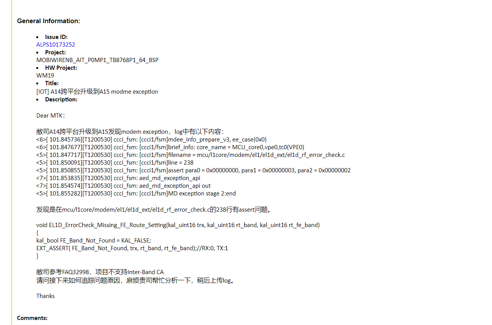
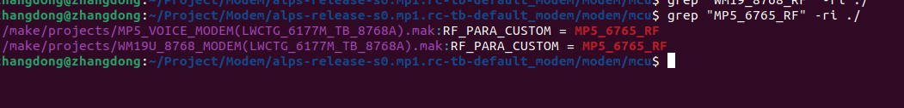

# WM58 OTA跨版本升级，出现Modem Assert

<!-- IMPORTED_CASE_BOUNDARY_START -->
> 使用口径：本页已整理出可复用 Case 卡片。排查时优先看“用户现象 / 结论 / 关键证据 / 定位口径”；“原始案例内容”只用于回溯来源，不作为单独结论引用。
<!-- IMPORTED_CASE_BOUNDARY_END -->

## 阅读入口

本 case 从旧 Outline 案例集合拆出，当前保留原始内容和初步 frontmatter。复用前需要核对平台、版本、运营商和完整 log。

## 用户现象
WM58 OTA跨版本升级，出现Modem Assert

## 结论

首坏点是 OTA 跨版本升级后的 `RF_PARA_CUSTOM` 宏配置错误，导致加载了错误射频参数并触发 modem assert。处理方向是修正 `RF_PARA_CUSTOM`，使用正确 RF 文件。

## 关键证据

- 原始分类：一、Modem 崩溃
- 来源：SIM问题案例补充.md
- 拆分序号：13
- 关键配置：`RF_PARA_CUSTOM`
- 根因：升级后版本使用错误 RF 参数文件。

## 定位口径

| 检查项 | 判断 |
|---|---|
| OTA 前后 RF 参数宏 | 必须确认是否随项目/硬件版本正确切换 |
| modem assert 伴随 RF 相关变更 | 优先查 RF parameter、band、校准 |
| 只在跨版本升级出现 | 查升级包是否带入错误配置或遗漏迁移 |

## 原始资料边界

- 原始内容保留用于回溯旧知识库、日志片段和历史结论。
- 如原始描述与前文 Case 卡片冲突，默认以前文“结论 / 关键证据 / 定位口径”为阅读入口。
- 复用到新问题时必须重新核对平台、版本、运营商、log 和第一坏点。

## 原始案例内容

### 案例：WM58 OTA跨版本升级，出现Modem Assert

分析：

 

根本原因：升级后的版本，RF_PARA_CUSTOM宏用错了，导致用的射频参数不对 

修改方案：修改RF_PARA_CUSTOM，使用正确的射频文件

## 复用边界

- 本 case 来自旧 Outline 迁入资料，状态为 partial。
- 复用时需要重新核对平台、项目、运营商、版本、log 时间窗和第一坏点。
- 如果后续补齐完整证据链，再把 status 改为 summarized 或 closed。
