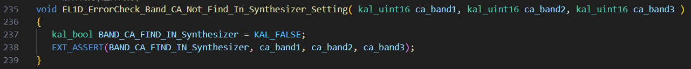

# NUU单机出现Modem Assert

<!-- IMPORTED_CASE_BOUNDARY_START -->
> 使用口径：本页已整理出可复用 Case 卡片。排查时优先看“用户现象 / 结论 / 关键证据 / 定位口径”；“原始案例内容”只用于回溯来源，不作为单独结论引用。
<!-- IMPORTED_CASE_BOUNDARY_END -->


## 阅读入口

本 case 从旧 Outline 案例集合拆出，当前保留原始内容和初步 frontmatter。复用前需要核对平台、版本、运营商和完整 log。

## 用户现象
NUU单机出现Modem Assert

## 结论

首坏点是硬件频段组合与软件/RF 参数不匹配。项目存在两个硬件版本、频段组合不同，但历史上未做单软多硬，互刷错误软件会导致 RF check assert。处理方向是刷回对应版本，必要时格式化刷机并重新写入射频参数。

## 关键证据

- 原始分类：一、Modem 崩溃
- 来源：SIM问题案例补充.md
- 拆分序号：15
- assert：`mcu/l1core/modem/el1/el1d_ext/el1d_rf_error_check.c line=238`
- 参数：`para1=0x0000000d, para2=0x00000014`
- 根因：频段/硬件版本不匹配，未做单软多硬隔离。

## 定位口径

| 检查项 | 判断 |
|---|---|
| 单机 assert | 先查硬件版本、RF band 组合、刷机版本 |
| RF check assert | 优先查 RF 参数和 band capability |
| 有多个硬件版本 | 必须建立 SKU/版本约束，不能互刷 |

## 原始资料边界

- 原始内容保留用于回溯旧知识库、日志片段和历史结论。
- 如原始描述与前文 Case 卡片冲突，默认以前文“结论 / 关键证据 / 定位口径”为阅读入口。
- 复用到新问题时必须重新核对平台、版本、运营商、log 和第一坏点。

## 原始案例内容

### 案例：NUU单机出现Modem Assert

```javascript
<5>[  293.108753][T100406] ccci_fsm: [ccci1/fsm]filename = mcu/l1core/modem/el1/el1d_ext/el1d_rf_error_check.c
<5>[  293.108780][T100406] ccci_fsm: [ccci1/fsm]line = 238
<5>[  293.108800][T100406] ccci_fsm: [ccci1/fsm]assert para0 = 0x00000000, para1 = 0x0000000d, para2 = 0x00000014
```

分析：查看报错代码，分析与Band有关，咨询射频

这个项目有两个频段组合 ，一个比较少，一个比较多。 两个硬件版本需要通过 不同的软件来刷

因为历史原因，没有做单软多硬，不能互刷

 

根本原因：频段不匹配，升级下载会导致 assert

解决方案：格式化刷机，重新写入射频参数。正常刷对应版本即可
