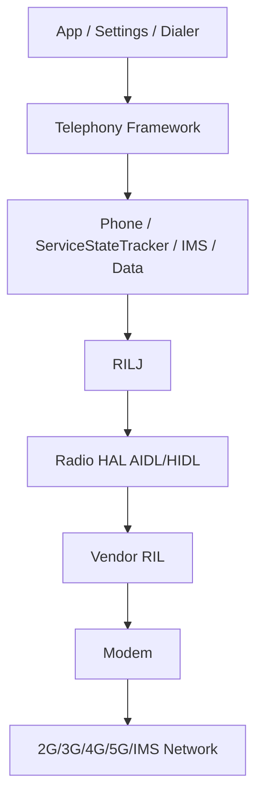
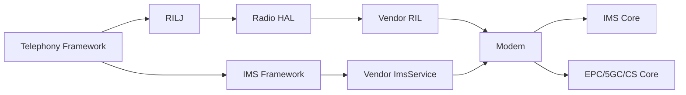
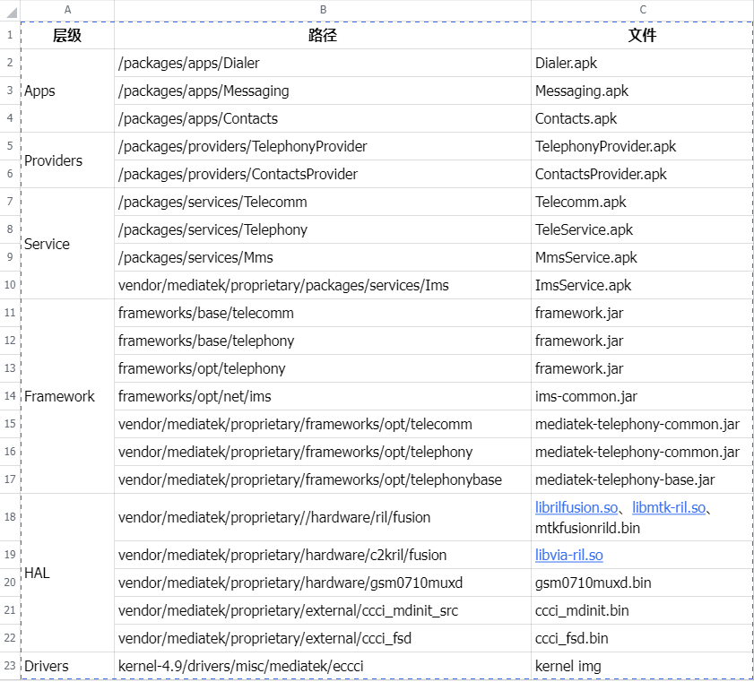
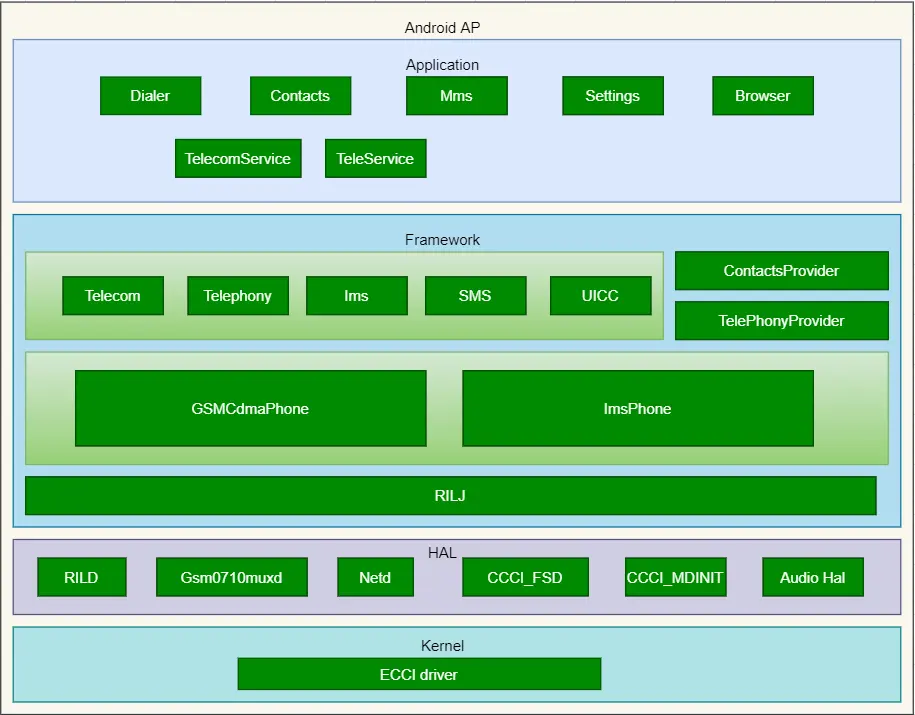

# Telephony系统架构

## 阅读入口

- 本文是迁入/补充资料，先按本节入口定位，再看正文和来源记录。
- 可复用结论应沉淀到主流程/配置/排障/case；本文只保留溯源材料和操作细节。

这篇合并 Android Telephony、RIL/IMS/Modem 边界和平台差异。具体流程不要放这里，流程放 `20_Service-Flows`。
## Android-Telephony架构

---
domain: Architecture
layer: AP/Framework/RIL/Modem
status: draft
---

## 一句话

Android Telephony 负责把上层业务请求、SIM状态、网络注册状态、IMS能力、通话/短信/数据状态组织成系统可理解的状态，并通过 RIL/HAL 与 modem 交互。

## 主要层次



## 常见模块

| 模块 | 负责内容 | 常见问题 |
|---|---|---|
| `ServiceStateTracker` | 注册状态、服务状态、RAT、PLMN | 无服务、状态跳变、RAT显示异常 |
| `NetworkRegistrationManager` | CS/PS注册状态查询 | 注册状态不上报或解析异常 |
| `UiccController` | SIM slot和卡状态 | 不识卡、卡状态异常 |
| `SIMRecords` | SIM EF文件、IMSI、SPN | IMSI未读出、SPN显示异常 |
| `CarrierConfigLoader` | 运营商配置 | VoLTE/VoWiFi/VoNR能力门控 |
| `ImsResolver` | IMS服务绑定 | IMS服务未绑定 |
| `ImsManager` | IMS注册和能力管理 | IMS开关、能力、注册状态异常 |
| `ImsPhoneCallTracker` | IMS呼叫状态机 | VoLTE拨号失败、掉话 |
| `DataNetworkController` | 数据网络管理 | PDN/PDU session异常 |

## 分析原则

- AP log 能证明 framework 看到什么、做了什么。
- Modem log 能证明信令和modem内部状态机发生了什么。
- bugreport 能提供系统快照，但不能替代 failure window 的实时 log。
- CarrierConfig 是能力开关和策略入口，经常影响 IMS、VoWiFi、VoNR、视频通话、UT。

## 常见边界

| 现象 | 优先看AP | 优先看Modem | 备注 |
|---|---|---|---|
| 设置项不显示 | 是 | 否 | 多数是配置/能力门控 |
| 无服务 | 是 | 是 | 需要确认注册拒绝、搜网、SIM |
| IMS未注册 | 是 | 是 | AP注册状态和SIP/NAS证据都要看 |
| VoLTE拨号失败 | 是 | 是 | AP dial request 到 SIP INVITE 之间是关键 |
| Modem assert | 否 | 是 | AP侧只能看到radio unavailable/restart |

## RIL-IMS-Modem关系

---
domain: Architecture
layer: AP/RIL/IMS/Modem
status: draft
---

## 核心关系



## 两条常见链路

### 网络注册

AP看到的链路：

```text
ServiceStateTracker -> RILJ getVoice/DataRegistrationState -> Radio HAL -> Vendor RIL -> Modem
```

Modem真实执行：

```text
PLMN search -> Cell selection -> RRC -> NAS attach/registration -> state indication
```

### IMS注册

AP看到的链路：

```text
ImsManager -> ImsService -> registration callback -> Telephony state update
```

Modem/IMS侧可能执行：

```text
IMS APN/PDU session -> P-CSCF discovery -> SIP REGISTER -> 401 challenge -> REGISTER with auth -> 200 OK
```

## 分析时要避免的误判

- AP显示 `IMS not registered` 不等于 SIP 一定失败，可能 IMS service 没绑定、配置关闭、P-CSCF不可用。
- RIL上报 `RADIO_NOT_AVAILABLE` 不等于 modem assert，可能是radio restart、服务重启、飞行模式切换。
- VoLTE开关打开不等于具备 VoLTE 能力，还要看 SIM、运营商配置、IMS feature、网络注册、IMS注册。
- Modem log 里有正常 SIP 200 OK，不代表 AP 一定已收到注册成功回调。

## 对齐证据

| 证据 | 能说明什么 | 不能说明什么 |
|---|---|---|
| AP log | framework状态和API路径 | modem内部原因 |
| radio log | RIL请求/响应/UNSOL | 网络真实信令细节 |
| modem log | NAS/RRC/SIP/内部状态机 | Android UI或上层策略 |
| bugreport | 系统快照 | 失败瞬间完整过程 |

## 平台差异-Qualcomm-MTK-UNISOC

---
domain: Architecture
layer: VendorRIL/IMSStack/Modem/Tools
platform: Qualcomm/MTK/UNISOC
status: draft
tags: [PlatformDiff, VendorCustomization]
---

## 结论

需要区分 Qualcomm、MTK、UNISOC。不要把平台当成普通备注，而要作为 case 的一等字段。原因是同一个用户现象，在不同平台上的日志格式、配置入口、IMS实现、modem状态机、工具链、客制化位置都可能不同。

## 怎么区分

| 维度        | 为什么重要                    | 记录位置                   |
| --------- | ------------------------ | ---------------------- |
| 平台        | 决定RIL/IMS/modem工具链和日志语义  | `platform`             |
| 芯片/基线     | 同平台不同基线行为可能不同            | `chipset`              |
| Modem版本   | 注册、IMS、call、稳定性高度相关      | `modem_version`        |
| Android版本 | framework接口、data/IMS架构会变 | `android_version`      |
| 客户定制      | 很多问题只在特定项目/运营商触发         | `vendor_customization` |
| 工具链       | 决定原始log如何解析              | case输入材料               |

## 平台差异常见位置

### RIL / Radio HAL

- RIL request/response 的封装和日志格式可能不同。
- UNSOL 上报时机和状态合并策略可能不同。
- 某些错误码可能经过 vendor 层转换后才到 Android framework。

### IMS Stack

- IMS service 实现通常是平台或厂商私有。
- IMS注册、能力上报、call session、WFC/ePDG 的日志路径差异很大。
- 同样是 `IMS not registered`，可能分别来自配置门控、IMS bearer失败、SIP失败、回调未上报。

### Modem配置

- Qualcomm 常见关注 NV、MBN、QXDM/QCAT 解析。
- MTK 常见关注 modem database、ELT/MD log、operator/customization 配置。
- UNISOC 常见关注 logel、modem trace、NV/运营商配置。

> 上面是知识库分类视角，不是绝对规则。真实判断仍以项目工具链和日志证据为准。

### 客户定制

客制化可能落在多个层级：

- Android resource overlay
- CarrierConfig
- vendor RIL policy
- vendor IMS policy
- modem NV / modem config
- MBN / operator package / modem database
- SIM/运营商匹配规则

## Case里必须记录的平台信息

```yaml
platform: Qualcomm/MTK/UNISOC
chipset:
android_version:
modem_version:
vendor_customization:
```

## 分析策略

### 先看共性流程

无论什么平台，先按统一流程确认：

- SIM是否ready
- 网络注册到哪一步
- IMS bearer是否建立
- SIP/CS call是否有关键消息
- AP是否正确收到modem结果

### 再看平台差异

当共性流程定位到 vendor/modem/IMS 层时，再进入平台分支：

| 断点 | 下一步 |
|---|---|
| AP请求没有到modem | 查vendor RIL/HAL平台实现 |
| IMS能力不上报 | 查vendor IMS service和CarrierConfig |
| SIP失败 | 查平台IMS/modem SIP日志和运营商配置 |
| 注册reject | 查平台NAS日志、SIM/PLMN/TA策略 |
| modem assert | 查平台assert dump和符号解析 |

## 不建议的做法

- 不要按平台单独维护三套完全割裂的知识库。
- 不要把每个平台都写成一套重复的 LTE/IMS/Call 流程。
- 不要只记录“某平台问题”，要记录“平台差异发生在哪一层”。

## 推荐结构

共性流程放在 `20_Service-Flows`，平台差异放在当前文档或 case 的“平台差异检查”部分。

真实 case 按问题域归类，而不是按平台归类：

```text
40_Case-Library/
  Registration/
  IMS/
  Call/
  SIM/
  Stability/
```

平台通过 frontmatter 和标签筛选：

```yaml
platform: Qualcomm
tags: [IMS, VoLTE, Qualcomm, VendorCustomization]
```

## Telephony架构补充资料

### 定位入口

- 先切清模块边界：Android Framework、RIL、厂商服务、modem、配置资源。
- 再补齐代码路径、开关来源、log 关键字、编译产物和运行时验证方式。
- 本文图片已转成本地附件；非图片附件仍保留原 Outline 链接作为资料索引。

迁入架构图片和入口资料补充。

> 图片已保存为本地附件；非图片附件仍保留原 Outline 链接作为资料索引。

### Telephony架构




 

### 来源记录

- [Telephony架构](http://192.168.3.94:8888/doc/telephony-4lR3Wy0EPr) (`4lR3Wy0EPr`)
- [IMS架构](http://192.168.3.94:8888/doc/ims-rGSXdmSeIW) (`rGSXdmSeIW`)
- [CarrierConfig架构](http://192.168.3.94:8888/doc/carrierconfig-O1eCwlVdF9) (`O1eCwlVdF9`)
