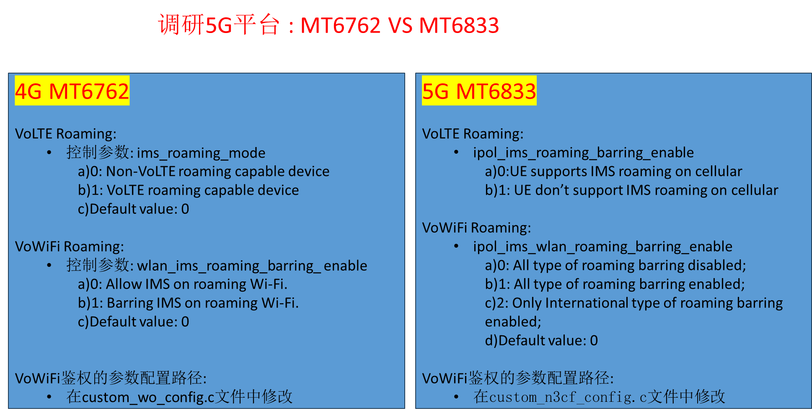

# 平台代码与产物速查

## 阅读入口

- 本文是迁入/补充资料，先按本节入口定位，再看正文和来源记录。
- 可复用结论应沉淀到主流程/配置/排障/case；本文只保留溯源材料和操作细节。

这篇合并 LTE 注册代码入口和 modem 产物/patch 链路。用于从代码、状态同步、modem image、流水线参数反推问题边界。
## LTE注册-平台代码架构速查

---
domain: Architecture
layer: AP/Framework/RIL/VendorRIL/Modem
rat: LTE
platform: Android/UNISOC/MTK
status: draft
tags: [LTE, Registration, Architecture, VendorRIL]
---

## 使用边界

这篇只回答“读代码时从哪里下手”。主流程判断仍放在 [[LTE注册流程]]，平台 log 字段和 trace 过滤放在 [[LTE注册-平台Log速查]]。

## Android Framework共性主线

两套平台在Android Framework层基本一致，先按下面的链路定位：

```text
ServiceStateTracker
-> NetworkRegistrationManager
-> CellularNetworkService.requestNetworkRegistrationInfo
-> RIL.getVoiceRegistrationState / getDataRegistrationState
-> RadioNetworkProxy
-> vendor RIL response
-> CellularNetworkService.createRegistrationStateFromVoice/DataRegState
-> NetworkRegistrationInfo
-> ServiceStateTracker.regCodeToServiceState
```

| 代码入口 | 作用 | 查问题时怎么用 |
|---|---|---|
| `NetworkRegistrationManager.java` | 绑定 `NetworkService` 并发起CS/PS注册态请求 | AP侧没有poll时，先看service是否绑定、callback是否返回 |
| `CellularNetworkService.java` | 把HAL/RIL注册态转成 `NetworkRegistrationInfo` | 对齐 `REG_HOME/REG_DENIED/REG_ROAMING`、RAT、PLMN、CellIdentity |
| `RIL.java` | 发起 `VOICE_REGISTRATION_STATE`、`DATA_REGISTRATION_STATE`、`SET_INITIAL_ATTACH_APN` | RILJ `>` 方向代表AP请求，不代表网络侧消息 |
| `RadioNetworkProxy.java` / `RadioDataProxy.java` | 根据AIDL/HIDL版本调用底层radio service | HAL版本或service异常时，RILJ有请求但vendor侧可能没收到 |
| `DataProfileManager.java` | 选择initial attach APN和普通data profile | ESM/default bearer失败时先看IA profile是否选对、是否下发 |
| `ServiceStateTracker.java` | 合成最终ServiceState | `IN_SERVICE` 是Framework合成结果，必须反查上游CS/PS注册态 |

Framework排查顺序：

```text
先看AP是否poll注册态
-> 再看vendor RIL是否返回正确RIL结构
-> 再看Framework是否正确映射NetworkRegistrationInfo
-> 最后看ServiceState是否合成IN_SERVICE
```

## 展锐代码架构

代码树参考：

```text
~/Project/Common/SPRDROID16_SYS_MAIN_W25.22.4
```

展锐公开代码里，标准LTE注册态主要走AOSP RIL主链：

```text
frameworks/opt/telephony
-> hardware/ril/libril/ril_service.cpp
-> vendor radio实现
-> modem log / trace
```

关键文件：

| 模块 | 文件/目录 | 作用 |
|---|---|---|
| 标准RIL请求 | `hardware/ril/libril/ril_service.cpp` | `getVoiceRegistrationState` / `getDataRegistrationState` 通过 `dispatchVoid` 下发；`setInitialAttachApn` 转成 `RIL_InitialAttachApn(_v15)` |
| 标准RIL响应 | `hardware/ril/libril/ril_commands.h`、`ril_service.cpp` | 把 `RIL_VoiceRegistrationStateResponse` / `RIL_DataRegistrationStateResponse` 转回HAL response |
| 展锐扩展HAL | `vendor/sprd/interfaces/radio/aidl/vendor/unisoc/hardware/radio/*` | 拆成 data/network/modem/sim/voice 等扩展服务 |
| 展锐AP扩展服务 | `vendor/sprd/modules/radiointeractor` | 提供AP侧vendor能力包装和异步通知分发 |
| 抓log配置 | `vendor/sprd/platform/packages/apps/LogManager` | 可以校准EMM/PLM/LRRC/L2等trace模块是否打开 |

展锐扩展能力主线：

```text
RadioInteractor.java
-> IRadioInteractor.aidl
-> RadioInteractorManager
-> RadioInteractorHandler
-> RadioInteractorCore
-> ExtRadioDataProxy / ExtRadioNetworkProxy / ExtRadioModemProxy
-> vendor.unisoc.hardware.radio.* AIDL/HIDL
```

注册相关扩展点：

| 扩展点 | 代码依据 | 用途 |
|---|---|---|
| LTE开关/扩展网络模式 | `ExtRadioNetworkProxy.java`、`IExtRadioNetwork.aidl` | `enableLTE`、`setPreferredNetworkTypeExt`、快速回网、信号/速率、CA状态 |
| 数据attach控制 | `ExtRadioDataProxy.java`、`IExtRadioData.aidl` | `attachData`、`reAttach`、`forceDeatch`、RAU notify、active PDP count |
| 注册拒绝旁路通知 | `ExtRadioNetworkIndication.java` | `reasonsForRegRejectedInd` 会通知上层注册拒绝场景信息 |
| RACH失败旁路通知 | `ExtRadioNetworkIndication.java` | `rachFailInd` 可辅助判断RRC建链第一坏点 |
| CS/PS注册态扩展通知 | `ExtRadioNetworkIndication.java` | `networkRegStateInd` 把CS/PS state/type交给 `RadioInteractorUtils` 更新 |

展锐定位口径：

- 标准注册态问题先看 `RILJ -> CellularNetworkService -> ServiceStateTracker`，不要直接跳到 `RadioInteractor`。
- `RadioInteractor` 更适合查平台扩展事件，例如注册拒绝场景、RACH失败、快速回网、强制data attach/detach。
- 如果AP侧标准链已经 `REG_HOME/IN_SERVICE`，但modem trace没有完整Attach/默认承载证据，优先补抓EMM/ESM/LRRC/L2 trace。
- 如果modem trace已成功但AP侧不同步，优先查 `hardware/ril/libril` response结构、CellIdentity、rplmn、reason字段是否正确返回。

## MTK代码架构

代码树参考：

```text
~/Project/MP6/alps-release-b0.mp1.rc-tb-default
```

MTK vendor RIL代码展开较完整，可以按层读：

| 层级 | 目录 | 作用 |
|---|---|---|
| Android radio service前端 | `vendor/mediatek/proprietary/hardware/ril/fusion/libril` | 接AIDL/HIDL radio service，把Android请求转成RIL request |
| RFX框架 | `fusion/mtk-ril/framework` | 定义 `RfxMessage`、`Rfx*Data`、request/URC映射、controller框架 |
| AP vendor控制层 | `fusion/mtk-ril/telcore` / `telcore_mipc` | `Rtc*Controller` 负责请求分发、状态修正、response回RILJ |
| modem通信层 | `fusion/mtk-ril/mdcomm` | AT通道处理，典型如 `+EREG/+EGREG/+EIAREG` |
| MIPC通信层 | `fusion/mtk-ril/mdcomm_mipc` | MIPC消息通道，和AT通道实现同类能力 |

MTK注册态主线：

```text
Android RILJ poll
-> radionetwork_service.cpp
-> RfxIdToMsgIdUtils: RIL request <-> RFX message
-> RtcNetworkController
-> RmcNetworkRealTimeRequestHandler / RmmNwRealTimeRequestHandler
-> RIL_VoiceRegistrationStateResponse / RIL_DataRegistrationStateResponse
-> radionetwork_service.cpp
-> Framework NetworkRegistrationInfo
```

MTK注册态cache来源：

```text
modem URC: +EREG / +EGREG
-> RmcNetworkUrcHandler
-> MD_EREG / MD_EGREG cache
-> requestVoiceRegistrationState / requestDataRegistrationState
-> sendVoiceRegResponse / sendDataRegResponse
```

关键实现点：

| 代码点 | 作用 | 定位价值 |
|---|---|---|
| `RmcNetworkUrcHandler.cpp` | 注册并解析 `+EREG`、`+EGREG`、`+PSBEARER`、`+ECSQ` 等URC | AP字段错时可反查URC解析和cache |
| `RmcNetworkHandler.h` | 定义 `MD_EREG` / `MD_EGREG` cache结构 | 对齐stat、lac/tac、ci、eAct、reject_cause |
| `RmcNetworkRealTimeRequestHandler.cpp` | 处理voice/data registration request | 从cache填RIL response，是AP注册态的直接来源 |
| `RtcNetworkController.cpp` | 注册network类RFX request，处理network scan和data registration response | 手动搜网、scan取消、特殊状态修正要看这里 |
| `radionetwork_service.cpp` | 把RIL response转成AIDL `RegStateResult` | 对齐 `registeredPlmn`、CellIdentity、reason字段 |

MTK Initial Attach APN主线：

```text
DataProfileManager
-> RIL.setInitialAttachApn
-> radiodata_service.cpp
-> RfxIdToMsgIdUtils
-> RtcDataController
-> RmcDcReqHandler / RmmDcEventHandler
-> AT+EIAAPN 或 MIPC_APN_SET_IA_REQ
-> +EIAREG: ME ATTACH
```

关键实现点：

| 代码点 | 作用 | 定位价值 |
|---|---|---|
| `radiodata_service.cpp` | 把HAL `DataProfileInfo` 转成 `RIL_InitialAttachApn_v15` | 对齐APN、protocol、auth、user/password、type bitmask、bearer bitmap |
| `RtcDataController.cpp` | 注册 `RFX_MSG_REQUEST_SET_INITIAL_ATTACH_APN` | 确认请求是否进入MTK data controller |
| `RmcDcReqHandler.cpp` | AT通道发 `AT+EIAAPN` 或 `AT+EIAMDPREFER=1` | 判断AP传入APN是否真正下到modem |
| `RmmDcEventHandler.cpp` | MIPC通道发 `MIPC_APN_SET_IA_REQ` 或MD preferred请求 | MIPC平台要看MIPC字段而不是只找AT命令 |
| `RmcDcPdnManager.cpp` | 初始化时打开 `AT+EIAREG=1` | 没有 `+EIAREG` 时先确认attach PDN URC是否打开 |

MTK定位口径：

- `+EREG` 偏CS注册状态，`+EGREG` 偏PS注册状态；LTE数据注册问题重点看 `+EGREG` 和data registration response。
- `+EREG/+EGREG` 字段进入 `MD_EREG/MD_EGREG` cache，再由poll请求读出；AP侧状态晚于URC或不一致时，要查cache刷新和poll时序。
- `SET_INITIAL_ATTACH_APN` 只是AP请求入口；最终以 `AT+EIAAPN` / `MIPC_APN_SET_IA_REQ` / `+EIAREG: ME ATTACH` 证明modem实际采用的APN。
- `RtcNetworkController` 对手动搜网、network scan并发、特殊双卡状态有中间处理；手动搜网问题不要只看modem NAS。
- `RfxIdToMsgIdUtils` 是读MTK RIL代码的索引入口：先把RIL request映射到 `RFX_MSG_*`，再找对应 `Rtc/Rmc/Rmm` handler。

## 看代码辅助看log的固定打法

| 现象 | 优先代码入口 | log侧证据 |
|---|---|---|
| modem Attach成功但AP无服务 | `CellularNetworkService`、`RIL.java`、平台RIL response转换 | `VOICE/DATA_REGISTRATION_STATE`、`NetworkRegistrationInfo`、`ServiceStateTracker` |
| AP显示 `REG_DENIED` | 平台RIL注册态response、reject cause填充点 | Attach/TAU Reject、`reasonForDenial`、`reasonDataDenied` |
| 默认承载失败 | `DataProfileManager`、平台IA APN handler | `SET_INITIAL_ATTACH_APN`、`PDN Connectivity Request`、`Activate Default EPS Bearer` |
| 手动搜网失败 | MTK看 `RtcNetworkController`；展锐看 `ExtRadioNetwork` 和modem PLMN trace | scan request/response、manual select PLMN、PLMN search result |
| RRC建链失败 | 展锐看RACH fail旁路和LRRC/L2 trace；MTK看OTA/ERRC/PS trace | `RRCConnectionRequest`、T300、RACH fail、cell barred/suitable |
| APN字段正确但网络仍拒绝 | 平台IA APN实际下发点 | MTK看 `+EIAREG`；展锐看NAS PDN request和RIL下发字段 |


## 迁入资料：5G平台调研

> 该段从 NR 注册导入资料中拆出；这里仅保留平台能力和架构图，流程判断仍回到 [[NR注册流程]] / [[IMS业务流程#VoNR流程|VoNR流程]]。

  

 

## Modem产物与Patch管理

## Modem产物与Patch管理

## 一句话

Modem patch 问题不能只看“是否合入了申请单”。要确认 patch list、modem image 来源、编译时间、服务器流水线、项目定制产物是否一致。

## Patch检查链路

| 检查项 | 目的 |
|---|---|
| 主申请 Patch ID | 确认需求入口 |
| Patch list / CR list | 确认供应商额外带入的依赖 CR |
| modem baseline | 确认影响范围，例如 GEN93 / LR12A.R3.MP |
| patch 引入时间 | 对齐问题开始版本 |
| associated files | 确认改动模块和潜在业务影响 |
| suggested test scenarios | 供应商建议回归场景不能跳过 |

## 产物一致性检查

| 检查项 | 说明 |
|---|---|
| PAC 中 modem 文件 | 设备实际刷入的 modem image |
| out 目录 modem 文件 | 编译产物来源 |
| bin 编译时间 | 是否与 patch 文件时间一致 |
| modem.img 差异 | SMT / 市场 / 运营商定制版本是否应不同 |
| 服务器流水线参数 | `MTK_TARGET_PROJECT`、`VEXT_TARGET_PROJECT` 等是否传递完整 |
| 拷贝脚本 | 是否取到了正确的市场/运营商 modem |

## 常见风险

| 风险 | 表现 |
|---|---|
| 供应商 patch 包带入额外 CR | 主申请 patch 无关模块也被改动，引入回归 |
| 编译服务器没生成定制 modem | 锁网、运营商配置、业务 profile 不生效 |
| AP脚本取错 modem image | 本地单编有效，服务器版本无效 |
| patch 合入正确但产物未更新 | 文件时间、版本号、bin 内容不一致 |
| 只做功能测试不做场景回归 | conference、业务 retry、弱网、SRVCC 等低频场景漏测 |

## 结论模板

```text
当前不能只说“patch 已合入”。需要补齐：
1. PatchList 中实际 CR 列表；
2. PAC/out 中 modem image 来源和编译时间；
3. 服务器流水线参数；
4. 触发场景是否覆盖供应商 suggested test scenarios。
```
