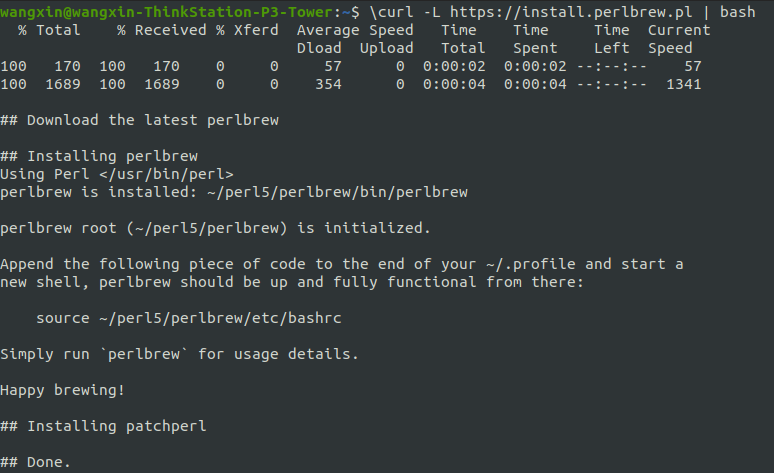

# MTK-Modem编译环境配置

<!-- SUPPLEMENTAL_BOUNDARY_START -->
## 使用边界

- 本页是补充资料或短专题，适合查局部步骤、旧来源和零散技巧。
- 若需要直接定位问题，优先回到对应主流程、配置方法、排障流程或 Case。
- 后续新增结论应沉淀到主文档，本页只保留来源和辅助说明。
<!-- SUPPLEMENTAL_BOUNDARY_END -->


## 阅读入口

- 本文是迁入/补充资料，先按本节入口定位，再看正文和来源记录。
- 可复用结论应沉淀到主流程/配置/排障/case；本文只保留溯源材料和操作细节。

## 定位入口

- 先切清模块边界：Android Framework、RIL、厂商服务、modem、配置资源。
- 再补齐代码路径、开关来源、log 关键字、编译产物和运行时验证方式。
- 本文图片已转成本地附件；非图片附件仍保留原 Outline 链接作为资料索引。

MTK modem 编译环境配置补充。

> 图片已保存为本地附件；非图片附件仍保留原 Outline 链接作为资料索引。

## 一、perl

1 . 安装perlbrew，可实现动态切换perl,打开终端并执行以下命令以安装perlbrew：

```java
\curl -L https://install.perlbrew.pl | bash
```

 

2 . 初始化perlbrew：

```java
echo 'source $HOME/perl5/perlbrew/etc/bashrc' >> ~/.bashrc
source ~/.bashrc
```

3 . 安装Perl 5.14.2：

```java
perlbrew install perl-5.14.2
```


> **信息**
> 需要外网，需要等很长时间
>


4 . 切换到Perl 5.14.2：

```java
perlbrew switch perl-5.14.2
```

5 . 验证版本：

```java
perl -v
```


> **提示**
> 如果有，前面几步不需要执行
>


6 . 使用cpan安装perl 模块

```java
sudo cpan File::Copy::Recursive XML::Parser XML::Simple
. ~/.bashrc
```


> **信息**
> 安装完成后,建议重新加载 Perl 环境
>


[Modem编译及IMEI和Barcode移植.ppt 726528](..\..\attachments\outline\files\c2c33ead-5efd-425a-83cc-b04adc00946c_Modem编译及IMEI和Barcode移植.ppt)

## 二、docker

1.安装

解压 docker1806ce-ubuntu16.rar

安装

```java
sudo dpkg -i *.deb
```

查看版本

```java
sudo docker --version
```

2.Ubuntu下docker使用非root权限运行docker

 将用户加入该 group 内

```java
sudo usermod -aG docker $USER
```

重启电脑

```java
sudo reboot
```

3.导入镜像：

解压rar

```java
rar x wangxiaoxi-docker-mtk-aosp.rar
```

 载入镜像

```java
docker load -i wangxiaoxi-docker-mtk-aosp.tar docker images
```

4.运行容器：

```java
docker run -idt -v /:/data/hosts -p 1111:22 --name kaios_container wangxiaoxi/mtk_aosp

docker run -idt -v /:/data/hosts
```

5.连接容器(编modem从这里开始)

```java
docker start docker ps -aq
ssh wangxiaoxi@localhost -p 1111
```


> **信息**
> 密码123
>


## 来源记录

- [MTK Modem编译环境配置](http://192.168.3.94:8888/doc/mtk-modem-5vKiBblL42) (`5vKiBblL42`)
