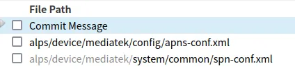
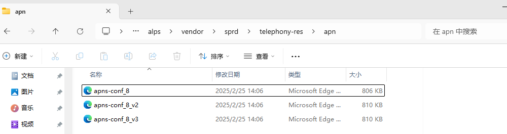
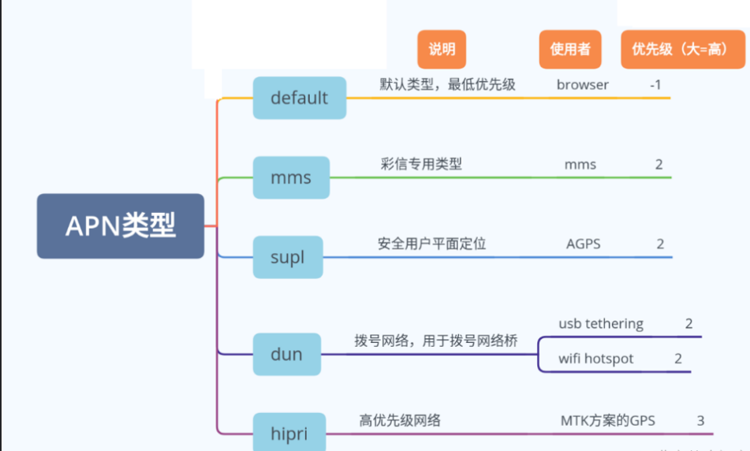
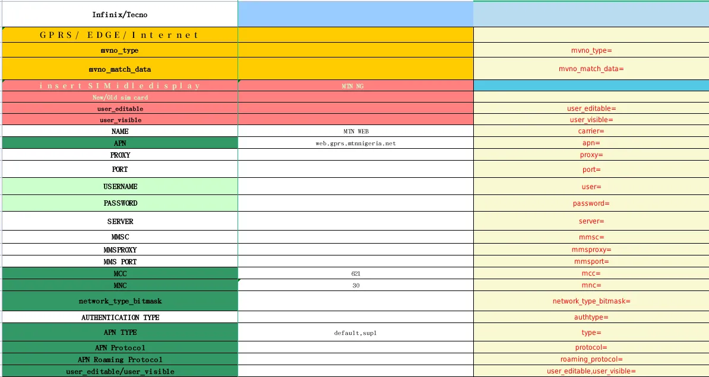

# APN配置方法

## 速查结论

- 配置问题先确认落点：AOSP 公共配置、厂商私有配置、MCC/MNC 运营商配置、SIM/卡槽维度、NV/系统属性/CarrierConfig。
- 定位时必须同时保留三类证据：配置文件、运行时 dump、log 中最终生效值。
- 本文图片已转成本地附件；非图片附件仍保留原 Outline 链接作为资料索引。

APN 配置字段、路径、平台差异和历史资料索引。

> 图片已保存为本地附件；非图片附件仍保留原 Outline 链接作为资料索引。


<!-- CONFIG_TEMPLATE_BLOCK_START -->
## 模板化定位

### 配置来源

| 来源 | 本文落点 | 运行时验证 |
|---|---|---|
| AOSP / 产品 APN 库 | `apns-conf.xml`、项目 overlay、运营商 APN 表 | `content://telephony/carriers`、APN UI、bugreport APN dump |
| CarrierConfig / APN 可见性 | APN type 隐藏、编辑限制、MMS/IMS/XCAP 相关开关 | `dumpsys carrier_config`、APN 列表是否显示目标 type |
| AP DataProfile | `DataProfileManager` 选择 IA APN 和业务 APN | RILJ `SET_INITIAL_ATTACH_APN`、`setupDataCall` |
| modem / 网络侧 | PDN Connectivity Request、ESM reject、default bearer | modem ESM/SM trace、APN/protocol/auth 字段 |

### 匹配与生效链路

```text
APN XML / database
-> TelephonyProvider 入库
-> DataProfileManager 按 APN type / carrier / roaming 选择
-> setInitialAttachApn 或 setupDataCall 下发
-> modem 发起 PDN / PDP
-> 网络接受或返回 ESM cause
```

### 平台差异

| 平台 | 重点看点 | 验证口径 |
|---|---|---|
| Android common | AOSP 公共 XML、Provider、framework 读取点 | 先证明 common 默认值和运行时 dump 是否一致 |
| UNISOC | carrier overlay、CarrierService、Operator NV、modem profile | 同时看 AP log、产物配置、NV/readback 和 modem trace |
| MTK | vendor/mediatek 私有配置、SBP/DSBP/CXP、NVRAM | 结合 debuglogger、ELT/MD log、AP dump 验证最终值 |
| Qualcomm | CarrierConfig overlay、MCFG/QCRIL、modem profile | 结合 dumpsys、QXDM/QCAT、MCFG 产物确认 |

### 验证命令与 log

| 目标 | 证据入口 | 预期结论 |
|---|---|---|
| 源配置存在 | apns-conf.xml / APN database / APN overlay | 能定位到需求字段、默认值和项目覆盖值 |
| 运行时 dump 生效 | content://telephony/carriers、APN UI、RILJ setupDataCall | 设备当前值与预期配置一致 |
| AP/vendor 已采用 | Telephony/RILJ/vendor service log | 能看到读取、选择、下发或业务判断动作 |
| modem/协议侧采用 | PDN Connectivity、ESM cause、DataCall profile | 协议字段、modem 状态或 reject cause 能与配置结果闭环 |

### 关联入口

| 入口 | 用途 |
|---|---|
| [配置目录 README](README.md) | 回到配置分类和放置规则 |
| [Case横向索引](../40_Case-Library/Case横向索引.md) | 查历史同类问题和第一坏点 |
| [平台代码入口](../50_Platform-Code/README.md) | 查厂商代码读取位置 |
| [常用命令](../70_Tools-Debug/Commands/常用命令.md) | 查 dumpsys、logcat 和 adb 命令 |

### 常见失败模式

| 现象 | 优先检查 | 第一坏点判断 |
|---|---|---|
| APN 看得见但连不上 | IA APN / data APN 是否同一个、protocol/auth 是否正确 | AP 已下发且 ESM reject 时，第一坏点通常在 APN/订阅/网络侧 |
| APN 配了但 UI 不显示 | APN type、CarrierConfig hide list、MVNO 匹配 | 入库失败或被 AP 策略过滤，不是 modem 问题 |
| IMS/MMS/XCAP 失败 | 是否使用了正确专用 APN | 默认 Internet APN 成功不代表专用 APN 成功 |
<!-- CONFIG_TEMPLATE_BLOCK_END -->
## 专题定位

APN 文档的主线只回答四件事：APN 从哪里入库、按什么条件被选中、下发给 RIL/modem 的是什么、网络侧接受还是拒绝。

历史截图、字段说明和旧资料保留在“迁入资料”区，后续可复用结论应逐步沉淀到模板化定位、常见失败模式或 Case。

## 主线速查

| 问题 | 优先入口 |
|---|---|
| APN 是否存在 | `apns-conf.xml`、TelephonyProvider 数据库、APN UI |
| APN 是否被选中 | APN type、MVNO 匹配、roaming、user_visible / user_editable |
| 是否下发 modem | RILJ `SET_INITIAL_ATTACH_APN`、`setupDataCall`、data profile |
| 网络是否接受 | PDN/PDP request、ESM/SM reject、MMS/IMS/XCAP 专用承载 |

## 迁入资料

以下内容来自历史资料迁入，适合查字段说明、旧路径、截图和案例线索；直接排障时优先使用上面的模板化定位。

### 简介

APN(Access Point Name)：即"接入点名称"，用来标识GPRS的业务种类，是通过手机上网时必须配置的一个参数，其决定了手机通过哪种接入方式来访问网络。

### 需求文档

目前无需我们维护相关需求文档

### 配置路径

#### MTK

APN 配置路径：alps/device/mediatek/config/apns-conf.xml

 

#### 展锐

APN 配置路径：

S之前：[vendor/sagereal/product/项目/default/apns_conf.xml](http://192.168.3.81:8085/gitweb?p=SPRD_R/MOCORDROIDR_Trunk_W20.36.4.git;a=commit;h=e4d8079e19fb1930dbea3ea176dff307907f4a4c)

S及之后：[alps/vendor/sprd/telephony-res/apn/apns-conf_8_v2.xml](http://192.168.3.81:8085/gitweb?p=SPRDROID13_MAIN_22C_W22.48.3_P4.git;a=commit;h=a564c0e97b23a183bc30739d344339068949cf47)

因为我们的代码分为vendor侧和system侧，在对apn进行修改时需确认好修改apn是在哪一侧修改
且目前我们修改apn的文件是`apns-conf_8_v3.xml`

 

### 参数含义

#### APN分类


1. Default APN --LTE Attach时需要携带给网络的APN类型
2. IMS APN --用于承载Volte业务的APN类型
3. SOS APN --用于承载LTE下紧急服务的APN类型
4. XCAP APN --用于承载附加业务通过UT服务的APN类型

#### `Account Type` 数字值和 Android `type` 字符串不要混用

从 CQWeb 历史问题 `SPCSS00746962` 看，部分 APN 需求表或功能机平台会使用 `Account Type` 数字值描述业务类型，例如：

| Account Type | 常见业务 | 说明 |
|---|---|---|
| `0` | default | 普通数据业务，LTE attach / 默认承载通常依赖该类 APN |
| `1` | mms | 彩信发送/接收使用的 APN |
| `5` | ims | VoLTE/IMS 注册使用的 APN |

注意这里的 `Account Type` 是表格或平台内部枚举，不能直接等同于 Android `apns-conf.xml` 里的 `type="default,mms,ims,xcap"` 字符串。做配置评审时要同时写清：

1. 需求表里的业务分类或 `Account Type`。
2. Android XML / 数据库里的 `type` 字符串。
3. AP 下发给 RIL 的 data profile / initial attach APN。
4. Modem NAS 里实际发起的是 default PDN、IMS PDN、MMS PDP 还是 XCAP 数据链路。

如果只说“APN type 配了 5”或“IMS APN 配了 default”，后续很容易把表格字段、Android 字段和 modem 承载类型混在一起。

#### 字段功能描述

> User：用户
>
> Password：密码
>
> Carrier：apn的名字，可为空，只用来显示apn列表中此apn的显示名字。
>
> Mcc：由三位数组成。 用于识别移动用户的所在国家;
>
> Mnc：由两位或三位组成。 用于识别移动用户的归属PLMN。 MNC的长度（两位或三位数）取决于MCC的值。
>
> Apn：APN网络标识（接入点名称），是APN参数中的必选组成部分。此标识由运营商分配。
>
> Proxy：代理服务器的地址
>
> Port：代理服务器的端口号
>
> Mmsc：MMS中继服务器/多媒体消息业务中心，是彩信的交换服务器。
>
> Mmsproxy：彩信代理服务器的地址
>
> Mmsport：彩信代理服务器的端口号
>
> Protocol：支持的协议，不配置默认为IPV4。
>
> Roaming_Protocol----漫游IP协议，有IP、IPV6、IPV4V6，不配置表示IP即IPV4
>
> Authtype：apn的认证协议，PAP为口令认证协议，是二次握手机制。CHAP是质询握手认证协议，是三次握手机制。表格中会有 NONE、 PAP、CHAP、PAP or CHAP，分别对应 xml authtype= 0、1、2、3
>
> Type: apn的接入点类型，有default、mms、supl、xcap、dun等
>
>  
>
> network_type_bitmask:网络类型掩码，若XML中未配置则默认为1|2|3|.....|17|19|20；不包含18那个，不配置18的话不支持vowifi
>
> mvno_type----虚拟网络运营商类型，有gid、spn、imsi
>
> mvno_match_data----mvno_type对应的value
>
> user_editable----在APN菜单中可编辑
>
> user_visible----在APN菜单中可见

#### 字段与需求表对应关系（`未配置字段值则采用 TelephonyProvider.java 中设置的默认值`）

 

### 如何验证

#### 插白卡

用白卡写 mccmnc 及虚拟运营商 spn，查看设置中的插卡名称及接入点配置。白卡验证类型为 spn 的虚拟运营时，写卡时，需要写 spn 名称，白卡验证类型为 imsi 的虚拟运营时，写卡时，需要写匹配的 imsi。

测试局限：隐藏显示的 apn 无法看到。

适合场景：apn 参数更新量少的情况。

#### Pull文件

**1、adb pull product/etc/apns-conf.xml**


**2、adb pull /data/user_de/0/com.android.providers.telephony**


#### 自动化工具

### 加载流程

#### 配置的xml是如何生效的？

> 设备开机后，终端启动phone进程，会加载运行在phone进程中的telephonyprovider负责解析apns-config.xml文件，将其中定义的APN参数写入到数据库中。
>
> 设备插入SIM后，设置菜单中会显示该SIM卡对应的APN菜单。这部分在ApnSettings.java中的fillList方法实现的。该方法主要根据SIM卡的mcc，mnc去查询db并将APN填入菜单中。


#### 如何做到不同卡能匹配上对应APN？（匹配逻辑）

> mcc，mnc匹配


#### 虚拟运营商APN配置规则？

> MTK：
>
> <https://online.mediatek.com/apps/faq/detail?faqid=FAQ09811&list=SW>
>
> 根据 mvno_type 的类型配置对应的 xml，mvno_type 为 spn 、imsi 、pnn 、gid 时，分别对应 virtual-spn-conf-by-efspn.xml 、virtual-spn-conf-by-imsi.xml 、virtual-spn-conf-by-efpnn.xml 、virtual-spn-conf-by-efgid1.xml
>
> 对应路径：alps/device/mediatek/common/telephony/etc/
>
> 展锐：
>
> 根据 mvno_type ，mvno_match_data 自动适配虚拟运营商，无需再额外配置。


#### 设置下的显示逻辑是什么样的？

> alps/packages/apps/Settings/src/com/android/settings/network/apn/ApnSettings.java
>
> onCreate()变量初始化

```javascript
@Override
    public void onCreate(Bundle icicle) {
        super.onCreate(icicle);
        final Activity activity = getActivity();
        mSubId = activity.getIntent().getIntExtra(SUB_ID,
                SubscriptionManager.INVALID_SUBSCRIPTION_ID);
        mPreferredApnRepository = new PreferredApnRepository(activity, mSubId);
        mSelectPreferredApnParam = new SelectPreferredApnParam(activity, mSubId,
                mPreferredApnRepository);
        mSelectPreferredApnParam.addSimStateChangeListener(getLifecycle());

        setIfOnlyAvailableForAdmins(true);

        final CarrierConfigManager configManager = (CarrierConfigManager)
                getSystemService(Context.CARRIER_CONFIG_SERVICE);
        final PersistableBundle b = configManager.getConfigForSubId(mSubId);
        mHideImsApn = b.getBoolean(CarrierConfigManager.KEY_HIDE_IMS_APN_BOOL);
        mAllowAddingApns = b.getBoolean(CarrierConfigManager.KEY_ALLOW_ADDING_APNS_BOOL);
        if (mAllowAddingApns) {
            final String[] readOnlyApnTypes = b.getStringArray(
                    CarrierConfigManager.KEY_READ_ONLY_APN_TYPES_STRING_ARRAY);
            // if no apn type can be edited, do not allow adding APNs
            if (ApnEditor.hasAllApns(readOnlyApnTypes)) {
                Log.d(TAG, "not allowing adding APN because all APN types are read only");
                mAllowAddingApns = false;
            }
        }
        mHidePresetApnDetails = b.getBoolean(CarrierConfigManager.KEY_HIDE_PRESET_APN_DETAILS_BOOL);
        mUserManager = UserManager.get(activity);

        mBroadcastReceiverChanged = new BroadcastReceiverChanged(getContext(), this);
        mBroadcastReceiverChanged.start();
    }
```

> onActivityCreated中设置布局文件

```javascript
Override
    public void onActivityCreated(Bundle savedInstanceState) {
        super.onActivityCreated(savedInstanceState);

        getEmptyTextView().setText(com.android.settingslib.R.string.apn_settings_not_available);
        mUnavailable = isUiRestricted();
        setHasOptionsMenu(!mUnavailable);
        if (mUnavailable) {
            addPreferencesFromResource(R.xml.placeholder_prefs);
            return;
        }

        addPreferencesFromResource(R.xml.apn_settings);
    }
```

> onResume注册监听并填充list

```javascript
@Override
    public void onResume() {
        super.onResume();

        if (mUnavailable) {
            return;
        }

        /* UNISOC: add for bug709449 @{ */
        if(mDialog != null && mDialog.isShowing() && !mRestoreDefaultApnMode) {
            removeDialog(DIALOG_RESTORE_DEFAULTAPN);
            mDialog = null;
        }
        /* @} */

        if (!mRestoreDefaultApnMode) {
            fillList();
        }
    }
```

> fillList填充

```javascript
private void fillList() {
        final Uri simApnUri = Uri.withAppendedPath(Telephony.Carriers.SIM_APN_URI,
                String.valueOf(mSubId));
        final StringBuilder where =
                new StringBuilder("NOT (type='ia' AND (apn=\"\" OR apn IS NULL)) AND "
                + "user_visible!=0");
        // Remove Emergency type, users should not mess with that
        where.append(" AND NOT (type='emergency')");

        if (mHideImsApn) {
            where.append(" AND NOT (type='ims')");
        }

        final Cursor cursor = getContentResolver().query(simApnUri,
                CARRIERS_PROJECTION, where.toString(), null,
                BaseColumns._ID);/*UNISOC: Bug 594919 set default APN*/

        if (cursor != null) {
            final PreferenceGroup apnPrefList = findPreference(APN_LIST);
            apnPrefList.removeAll();

            final ArrayList<ApnPreference> apnList = new ArrayList<ApnPreference>();
            final ArrayList<ApnPreference> mmsApnList = new ArrayList<ApnPreference>();

            cursor.moveToFirst();
            while (!cursor.isAfterLast()) {
                final String name = cursor.getString(NAME_INDEX);
                final String apn = cursor.getString(APN_INDEX);
                final String key = cursor.getString(ID_INDEX);
                final String type = cursor.getString(TYPES_INDEX);
                final int edited = cursor.getInt(EDITED_INDEX);
                mMvnoType = cursor.getString(MVNO_TYPE_INDEX);
                mMvnoMatchData = cursor.getString(MVNO_MATCH_DATA_INDEX);

                final ApnPreference pref = new ApnPreference(getPrefContext());

                pref.setKey(key);
                pref.setTitle(name);
                pref.setPersistent(false);
                pref.setOnPreferenceChangeListener(this);
                pref.setSubId(mSubId);
                if (mHidePresetApnDetails && edited == Telephony.Carriers.UNEDITED) {
                    pref.setHideDetails();
                } else {
                    pref.setSummary(apn);
                }

                /* UNISOC: bug #792349 @{ */
                final boolean defaultSelectable =
                        ((type == null) || type.contains(ApnSetting.TYPE_DEFAULT_STRING)
                        || (type.equals("*")) || (type.isEmpty()));
                /* @} */
                pref.setDefaultSelectable(defaultSelectable);
                if (mSelectPreferredApnParam.isAddApnNeeded(type, apn)) {
                    if (defaultSelectable) {
                        pref.setIsChecked(key.equals(mPreferredApnKey));
                        apnList.add(pref);
                    } else {
                        mmsApnList.add(pref);
                    }
                }
                cursor.moveToNext();
            }
            cursor.close();

            for (Preference preference : apnList) {
                /* UNISOC: bug 2664340 set default APN selected @{ */
                mSelectPreferredApnParam.setSelectedApnKeyChecked(preference);
                /* @} */
                apnPrefList.addPreference(preference);
            }
            for (Preference preference : mmsApnList) {
                apnPrefList.addPreference(preference);
            }
        }
    }
```


#### APN的使用场景是？

> 可以通过apn的type来分析apn的使用场景，包括彩信，xcap，ims，sos等，选择网络的接入方式，如果配置中只配置了type的部分，那么也只支持相应的type业务。type为空则默认全部支持


#### 为什么PDN中能加载到APN配置？

### 常见问题

#### 缺少对应APN会怎么样？（分type讨论）

> 缺少ims apn，导致无法注册ims/volte


#### 什么样的问题会排查APN配置？

> 数据网络业务不支持时，检查配置文件中测试卡对应 plmn 的 APN type 中是否包含 default 类型。
>
> 彩信业务不支持时，检查配置文件中测试卡对应 plmn 的 APN type 中是否包含 mms 类型。
>
> UT 补充业务不支持时，检查配置文件中测试卡对应 plmn 的 APN type 字段是否包含 xcap 类型。


#### APN中某个参数配置错误会怎么样？（分字段讨论）

> mcc、mnc：配置错误，会导致读取不到对应的配置，apn接入失败
>
> type：配置错误会导致与运营商需求不符，导致该支持的业务不支持
>
> protocol：配置错误会导致与需求配置不符，
>
> apn接入点名称：配置错误，设备无法正确识别要连接的目标接入点。手机可能会显示 "无法连接到网络" 或 "找不到可用的接入点" 等提示。即便能搜索到网络信号，也无法建立有效的数据连接，像无法打开网页、不能收发彩信等，因为设备无法依据错误的 APN 名称找到正确的网络接入路径。
>
> username和password：部分apn需要输入username和password进行身份验证，如果输入错误，也会导致apn无法接入

#### 错误 APN 触发 PDN/PDP reject 怎么看

从 CQWeb 历史问题 `SPCSS01428658` 看，测试方手动创建错误 APN 后，设备在 LTE 上可能收到 `PDN connectivity reject`，回落到 3G 后也可能收到 `Activate PDP context Reject`。此时要先确认 reject cause，而不是把现象笼统归为“注册不上”。

| reject cause | 常见含义 | APN侧检查 |
|---|---|---|
| `#27 missing or unknown APN` | 网络不认识该 APN | APN 名称/DNN 是否与运营商签约一致 |
| `#29 user authentication failed` | 用户名、密码或认证方式失败 | `username`、`password`、`authtype` |
| `#33 requested service option not subscribed` | 请求业务未签约 | APN 类型、签约范围、测试卡能力 |

排查顺序：

1. 确认 APN profile 是否为用户手动新增、OTA/OMA-CP 下发，还是预置 APN。
2. 对齐 AP log 的 `SETUP_DATA_CALL` / `DataCallResponse` 与 modem NAS 的 `PDN CONNECTIVITY REQUEST/REJECT`。
3. 如果 LTE reject 后进入 3G PDP 激活流程，继续看 `Activate PDP context Request/Reject` 和 SM cause。
4. 修改回正确 APN 后复测 data call 是否成功；成功后再判断是否需要触发 RAU/TAU 或重新建链。

#### APN type 已配置但设置中不显示

从 CQWeb 历史问题 `SPCSS01052197` 看，`apn type` 中添加 `xcap` 后不显示，不一定是 APN XML 未生效，也可能是 CarrierConfig 隐藏列表过滤。

重点检查：

```text
vendor/sprd/platform/frameworks/uniframework/base/telephony/java/android/telephony/UniCarrierConfigManager.java
KEY_HIDE_APN_TYPE_STRING_ARRAY
```

排查顺序：

1. 确认 `apns-conf_*.xml` 里目标 APN `type` 已包含 `xcap`。
2. 拉取 telephony provider 数据库，确认 APN 已写入。
3. `adb shell dumpsys carrier_config` 查看 APN type 隐藏列表。
4. 如需在设置中显示 `xcap`，从隐藏列表或运营商覆盖配置中移除。

#### AT+CGDCONT 修改 APN 后是否会自动重建 PDN？

从 CQWeb 历史问题 `SPCSS01656937` 看，`AT+CGDCONT` 只定义 PDP context/APN 参数，不负责自动释放并重建已有 PDN。若需求是“APN 变更后重新按新 APN 建链”，脚本应显式执行去激活、改 APN、重新激活。

推荐步骤：

```text
AT+CGACT?          // 查询当前激活 cid
AT+CGACT=0,<cid>   // 去激活当前数据连接，触发 PDN DISCONNECT REQUEST
AT+CGDCONT=<cid>,"IP","APN_2"
AT+CGACT=1,<cid>   // 重新激活，建立新 PDN
```

如果测试规范要求 detach/attach，而不是单独 PDN disconnect，可在去激活后增加：

```text
AT+CFUN=0
AT+CFUN=1
```

注意：不要把 `CGDCONT` 包装成隐式断链重链接口，否则 AT 语义会和标准流程混在一起，后续自动化也难判断到底验证的是 APN 定义、PDN disconnect 还是 detach。

#### APN `type=wap` 显示为空是否正常？

从 CQWeb 历史问题 `SPCSS01460052` 看，`wap` 不属于 Android 原生 APN type 枚举，因此在 APN type 一栏显示为空属于正常现象。这里要区分：

| 字段 | 含义 |
|---|---|
| `apn="wap"` | 接入点名称，可以按运营商资料配置 |
| `type="wap"` | 业务类型；若不是系统支持的标准 type，Settings 不会按标准类型展示 |

处理建议：如果运营商资料写的是 WAP 接入点，通常应放在 `apn` 名称或 profile 名称中；如果要承载数据/MMS/补充业务，需要映射到 Android 支持的标准 `type`，如 `default`、`mms`、`supl`、`dun`、`ims`、`xcap` 等。

#### OTA 后默认 APN 顺序异常

从 CQWeb 历史问题 `SPCSS01005351` 看，OTA 前用户新增了无效 APN，OTA 后如果该无效 APN 成为默认 APN，可能导致依赖默认 APN 选择的业务异常。`apns-conf.xml` 中的数据会导入 `telephony.db` 的 `carriers` 表，历史用户 APN 与新版本预置 APN 合并时，需要关注排序和默认选择。

排查顺序：

1. OTA 前后分别导出 `telephony.db` 的 `carriers` 表。
2. 确认用户新增 APN、系统预置 APN 的 `_id`、`edited`、`current`、`type`、`carrier_enabled`。
3. 看默认 APN 是否被无效 APN 抢占。
4. 必要时 OTA 后重排 APN，让系统预置可用 APN 优先，用户新增 APN 后置。

#### OMA-CP APN 是否替换原始默认 APN

从 CQWeb 历史问题 `SPCSS01069472` 看，运营商要求 OMA-CP 下发的 `default` 类型 APN 替换原始默认 APN 时，默认行为可能只是新增一条 APN，并保留原来的预置 APN。若需求明确是“安装 INTERNET APN 后替换 Play Internet 默认 APN”，需要实现删除或停用原始 APN 的逻辑，而不是只依赖 APN 插入。

排查顺序：

1. OTA/OMA-CP 前后分别导出 `telephony.db` 中目标 MCC/MNC 的 APN 记录。
2. 确认 OMA-CP 新增 APN 的 `type` 是否包含 `default`，`carrier_enabled` 是否为 1。
3. 确认原始默认 APN 是否仍存在并仍被选中。
4. 若运营商要求替换，需在插入新 APN 后删除、禁用或重排原始 APN，并验证首选 APN 指针是否更新。

记录证据：

```text
原始 APN：carrier / apn / type / edited / current
OMA-CP APN：carrier / apn / type / edited / current
preferred APN：subId / apn_id
```

#### MMS 发送失败时先确认彩信 APN

从 CQWeb 历史问题 `SPCSS01232418` 看，MMS 界面报 `Send failed, user not found` 不一定是号码或联系人问题，也可能是彩信发送时选错 APN。该案例中 MMS PDP 激活使用 `hos`，但实际 PDP info 指向 internet APN，随后 HTTP POST 阶段地址解析失败。

关键日志：

```text
MMIAPIPDP_Active: priority:3, app_handler:0x6, apn:hos
RequestPdpId: pdp_id=1, setting_item_ptr=hos,
  pdp_info=internet.telekom.mnc030.mcc216.gprs.
MMS_PARSE: MmsLibHttpPostCnf, address unresolved!
MMS_PARSE: SendRecvFail, send mms error!
```

排查顺序：

1. 确认目标 MCC/MNC 的 APN 是否存在独立 MMS profile。
2. 检查 MMS profile 是否包含 `type=mms`，并配置正确 `mmsc`、`mmsproxy`、`mmsport`。
3. 看 PDP 激活日志里实际使用的 APN 是否为 MMS APN，而不是 default internet APN。
4. 如果普通数据可用但 MMS 失败，优先按 MMS APN / MMSC / proxy / DNS 路由排查。

#### PDN reject 是默认承载还是业务 APN 要先分清

从 CQWeb 索引里的 `SPCSS00802601` / `SPCSS00814493` 看，GCF/运营商测试里经常出现 `PDN Connectivity Reject on IMS APN`，典型 ESM cause 是 `#27 missing or unknown APN`。这类问题不要直接归到“LTE 注册失败”：如果 attach 和 default bearer 已成功，只是 IMS PDN 被拒，第一坏点应回到 IMS APN 名称、运营商签约、测试规范和网络侧 APN profile。

分层口径：

| 现象 | 优先归类 | 检查重点 |
|---|---|---|
| Attach 阶段默认 PDN 被拒 | Registration / Data 边界 | initial attach APN、default APN、签约、ESM cause |
| Attach 成功后 IMS PDN 被拒 | APN / IMS 前置数据链路 | `type=ims`、P-CSCF、签约、ESM cause |
| MMS 发送时 PDP/PDN 被拒 | MMS / APN | `type=mms`、MMSC、proxy、MMS APN 是否被选中 |
| XCAP/UT 数据链路失败 | SS / APN | `type=xcap`、XCAP APN、URL、GBA/BSF/NAF |

记录结论时至少保留：

```text
PDN purpose: default / ims / mms / xcap
APN name:
PDN type: IPv4 / IPv6 / IPv4v6
ESM/SM cause:
Attach/default bearer state:
```

## APN参数

[全球SPRD IMS参数表2025.6.17.xlsx 2222402](..\attachments\outline\files\6c5e68db-b52e-470d-8103-f3306f8e48ce_全球SPRD IMS参数表2025.6.17.xlsx)

[全球APN归档参数表（MTK IMS参数）2025.6.17.xlsx 2459501](..\attachments\outline\files\c3491234-2b6e-4752-b87f-37273046296b_全球APN归档参数表（MTK IMS参数）2025.6.17.xlsx)

## 来源记录

本节只保留来源入口；可复用结论应回填到主线速查、常见失败模式或 Case。

- [APN配置](http://192.168.3.94:8888/doc/apn-bbvWSaFWEO) (`bbvWSaFWEO`)
- [APN参数](http://192.168.3.94:8888/doc/apn-A3FatRwnyR) (`A3FatRwnyR`)
- CQWeb `SPCSS00746962`：APN `Account Type` 数字枚举与 default/mms/ims 业务类型。
- CQWeb `SPCSS00802601` / `SPCSS00814493`：IMS APN `missing or unknown APN` 的 PDN reject 分层口径。
