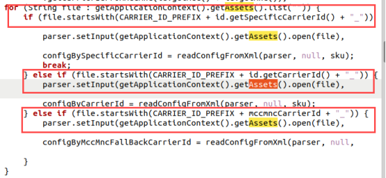
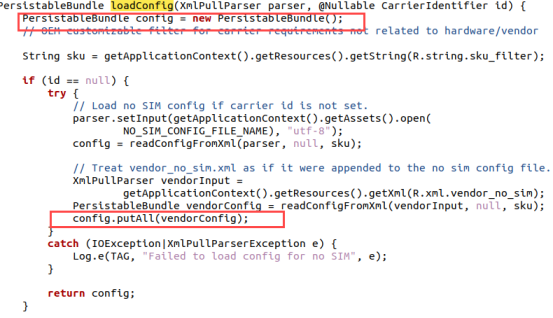
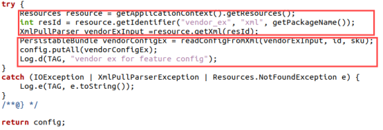
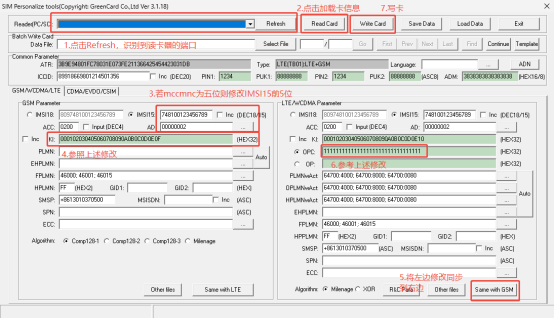
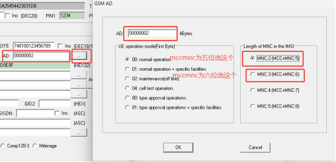

# CarrierConfig配置方法

## 速查结论

- 配置问题先确认落点：AOSP 公共配置、厂商私有配置、MCC/MNC 运营商配置、SIM/卡槽维度、NV/系统属性/CarrierConfig。
- 定位时必须同时保留三类证据：配置文件、运行时 dump、log 中最终生效值。
- 本文图片已转成本地附件；非图片附件仍保留原 Outline 链接作为资料索引。

CarrierConfig / CarrierSettings 配置和架构资料。

> 图片已保存为本地附件；非图片附件仍保留原 Outline 链接作为资料索引。

参数映射入口：[[CarrierConfig参数映射]]

相关流程：[[UNISOC-CarrierService启动与CarrierConfig加载流程]]


<!-- CONFIG_TEMPLATE_BLOCK_START -->
## 模板化定位

### 配置来源

| 来源 | 本文落点 | 运行时验证 |
|---|---|---|
| AOSP 默认配置 | `packages/apps/CarrierConfig` 默认 XML | `dumpsys carrier_config` 默认值 |
| 厂商 / 项目 overlay | `vendor/*/overlays/packages/apps/CarrierConfig` | 产物中 XML、overlay 是否打入 |
| CarrierService | `CarrierConfigLoader` 绑定默认包或 carrier app | `CarrierConfigLoader` log、bind/fetch 结果 |
| 临时 override | `overrideConfig()`、测试命令 | `dumpsys carrier_config` 是否出现 override 值 |

### 匹配与生效链路

```text
SIM / carrier id / MCCMNC / GID / SPN
-> CarrierConfigLoader.updateConfigForPhoneId
-> bindToConfigPackage / CarrierService.onLoadConfig
-> PersistableBundle 合并
-> Telephony / Data / IMS / UI 模块读取
```

### 平台差异

| 平台 | 重点看点 | 验证口径 |
|---|---|---|
| Android common | AOSP 公共 XML、Provider、framework 读取点 | 先证明 common 默认值和运行时 dump 是否一致 |
| UNISOC | carrier overlay、CarrierService、Operator NV、modem profile | 同时看 AP log、产物配置、NV/readback 和 modem trace |
| MTK | vendor/mediatek 私有配置、SBP/DSBP/CXP、NVRAM | 结合 debuglogger、ELT/MD log、AP dump 验证最终值 |
| Qualcomm | CarrierConfig overlay、MCFG/QCRIL、modem profile | 结合 dumpsys、QXDM/QCAT、MCFG 产物确认 |

### 验证命令与 log

| 目标 | 证据入口 | 预期结论 |
|---|---|---|
| 源配置存在 | CarrierConfig XML / overlay / CarrierService | 能定位到需求字段、默认值和项目覆盖值 |
| 运行时 dump 生效 | dumpsys carrier_config、CarrierConfigLoader log | 设备当前值与预期配置一致 |
| AP/vendor 已采用 | Telephony/RILJ/vendor service log | 能看到读取、选择、下发或业务判断动作 |
| modem/协议侧采用 | 读取方业务 log，必要时结合 IMS/Data/Call trace | 协议字段、modem 状态或 reject cause 能与配置结果闭环 |

### 关联入口

| 入口 | 用途 |
|---|---|
| [配置目录 README](README.md) | 回到配置分类和放置规则 |
| [Case横向索引](../40_Case-Library/Case横向索引.md) | 查历史同类问题和第一坏点 |
| [平台代码入口](../50_Platform-Code/README.md) | 查厂商代码读取位置 |
| [常用命令](../70_Tools-Debug/Commands/常用命令.md) | 查 dumpsys、logcat 和 adb 命令 |

### 常见失败模式

| 现象 | 优先检查 | 第一坏点判断 |
|---|---|---|
| XML 已改但 dump 不变 | overlay 是否进产物、carrier id 是否命中、是否被 override 覆盖 | 源配置未进入运行时 bundle |
| dump 正确但业务不变 | 消费方是否读取该 key，是否还有厂商私有开关 | 第一坏点在读取链路或私有配置优先级 |
| 换卡后仍旧值 | SIM 状态触发、缓存、subId/phoneId 映射 | 配置刷新或卡槽映射问题 |
<!-- CONFIG_TEMPLATE_BLOCK_END -->
## **1、简介**

CarrierConfig（运营商配置）有一些项目会叫CarrierSettings，首次出现是在Android 6.0 版本中，此机制的出现就是为运营商配置定制的功能。让我们可以弃用静态配置叠加层，通过使用配置文件和指定接口向相应平台动态提供运营商配置。可配置的模块很多，如，漫游/非漫游网络、可视语音信箱、短信/彩信网络设置、VoLTE/即时通讯配置等。

CarrierConfig和Settings、CellBroadcastReceiver一样，都在packages的apps中都属于系统应用。

一般情况下，我们根据运营商id或mccmnc来定位需要修改的配置文件，然后按照需求进行配置的修改。

## **2、需求文档**

[IMS Requirements for Region_v19.6_20241113.xlsx 154686](..\attachments\outline\files\ace56609-5b78-4860-bd95-36e2a01ad99e_IMS Requirements for Region_v19.6_20241113.xlsx)

## **3、配置路径**

vendor厂商配置文件优先级高于AOSP默认配置文件

### MTK

carrier_config_carrierid_x(Carrier-ID)_xx(operator name)：
/alps/vendor/mediatek/proprietary/packages/apps/CarrierConfig/assets

carrier_config_mccmnc_xx(mccmnc value)：

/alps/vendor/mediatek/proprietary/packages/apps/CarrierConfig/assets

vendor_ex.xml：

/alps/vendor/mediatek/proprietary/packages/apps/CarrierConfig/res/xml

### 展锐

carrier_config_carrierid_x(Carrier-ID)_xx(operator name)：
/SPRDROID13_VND_RLS_23A/system/A15/alps/vendor/sprd/platform/packages/apps/CarrierConfig/assets

carrier_config_mccmnc_xx(mccmnc value)：

/SPRDROID13_VND_RLS_23A/system/A15/alps/vendor/sprd/platform/packages/apps/CarrierConfig/assets

vendor_ex.xml：

/SPRDROID13_VND_RLS_23A/system/A15/alps/vendor/sprd/platform/packages/apps/CarrierConfig/res/xml

## **4、配置说明**

### 优先级/配置文件选择

DefaultCarrierConfigService.java介绍了各配置文件的优先级

通过遍历assets目录，按SpecificCarrierId>CarrierId>mccmncCarrierId优先级依次查找对应配置文件。即优先使用 Specific Carrier ID（针对 MVNO 或子运营商），其次是通用 Carrier ID，最后是 MCC+MNC 回退的 Carrier ID

 

但是存在配置覆盖的现象，当所有运营商配置加载完成后，随后强制合并平台方的配置文件，并覆盖同名属性的配置。先加载vendor.xml，后加载vendor_ex.xml

// 1. 先加载 assets/ 中的配置（CarrierID/MCCMNC）和 vendor.xml

 

//最后加载 vendor_ex.xml。先通过id查找vendor_ex.xml，然后解析vendor_ex.xml并合并到config，覆盖所有同名配置项

 

### 运营商配置要求

carrier_config_carrierid_xx_xx.xml：

<carrier_config>

   <boolean name="carrier_wfc_ims_available_bool" value="true"/>

   <int name="carrier_default_wfc_ims_mode_int" value="1"/>

   <string name="key_oem_pref_network_mode">1,0,0,1,1,1</string>

</carrier_config>

carrier_config_mccmnc_xx.xml：与上面格式一致

### `key_oem_pref_network_mode` 注意事项

`key_oem_pref_network_mode` 不只是控制 Settings 下可见的网络模式。部分项目逻辑会在首次插卡或 CarrierConfig 更新后，调用 `updateOemAllowedNetworkMode()` 并触发 `TelephonyManager.setPreferredNetworkType()`，最终下发 modem workmode。

典型影响链路：

```text
key_oem_pref_network_mode
-> updateOemAllowedNetworkMode()
-> setPreferredNetworkType()
-> AT+SPTESTMODEM
-> UECapabilityInformation 中 RAT 能力变化
```

如果配置为只允许 4G/3G，后续 LTE 能力上报可能不再携带 GSM/2G。遇到运营商实验室反馈 UE Capability 不符合预期时，要同时查 CarrierConfig、`AT+SPTESTMODEM` 和空口 `UECapabilityInformation`。

参考案例：[[../40_Case-Library/Registration/2025-07-16_Registration_UNISOC_UECapability缺少2G能力_网络模式客制化]]。


### vendor(同vendor_ex)配置要求

carrier_config_list中包含所有运营商的配置，若需修改配置请在指定mccmnc下完成

格式如下：

<carrier_config_list>

   <carrier_config mcc="xxx(国家码)" mnc="xx(网络码)">

   <boolean name="属性名" value="true or false(bool类型)" />

   <int name="属性名" value="0,1,2...(数值型数据)" />

   </carrier_config>

...

</carrier_config_list>

Ex：

<carrier_config_list>

   <carrier_config mcc="259" mnc="15">

   <boolean name="carrier_volte_available_bool" value="true" />

   <int name="carrier_default_wfc_ims_mode_int" value="1" />

   </carrier_config>

...

</carrier_config_list>

### 新建XML配置文件

**MTK**

建议使用MTK MCF Tool工具创建，详细操作步骤如下：
[MCF TOOL使用说明](http://192.168.3.94:8888/doc/mcf-tool-VceB7oPtEp)

**展锐**

参考其它运营商文件格式(命名格式和内容格式)，新建一个xml文件

### 参数功能介绍

参数含义、默认值和平台覆盖情况统一维护在 [CarrierConfig参数映射](CarrierConfig参数映射.md)。修改前先确认目标 key 存在于当前分支 `CarrierConfigManager.java`，再确认运营商 XML 匹配条件和运行时 `dumpsys carrier_config` 生效值。


### 自定义键值对如何


## 5、如何验证

### 写白卡要求

GRSIMWrite------用于修改白卡MCCMNC、SPN、ICCID等

工具路径：\\\\\\\\192.168.3.127\\127\\13_Test\\02_Tools\\01-common\\01-MCCMNC写卡软件

 

 

### 查看菜单

不同配置菜单对应位置

例如ims相关配置可在以下路径验证：设置--网络--sim。在该页面下会显示volte、vowifi、vilte等选项

### ADB命令读取

所有值通过CarrierConfigManager读取

查看sim对业务的支持状态：adb shell dumpsys carrier_config

查看sim指定业务的支持状态：adb shell dumpsys carrier_config | grep "业务属性名"

### 卡模拟


## 6、常见问题

### 加载慢问题


### 对应KEY逻辑位置整理

[CC键值对逻辑整理](http://192.168.3.94:8888/doc/cc-wzlRpYy4TR)

## 7、历史问题速查

| 场景 | 关键配置/代码 | 排查点 |
|---|---|---|
| 手动选网成功后是否回自动模式 | `oem_key_restore_auto_mode` | `false` 保持手动；`true` 成功后返回自动模式 |
| 手动选网失败后是否回自动模式 | `oem_key_permanent_auto_sel_mode_bool` | `true` 失败后返回自动模式；`false` 失败后保持手动 |
| 手动选网失败弹框 | `mShowNetworkSelectionFailed` | 可能拦截自动回网分支，需结合 `NetworkSelectSettings.java` 验证 |
| APN type 不显示 | `KEY_HIDE_APN_TYPE_STRING_ARRAY` | APN XML 已写入也可能被隐藏列表过滤 |
| MMS 大小限制 | `KEY_MMS_MAX_MESSAGE_SIZE_INT` | 优先按 MCC/MNC 在 CarrierConfig 覆盖，不建议改全局默认值 |

相关案例：

- [[../40_Case-Library/Registration/2024-06-24_Registration_UNISOC_手动选网CarrierConfig策略]]
- [[../40_Case-Library/Data/2022-10-31_Data_UNISOC_APN_XCAP类型被隐藏]]
- [[../40_Case-Library/Data/2024-11-13_Data_UNISOC_MMS大小限制CarrierConfig]]

## 来源记录

- [CarrierConfig配置](http://192.168.3.94:8888/doc/carrierconfig-Q1I6HioHAA) (`Q1I6HioHAA`)
- [CarrierConfig架构](http://192.168.3.94:8888/doc/carrierconfig-O1eCwlVdF9) (`O1eCwlVdF9`)
- [CarrierSettings的配置](http://192.168.3.94:8888/doc/carriersettings-RD3NZCYel6) (`RD3NZCYel6`)
- [CC键值对逻辑整理](http://192.168.3.94:8888/doc/cc-wzlRpYy4TR) (`wzlRpYy4TR`)
