# ECC配置方法

## 速查结论

- 配置问题先确认落点：AOSP 公共配置、厂商私有配置、MCC/MNC 运营商配置、SIM/卡槽维度、NV/系统属性/CarrierConfig。
- 定位时必须同时保留三类证据：配置文件、运行时 dump、log 中最终生效值。
- 本文图片已转成本地附件；非图片附件仍保留原 Outline 链接作为资料索引。

紧急号码来源、MTK/UNISOC EccList 配置和参数资料。

> 图片已保存为本地附件；非图片附件仍保留原 Outline 链接作为资料索引。


<!-- CONFIG_TEMPLATE_BLOCK_START -->
## 模板化定位

### 配置来源

| 来源 | 本文落点 | 运行时验证 |
|---|---|---|
| SIM / 网络 | EF_ECC、网络下发 emergency number | radio log、EmergencyNumberTracker dump |
| 本地号码库 | AOSP / 厂商 ECC database、`eccdata` | emergency number list、拨号前号码分类 |
| CarrierConfig / 客制化 | category、URN、routing、fallback、card condition | `dumpsys carrier_config`、Dialer/Telecom log |
| modem / 域选 | CS / IMS emergency、CSFB/EPSFB、无卡拨号路径 | NAS/RRC/CC/SIP trace |

### 匹配与生效链路

```text
SIM / network / local ECC source
-> EmergencyNumberTracker 合并号码池
-> Dialer / Telecom 判断紧急号码
-> domain selection 选择 CS / IMS / fallback
-> RIL / modem 发起紧急呼叫
```

### 平台差异

| 平台 | 重点看点 | 验证口径 |
|---|---|---|
| Android common | AOSP 公共 XML、Provider、framework 读取点 | 先证明 common 默认值和运行时 dump 是否一致 |
| UNISOC | carrier overlay、CarrierService、Operator NV、modem profile | 同时看 AP log、产物配置、NV/readback 和 modem trace |
| MTK | vendor/mediatek 私有配置、SBP/DSBP/CXP、NVRAM | 结合 debuglogger、ELT/MD log、AP dump 验证最终值 |
| Qualcomm | CarrierConfig overlay、MCFG/QCRIL、modem profile | 结合 dumpsys、QXDM/QCAT、MCFG 产物确认 |

### 验证命令与 log

| 目标 | 证据入口 | 预期结论 |
|---|---|---|
| 源配置存在 | EF_ECC / ECC database / CarrierConfig / vendor EccList | 能定位到需求字段、默认值和项目覆盖值 |
| 运行时 dump 生效 | EmergencyNumberTracker、Telecom/Dialer log | 设备当前值与预期配置一致 |
| AP/vendor 已采用 | Telephony/RILJ/vendor service log | 能看到读取、选择、下发或业务判断动作 |
| modem/协议侧采用 | emergency call routing、CS/IMS emergency trace | 协议字段、modem 状态或 reject cause 能与配置结果闭环 |

### 关联入口

| 入口 | 用途 |
|---|---|
| [配置目录 README](README.md) | 回到配置分类和放置规则 |
| [Case横向索引](../40_Case-Library/Case横向索引.md) | 查历史同类问题和第一坏点 |
| [平台代码入口](../50_Platform-Code/README.md) | 查厂商代码读取位置 |
| [常用命令](../70_Tools-Debug/Commands/常用命令.md) | 查 dumpsys、logcat 和 adb 命令 |

### 常见失败模式

| 现象 | 优先检查 | 第一坏点判断 |
|---|---|---|
| 号码被误识别成 ECC | 本地号码库、MCC/MNC、category/fallback | 第一坏点在号码池或匹配条件 |
| 无卡紧急呼叫失败 | card flag、slot selection、eSIM/physical SIM 过滤 | AP 选卡失败和 modem 拒绝要分开 |
| ECC 后不回 LTE | 是否走 CSFB、是否因 `ecc_cs_prefer` 直接选网进 3G | 不是所有 3G 停留都属于 CSFB fast return |
<!-- CONFIG_TEMPLATE_BLOCK_END -->
## 专题定位

ECC 文档主线只回答四件事：号码从哪里来、什么条件下被识别为紧急号码、按哪条通话路径拨出、失败先看哪一层。

历史资料、不同平台旧实现和截图保留在“迁入资料”区；要直接排障时先看模板化定位和常见失败模式。

## 主线速查

| 问题 | 优先入口 |
|---|---|
| 号码来源 | EF_ECC、网络下发、本地 ECC database、厂商 EccList |
| 号码识别 | EmergencyNumberTracker、category、routing、SIM 有无 |
| 通话路径 | CS / IMS emergency、无卡 / 有卡、fallback |
| 失败定位 | Radio log、Dialer / Telecom、modem emergency trace |

## 迁入资料

以下内容保留历史资料和平台差异。新结论优先沉淀到模板化定位、常见失败模式或 Case。

### 紧急号码配置

**[MTK EccList 如何配置](http://192.168.3.94:8888/doc/mtk-ecclist-ZiFAwCnGmD)**

**[展锐EccList如何配置](http://192.168.3.94:8888/doc/ecclist-MCODKj2RcG)**

### MTK EccList 如何配置

#### 简介

3GPP 协议定义了8个紧急号码，分别是911、112、000、08、110、999、118、119。但实际每个国家都有各自不同的紧急号码，并且很多国家的紧急号码并不包含在 3GPP 协议规定的这几个紧急号码之内。另外，手机插有SIM卡和未插SIM卡时的紧急号码列表也不相同。


#### 需求文档

紧急号码表格，如 05Emergency Number Statistics20230318.xlsx，在 redmine 中搜索紧急号码即可查找最新紧急号码需求表格。

 


#### 配置路径

（1）谷歌原生

从 Android Q 开始，google 提供了新的紧急号码配置方法，使用 Google eccdata 配置紧急号码(详细方法请参考packages/services/Telephony/ecc/README.md）。

配置路径：vendor/mediatek/proprietary/packages/services/Telephony/ecc

1）修改举例：

| XML\*\*countries {   \*\*\*\*iso_code: "AF"   \*\*\*\*eccs {   \*\*\*\*phone_number: "119"   \*\*\*\*types: POLICE   \*\*\*\*types: FIRE   \*\***}** |
|:---|

iso_code 可以从出货市场 TRANSSION Shipping Country List & Marketing Requirements 表中根据国家查到。

注意：Google ECC database 没有经过完整的验证和测试，如果要使用必须自行验证各国紧急号码的完整和正确性。

2）如何更新 AOSP eccdata ：

修改 input/eccdata.txt

更新 ecc database

| Shell\*\*//根目录执行 \*\*   \*\*source and lunch   \*\*\*\*source build/envsetup.sh   \*\*\*\*       lunch full_xxx-eng   （ xxx 是 project 名字）   \*\*\*\*//cd 进入到 uniecc 的目录：   \*\*\*\*cd vendor/sprd/platform/packages/apps/UniTelephony/uniecc/   \*\*\*\*bash gen_eccdata.sh  //(实测只能用 bash 来执行这个脚本，用 sh 或者直接执行脚本会有错误)   \*\*\*\*Make TeleService   \*\*\*\*Push TeleService.apk to system/priv-app/TeleService   \*\*\*\*Reboot device   \*\***run 'atest TeleServiceTests:EccDataTest#testEccDataContent'** |
|:---|

（2）MTK 原生

MTK 还支持通过 ecc_list.xml 配置紧急号码，MTK 原生与谷歌原生配置方法比较@陈清锋：

 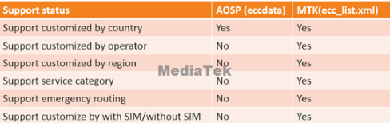

配置路径：


vendor/mediatek/proprietary/external/EccList   ---配置资源vendor/mediatek/proprietary/hardware/ril/fusion/mtk-ril/telcore/cc/  ---解析资源

|  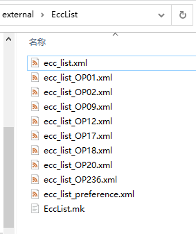 |  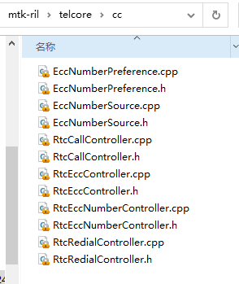 |
|:---:|:---:|

其中，ecc_list.xml:  国际默认紧急号码，多个国家紧急号码，单个国家紧急号码，单个运营商紧急号码； ecc_list_OPXX.xml:  运营商定制版本；ecc_list_preference.xml:  定义 GsmOnly,GsmPref,CdmaPref，这类号码； EccList.mk:  将资源文件拷贝到 /system/vendor/etc/ （具体位置以代码实际内容为准） 。

（3）萨瑞客制化

MTK 原生配置并不能客制化紧急号码的显示名称，由于需求表中号码有不同的字符串显示需求，因此需要萨瑞客制化和传音客制化。

萨瑞客制化只简单的配置了紧急号码的显示，国家与号码对应关系采用了 MTK 原生配置。

配置路径：

vendor/mediatek/proprietary/packages/services/Telephony/res/values/

 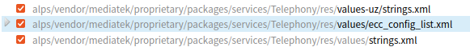

其中 ecc_config_list.xml ，将紧急号码与字符串 id 对应，strings.xml 将字符串 id 与具体字符串资源对应。

（4）传音客制化

传音客制化不仅配置了紧急号码的显示，国家与号码对应关系也进行了客制化。

配置路径：

packages/apps/EccList/

|  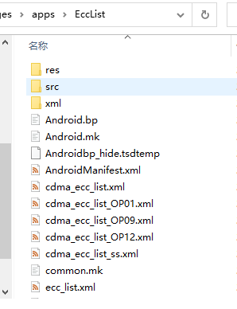 |  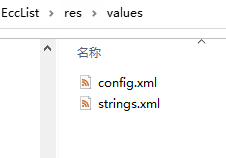<br> 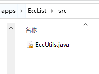<br> 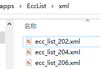 |
|:---:|:---:|

xml 文件夹：国家与号码对应资源，如 ecc_list_202.xml ，则代表了 mcc 202的紧急号码， EccList.mk 将 ecc_list\*.xml 拷贝到 /system/vendor/etc/ 或 /system/etc/ ，所有的 ecc_list\*.xml 组合起来类似 ecc_list.xml ；

res文件夹：紧急号码与字符串对应资源，Android.bp，EccListConfig.go，common.mk，Android.mk，EccList.mk，作用是编译res资源，config.xml 类似 ecc_config_list.xml ，将紧急号码与字符串 id 对应，strings.xml 将字符串 id 与具体字符串资源对应；

src文件夹和其余文件：并没有编译和调用。

#### 参数含义

（1）表格内容举例：

紧急号码对应的国家，由 mcc 区别，如新加坡，mcc 525 ；一个国家可能有多个紧急号码，由需求表和场测提供；紧急号码有多个显示情况（2-3个），英文显示，本地语言显示（本地语言可以查表或百度）；拨打情况 2 种，只能插卡拨打（Without SIM Can Call =NO）；不插卡也能拨打（Without SIM Can Call =Yes）。

 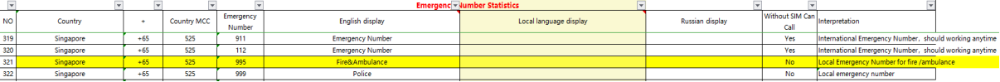

（2）表格与 MTK 原生配置对应关系：

1）ecc_list.xml:

| XML\*\*<EccEntry Ecc="112" Category="0" Condition="1" Plmn=""/>   \*\*\*\*<EccEntry Ecc="110" Category="0" Condition="0" Plmn="NOMAL1" /> //NOMAL1--- EccNumberSource.c   \*\*\*\*<EccEntry Ecc="767" Category="0" Condition="2" Plmn="621 FFF" />   \*\***<EccEntry Ecc="110" Category="0" Condition="1" Plmn="460 03"/>**      - Ecc: the emergency number         - Category: the service category (From 3GPP ) ---EccNumberSource.cpp定义               - Bit 1 (1): Police               - Bit 2 (2): Ambulance               - Bit 3 (4): Fire Brigade               - Bit 4 (8): Marine Guard               - Bit 5 (16): Mountain Rescue               - Bit 6 (32): Manually initiated eCall               - Bit 7 (64): Automatically initiated eCall               - Bit 8 (128): is spare and set to "0"      - Condition: there are following values：---EccNumberSource.h 定义      - Plmn: Operator PLMN which contains MCC+MNC.               - Use FFF or FF for all operators in the same country Ex: 460 FFF means all operators in China |
|:---|

注意：表格中的 Country MCC 对应 ecc_list.xml 中的 Plmn ，当为某国家紧急号码时配置 MCC FFF，当为某国家某具体运营商时 配置为 MCC MNC ；表格中的 Emergency Number 对应 ecc_list.xml 中的 Ecc ；表格中的 Without SIM Can Call 对应 ecc_list.xml 中的  Condition ，当 Without SIM Can Call =NO 时，Condition=2，当 Without SIM Can Call =Yes 时，Condition=1 。Condition 的配置对应了拨打方式是普通拨号还是紧急拨号，有些号码虽然按照表格配置了Condition ，可能存在无法拨通的情况，这时就需要修改 Condition 或其他解决方式。另外 MTK 原生 Condition=2 的定义（ EccNumberSource.cpp ）是插卡时以普通拨号方式拨出，不插卡时以紧急拨号方式拨出，与表格中 Without SIM Can Call =NO 的含义是有差异的，场测会反馈某国家不插卡拨某号也是紧急号码，修复方式有2种，一是在代码中去除该号码[某号码不是紧急号码](https://r29f33hhdx.feishu.cn/wiki/HjI2wfPayiSL4okUgMFcoEtOnlf)，二是在 EccNumberSource.h 中 增加CONDITION_MMI_SIM_ONLY = 5 ，EccNumberSource.cpp 中针对 CONDITION_MMI_SIM_ONLY 做相应处理，详细可看 ALPS07978901 。

 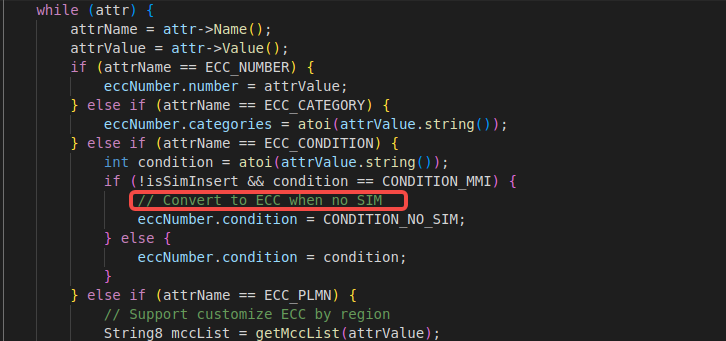

 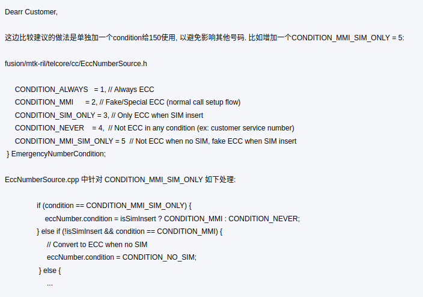

2）ecc_list_preference.xml:

| XML**<GsmPref Operator="460" EccList="000,08,118,911,999" />** |
|:---|

注意：表格中的 Country MCC 对应 ecc_list.xml 中的 Operator ；表格中的 Emergency Number 对应 ecc_list.xml 中的 EccList 。

（3）表格与传音客制化对应关系：

1） ecc_list_293.xml:

| XML**<EccEntry Ecc="19810" Category="0" Condition="2" />** |
|:---|

注意：表格中的 Country MCC 对应 ecc_list\*.xml 中的 \*  ；表格中的 Emergency Number 对应 ecc_list\*.xml 中的 Ecc ；表格中的 Without SIM Can Call 对应 ecc_list\*.xml 中的  Condition ，当 Without SIM Can Call =NO 时，Condition=2，当 Without SIM Can Call =Yes 时，Condition=1 。Condition 的配置对应了拨打方式是普通拨号还是紧急拨号，有些号码虽然按照表格配置了Condition ，可能存在无法拨通的情况，这时就需要修改 Condition 或其他解决方式。传音客制化的 Condition=2 则不存在 MTK 原生 Condition=2 的问题，与表格仅插卡能拨打含义相符。

之前传音客制化存在一个问题：无卡也能拨打的号码实际没有实现，解决方法是：无卡也能拨打的号码需要在 MTK 原生 ecc_list.xml 中再次配置，这个问题需要注意。

 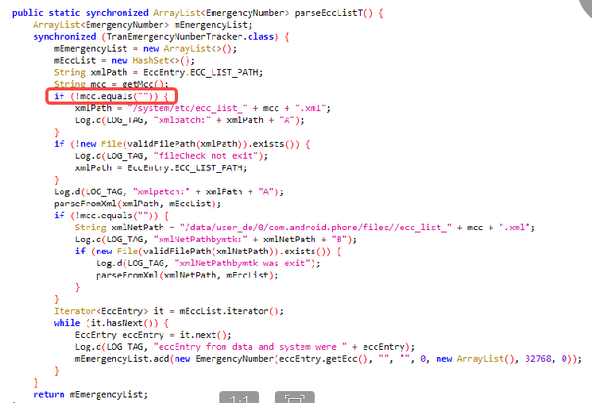

（4）表格与字符串资源对应关系：

1）ecc_config_list.xml 或 config.xml：

 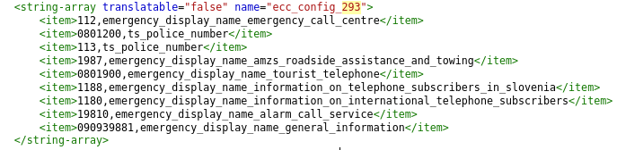

注意：表格中的 Country MCC 对应 ecc_config_\* 中的 \*  ；表格中的 Emergency Number 对应 item 后的数字，English display 对应数字后的字符串 id ，直接将期望显示字符串配置在这里也是能生效的，但是为了字符串复用，建议配置 id 。

2）strings.xml：

注意： strings.xml 中的字符串 id 与 ecc_config_list.xml 中的字符串 id 为同一个，values/strings.xml 对应的字符串资源则为 English display ，values-ru/strings.xml 对应的字符串资源则为 Russian display ，Local language display 则为某国家的本地语言对应 values-xx/strings.xml 。

#### routing 与无卡能否拨打不要混用

从 CQWeb 历史问题 `SPCSS01017433` 看，`eccdata` 中的 `routing=2` 不等价于“无卡不能拨打”。该配置控制有卡/无卡时以普通拨号还是真紧急拨号方式下发；紧急号码默认有无卡都可能被加载。

如果需求是“该号码仅插卡时可作为紧急号码”，需要额外引入卡状态条件，例如 `card_flag=with_card`，并在对应平台的 `EmergencyNumberTracker` / `EmergencyNumberTrackerEx` / `UniEmergencyNumberTracker` 链路中确认是否支持和生效。

验证时至少覆盖：

| 场景 | 预期 |
|---|---|
| 插卡且 SIM ready | 号码可识别/可拨出 |
| 无卡 | 号码不应加载为 ECC，或不应按紧急号码拨出 |
| PIN 未解锁 | 需要按需求确认是否只读取卡内 EF_ECC |
| 飞行模式 | 确认 UI 识别、AP 下发和 modem 行为一致 |

 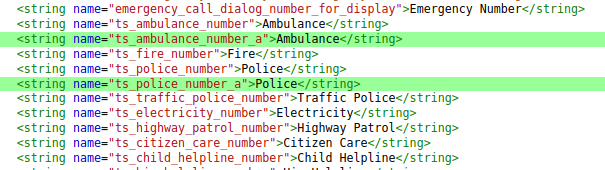

#### category 与 emergency URN 映射

从旧 Outline 案例 [urn:service:sos.police问题](../40_Case-Library/Call/Imported_Call_01_urnservicesos.police问题.md) 看，网络下发 ECC 时可能携带多类型 category，例如 `category:31`。如果平台默认按最低有效 bit 映射，SIP INVITE 可能携带 `urn:service:sos.police`；但部分运营商期望多类型紧急号码统一使用 `urn:service:sos`。

定位时按下面顺序确认：

| 检查项 | 关键证据 |
|---|---|
| 号码来源 | RIL `sendUnsolEccList`、Attach/TAU Accept Emergency Number List、SIM EF_ECC、本地 `eccdata` |
| category | 是否是 `31` 这类多 bit category |
| SIP URN | INVITE 中是否生成 `urn:service:sos.police`、`urn:service:sos.fire` 或 generic `urn:service:sos` |
| UNISOC 配置 | `OPERATOR_NV_IMS\ims_emg_urn_generic\sip_emerg_urn_generic\sip_emerg_urn_generic[0]=1` |
| MTK 配置 | `emergency_call_category_mapping = 1` |

#### ECC CS only 不要误用废弃 CS prefer

从旧 Outline 案例 [ECC csfb cs后重回LTE时间过长问题](../40_Case-Library/Call/Imported_Call_02_ECC_csfb_cs后重回LTE时间过长问题.md) 看，`ecc_cs_prefer` 会让 UE 在 ECC 域选阶段把 LTE 放入 forbidden RAT，导致设备通过选网进入 3G CS，而不是标准 CSFB。通话结束后 fast return 条件不成立，就会长时间停留在 3G。

如果运营商明确要求 ECC 不走 VoLTE，优先使用 `ecc_cs_only=1`：

```text
OPERATOR_NV_MN\mn_ecc_cs_only\ecc_cs_only\ecc_cs_only[0]=1
```

排查“ECC 后不回 LTE”时，先确认进入 3G 的原因：

| 现象 | 判断 |
|---|---|
| `MSG_ID_MNM_PHONE_ECC_STATUS_SET` 后 LTE 在 forbidden RAT | 多半是 ECC 域选配置导致的选网入 3G |
| 标准 CSFB 入 3G | 再查 fast return、RRC release redirection、LTE 小区重选 |
| 对比机 1 秒回 LTE，DUT 2 分钟回 LTE | 重点比对 ECC 域选 NV 和进入 3G 的触发路径 |

#### 本地 ECC 配置导致号码重定向

从旧 Outline 案例 [LA Réunion重定向](../40_Case-Library/Call/Imported_Call_03_LA_Réunion重定向.md) 看，`RE` 国家下把 `15/17/18` 配成本地 ECC，并配置 `ecc_fallback: "112"`，会导致这些号码被识别为紧急号码并重定向到 `112`。

这类问题不要直接归因网络侧。先检查本地配置：

| 平台 | 典型路径 |
|---|---|
| MTK AOSP eccdata | `vendor/mediatek/proprietary/packages/services/Telephony/ecc/input/eccdata.txt` |
| UNISOC uniecc | `vendor/sprd/platform/packages/apps/UniTelephony/uniecc/input/eccdata.txt` 或 `vendor/sprd/platform/packages/services/Telephony/uniecc/input/eccdata.txt` |

修改后必须同步生成 output 数据库，并在设备运行时确认 emergency number list 已更新。

#### PIN 未解锁时 EF_ECC 与无卡 ECC 边界

从 CQWeb 历史问题 `SPCSS00841322` 看，SIM PIN 输入界面不是简单的“无卡状态”。部分运营商要求：PIN 未解锁时只允许 `112/911` 和 SIM `EF_ECC` 中的号码作为紧急号码；`000/08/110/118/119/999` 等 Without SIM 默认号码不应按紧急号码处理。

典型坏点是 SIM 状态判断把 `SIM_NOT_INITED` 当作无卡，导致走了本地 Without SIM ECC：

```text
MMIAPIPHONE_GetSimExistedStatusEx sim[0].status = 8, plmn status = 4
MMIAPICC_IsEccByLocalConfig Without SIM tele_num=110
MMIAPICC_IsEccByLocalConfig Without SIM tele_num=118
MMIAPICC_IsEccByLocalConfig Without SIM tele_num=000
```

如果需求要求 PIN prompt 状态按“有卡但未解锁”处理，需要让 `SIM_NOT_INITED + PLMN_EMERGENCY_ONLY` 进入有卡 ECC 判断，并确认能读取/使用 SIM `EF_ECC`：

```text
MMIAPICC_IsEmergencyPartNum: ecc_code=123
MMIAPICC_IsEmergencyPartNum() is sim emc
```

复测矩阵：

| 状态 | 必测号码 |
|---|---|
| SIM READY | 本地 ECC、网络下发 ECC、SIM EF_ECC |
| PIN prompt | `112/911`、SIM EF_ECC、Without SIM 默认号码 |
| 无卡 | 协议默认无卡号码、本地配置无卡号码 |
| PUK / blocked | 按需求确认是否等同 PIN prompt 或无效卡 |

#### 无卡紧急呼叫固定网络测试边界

从 CQWeb 历史问题 `SPCSS01644200` 看，实网无卡紧急呼叫问题不建议依赖“临时强制无卡注册到某个 PLMN”来复现。无卡紧急驻留由可用小区、PLMN 选择和网络环境决定，平台侧没有通用安全的强制固定网络调试开关。

排查时优先要求：

1. 目标网络现场 fail log。
2. 同地点同时间 pass 对比机 log。
3. 当前驻留 RAT/PLMN、是否 limited service、是否发起 emergency call setup。
4. 仪表环境复现时，明确只开放目标 PLMN，避免 UE 选到其他可用网络。

没有 fail log 时，只能确认本机 ECC 配置和域选择策略，不能证明目标运营商网络上的第一坏点。

#### 如何验证

（1）白卡测试

白卡只能测试紧急号码字符串显示问题，无法测试能否拨通及连接情况。

（2）场测测试

国外的网络环境可以测试紧急号码能否拨通及连接情况，无法自测的紧急号码问题一定要发软件给场测验证 PASS 后再合入到正式代码中。

#### 相关问题

| Q: Ecc_list.xml和eccdata配置紧急号码有什么区别，任选一种方式配置都会生效吗？@陈清锋<br>A：eccdata 谷歌原生配置只支持根据国家配置，Ecc_list MTK原生配置还支持按照运营商、有卡无卡、拨号方式等配置，上文有详细对比图片； 任选一种方式配置对于android Q及之后的MTK手机从原理上是都会生效的，但是完整性和正确性需要进行实际的验证和测试。@无 |
|:---|

| 如何针对单个运营商配置紧急号码？ |
|:---|

### 紧急号码基础

#### 1. 紧急号码来源

网络配置的。（attach_accept / TAU accept消息中网络会携带ecc_numbers ）网络下发的紧急号码列表，CP通过：+CEN2:<cat>,<number>上报到AP

SIM卡中存储的；(USIM卡存储在ADF_USIM/EF_ECC文件中，SIM卡存储在DF_GSM/EF_ECC中)

本地配置：用户可配，UE也可根据运营商要求配置；在AP侧配置；

协议规定（22.101 10.1.1）:如无卡：911/112/000/08/110/118/119/999；有卡：911/112

`在Android 12及之后，使用CP侧方案`

#### 2.如何区分真假紧急号码

log层面：AP侧下发到CP侧的真紧急电话拨号命令格式为：

 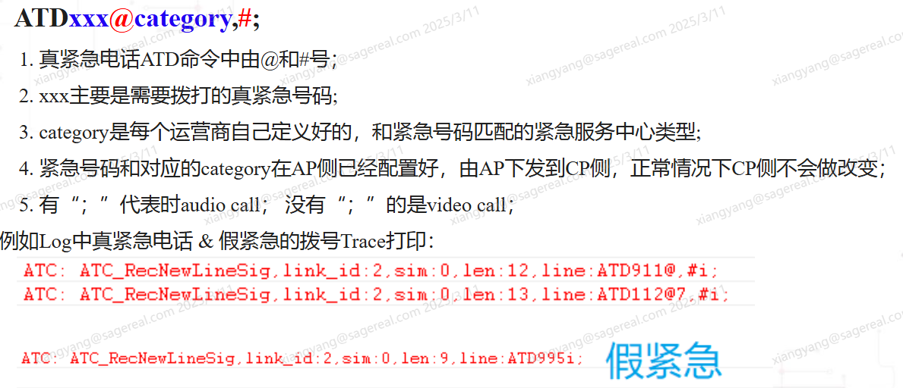

代码层面：在配置eccs时，配置routing（值为2为假紧急，拨号界面显示紧急呼叫，但实际以正常拨号呼出）。如果不配置，默认为真紧急。

### 需求文档

紧急号码表格，可向SPL或jira搜索获取最新的紧急号码需求表格。

需求表解读：

ECC表格分为以下4部分：

 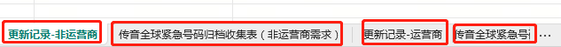

每次更新都需要查看两个更新记录表（更新记录-非运营商/更新记录运营商），然后查看归档表收集表是否包含更新点记录。(两个表格通过country关联)

 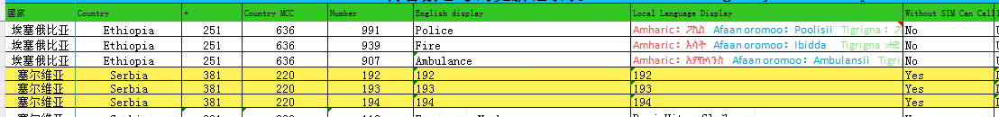

**Country mcc**:紧急号码对应的国家，由 mcc 区别

**Number**：一个国家可能有多个紧急号码，由需求表和场测提供

**English display**：英文显示，一个Number对应唯一一个英语显示

**Local Language Display**：本地语言显示，需要注意同个国家可能存在多个本地语言显示（例如：突尼斯存在两种本地语言使用，法语和阿拉伯语）

**Without SIM Can Call**：拨打方式有两种，只能插卡拨打（Without SIM Can Call =NO）；不插卡也能拨打（Without SIM Can Call =Yes）

### 配置路径和方法

#### 1.Android 4.4/7.0/8.1/9

配置路径：packages/apps/CarrierConfig/assets/carrier_config_xxxxxx.xml

#### 2.Android 10

配置路径：

packages/services/Telephony/ecc/input/eccdata.txt

修改完后，在packages/services/Telephony/ecc/目录下运行gen_eccdata.sh脚本，将更新的

packages/services/Telephony/ecc/output/eccdata一并提交，重新编译版本并验证。

#### 3.Android 11及以后

常见配置路径：

- `vendor/sprd/platform/packages/apps/UniTelephony/uniecc/input/eccdata.txt`
- `vendor/sprd/platform/packages/services/Telephony/uniecc/input/eccdata.txt`

不同 Android 分支和项目裁剪会放在不同目录，先以当前代码实际编译路径为准，不要只按文档路径改一个副本。

修改完后，在对应 `uniecc` 目录下运行 `gen_eccdata.sh`

脚本，将更新的 `output/unieccdata` 一并

提交，重新编译版本并验证。

#### 4.配置步骤

 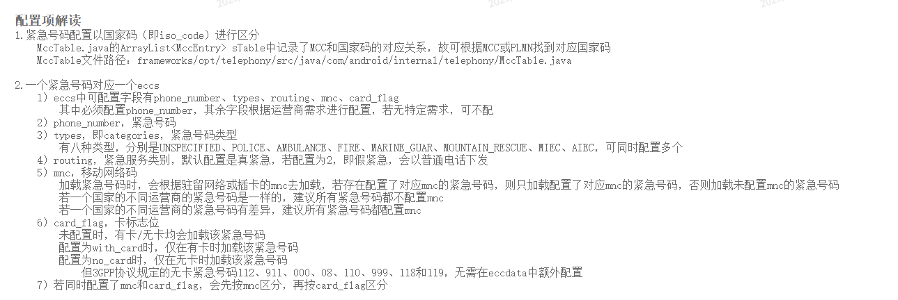

①确认国家码（countryISO）。国家码的确认可以通过：<https://mcc-mnc.org/>

通过检索对应的plmn可以得到相应的国家码
 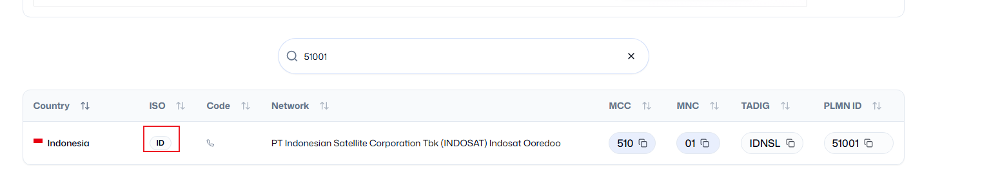

②在对应的国家下编辑eccs：

每添加一个紧急号码，需添加一个eccs。

每个eccs只能有一个紧急号码，但可以对应多个type。

如果不知道type类型，可以不配置该字段，默认为UNKNOWN。

每个eccs可以配置routing，表示真假紧急。如果不配置，默认为真紧急。

如果eccdata中没有需要配置的国家，则需要添加国家，再在国家中添加eccs。

对于需要根据mnc添加相应的紧急号码，可以参考如下配置：

 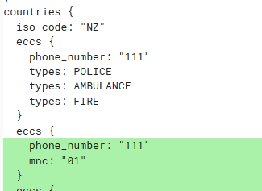

③运行脚本gen_eccdata.sh。

④编译验证。

#### 4.1 展锐 uniecc 修改不生效自查

从 CQWeb 历史问题 `SPCSS01618498` 看，客户为 DZ 增加仅插卡紧急号码 `1548`，修改 `vendor/sprd/platform/packages/services/Telephony/uniecc/input/eccdata.txt` 并生成 `output/unieccdata` 后仍反馈不生效，最终由客户自行解决，记录中没有给出明确代码补丁。这个问题不能沉淀成确定 root cause，但适合作为配置不生效的自查清单。

遇到“`eccdata.txt` 已改但设备不生效”，按下面顺序切：

| 检查点 | 判断方法 |
|---|---|
| 改的是当前分支实际编译路径 | 同时搜索 `apps/UniTelephony/uniecc`、`services/Telephony/uniecc`，确认 `Android.bp` / `Android.mk` / makefile 实际打包的是哪一份 |
| 生成物是否同步 | `input/eccdata.txt` 和 `output/unieccdata` 要一起更新；只改 input 不等于设备会加载新库 |
| 模块是否重新打包 | 按项目确认是重编 `TeleService`、`UniTelephony` 还是整包；push 单个 APK 时要确认设备端实际替换成功并重启 |
| 字段是否被当前分支解析 | `card_flag: "with_card"` 这类扩展字段要在代码里搜索解析链路，确认 `EmergencyNumberTracker` / 平台扩展 tracker 会读取并使用 |
| 国家/PLMN 是否匹配 | `iso_code: "DZ"` 只在设备运行时国家、PLMN、SIM 信息能匹配到 DZ 时生效；运营商级需求要确认是否需要 MNC/PLMN 维度配置 |
| 运行时列表是否更新 | 看 AP 侧 emergency number dump、`EmergencyNumberTracker` 相关 log、RIL 上报和拨号前最终号码列表，不只看源码 diff |

结论模板：

```text
当前只能证明配置文件已修改/已生成，不能证明运行时已加载。
需要补充：设备端生效产物校验、EmergencyNumberTracker 运行时号码列表、拨号前 AP 判定和 RIL/Modem 下发命令。
```

#### 5.紧急号码的type类型

 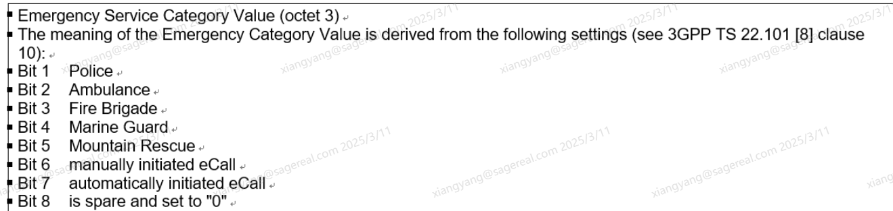


### 紧急号码通话方式

#### 1.N3GPP是否能拨打紧急电话

N3GPP是否已经注册？(N3GPP是否注册成功取决于对应网络白名单是否打开，VOWIFI开关是否打开；WIFI信号是否正常......)

关注这个nv的参数：OPERATOR_NV_MN\\mn_vowifi_ecc\\vowifi_ecc\\vowifi_ecc\[0\]

#### 2.VOLTE是否能拨打紧急电话

手机VOLTE开关是否打开；当前LTE网络注册是否正常；当前驻留的网络核心网是否支持VOLTE拨打ECC

attach accept中的emc_bs，ims_vops，LTEAS_CELL_SELECT_CNF 中isImsEmergencySupport是否为1

手机相关的NV配置是否打开VOLTE拨打ECC功能：OPERATOR_NV_MN\\mn_ecc_cs_only\\ecc_cs_only\\ecc_cs_only\[0\]----该NV根据当前驻留网络PLMN进行加载；OPERATOR_NV_MN\\mn_emc_need_csfb_when_roaming\\emc_need_csfb_when_roaming\\emc_need_csfb_when_roaming\[0\]----该NV跟据当前插入的SIM卡对应的PLMN进行加载；控制当前SIM卡在漫游时候，是否允许ECC Via VOLTE

#### 3.是否通过CS拨打紧急通话

cs紧急呼叫log中会有`EMERGENCY_SETUP，`volte是==ATTACH_ACCEPT(voip=1,emc_bs=1)==

## ECC参数

[05Emergency Number Statistics20250331.xlsx 137268](..\attachments\outline\files\1afe9f20-6e44-4e84-ad7a-b922c9c60c51_05Emergency Number Statistics20250331.xlsx)

## 来源记录

本节只保留来源入口；可复用结论应回填到主线速查、常见失败模式或 Case。

- [紧急号码配置](http://192.168.3.94:8888/doc/57sn5ocl5y356cb6ywn572u-3TNXJTNsp2) (`3TNXJTNsp2`)
- [MTK EccList 如何配置](http://192.168.3.94:8888/doc/mtk-ecclist-ZiFAwCnGmD) (`ZiFAwCnGmD`)
- [展锐EccList如何配置](http://192.168.3.94:8888/doc/ecclist-MCODKj2RcG) (`MCODKj2RcG`)
- [ECC参数](http://192.168.3.94:8888/doc/ecc-isKynyRN2x) (`isKynyRN2x`)
- CQWeb `SPCSS01618498`：展锐 `uniecc` 增加仅插卡紧急号码后不生效自查。
