# NV参数配置

## 阅读入口

- 本文是迁入/补充资料，先按本节入口定位，再看正文和来源记录。
- 可复用结论应沉淀到主流程/配置/排障/case；本文只保留溯源材料和操作细节。

NV 问题的核心不是“配置文件里有没有写”，而是确认目标产物、刷入版本、运行时读取值三者一致。

参数映射入口：[[Modem NV参数映射]]


<!-- CONFIG_TEMPLATE_BLOCK_START -->
## 模板化定位

### 配置来源

| 来源 | 本文落点 | 运行时验证 |
|---|---|---|
| modem NV / Operator NV | NVTool、Operator NV、RDNV、产品默认 NV | NV readback、版本号、LID/verno |
| fixnv / NVRAM / NVDATA | 个体化参数、IMEI、RF calibration | 主备分区回读、factory log、工模参数 |
| 编译产物 | modem image、PAC、patch list、流水线参数 | 设备实际 image 时间戳、out/PAC 对比 |
| AP 侧表象 | IMEI unknown、META 失败、radio unavailable、不识卡 | bugreport、radio log、modem assert |

### 匹配与生效链路

```text
源 NV / 默认参数 / 工厂写入
-> 编译或下载产物
-> 刷机 / 写号 / 校准
-> modem boot 读取 NV / NVRAM
-> AP 看到注册、SIM、IMEI、射频或稳定性表象
```

### 平台差异

| 平台 | 重点看点 | 验证口径 |
|---|---|---|
| Android common | AOSP 公共 XML、Provider、framework 读取点 | 先证明 common 默认值和运行时 dump 是否一致 |
| UNISOC | carrier overlay、CarrierService、Operator NV、modem profile | 同时看 AP log、产物配置、NV/readback 和 modem trace |
| MTK | vendor/mediatek 私有配置、SBP/DSBP/CXP、NVRAM | 结合 debuglogger、ELT/MD log、AP dump 验证最终值 |
| Qualcomm | CarrierConfig overlay、MCFG/QCRIL、modem profile | 结合 dumpsys、QXDM/QCAT、MCFG 产物确认 |

### 验证命令与 log

| 目标 | 证据入口 | 预期结论 |
|---|---|---|
| 源配置存在 | fixnv / operator NV / MCFG / NVTool 导入文件 | 能定位到需求字段、默认值和项目覆盖值 |
| 运行时 dump 生效 | NVTool readback、版本号、modem 运行时读取值 | 设备当前值与预期配置一致 |
| AP/vendor 已采用 | Telephony/RILJ/vendor service log | 能看到读取、选择、下发或业务判断动作 |
| modem/协议侧采用 | modem NV trace、能力开关、profile 选择 | 协议字段、modem 状态或 reject cause 能与配置结果闭环 |

### 关联入口

| 入口 | 用途 |
|---|---|
| [配置目录 README](README.md) | 回到配置分类和放置规则 |
| [Case横向索引](../40_Case-Library/Case横向索引.md) | 查历史同类问题和第一坏点 |
| [平台代码入口](../50_Platform-Code/README.md) | 查厂商代码读取位置 |
| [常用命令](../70_Tools-Debug/Commands/常用命令.md) | 查 dumpsys、logcat 和 adb 命令 |

### 常见失败模式

| 现象 | 优先检查 | 第一坏点判断 |
|---|---|---|
| IMEI unknown | 加密宏控、LID size/verno、SML、fixnv 主备 | 先判 NV 读取/解密，不先判 SIM |
| META 无法连接 | modem 是否已 EE/assert、SML 数据是否为空 | META 是表象，第一坏点常在 modem/NV 链路 |
| 升级后 modem assert | modem image、RF parameter、patch list、NV 迁移 | 产物不一致优先于业务配置 |
<!-- CONFIG_TEMPLATE_BLOCK_END -->
## 标准检查链路

1. 明确需求：哪个项目、运营商、卡槽、功能、RAT、版本需要改。
2. 找源头：NV 默认值、运营商 overlay、项目差异、modem profile 或供应商工具配置。
3. 查版本：NV LID / VERNO / profile version 是否变化。
4. 查产物：PAC / modem image / vendor image 是否包含目标配置。
5. 查运行：设备端 modem 是否读取到新值，AP 是否收到对应状态。
6. 查回退：升级、恢复出厂、保留 NVRAM、换卡后是否仍符合预期。

## 常见风险

| 风险 | 表现 | 处理方向 |
|---|---|---|
| 源文件改了但产物没更新 | 本地单编有效，服务器版本无效 | 查流水线参数和 copy 脚本 |
| VERNO 未变化 | 升级后仍用旧 NVRAM，或被判断为异常 | 确认版本升级策略 |
| 多卡槽 bitmask 配错 | 单卡有效，双卡或指定卡槽异常 | 按卡槽逐 bit 校验 |
| 卡槽历史配置复用错误 | 单软多硬、singlesim/dualsim 某一 SKU 不识卡 | 对齐 AP SKU、硬件卡槽和 modem NV slot mapping |
| fixnv 主备都损坏 | modem 起不来，RIL radio unavailable，IMEI/SIM/ECC 连带异常 | 查 `MODEM_CTRL:NV_READ` 主备校验和，保留分区镜像 |
| fastboot 直接刷 fixnv | IMEI、RF 校准参数、工厂个体化参数丢失 | 先查是否支持 NV backup/merge，避免用公共 base nvitem 覆盖现场机 |
| A/B OTA 中断窗口错误 | OTA 后或线刷后 IMEI/校准参数异常 | 查 `update_engine` 中 fixnv 写入与 `nvmerge` 执行顺序 |
| MNC 位数错误 | 白名单/运营商匹配失败 | 保留 2/3 位 MNC 差异 |
| 固定解锁码或默认值不安全 | 量产风险 | 明确客户安全方案 |

## 记录模板

```text
需求：
平台：
项目/运营商：
源文件或工具：
关键字段：
旧值：
新值：
版本号/VERNO：
产物路径：
设备端验证：
风险：
```

## 关联入口

- [[SIMLock配置方法|SIMLock与锁网配置]]
- [[../50_Platform-Code/Cross-Platform/平台代码与产物速查#Modem产物与Patch管理|Modem产物与Patch管理]]

## Operator NV 验证补充

从 CQWeb 历史问题 `SPCSS01424951`、`SPCSS01530980` 和 `SPCSS01287053` 看，Operator NV 常见误区有几类：

| 问题 | 结论 |
|---|---|
| NVTool 应打开哪个工程 | 修改/查看运营商参数时按展锐文档打开 `RDNV` 目录下的 `xprj`，不要只按目录名误认为必须打开 `OperatorNV` |
| 是否必须插卡验证 | 需要插卡触发对应运营商参数加载；白卡可以用，但必须写入目标运营商 MCC/MNC |
| LinuxCmdNV 能否差分 Operator NV | 历史结论是命令行格式不支持差分运营商数据，批量差分能力不能按 NVTool GUI 能力直接等价推断 |
| NVTool 保存后顺序/注释变化 | 保存 delta NV 时工具会去重，并结合 `default.nv` 顺序保存；新版本可避免删除注释，但顺序仍可能变化 |

验证建议：

1. 先确认目标 SIM/白卡 MCC/MNC 与 Operator NV 条件匹配。
2. 插卡注册后再导出 running NV 或看 Adaptive Parameter Configuration。
3. 对比源文件、生成 bin、设备端加载值，避免只看工具界面。
4. 如果需要批量差分 Operator NV，先确认当前工具链是否支持；不支持时要走完整 NV 工程修改/编译流程。
5. 如果项目依赖人工注释维护 Operator NV，记录 NVTool 版本；`R1.22.3301` 之后历史反馈已支持不删除注释，但保存顺序仍会按去重和 `default.nv` 模板重排。

### Operator NV 保存顺序与注释边界

`SPCSS01287053` 的关键结论是：NVTool 保存 Operator NV 时，会同步保存 delta NV 和 NV 工程。保存 delta NV 阶段工具会做去重，并结合 `default.nv` 模板顺序重排。这个行为不一定影响 NV bin 生成，但会影响人工 review 时的 diff 可读性。

处理口径：

| 场景             | 建议                                          |
| -------------- | ------------------------------------------- |
| 只关心运行值         | 以生成 bin 和设备端 running NV 为准，不要把文件顺序变化直接当功能风险 |
| 需要保留注释         | 使用支持保留注释的新版本 NVTool，并记录工具版本                 |
| 需要保持人工 diff 可读 | 保存前后分别备份 `.nv` 文件，review 时按字段语义分组，而不是只按行序判断 |
| 顺序变化过大         | 对比是否只是按 `default.nv` 模板重排；若字段值也变化，再继续追功能风险  |

结论写法建议：

```text
本次 NVTool 保存导致 Operator NV 文件顺序变化，属于工具按 default.nv 模板去重/重排的保存行为。
当前未发现目标字段值变化；功能判断仍以生成 bin 和设备端 running NV 为准。
```

## RDNV Save Image 崩溃排查

从 CQWeb 历史问题 `SPCSS00783213` 看，打开 RDNV 工程不修改直接 Save Image 后如果出现双卡 modem 崩溃，不能直接归因 NVTool。该问题最终由客户侧 `CustNV` 修改导致，排查价值在于如何证明第一坏点。

关键检查：

| 检查项 | 目的 |
|---|---|
| NVTool 版本、modem base 版本 | 确认工具和基线是否匹配 |
| 保存前后 `sharkl3_pubcp_customer_nvitem.bin` | 判断 Save Image 是否引入功能性差异 |
| 客户 NV 工程 vs 原始 NV 工程 | 判断是否已有 CustNV 大量差异 |
| 单卡/双卡分别验证 | 确认是否与卡槽或双卡 bitmask 配置相关 |
| RDNV / OperatorNV 路径分别验证 | 区分工程入口差异和真实 NV 内容差异 |

经验结论：

- 如果保存前后只有少数字节差异，且确认是时间相关字段，通常不影响功能。
- 如果保存后 `sharkl3_pubcp_customer_nvitem.bin` 与原始文件差异很大，应继续对比客户 NV 工程与对应 modem base 原始 NV 工程。
- OperatorNV 路径临时不崩溃，不代表 RDNV 文档入口错误；仍要基于目标参数类型和工具文档确认应修改的工程。

## fixnv 损坏证据包

IMEI 丢失、校准参数丢失、modem 起不来时，优先保留 fixnv 证据。仅靠 bugreport 无法证明 fixnv 是否损坏，应使用下载工具回读主备分区：

```text
l_fixnv1_a -> fixnv1_a.bin
l_fixnv1_b -> fixnv1_b.bin
l_fixnv2_a -> fixnv2_a.bin
l_fixnv2_b -> fixnv2_b.bin
```

回读前不要格式化或重刷覆盖现场；如果必须恢复设备，也应先保存异常分区镜像。

### fastboot 直接刷 fixnv 风险

从 CQWeb 历史问题 `SPCSS00766912` 和 `SPCSS00967511` 看，`fastboot flash l_fixnv1_a/w_fixnv1_a ...nvitem.bin` 是高风险操作。原生 fastboot 对 fixnv 分区不一定支持 NV backup/merge，直接写 base/customer `nvitem.bin` 会覆盖原机 IMEI、RF 校准等个体化参数。

判断边界：

| 检查项 | 结论 |
|---|---|
| 刷入目标 | `l_fixnv1_a`、`w_fixnv1_a`、`fixnv1/2` 一类分区都属于高风险目标 |
| 刷入文件 | 公共 base/customer `nvitem.bin` 不是现场机 fixnv 备份 |
| fastboot 能力 | 需要确认是否已有 `backupnv` 或 NV merge patch |
| 现场恢复 | 先回读主备 fixnv，再决定恢复方式，避免继续覆盖证据 |

处理建议：

- 量产或售后流程不要默认使用 fastboot 直接刷 fixnv。
- 如果必须走 fastboot，需要正式集成并验证 NV backup/merge 方案，确保 IMEI/校准 NV 被合并保留。
- OTA 或下载工具通常更适合做带参数保留的升级/刷机流程。
- 归档问题时记录刷机命令、刷入文件来源、fastboot 版本、是否支持 `backupnv`、刷前刷后 fixnv 回读结果。

### A/B OTA fixnv 与 nvmerge 中断窗口

从 CQWeb 历史问题 `SPCSS01234705` 看，A/B OTA 场景下需要区分“目标 slot fixnv 已写入”和“个体化 NV 已 merge 完成”两个阶段。关键日志如下：

```text
update_engine: Applying 1 operations to partition "l_fixnv1"
update_engine: Applying 1 operations to partition "l_fixnv2"
update_engine: Hash of l_fixnv1: ...
update_engine: Hash of l_fixnv2: ...
update_engine: Running "/postinstall/bin/nvmerge 1 3"
```

判断边界：

- `Applying ... l_fixnv1/l_fixnv2` 之后，说明目标 slot 的 fixnv 分区已经被 OTA 写入。
- `Running "/postinstall/bin/nvmerge ..."` 之前，如果掉电、强制关机或切入线刷，目标 slot fixnv 可能还未合并原机 IMEI/校准参数。
- 如果已经提示重启，通常说明 postinstall / nvmerge 已完成，应优先按其他刷机或现场保全问题排查。
- OTA/FOTA 相关 NV 问题必须保留完整 `update_engine` 日志、当前 slot/目标 slot、刷机/断电时间点和 fixnv 主备回读结果。

### fixnv DIAG 备份还原接口

从 CQWeb 历史问题 `SPCSS01438797` 看，校准模式下可以通过支持 Simba 备份还原 fixnv 的 DIAG 指令补齐自动化能力。历史结论提到两类接口：

```text
query fixnv partition size
dump fixnv
```

使用边界：

- 这类接口适合做产线/售后工具自动化，不替代问题现场的分区镜像保全要求。
- 先查询 fixnv 分区大小，再 dump fixnv，避免工具按错误长度截断或读越界。
- dump 出来的内容要和 `l_fixnv1_a/b`、`l_fixnv2_a/b` 分区回读证据对应起来，记录工具版本、端口、模式和 modem 版本。
- 如果 NVTool `Load from Phone(fixnv)` 正常，说明 fixnv 分区中 NV 项结构大概率未破坏；若失败，继续保留错误码、端口日志和原始分区镜像。

### 校准 NV 损坏的 modem assert 特征

从 CQWeb 历史问题 `SPCSS01379783` 看，售后机出现 IMEI 丢失、无信号、`Modem is not alive` 时，如果 modem dump 中出现 WSRCH/RF calibration 相关 assert，要优先怀疑校准 NV 或 NV 分区内容异常。

典型 assert：

```text
Modem Assert WSRCH Task in file drv_rf_nv_comanche_calibration_wcdma_iram.c
exp=again < COMANCHE_NV_WCDMA_XDSP_RX_NUM_TBL_ENTRIES
info=[when read rssi, Again_index:... exceed XDSP_RX_NUM_TBL_ENTRIES:25]
```

判断要点：

- `radio_not_available` 是结果，不是第一坏点；第一坏点要看 modem assert info。
- 如果导出 running NV 失败，继续尝试回读 NV/fixnv 分区；回读也失败时要考虑 NV 分区或硬件损坏。
- 售后环境无法校准时，至少保留 modem dump、running NV 导出结果、fixnv 分区回读结果和工模 IMEI/校准状态截图。

## NV配置方法补充资料

### 速查结论

- 配置问题先确认落点：AOSP 公共配置、厂商私有配置、MCC/MNC 运营商配置、SIM/卡槽维度、NV/系统属性/CarrierConfig。
- 定位时必须同时保留三类证据：配置文件、运行时 dump、log 中最终生效值。
- 本文图片已转成本地附件；非图片附件仍保留原 Outline 链接作为资料索引。

迁入 NV 修改流程、工具和展锐 NV 参数资料。

> 图片已保存为本地附件；非图片附件仍保留原 Outline 链接作为资料索引。

### 1 之前方案回顾

#### 1.1 最初方案

* **操作流程**：
  * 使用NVTool工具修改OperatorNV配置
  * 保存修改后点击"Save Project"保存工程
  * 工具编译生成bin文件
  * 手动提交NV修改+bin文件（需拷贝bin到上级目录）
* **优点**：配置操作简单，问题易排查
* **缺点**：修改点不易区分，多人提交冲突风险高

#### 1.2 后续改进方案

* **操作流程**：
  * NV提交手动添加备注
  * 通过LinuxCmdNV工具编译Modem
* **优点**：可追溯修改者，减少提交冲突
* **缺点**：
  * 可移植性差
  * 更新Modem patch后合并复杂
  * 新人易找错工程路径
  * 多Modem需重复操作

#### 1.3 NV工具修改流程

* **工具选择**：
  * `NVEditor`：打开\*.prj工程文件
  * `NVTool`：打开RDNV/rd_nvitem.xprj
* 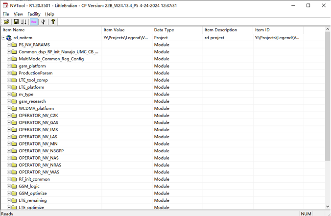
* **修改步骤**：


  1. 按工具路径修改配置（如IMEI SVN）
  2. 使用Ctrl+F搜索定位配置项

   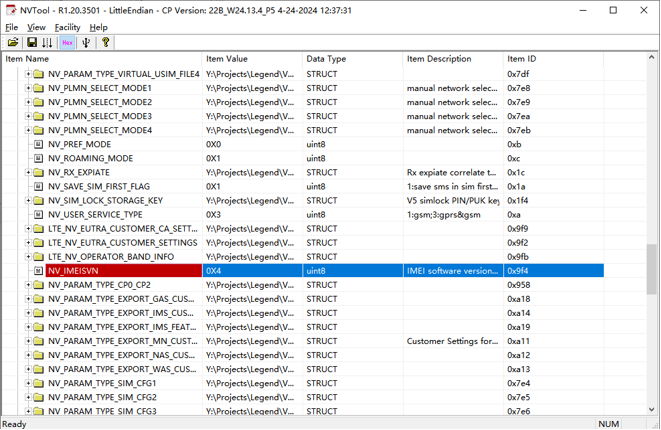
  3. 在Operator NV界面点击Save保存

   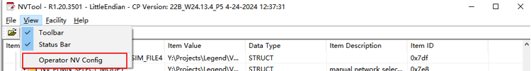

   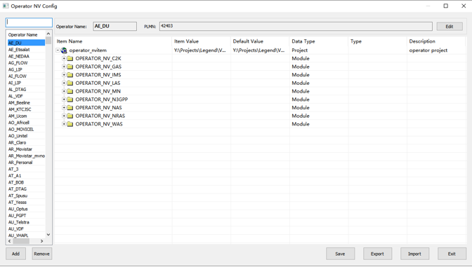
  4. 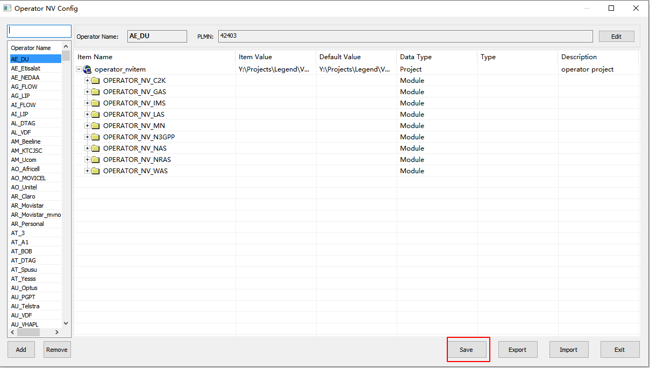

   主界面点击Save Project保存工程

 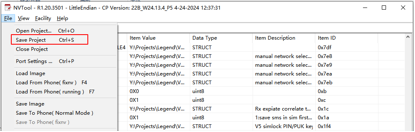

#### 1.4 NV修改注释添加规范

* **场景分类**：
  * **首次少量修改**：
   * 用文本工具打开nv文件
   * 在修改内容附近直接添加注释

  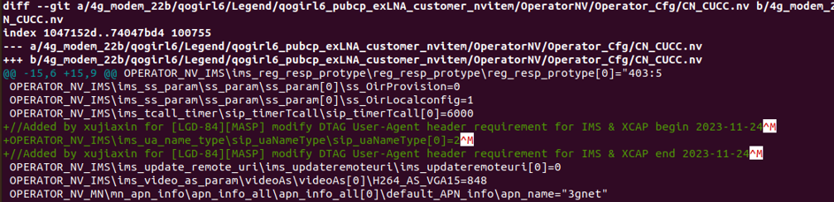
  * **首次多行修改**：
   * 集中放置修改项
   * 统一添加区块注释

  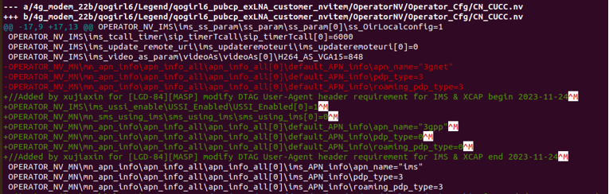
  * **多次修改（已有注释）**：
   * 还原原有注释和顺序
   * 添加新修改注释
   * 避免使用展锐新工具（会打乱顺序）

 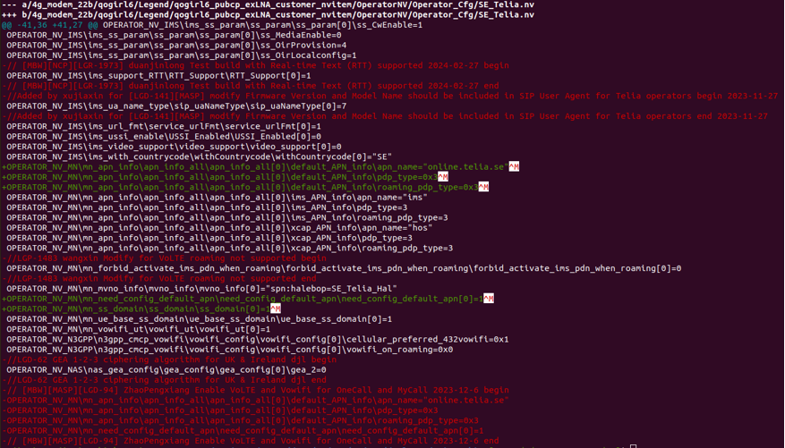

* **提交要求**：
  * 提交修改的NV文件+生成的bin文件
  * 若集成自动脚本（如SA_STC.nv），只需提交NV文件

#### 1.5 Modem编译脚本

* **触发命令**：`mk clone`
* **核心流程**：


  1. `clone_sr_files`调用`generate_nvitem.sh`

   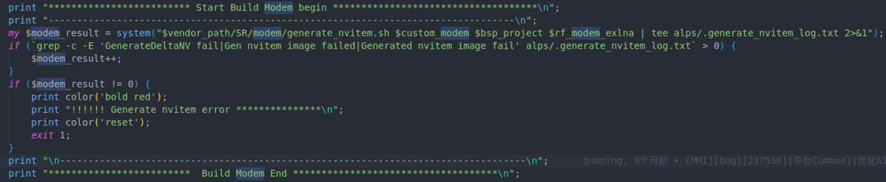
  2. 传递参数：
   * `$1`：项目名称（如SE511_GH5111_32Bit_Go）
   * `$2`：硬件平台（如ums9230）
   * `$3`：是否使用外部LNA（true/false）
* **脚本函数**：
  * `initModemBuildParameters()`：初始化路径
  * `checkModemBuildParameters()`：验证文件完整性
  * `generatingModemNvitemBin()`：用LinuxCmdNV生成bin

  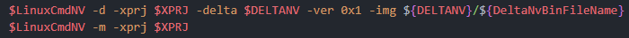
  * `copyBuildNvitemBin()`：复制到目标目录

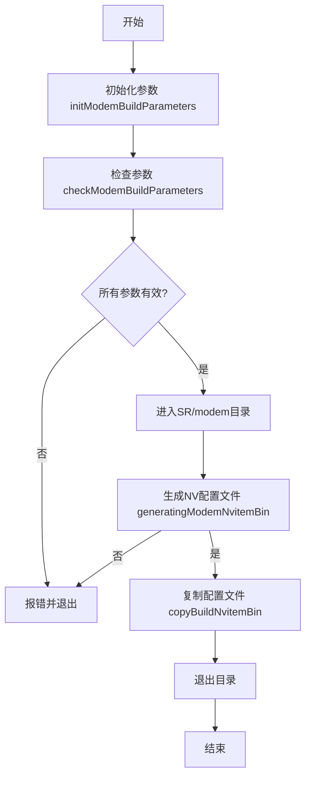


---

### 2 A16优化介绍

#### 2.1 优化背景

* **问题**：每项目独立Modem导致维护困难
* **解决方案**：
  * 移除拷贝方案
  * 在SR目录统一维护Operator NV
  * 运营商配置与项目解耦

 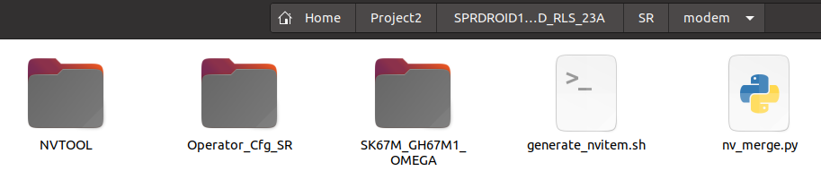

#### 2.2 脚本优化流程


1. **初始化阶段**：
   * 在SR/modem下创建临时文件夹
   * 根据项目信息从alps拷贝内容
   * 特殊处理exlna（外部低噪放频段需求）

   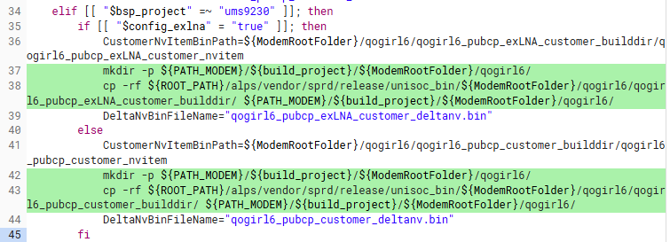
2. **NV编译阶段**：
   * 导入差分NV目录生成NV Image

   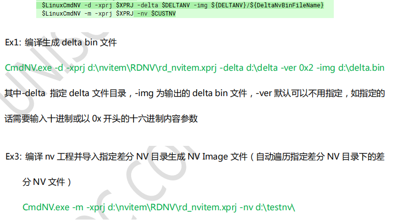
3. **Operator NV差分**：
   * **限制**：LinuxCmdNV不支持Operator NV批量差分（展锐SPCSS01530980确认）

   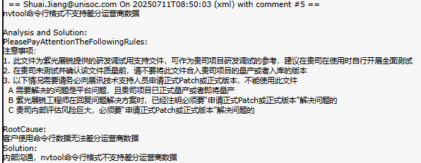
   * **添加脚本差分**：
   * 文件名需与目标NV一致
   * 新增PLMN必须填写
   * 删除配置需改为默认值
   * **差分逻辑**：

     ```mermaid
     graph LR
     A[遍历custom目录] --> B{默认配置存在同名文件?}
     B -->|否| C[移除注释/空行→直接拷贝]
     B -->|是| D[解析配置文件]
     D --> E[PLMN处理：有效用我司/无效用默认]
     D --> F[配置合并：默认值填充+我司值覆盖]
     F --> G[写入输出文件]
     ```

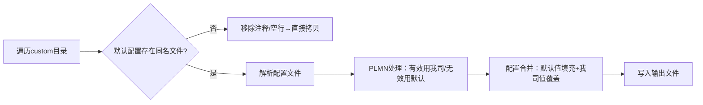


4. **清理阶段**：
   * 编译后bin文件拷贝回alps

   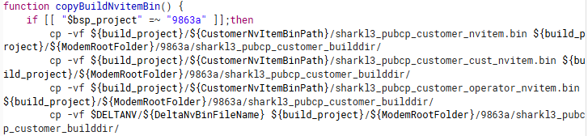
   * 删除临时文件夹

   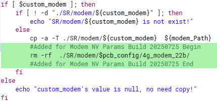
   * **防误导机制**：初始化时清除alps下旧修改

   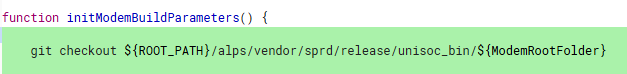

#### **2.3 注意事项**

* **修改验证**：使用`clone`指令编译后检查alps修改点
* **错误处理**：配置错误会导致LinuxCmdNV编译报错
* **注释规范**：
  * 按原要求添加注释
  * **例外**：PLMN修改禁止加备注
* **修改保留**：提交后alps下修改不会被清除


---

### **03 需要优化部分探讨**

#### **3.1 待解决问题**

* **XML文件修改优化**：
  * PPT未提供具体方案（需进一步讨论）
  * 可能方向：自动化解析/版本对比工具集成


### 附件

[102303__运营商NV配置指南V1.1.pdf 1579159](..\attachments\outline\files\d71a5b9a-8443-4658-b50e-6507187caaeb_102303__运营商NV配置指南V1.1.pdf)

[105256__Modem运营商NV参数配置指南V1.0.pdf 1817337](..\attachments\outline\files\6e57bf09-a51f-43bb-abe5-c43347771875_105256__Modem运营商NV参数配置指南V1.0.pdf)

[展锐Modem NV修改以及注释添加.pptx 2016200](..\attachments\outline\files\33f539a2-b595-4bdc-b8d2-17aa1c4363a4_展锐Modem NV修改以及注释添加.pptx)


### 展锐NV参数

|    |    |    |
|----|----|----|
|    |    |    |
|    |    |    |

### NVTool工具使用

[NVTool User Guide (zh).pdf 1035919](..\attachments\outline\files\c1809b72-47e4-47fd-bcac-4437a59b023a_NVTool User Guide (zh).pdf)

### 来源记录

- [NV配置](http://192.168.3.94:8888/doc/nv-3hDd1Wnh9J) (`3hDd1Wnh9J`)
- [展锐NV参数](http://192.168.3.94:8888/doc/nv-TOSymVB3T3) (`TOSymVB3T3`)
- [NVTool工具使用](http://192.168.3.94:8888/doc/nvtool-HmWesTyUR2) (`HmWesTyUR2`)
