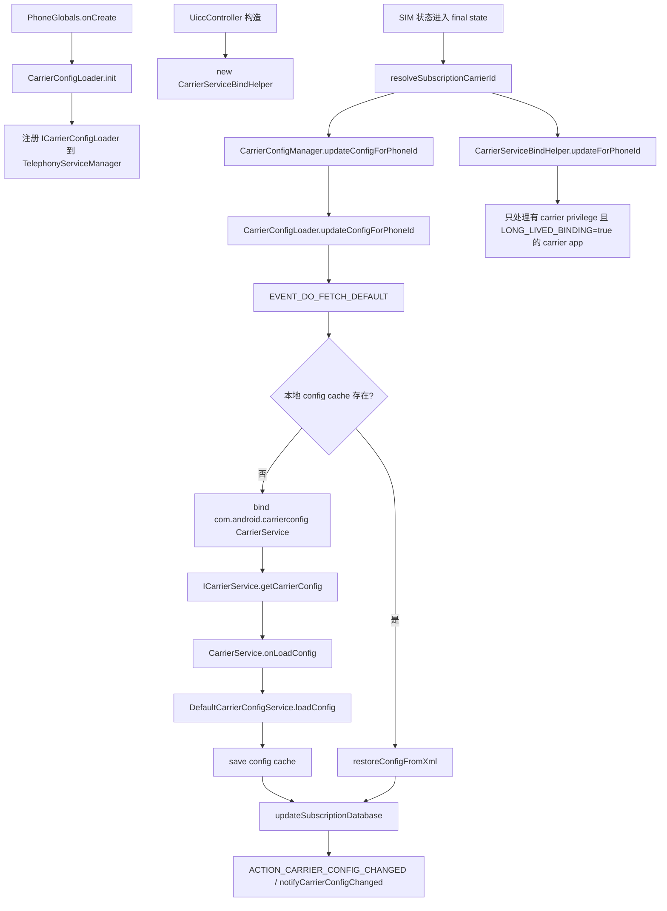

# UNISOC CarrierService启动与CarrierConfig加载流程

## 速查结论

- `CarrierService` 本身不是开机主动跑的服务；它通常由 Telephony 通过 `bindService()` 拉起，拉起点主要有两类：`CarrierConfigLoader` 的短连接配置加载，以及 `CarrierServiceBindHelper` 的长连接 carrier app 绑定。
- UNISOC 默认 CarrierConfig 服务包名仍是 `com.android.carrierconfig`，源码里由 `UnisocCarrierConfig` 覆盖 AOSP `CarrierConfig`，Manifest 声明 `android.service.carrier.CarrierService`。
- `CarrierConfigLoader` 是 CarrierConfig 加载主链路：SIM 进入终态后，`UiccController` 调 `CarrierConfigManager.updateConfigForPhoneId()`，最终 bind 到 `DefaultCarrierConfigService` 并触发 `onLoadConfig()`。
- `CarrierServiceBindHelper` 不是默认 CarrierConfig XML 加载主链路，它只给有 SIM carrier privilege、并声明 `android.service.carrier.LONG_LIVED_BINDING=true` 的 carrier app 做长连接绑定。

## 代码入口

| 模块 | 路径 | 作用 |
|---|---|---|
| Phone app 启动 | `packages/services/Telephony/src/com/android/phone/PhoneGlobals.java` | `PhoneGlobals.onCreate()` 中初始化 `CarrierConfigLoader.init()` |
| CarrierConfigLoader | `packages/services/Telephony/src/com/android/phone/CarrierConfigLoader.java` | 注册 `ICarrierConfigLoader`，负责 bind CarrierService、拉取 config、广播变更 |
| CarrierService API | `frameworks/base/telephony/java/android/service/carrier/CarrierService.java` | Service 基类，`onBind()` 返回 `ICarrierService`，再转调 `onLoadConfig()` |
| SIM 触发入口 | `frameworks/opt/telephony/src/java/com/android/internal/telephony/uicc/UiccController.java` | SIM 状态进入终态后触发 CarrierConfig 更新和 CarrierService 长连接检查 |
| 长连接管理 | `frameworks/opt/telephony/src/java/com/android/internal/telephony/CarrierServiceBindHelper.java` | 绑定需要常驻的 carrier app `CarrierService` |
| carrier app 判定 | `frameworks/opt/telephony/src/java/com/android/internal/telephony/CarrierPrivilegesTracker.java` | 查询声明 `CarrierService` 且有 SIM carrier privilege 的 package |
| UNISOC 默认服务 | `vendor/sprd/platform/packages/apps/CarrierConfig/AndroidManifest.xml` | `com.android.carrierconfig/.DefaultCarrierConfigService` |
| UNISOC 默认实现 | `packages/apps/CarrierConfig/src/com/android/carrierconfig/DefaultCarrierConfigService.java` | 读取 assets、`vendor.xml`、`vendor_ex.xml` 并返回 `PersistableBundle` |

## 总体流程



## 开机初始化

`PhoneGlobals.onCreate()` 初始化 Telephony 主服务时会调用 `CarrierConfigLoader.init(this, mFeatureFlags)`。`CarrierConfigLoader` 构造后做几件事：

- 读取默认 CarrierConfig 包名：`R.string.platform_carrier_config_package`，UNISOC 当前值是 `com.android.carrierconfig`。
- 创建后台 `ConfigHandler`。UNISOC 这里改过 AOSP 逻辑，注释为 “call data early”，通过 `createUpdateThread(looper)` 把 CarrierConfig 加载放到 handler thread。
- 注册 `ACTION_BOOT_COMPLETED`、多 SIM 配置变化、`CarrierPrivilegesCallback`。
- 通过 `TelephonyFrameworkInitializer.getTelephonyServiceManager().getCarrierConfigServiceRegisterer().register(sInstance)` 注册 `ICarrierConfigLoader`，供 `CarrierConfigManager` 通过 binder 调用。

这一步只是把 loader 服务挂上去，不等于已经拉起 `DefaultCarrierConfigService`。真正启动 `CarrierService` 要等 SIM 状态、carrier app 变化、或外部显式 reload。

## SIM状态触发

`UiccController.updateSimState()` 在 SubscriptionManagerService 完成 SIM 状态更新后，只有到 final state 才继续：

- `READY` 不是 final state，直接返回。
- 部分 `NOT_READY` 场景也会返回，避免 SIM 应用还没稳定时过早加载配置。
- 到 final state 后先 `PhoneFactory.getPhone(phoneId).resolveSubscriptionCarrierId(legacySimState)`，再 `updateCarrierServices(phoneId, legacySimState)`。

`updateCarrierServices()` 同时做两件事：

- `CarrierConfigManager.updateConfigForPhoneId(phoneId, simState)`：进入 CarrierConfig 加载主链路。
- `mCarrierServiceBindHelper.updateForPhoneId(phoneId, simState)`：刷新长连接 carrier app 绑定。

因此看 log 时不要把这两条线混在一起。默认配置加载看 `CarrierConfigLoader`；carrier app 长连接看 `CarrierSvcBindHelper`。

## CarrierConfigLoader短连接加载

`CarrierConfigManager.updateConfigForPhoneId()` 只是 framework API 外壳，内部取 `ICarrierConfigLoader` binder 后调用 `CarrierConfigLoader.updateConfigForPhoneId(phoneId, simState)`。

`CarrierConfigLoader` 根据 SIM 状态分支：

| SIM state | 行为 |
|---|---|
| `ABSENT` / `CARD_IO_ERROR` / `CARD_RESTRICTED` / `UNKNOWN` / `NOT_READY` | 发送 `EVENT_CLEAR_CONFIG`，清空当前 phoneId 配置，必要时加载 no-SIM config |
| `LOADED` / `LOCKED` | 标记需要通知 callback，然后进入 `EVENT_DO_FETCH_DEFAULT` |

加载 default CarrierConfig 的核心链路：

1. `EVENT_DO_FETCH_DEFAULT` 先尝试 `restoreConfigFromXml(mPlatformCarrierConfigPackage, "", phoneId)`，也就是读缓存。
2. 没有缓存时调用 `bindToConfigPackage(mPlatformCarrierConfigPackage, phoneId, EVENT_CONNECTED_TO_DEFAULT)`。
3. `bindToConfigPackage()` 用 `Intent(CarrierService.CARRIER_SERVICE_INTERFACE)`，setPackage 为 `com.android.carrierconfig`，通过 `Context.BIND_AUTO_CREATE` bind。
4. `EVENT_CONNECTED_TO_DEFAULT` 拿到 `IBinder` 后转成 `ICarrierService`，调用 `getCarrierConfig(phoneId, carrierId, resultReceiver)`。
5. `CarrierService.ICarrierServiceWrapper.getCarrierConfig()` 取 `subId`，转调 `CarrierService.this.onLoadConfig(subId, id)`。
6. UNISOC 的 `DefaultCarrierConfigService.onLoadConfig()` 读取 XML 并返回 `PersistableBundle`。
7. resultReceiver 收到结果后保存 cache，进入 `EVENT_FETCH_DEFAULT_DONE`。

如果当前 SIM 有额外的 carrier app service，`EVENT_FETCH_DEFAULT_DONE` 后还会进入 `EVENT_DO_FETCH_CARRIER`，再 bind carrier app 并加载二级覆盖。最终配置会进入 `updateSubscriptionDatabase()`，之后发送 `ACTION_CARRIER_CONFIG_CHANGED`，并通过 `TelephonyRegistryManager.notifyCarrierConfigChanged()` 通知注册者。

## CarrierServiceBindHelper长连接

`CarrierServiceBindHelper` 的职责是“保持 carrier app 的 CarrierService 长连接”，不是 default CarrierConfig 的短连接读取。它的关键判断在 `AppBinding.rebind()`：

1. 调 `TelephonyManager.getCarrierServicePackageNameForLogicalSlot(phoneId)` 获取当前 slot 的 carrier service package。
2. 这个值来自 `PhoneInterfaceManager -> CarrierPrivilegesTracker.getCarrierServicePackageName()`。
3. `CarrierPrivilegesTracker` 会 query 所有声明 `android.service.carrier.CarrierService` 的 service，再和 SIM carrier privilege package 集合求交集。
4. 找到 package 后，`CarrierServiceBindHelper` 再 resolve service，并检查 metadata：`android.service.carrier.LONG_LIVED_BINDING=true`。
5. 只有声明了这个 metadata，才会用 `BIND_AUTO_CREATE | BIND_FOREGROUND_SERVICE | BIND_INCLUDE_CAPABILITIES` 绑定。

UNISOC 默认 `com.android.carrierconfig/.DefaultCarrierConfigService` 的 Manifest 没有声明 `LONG_LIVED_BINDING`，因此它通常走 `CarrierConfigLoader` 的短连接加载，不应按长连接路径排查。

## UNISOC差异点

| 点 | UNISOC实现 |
|---|---|
| 默认包 | `vendor/sprd/platform/packages/apps/CarrierConfig/Android.bp` 构建 `UnisocCarrierConfig`，`overrides: ["CarrierConfig"]`，包名仍是 `com.android.carrierconfig` |
| 默认 service | Manifest 声明 `.DefaultCarrierConfigService`，权限 `android.permission.BIND_CARRIER_SERVICES`，action `android.service.carrier.CarrierService` |
| 加载线程 | `CarrierConfigLoader` 将 AOSP `mHandler = new ConfigHandler(looper)` 改为 `createUpdateThread(looper)`，用于 “call data early” |
| carrierId fallback | `DefaultCarrierConfigService` 用 `UniTelePhoneManager.getCarrierIdFromMccMnc()` 取 MCC/MNC fallback carrierId |
| vendor_ex | `DefaultCarrierConfigService` 在 assets 和 `vendor.xml` 后继续读取 `vendor_ex.xml`，运营商 RRO 可覆盖这个资源 |
| 数据侧联动 | `persist.vendor.radio.sim.allfile=true` 时，广播后会回到主线程触发 `PhoneSwitcher.updateSubscriptions()` 和 `DataNetworkController.updateCarrierConfigState()` |

## 排查顺序

1. 看服务是否存在：`adb shell dumpsys package com.android.carrierconfig`，确认 `.DefaultCarrierConfigService`、`BIND_CARRIER_SERVICES`、`android.service.carrier.CarrierService`。
2. 看 loader 是否启动：log 中查 `CarrierConfigLoader has started`，异常时常见现象是 `ICarrierConfigLoader is null`。
3. 看 SIM 是否到 final state：查 `UiccController updateSimState`，确认不是停在 `READY` 或 transient `NOT_READY`。
4. 看是否真的发起 bind：查 `CarrierConfigLoader` 的 `Binding to com.android.carrierconfig for phone X`、`Fetch config for default app`。
5. 看 `onLoadConfig()` 是否执行：查 `DefaultCarrierConfigService` 的 `Config being fetched`。
6. 看结果是否广播：查 `ACTION_CARRIER_CONFIG_CHANGED`、`Notify carrier config changed callback`、`dumpsys carrier_config`。
7. 如果排查 carrier app 长连接，再看 `CarrierSvcBindHelper`、`CarrierPrivilegesTracker`、`LONG_LIVED_BINDING`，不要用这条线判断默认 CarrierConfig 是否加载。

## 常见第一坏点

| 现象 | 优先怀疑 |
|---|---|
| `dumpsys carrier_config` 只有默认值 | SIM 未到 `LOADED/LOCKED`、`CarrierConfigLoader` 未触发、或读取了空 cache |
| `ICarrierConfigLoader is null` | Phone app/`CarrierConfigLoader.init()` 未完成或 Telephony service 注册异常 |
| 没看到 `DefaultCarrierConfigService` log | 没走 bind、已有 cache 被直接使用、service action/package 不匹配 |
| carrier app 不生效 | app 没 carrier privilege、没声明 `CarrierService`、或没 `LONG_LIVED_BINDING` 但按长连接预期排查 |
| 修改 `vendor_ex.xml` 不生效 | RRO 未打包/未启用、目标 package 不对、过滤条件 MCC/MNC/GID/SPN 不匹配 |
| 数据业务早期状态异常 | 关注 UNISOC `persist.vendor.radio.sim.allfile` 分支以及 `PhoneSwitcher/DataNetworkController` 是否收到 CarrierConfig 更新 |

## 关键日志标签

- `CarrierConfigLoader`
- `CarrierSvcBindHelper`
- `CarrierService`
- `DefaultCarrierConfigService`
- `CarrierPrivilegesTracker`
- `UiccController`

调试命令：

```bash
adb shell dumpsys carrier_config
adb shell dumpsys package com.android.carrierconfig
adb logcat -b main -b radio -s CarrierConfigLoader CarrierSvcBindHelper CarrierService DefaultCarrierConfigService CarrierPrivilegesTracker UiccController
```

## 来源记录

- `SPRDROID16_SYS_MAIN_W25.22.4/alps/packages/services/Telephony/src/com/android/phone/PhoneGlobals.java`
- `SPRDROID16_SYS_MAIN_W25.22.4/alps/packages/services/Telephony/src/com/android/phone/CarrierConfigLoader.java`
- `SPRDROID16_SYS_MAIN_W25.22.4/alps/frameworks/base/telephony/java/android/service/carrier/CarrierService.java`
- `SPRDROID16_SYS_MAIN_W25.22.4/alps/frameworks/opt/telephony/src/java/com/android/internal/telephony/uicc/UiccController.java`
- `SPRDROID16_SYS_MAIN_W25.22.4/alps/frameworks/opt/telephony/src/java/com/android/internal/telephony/CarrierServiceBindHelper.java`
- `SPRDROID16_SYS_MAIN_W25.22.4/alps/frameworks/opt/telephony/src/java/com/android/internal/telephony/CarrierPrivilegesTracker.java`
- `SPRDROID16_SYS_MAIN_W25.22.4/alps/vendor/sprd/platform/packages/apps/CarrierConfig/AndroidManifest.xml`
- `SPRDROID16_SYS_MAIN_W25.22.4/alps/packages/apps/CarrierConfig/src/com/android/carrierconfig/DefaultCarrierConfigService.java`
