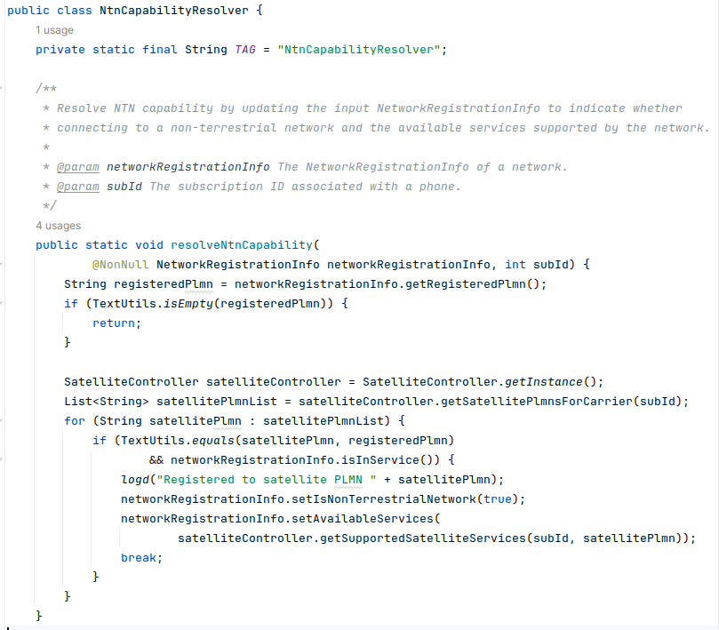
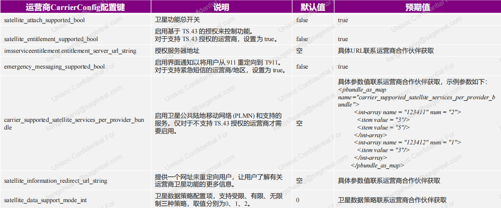

# 卫星通信配置

## 速查结论

- 配置问题先确认落点：AOSP 公共配置、厂商私有配置、MCC/MNC 运营商配置、SIM/卡槽维度、NV/系统属性/CarrierConfig。
- 定位时必须同时保留三类证据：配置文件、运行时 dump、log 中最终生效值。
- 本文图片已转成本地附件；非图片附件仍保留原 Outline 链接作为资料索引。

Satellite Telephony feature flag 和相关配置。

> 图片已保存为本地附件；非图片附件仍保留原 Outline 链接作为资料索引。

## 卫星通信配置

### 一、**为Satellite配置Telephony Feature Flag**

以9230项目为例，在如下路径添加配置文件：

```java
device/sprd/vnd_mpool/module/vendor/telephony/msoc/qogirl6/qogirl6.mk
```

添加如下内容：

```java
PRODUCT_COPY_FILES += \
   $(ETC_FILES_DIR)/android.hardware.telephony.satellite.xml:$(TARGET_COPY_OUT_VENDOR)/etc/permissions/android.hardware.telephony.satellite.xml
```


> **注意**
> 另外需要check下vendor/sprd/vendor_snapshot/v33/etc有无android.hardware.telephony.satellite.xml
>
> 若没有还请将frameworks/native/data/etc/android.hardware.telephony.satellite.xml 复制添加到vendor/sprd/vendor_snapshot/v33/etc 再编译
>


### 二、**开启Carrier Model NTN（D2C）功能**

需要按照运营商预期值对以下CarrierConfig进行配置

1、启用satellite feature，值为true
`<boolean name="satellite_attach_supported_bool" value="true" />`
2、启用卫星鉴权功能，值为true
`<boolean name="satellite_entitlement_supported_bool" value="true" />`


> **注意**
> 不支持卫星鉴权，应该要这项置为false。imsserviceentitlement.entitlement_server_url_string也无需配置
>


3、支持紧急短信，值为true
`<boolean name="emergency_messaging_supported_bool" value="true" />`
4、支持的业务类型，具体类型查看NetworkRegistrationInfo,下面3表示SERVICE_TYPE_SMS，替换具体的plmn

```java
    <pbundle_as_map name="carrier_supported_satellite_services_per_provider_bundle">
         <int-array name="plmn" num="1">
             <item value="3"/>
         </int-array>
     </pbundle_as_map>
```


> **注意**
> 此处plmn要填写卫星的PLMN，具体是什么需要咨询客户
>


当前AP判断是否注册上卫星网络的依据就是，判断当前注册上网络的PLMN与此PLMN是否一致。如果一致就进入sat mode

 

```java
     支持的业务类型可配置下面六种
     * <li>1 = {@link android.telephony.NetworkRegistrationInfo#SERVICE_TYPE_VOICE}</li>
     * <li>2 = {@link android.telephony.NetworkRegistrationInfo#SERVICE_TYPE_DATA}</li>
     * <li>3 = {@link android.telephony.NetworkRegistrationInfo#SERVICE_TYPE_SMS}</li>
     * <li>4 = {@link android.telephony.NetworkRegistrationInfo#SERVICE_TYPE_VIDEO}</li>
     * <li>5 = {@link android.telephony.NetworkRegistrationInfo#SERVICE_TYPE_EMERGENCY}</li>
     * <li>6 = {@link android.telephony.NetworkRegistrationInfo#SERVICE_TYPE_MMS}</li>
```

5、替换具体的url地址,用于让用户了解更多的starlink信息
`<string name="satellite_information_redirect_url_string">``[https://www.entel.cl/starlink/</string>](https://www.entel.cl/starlink/%3C/string%3E)`


> **信息**
> 不影响功能，只是个网站链接，可以找客户提供
>


6、更新鉴权地址，测试版本和产品版地址不一样，注意区分
`<string name="imsserviceentitlement.entitlement_server_url_string">``[https://test.aes.mnc001.mcc730.pub.3gppnetwork.org:3444/rcs-entitlement/</string>](https://test.aes.mnc001.mcc730.pub.3gppnetwork.org:3444/rcs-entitlement/%3C/string%3E)`


> **注意**
> 如果开启了卫星鉴权，会校验此URL，如果不对，会导致注册fail。需要客户提供
>


7、data设置受限模式
`<int name="satellite_data_support_mode_int" value="0"/>`

 

### 三、**卫星模式下运商营SPN显示配置方案**

网络侧下发了驻网PLMN的mccmnc后，又从NITZ下发了预期名称。

* 在vendor/sprd/platform/frameworks/base/core/res/res/values-mcc*xxx*-mnc*xx*中配置config_is_plmn_higher_priority_bool为true，确保对该mccmnc启用PLMN名称优先
* 在vendor/sprd/platform/frameworks/base/core/res/res/values-mcc*xxx*-mnc*xx*中配置config_is_nitz_higher_priority_bool为true，确保对该mccmnc启用NITZ名称优先

网络侧仅下发了驻网PLMN的mccmnc ，名称需要UE去自定义。

* 在vendor/sprd/platform/frameworks/base/core/res/res/values-mcc*xxx*-mnc*xx*中配置config_is_plmn_higher_priority_bool为true，确保对该mccmnc启用PLMN名称优先
* 在numeric_operator.xml中配置该PLMN对应名称

建议同时配置两个方案。当网络下发了NITZ时，系统将优先采用NITZ名称；而在未下发NITZ的情况下，将从numeric_operator.xml中提取配置名称


### 四、附件与提交记录

One NZ相关提交

<http://192.168.3.81:8085/c/SPRD_V/SPRDROID15_SYS_MAIN_W24.37.2_P1/+/101794>
<http://192.168.3.81:8085/c/SPRD_U/SPRDROID13_VND_RLS_23A/+/101795>


One NZ在上述基础上验证，有报告说RCS功能无法使用

解决过程：RCS功能是Google Message中设计的闭源功能，和MTK对比机比较发现，我们数据漫游没打开。

客户手动打开数据漫游，RCS功能正常

解决方案：连接上卫星网络后，自动打开数据漫游。断开后，恢复原样

<http://192.168.3.81:8085/c/SPRD_V/SPRDROID15_SYS_MAIN_W24.37.2_P1/+/105143>


[106742_展锐智能机平台星链D2C功能开发指南V1.0.pdf 1257655](..\attachments\outline\files\50aa70f9-5b35-4b0a-8132-8bd22be6bada_106742_展锐智能机平台星链D2C功能开发指南V1.0.pdf)


## 来源记录

- [卫星通信配置](http://192.168.3.94:8888/doc/5y2r5pif6yca5lh6ywn572u-f1DHzcB4Z8) (`f1DHzcB4Z8`)
