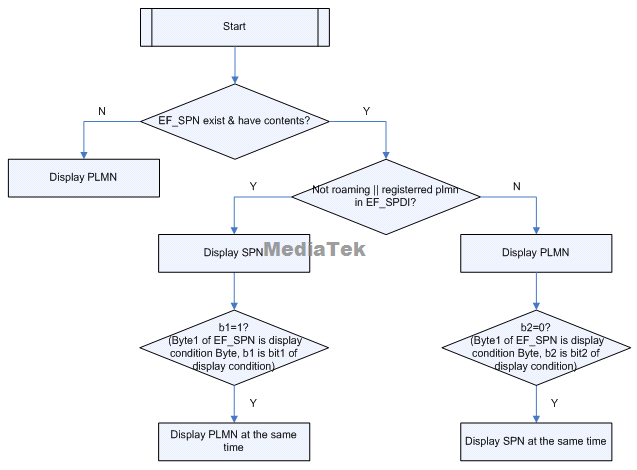
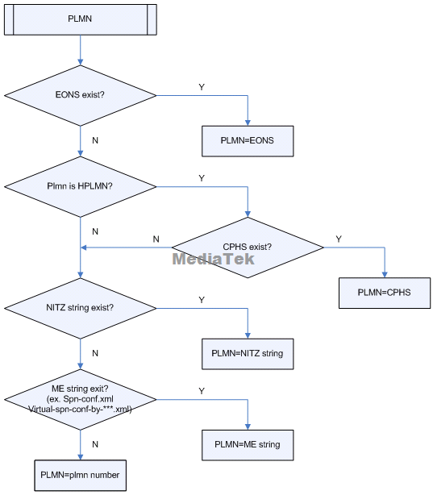

# 运营商名称配置方法

## 速查结论

- 配置问题先确认落点：AOSP 公共配置、厂商私有配置、MCC/MNC 运营商配置、SIM/卡槽维度、NV/系统属性/CarrierConfig。
- 定位时必须同时保留三类证据：配置文件、运行时 dump、log 中最终生效值。
- 本文图片已转成本地附件；非图片附件仍保留原 Outline 链接作为资料索引。

运营商名称显示、EONS、PNN/OPL/SPN 加载流程补充。

> 图片已保存为本地附件；非图片附件仍保留原 Outline 链接作为资料索引。

## 网络运营商名称加载流程

### 前言

网络名称显示这部分比较复杂，Spec对这也有明确的规定，根据其优先级由高往低介绍(其优先级参考TS 22.101)

1. Enhanced Operator Name String，也就是Eons。此种方式的名称是存放在EF_PNN(PLMN Network Name, fid: 6FC5)和EF_OPL(Operator PLMN List, fid: 6FC6)中。

EF_OPL中存放的是LAC和EF_PNN中的Record Identifier,

EF_PNN中存放的是Network Name，也就是具体的名称了。

如果注册上的网络是HPLMN，那么EF_OPL返回的Record Identifier就是1。

如果不是HPLMN的话，就根据LAC在EF_OPL中寻找对应的Record Identifier。

然后根据OPL的Record Identifier，在PNN中找对应的Network Name。

这里需要声明一下，Record Identifier是基于1的，而EF_PNN的记录是基于0的。也就是说，Record Identifier是1，那匹配的是EF_PNN中的第0条记录。 这个分的代码可以参考SIMRecords.java中的getEonsIfExist()方法

2. Common PCN Handset Specification Operator Name String，也就是CPHS ONS。需要当前注册的是HPLMN网络，

a.   如果SIM中的CPHS ONS的长格式文件(fid:6F14, long name)读取成功，用此当作网络名称。

b.   如果SIM中的CPHS ONS的短格式文件(fid:6F18, short name)读取成功，用此当作网络名称。

这个分的代码可以参考SIMRecords.java中的读取CPHSOns文件的部分

3. NITZ Operator Name

此名称是由所注册的网络下发给手机的，参考TS22.042。如果网络有下发这个数据给手机，modem会通过"+CIEV: 10"把数据传给AP端，AP端会用这个数据来当成网络名称，另外AP端还会把这个数据和对应的网络PLMN一同记下来，当之后注册上的网络仍是这个PLMN，这显示的网络名称还会是这个网络名称。

这部分的代码可以参考ril_nw.c中的onNitzOperNameReceived()

4. ROM

这一个是存储在手机flash中的，目前的存储方式是xml文件。如果是有打开支持MVNO的option，那么以下xml都依次读取，如果读取到就终止往下读了。如果没有MVNO，那么仅仅读取spn-conf.xml。如果没有读取到那么显示plmn号了。

Virtual-spn-conf-by-efspn.xml

Virtual-spn-conf-by-imsi.xml

Virtual-spn-conf-by-efpnn.xml

Virtual-spn-conf-by-efgid1.xml

Spn-conf.xml

这个分的代码可以参考ril.java中的 lookupOperatorName()方法和SpnOverride类

Spec 51.011中EF_SPN定义的rule 总结就是：

1. 名称分为 SPN 和 Registered plmn（包括EONS, CPHS (即ONS), S-CPHS, NITZ, PLMN；优先级依次降低）

2. 如果没有SPN文件，那么就显示Registered plmn

3. 若有SPN，注册的plmn是HPLMN或者注册的plmn在SIM卡文件EF_SPDI中，那么

   (1) 如果有SPN就要显示SPN

   (2) 如果SPN的bit1 = 1, 则需要同时显示Registered plmn，如果SPN的bit1=0，则不需要同时显示Registered plmn

4. 若有SPN，注册的plmn是Roaming plmn且注册的plmn也不在SIM卡文件EF_SPDI中，那么

   (1) 显示Registered plmn

   (2) 如果SPN的bit2=0，则需要同时显示SPN，如果SPN的bit2=1，则不需要同时显示SPN

EONS, CPHS (即ONS), S-CPHS, NITZ, PLMN。优先级依次减少

**流程图如下：**

 

 

### 手动搜网名称与 EFOPL5G

从 CQWeb 历史问题 `SPCSS01345931` 看，手动搜网列表中的运营商名称也可能需要遵从 SIM 中 PNN/OPL 的显示规则。例如 Vodafone AU SIM 在澳洲手动搜到 Optus 505-03 时，期望显示 `Vodafone AU R`，而不是 ROM XML 中的 `Optus`。

该问题的历史根因是：DUT 未注册 5G 网络时，仍根据 `EFOPL5G` 获取 PNN record number。修复方向是未注册 5G 时不从 `EFOPL5G` 获取 PNN record，避免把 5G OPL 规则误用于当前搜网结果。

排查时看三类 log：

```text
UniOperatorNameHandler: getPnn return Vodafone AU R
RIL: match plmn: 50502, longName: Optus
UNSOL_NETWORK_SCAN_RESULT ... mAlphaLong=Vodafone AU R / Optus
```

判断顺序：

1. SIM 是否有 EF_PNN、EF_OPL、EFOPL5G。
2. 当前注册/搜网 RAT 是否允许使用 EFOPL5G。
3. `UNSOL_NETWORK_SCAN_RESULT` 中 `mAlphaLong/mAlphaShort` 最终上报值。
4. 若 SIM EONS 未命中，再查 ROM `spn-conf`、virtual-spn、operator XML fallback。

### NITZ 与 ROM 配置判定

从 CQWeb 历史问题 `SPCSS01280971` 看，运营商名称显示优先级可按下列顺序先做粗判：

```text
OPL/PNN > ONS(非漫游状态下) > NITZ > numeric_operator.xml > mcc+mnc
```

判断当前名称是不是 NITZ 下发，先在完整开机到复现结束的 AP/RIL log 中搜：

```text
s_nitzOperatorInfo
```

典型打印形态：

```text
RIL: s_nitzOperatorInfo[0]: 405872=Jio True5G=Jio True5G
```

如果有对应 PLMN 的 `s_nitzOperatorInfo`，说明 modem/RIL 已收到网络侧 NITZ 名称，后续 AP 可能优先使用这个缓存名称。如果没有 NITZ 打印，再结合 `numeric_operator.xml`、`spn-conf`、virtual-spn 的加载日志判断是否走 ROM 配置或 MCC/MNC fallback。

### NITZ 名称缓存与飞行模式

从 CQWeb 历史问题 `SPCSS01575486` 看，印尼 Smartfren 这类场景容易把“网络下发名称”和“飞行模式后 UI 名称策略”混在一起判断。复现路径是：先驻网并显示 NITZ 下发的网络名称，随后开启飞行模式，DUT 的 NITZ 名称失效或回退，而对比机仍保留原 NITZ 名称。

这类问题不要先改 `numeric_operator.xml`。第一轮要确认 AP 是否在 radio off / out of service 时清掉了 NITZ 缓存，或者 `updateSpnDisplayLegacy()` 重新按 SPN/PNN/operator XML 计算了名称。

优先搜索：

```text
s_nitzOperatorInfo
NitzStateMachineImpl
handleNetworkAvailable
handleNetworkUnavailable
updateSpnDisplayLegacy
updateSpnDisplay: radio is off
updateSpnDisplay: radio is on but out of service
rawPlmn
rawSpn
operatorNumeric
oem_key_ignore_operator_name_from_net_bool
```

判断口径：

| 判断点 | 说明 |
|---|---|
| 有 `s_nitzOperatorInfo` | 网络名称已通过 NITZ 到达 AP/RIL，后续要看缓存和显示策略 |
| 飞行模式后名称消失 | 重点查 radio off 后是否清缓存，或是否强制回退到 SPN / XML |
| 对比机仍保留 NITZ 名称 | 对比“保留上次网络名称”的产品策略，而不是只看 TS.25 / PLMN 表 |
| 配置了 ignore NITZ | 查 `oem_key_ignore_operator_name_from_net_bool` 或同类开关是否屏蔽网络侧名称 |

如果目标需求是“飞行模式后仍显示上次网络侧名称”，需要明确这是 UI/产品策略；若目标需求是“网络不可用时不显示旧网络名称”，则 NITZ 缓存清理反而可能是预期行为。

### NITZ 时间与运营商名称要分开

NITZ 同时可能影响运营商名称、时间、时区和夏令时，但排查时要分开记录。历史 CQ 中存在两类常见误判：

- 只看到 `persist.sys.timezone` 没变化，就判断 NITZ 未生效；实际可能是网络未下发 NITZ，或时间区检测退回国家默认时区。
- 关闭 SNTP 后以为会关闭 NITZ；RTOS 平台上 `MMI_SNTP_SUPPORT` 与网络状态消息触发的 `MMIAPIPHONE_StartGetNitzTime` 不是同一条链路。

时间/时区类问题建议同时保留：

```text
NitzStateMachineImpl
doTimeZoneDetection
TimeServiceHelper
persist.sys.timezone
logAutoUpdate
APP_MN_NETWORK_STATUS_IND
MMIAPIPHONE_StartGetNitzTime
```

结论口径：运营商名称显示异常归 `updateSpnDisplay` / operator name 链路；时间、时区、夏令时异常归 NITZ time zone detection 链路。两者共享“NITZ 是否收到”的证据，但不要混成一个根因。

### 漫游图标与运营商显示名不要混用

从 CQWeb 历史问题 `SPCSS01545940` 看，印度 Idea SIM 漫游到 Airtel 网络时，即使通过 `non_roaming_operator_string_array` 把 VPLMN 配成非漫游、不显示漫游图标，状态栏仍可能显示 Airtel。这不是配置未生效，而是“漫游状态”和“显示名称”两条链路不同。

典型日志：

```text
UniOperatorNameHandler: get name from xml: airtel
SST: updateSpnDisplay: rawPlmn = airtel
SST: updateSpnDisplay: rawSpn =
SST: updateSpnDisplay: simNumeric = 405799 operatorNumeric = 40492
SST: updateSpnDisplay: rule=2, showPlmn=true, plmn=airtel, showSpn=false, spn=
```

判断口径：

| 问题 | 看什么 |
|---|---|
| 漫游图标是否显示 | `isRoaming`、`non_roaming_operator_string_array`、`roaming_operator_string_array` |
| 状态栏显示什么名字 | `rawPlmn/rawSpn/showPlmn/showSpn`、SPN/PNN/OPL/NITZ/operator XML |
| 是否来自 ROM XML | `UniOperatorNameHandler: get name from xml` |
| 是否来自 SIM/SPN | `getServiceProviderName()`、`rawSpn`、`showSpn` |

注意：不要为了让 405799 漫游到 40492 时显示 Idea，就直接把 `numeric_operator.xml` 中全局 `40492` 改成 Idea；这会影响真实 40492 SIM 或其他漫游场景。应优先从目标 carrier 的 `carrier_name_string`、SPN 显示规则或 `updateSpnDisplayLegacy()` 的 `showSpn/showPlmn` 逻辑确认。

### 不要把 carrier_list 当成本地客制化入口

从 CQWeb 历史问题 `SPCSS01020903` 看，`packages/providers/TelephonyProvider/carrier_list.textpb` / `carrier_list.bp` 属于 Google 维护的公共 carrier list，不建议作为本地运营商名称客制化入口。遇到 `numeric_operator.xml` 配置后显示不一致时，应先按优先级排除 SIM EONS、ONS、NITZ，再检查 ROM 侧 operator XML、virtual-spn、`spn-conf`、CarrierConfig 或厂商私有映射。

实操判断：

1. 如果显示字符串只在 `carrier_list.textpb` 里能搜到，不代表应该直接改该文件。
2. 如果白卡验证和目标商用 SIM 结果不一致，先确认白卡写入的 MCC/MNC、GID、SPN、PNN/OPL 是否完整。
3. 需要证明最终来源时，同时保留配置文件、RIL/NITZ 日志、`ServiceStateTracker` / `updateSpnDisplay` 打印。

### spn-conf 与 numeric_operator 的平台差异

从 CQWeb 历史问题 `SPCSS01185087` 看，部分新平台已经弃用 `spn-conf.xml`，TS.25 / PLMN 名称数据对应 `numeric_operator.xml`。因此不要只看到 `spn-conf.xml` 被拷贝到镜像中就判断它生效，要结合当前平台代码和运行日志确认实际读取入口。

建议判断：

1. 新平台优先确认 `numeric_operator.xml` 是否为最终 TS.25 / PLMN 名称来源。
2. 老平台或客户旧分支仍可能保留 `spn-conf.xml`、virtual-spn、厂商私有 overlay，需按代码分支确认。
3. 如果配置后无效，先看 log 中 `processNetworkName` / `getOperatorName` / `UniOperatorNameHandler` 是否命中目标 PLMN，而不是盲改多个 XML。

### system / vendor 两套 numeric_operator 的取值边界

从 CQWeb 历史问题 `SPCSS01440031` 看，PLMN 名称可能同时被 FWK 和 RIL 处理：FWK 读取 system 侧 `numeric_operator.xml`，RIL 侧可能读取 vendor 侧 `numeric_operator.xml`。如果两侧配置不一致，且 AP 高优先级名称流程中间返回空值，就可能出现同一 PLMN 名称来源不一致。

典型坏点：

```text
UniOperatorNameHandler: ist is null, return empty pnn
UniOperatorNameHandler: return ons = null
RIL: match plmn: 46001, longName: ...
UniOperatorNameHandler: get name from xml: ...
```

判断要点：

1. `getSimOns()` / ONS 为空时，不应直接把空值作为高优先级名称返回，应继续走后续 XML fallback。
2. 如果 RIL 打印 `match plmn`，说明 vendor 侧 operator XML 仍可能参与取名。
3. 如果项目要求只保留 FWK/system 侧名称来源，需要确认 `uni_tele_res_vendor.mk` 中 vendor `numeric_operator.xml` 的拷贝逻辑是否已删除。
4. system/vendor 两份 XML 同时存在时，必须明确谁是目标来源，避免两个文件配置不同导致复现概率依赖加载时序。

排查优先搜：

```text
UniOperatorNameHandler
return ons =
get name from xml
RIL: match plmn
vendor/etc/numeric_operator.xml
system/etc/numeric_operator.xml
```

### 手动搜网列表的 MCC/MNC 位数

从 CQWeb 历史问题 `SPCSS01007822` 看，手动搜网列表显示为空或不同卡槽显示不一致时，`numeric_operator.xml` 的键值位数是高频坏点。RIL 侧通常按 `mcc + mnc` 拼接，MNC 会根据 `mnc_digit` 进行 2 位或 3 位补零。

典型例子：

```text
mcc = 334, mnc = 020 -> numeric_operator.xml 应匹配 334020
mcc = 334, mnc = 140 -> numeric_operator.xml 应匹配 334140
```

关键 log：

```text
NetworkSelectSettings: CellInfoList display: {CellType = ..., mcc = 334, mnc = 020, alphaL = ..., alphaS = ...}
processNetworkName get network mcc = ..., mnc = ...
processNetworkName getOperatorName_err = ...
getOperatorName plmn = ...
```

排查顺序：

1. 从 `NetworkSelectSettings: CellInfoList display` 取实际 `mcc/mnc` 和 `mnc_digit`。
2. 检查 `numeric_operator.xml` 是否配置了正确 5 位或 6 位 key。
3. 搜 `processNetworkName`，确认先匹配 NITZ，再匹配 operator XML，最后才退到 ONS / fallback。
4. 如果同一环境、同一卡不同卡槽显示不一致，先补齐目标 PLMN 的 XML 配置，再看卡槽维度缓存或上报差异。

### MVNO 名称与 APN MVNO 字段边界

从 CQWeb 历史问题 `SPCSS01124358` 看，平台不一定提供通用接口直接判断“这张卡是不是虚拟运营商卡”。APN 中的 `MVNO Type` / `MVNO Value` 是 APN 匹配条件，由运营商提供；它们不等价于全局 MVNO 识别标志。

Lebara / Vodafone AU 类问题的判断：

- 如果 SIM 无 EF_SPN，PNN/OPL 又未命中，平台按协议会显示本地存储的 PLMN 名称。
- 若客户希望 MVNO 强制显示独立品牌名，需要明确可用识别条件，例如 MCC/MNC、IMSI range、GID、SPN、PNN/OPL、运营商提供的 MVNO 规则。
- 只凭“APN 里配置了 MVNO Type/Value”不能推导所有 UI 名称都应显示 MVNO 名称。

关键 log：

```text
GetNetworkNameString ... is_spn_support = 0, spn_len = 0
GetNetworkNameString ... pnn_len = 0, ons_len = 0, opn_len = 0
SelectOPNString ... pnn_len = 0, ons_len = 0, opn_len = 0
MMIAPIBT_SetOperatorName name <...>
```

### EF_PNN / EF_OPL 读取证据

从 CQWeb 历史问题 `SPCSS01132047` 看，MVNO 卡或漫游场景下“读不到 EF_PNN”不一定是 SIM 文件未读，常见坏点包括 OPL 匹配失败、LAC/PLMN 不一致、`pnn_len` 被本地代码清零、旧版本代码未同步。

优先搜索这些 modem/AP 关键字：

```text
MMIPHONE_HandleSIMRecordNumCnf
MMIPHONE_HandleSIMRecordReadCnf
OPL:-- lac_1 = ..., lac_2 = ..., pnn_index = ..., mcc = ..., mnc = ...
GetPNNIndexByOPL pnn_index = ..., lac = ..., lac_1 = ..., lac_2 = ...
SetPNNWithLac pnn_index = ...
GetNetworkNameString dual_sys = ..., pnn_len = ..., ons_len = ..., opn_len = ...
MMIAPIPHONE_GenPLMNDisplay
```

判断要点：

- `GetPNNIndexByOPL` 失败时，先看当前 PLMN/LAC 是否和 SIM 的 EF_OPL 记录匹配；异地测试外国卡时，实际注册 MCC 与卡内 OPL 预期不一致会导致匹配失败。
- 已匹配到 `pnn_index` 但 `GetNetworkNameString` 中 `pnn_len=0`，重点查 `SetPNNWithLac` / `SetPLMNNetworkName` 周围是否有本地修改或旧版本逻辑。
- `pnn_len=0` 后通常会退回本地字符串或 ROM 配置，因此表现为“运营商名显示错误”，不是单纯 UI 问题。

### 代码流程

//通过**TelephonyManager**获取的SIM卡和网络运营商的相关信息

```java
路径：system\A15\alps\frameworks\base\telephony\java\android\telephony\TelephonyManager.java
//获取sim卡mcc mnc
public String getSimOperatorNumericForPhone(int phoneId) {
        return getTelephonyProperty(phoneId, TelephonyProperties.icc_operator_numeric(), "");
    }
//获取SPN
public String getSimOperatorNameForPhone(int phoneId) {
        return getTelephonyProperty(phoneId, TelephonyProperties.icc_operator_alpha(), "");
    }
//获取当前注册运营商的字母名字
public String getNetworkOperatorName(int subId) {
        int phoneId = SubscriptionManager.getPhoneId(subId);
        return getTelephonyProperty(phoneId, TelephonyProperties.operator_alpha(), "");
    }
//获取当前注册运营商的mcc mnc
public String getNetworkOperatorForPhone(int phoneId) {
        return getTelephonyProperty(phoneId, TelephonyProperties.operator_numeric(), "");
    }
```

//获取 SIM 卡服务提供商名称，优先从 **3GPP 标准 EF_SPN** 文件读取，失败时回退到 **CPHS 标准**

```java
路径：system\A15\alps\frameworks\opt\telephony\src\java\com\android\internal\telephony\uicc\SIMRecords.java
private void getSpnFsm(boolean start, AsyncResult ar) {
        byte[] data;

        if (start) {
            // Check previous state to see if there is outstanding
            // SPN read
            if (mSpnState == GetSpnFsmState.READ_SPN_3GPP
                    || mSpnState == GetSpnFsmState.READ_SPN_CPHS
                    || mSpnState == GetSpnFsmState.READ_SPN_SHORT_CPHS
                    || mSpnState == GetSpnFsmState.INIT) {
                // Set INIT then return so the INIT code
                // will run when the outstanding read done.
                mSpnState = GetSpnFsmState.INIT;
                return;
            } else {
                mSpnState = GetSpnFsmState.INIT;
            }
        }
        ...
```

//创建SIMRecords

```java
路径：system\A15\alps\frameworks\opt\telephony\src\java\com\android\internal\telephony\uicc\UiccCardApplication.java
private IccRecords createIccRecords(AppType type, Context c, CommandsInterface ci) {
        if (type ` AppType.APPTYPE_USIM || type ` AppType.APPTYPE_SIM) {
            /* Unisoc: Create a new SIMRecords instance.
             * AR.695.001064.003180.013109
             * method: modify directly
             * AOSP Code @{
             *     return new SIMRecords(this, c, ci);
             * }
             * Unisoc code @{
             */
            return TelephonyComponentFactory.getInstance().inject(SIMRecords.class.getName())
                .makeSIMRecords(this, c, ci);
            /* @} */
        } else if (type ` AppType.APPTYPE_RUIM || type ` AppType.APPTYPE_CSIM){
            /* Unisoc: Create a new RuimRecords instance.
             * AR.695.001064.003180.013109
             * method: modify directly
             * AOSP Code @{
             *     return new RuimRecords(this, c, ci);
             * }
             * Unisoc code @{
             */
            return TelephonyComponentFactory.getInstance().inject(RuimRecords.class.getName())
                .makeRuimRecords(this, c, ci);
            /* @} */
        } else if (type == AppType.APPTYPE_ISIM) {
            return new IsimUiccRecords(this, c, ci);
        } else {
            // Unknown app type (maybe detection is still in progress)
            return null;
        }
    }
```

//**SIMRecords** 在 **UiccCardApplication** 初始化的时候就已经被创建

```java
路径：system\A15\alps\frameworks\opt\telephony\src\java\com\android\internal\telephony\uicc\UiccCardApplication.java
public UiccCardApplication(UiccProfile uiccProfile,
                        IccCardApplicationStatus as,
                        Context c,
                        CommandsInterface ci) {
        if (DBG) log("Creating UiccApp: " + as);
        mUiccProfile = uiccProfile;
        mAppState = as.app_state;
        mAppType = as.app_type;
        mAuthContext = getAuthContext(mAppType);
        mPersoSubState = as.perso_substate;
        mAid = as.aid;
        mAppLabel = as.app_label;
        mPin1Replaced = as.pin1_replaced;
        mPin1State = as.pin1;
        mPin2State = as.pin2;
        mIgnoreApp = false;

        mContext = c;
        mCi = ci;

        mIccFh = createIccFileHandler(as.app_type);
        mIccRecords = createIccRecords(as.app_type, mContext, mCi);
        if (mAppState == AppState.APPSTATE_READY) {
            queryFdn();
            queryPin1State();
        }
        mCi.registerForNotAvailable(mHandler, EVENT_RADIO_UNAVAILABLE, null);
    }
```

//更新sim卡状态和iccid

```java
路径：system\A15\alps\frameworks\opt\telephony\src\java\com\android\internal\telephony\uicc\UiccCard.java
public void update(Context c, CommandsInterface ci, IccCardStatus ics, int phoneId) {
        synchronized (mLock) {
            mCardState = ics.mCardState;
            updateCardId(ics.iccid);
            if (mCardState != CardState.CARDSTATE_ABSENT) {
                int portIdx = ics.mSlotPortMapping.mPortIndex;
                UiccPort port = mUiccPorts.get(portIdx);
                if (port == null) {
                    if (this instanceof EuiccCard) {
                        port = new EuiccPort(c, ci, ics, phoneId, mLock, this,
                                mSupportedMepMode); // eSim
                    } else {
                        port = new UiccPort(c, ci, ics, phoneId, mLock, this); // pSim
                    }
                    mUiccPorts.put(portIdx, port);
                } else {
                    port.update(c, ci, ics, this);
                }
                mPhoneIdToPortIdx.put(phoneId, portIdx);
            } else {
                throw new RuntimeException("Card state is absent when updating!");
            }
        }
    }
```

//sim卡加载完成后更新运营商编号（MCC+MNC）、国家代码（基于 IMSI 的 MCC）、语音信箱配置

```java
路径：system\A15\alps\frameworks\opt\telephony\src\java\com\android\internal\telephony\uicc\SIMRecords.java
protected void onAllRecordsLoaded() {
        if (DBG) log("record load complete");

        setSimLanguageFromEF();
        setVoiceCallForwardingFlagFromSimRecords();

        // Some fields require more than one SIM record to set

        String operator = getOperatorNumeric();
        if (!TextUtils.isEmpty(operator)) {
            log("onAllRecordsLoaded set 'gsm.sim.operator.numeric' to operator='" +
                    operator + "'");
            mTelephonyManager.setSimOperatorNumericForPhone(
                    mParentApp.getPhoneId(), operator);
        } else {
            log("onAllRecordsLoaded empty 'gsm.sim.operator.numeric' skipping");
        }

        String imsi = getIMSI();

        if (!TextUtils.isEmpty(imsi) && imsi.length() >= 3) {
            log("onAllRecordsLoaded set mcc imsi" + ((VDBG || SIM_DEBUG) ? ("=" + imsi) : ""));
            mTelephonyManager.setSimCountryIsoForPhone(
                    mParentApp.getPhoneId(), MccTable.countryCodeForMcc(imsi.substring(0, 3)));
        } else {
            log("onAllRecordsLoaded empty imsi skipping setting mcc");
        }

        setVoiceMailByCountry(operator);
        mLoaded.set(true);
        mRecordsLoadedRegistrants.notifyRegistrants(new AsyncResult(null, null, null));
    }
```


### AP LOG

06-30 11:10:26.060  1402  1402 D NitzStateMachineImpl: runDetection: reason=handleNetworkUnavailable, countryIsoCode=cn, nitzSignal=null

06-30 11:10:26.061  1402  1402 D NitzStateMachineImpl: doTimeZoneDetection: countryIsoCode=cn, nitzSignal=null, suggestion=TelephonyTimeZoneSuggestion{mSlotIndex=0, mZoneId='Asia/Shanghai', mMatchType=2, mQuality=1, mDebugInfo=\[findTimeZoneFromNetworkCountryCode: whenMillis=<timestamp>, countryIsoCode=cn, findTimeZoneFromNetworkCountryCode: lookupResult=CountryResult{zoneId='Asia/Shanghai', quality=2, mDebugInfo=Country default is boosted}, Detection reason=handleNetworkUnavailable\]}, reason=handleNetworkUnavailable

06-30 11:10:26.070  1402  1402 D SST   : \[0\] updateSpnDisplayLegacy+

06-30 11:10:26.070  1402  1402 D SST   : \[0\] updateSpnDisplay: combinedRegState = 1

06-30 11:10:26.072  1402  1402 D SST   : \[0\] getServiceProviderName: carrierName = CMCC

06-30 11:10:26.072  1402  1402 D SST   : \[0\] updateSpnDisplay: radio is on but out of service, set plmn='No service'

06-30 11:10:26.073  1402  1402 D SST   : \[0\] getServiceProviderName: carrierName = CMCC

06-30 11:10:26.108  1402  1402 D UniTeleUtils: specialNameList:China Mobile|default

06-30 11:10:26.108  1402  1402 D SST   : \[0\] updateSpnDisplay: rawSpn = China Mobile

06-30 11:10:26.108  1402  1402 D SST   : \[0\] updateSpnDisplay: simNumeric = 46000 operatorNumeric =

06-30 11:10:26.111  1402  1402 D SST   : \[0\] prefer showing plmn

06-30 11:10:26.111  1402  1402 D SST   : \[0\] getServiceProviderName: carrierName = CMCC

06-30 11:10:26.111  1402  1402 D SST   : \[0\] updateSpnDisplay: updateSpnDisplay: changed sending intent, rule=3, showPlmn='true', plmn='No service', showSpn='false', spn='China Mobile', dataSpn='China Mobile', subId='1'

06-30 11:10:26.116  1402  1402 D SST   : \[0\] updateSpnDisplayLegacy-

## 来源记录

- [网络运营商名称加载流程](http://192.168.3.94:8888/doc/572r57uc6lq6jcl5zwg5zcn56ew5yqg6l295rwb56il-rxYBhAf2CL) (`rxYBhAf2CL`)
