# Log工具使用补充资料

## 使用入口

- 先确认目标：抓 log、解 log、写卡、导入参数、射频/校准、专项验证。
- 操作类内容优先看截图；遇到版本差异时检查工具菜单、依赖环境和输入文件格式。
- 本文图片已转成本地附件；非图片附件仍保留原 Outline 链接作为资料索引。

迁入 ELT、Logel、Wireshark 使用方法补充。

> 图片已保存为本地附件；非图片附件仍保留原 Outline 链接作为资料索引。

## **一、Logel工具介绍**

Logel工具是一个实时诊断和监控DUT内部各模块消息和Log的分析工具，界面简洁，上手速度快，支持消息配置过滤、数据实时抓取、业务场景图形化显示等功能，工具界面如下所示。官方文档：<https://unisupport.unisoc.com/file/index.do?fileid=32409>

 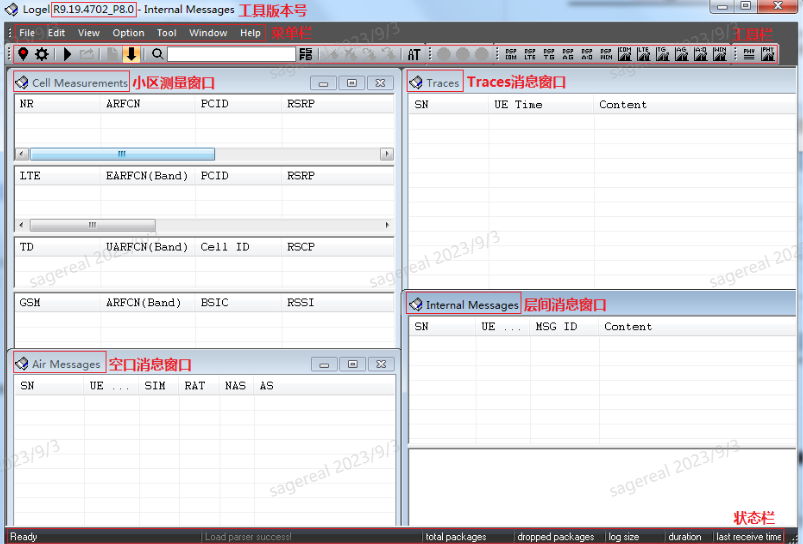

 

 

## **二、解析modem log**

为确保modem log的有效性，首先要确认是否是完整的开机log，需保证从开机开始抓取log（ylog默认开启），如不能确认是否是开机log，可先确认ylog是否开启，然后重启手机，开发通过log查看ImsService是否被拉起。

ImsApp  : ImsApp Boot Successfully. version:12

ImsApp  : ImsService Boot Successfully!

UniTelephonyApp: Boot Successfully!

单击工具栏左上角的"Open log file to replay"按钮

 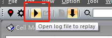

在弹出的Log选择框中选择需要解析的Log文件，单击"打开"即可回放

 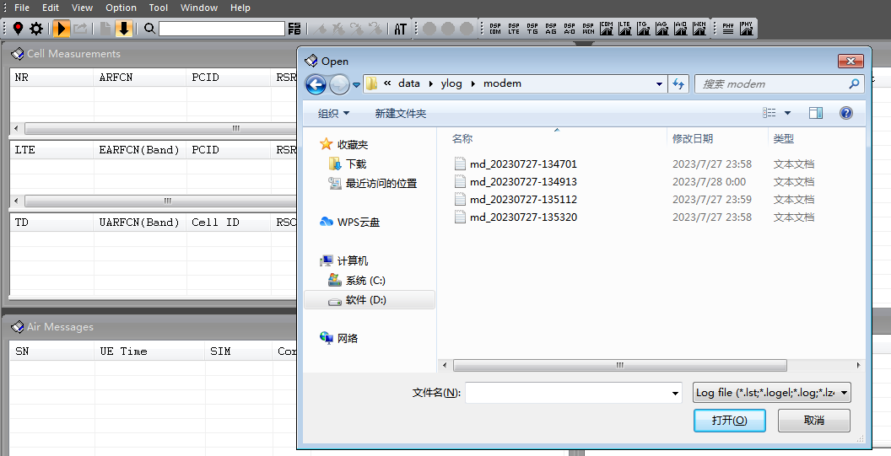

 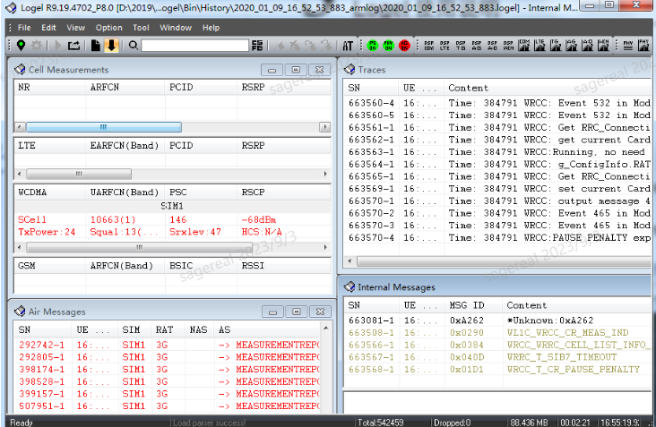

## **三、常见功能**

### **1、Arm log搜索**

单击工具栏左上角的"find"，在弹出的搜索框输入想检索的关键字\[2\]，输入需要搜索的消息关键字，双击关键字后的颜色框可以自行选择颜色，方便区分不同关键字消息。选择需要在哪些窗口及哪些列搜索。单击"Find"即可搜索

 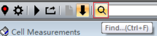

 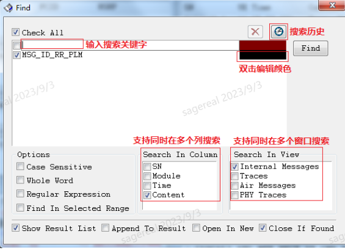

常见关键搜索信息\[1\]

无存储信息的PLMN和小区选择

| 序号 | 消息名称 | 描述 |
|:---|:---|:---|
| 1 | MSG_ID_CMD_RLM_SELECT_CELL | NAS/ASM请求LRRC开始PLMN和小区选择 |
| 2 | MSG_ID_LTE_CPHY_BAND_SWEEP_ REQ | LRRC请求PHY检测并同步所有支持频段上的小区 |
| 3 | MSG_ID_LTE_CPHY_SUCC_SYNC_ CELLS_IND | PHY上报LRRC小区检测和同步的结果 |
| 4 | MSG_ID_LTE_CPHY_IDLE_ CONFIG_REQ | LRRC请求PHY驻留在当前小区 |
| 5 | MSG_ID_LTEAS_NAS_UPDATE_INFO_IND | LRRC上报NAS当前驻留小区的接入信息 |
| 6 | MSG_ID_LAS_CELL_SELECT_ CNF | LRRC上报NAS  PLMN和小区选择的结果 |

PLMN搜索

| 序号 | 消息名称 | 描述 |
|:---|:---|:---|
| 1 | MSG_ID_CMD_RLM_SEARCH_REQUEST | NAS/ASM请求开始PLMN搜索 |
| 2 | MSG_ID_LTEAS_PLMN_LIST_IN_IND | LRRC指示NAS检测到的小区PLM N信息 |
| 3 | MSG_ID_LTEAS_PLMN_LIST_SEA RCH_CNF | LRRC指示NAS  PLMN搜索流程结束 |

### **2、场景化搜索**

单击菜单栏"Edit> Scene Search"，里面已集成一些业务场景供用户选择，也支持用户新增、修改、删除业务场景，如图所示。type可选择MSG、AIR、TRACE

 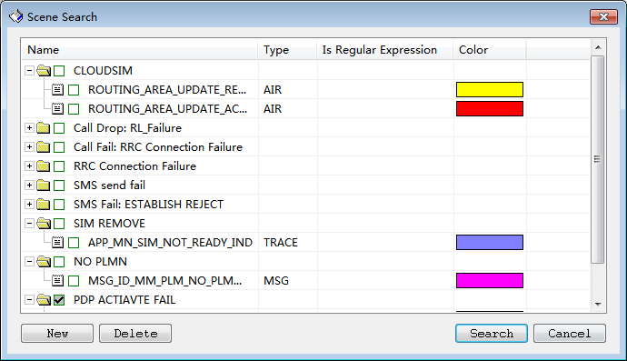

Scene Search页面

### **3、DSP Log搜索**

单击工具栏右上角的"LTE"、"TG"搜索按钮，在有独立AG-DSP模块的芯片上，还可以单击"AG"搜索按钮。会弹出图1.1的提示框

 

 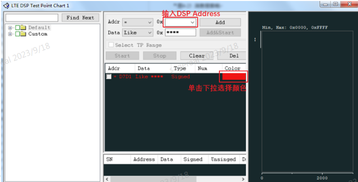

**图1.1**

输入需要搜索的DSP Address，单击Add。单击Addr后的Color框可以自行选择颜色，方便区分不同Address。单击"Start"即可搜索，搜索结果如图所示

 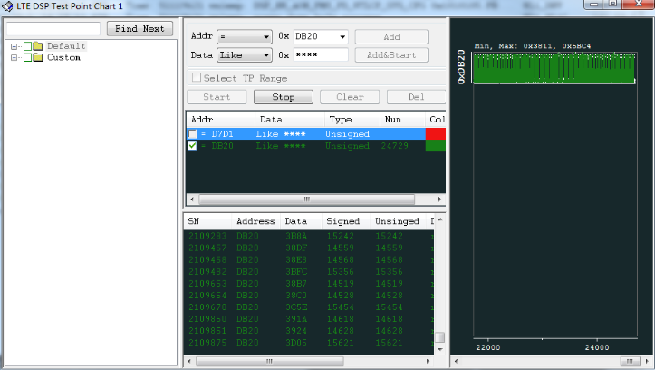

### **4、图表功能**

在Logel工具菜单栏"View"选项中可以打开对应的图表，以LTE Serving CellChartofSIM1/Primary为例

\*\*SINR:\*\*信号与干扰加噪声音比,是指接收到的有用信号与接收到的干扰信号的强度比值，反应当前信道的链路质量，是衡量UE性能参数的一个重要指标，SINR数值越大，接收信号质量越好

\*\*RSRQ:\*\*参考信号接受质量，M\*RSRP/RSSI，其中M为RSSI测量带宽内的RB数，即为系统带宽内的RB总数。反映和指示当前信道质量的信噪比和干扰水平。为了使测量得到的RSRQ为负值，与RSRP保持一致，因此RSRP定义的是单个RE上的信号功率，RSSI定义的是一个OFDM符号上所有RE的总接收功率。取值范围：-3\~-19.5 ，值越大越好

\*\*RSRP:\*\*参考信号接受功率，小区下行公共导频在测量带宽内功率的线性值（每个RE上的功率），当存在多根接收天线时，需要对多根天线上的测量结果进行比较，上报值不低于任何一个分支对应的RSRP值，max(RSRP00,RSRP01)。即为信号功率S。反映当前信道的路径损耗强度，用于小区覆盖的测量和小区选择/重选和切换。取值范围：-44\~-140dBm,值越大越好

 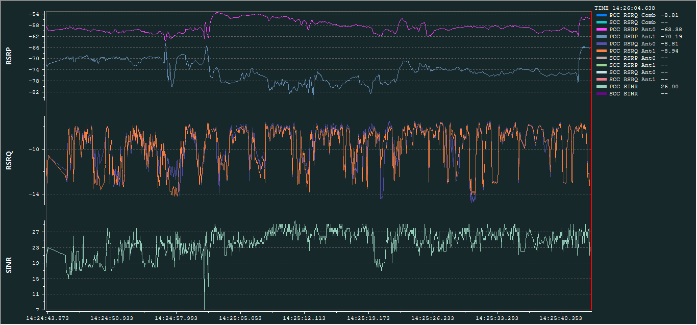

## **四、full dump log抓取**

在遇到modem block问题时，展锐通常需要我们提供full dump文件，下面介绍一下full dump的抓取方法

首先要保证Sysdump Enable开关（Ylog->调试->Sysdump Enable）是打开的，ud软件默认打开，user需要手动打开

在system info dumping场景完成后，同时按住音量上下键，双击power键,黑屏以后来到该界面

 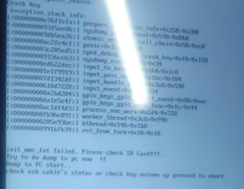

打开modem logel工具，手机插入USB，点击Capture log，如下，开始捕获dump日志，等到finish提示就完成了

 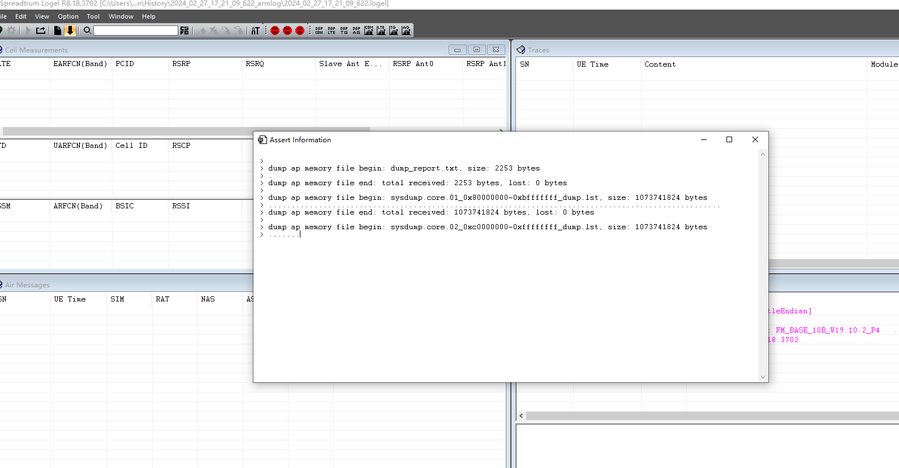

full dump日志保存在logel工具的bin\\history路径下，将整个armlog文件夹打包发给展锐

 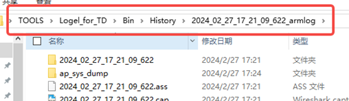

## **五、注意事项**

展锐Log默认使用YLog抓取，若选择PC方式输出ModemLog，出现问题后需同时导出YLog抓取的AP Log和保存PC端抓取的Modem Log。

User工程Modem Reset开关默认开启，关闭步骤如下：

−Android 8.1\~11产品：进入"YLog> Settings> LogSetting> ModemLogSetting"，关闭Modem Reset。

−Android 12\~14产品：进入"YLog> 更多选项> 调试"，关闭Modem Reset。

通过Logel工具"Log Lost Statistics"菜单可以查看Log丢失率，丢失率≤5%属于正常范畴。

## **六、参考文献**

\[1\] 【33721】 LTE ModemLog分析指南

\[2\] 【30866】PC Log抓取指南V1.5

\[3\] 【103529】 客户培训-通信协议部分(2G3G4G的一些基本流程及常见问题)_v1.2

\[3\] 【34262】WCDMA协议栈Log分析V1.0

[Logel User Guide.pdf 4200704](..\..\attachments\outline\files\f5686886-47ec-43e7-8aee-18b3769af4ce_Logel User Guide.pdf)

## **一、简介**

Wireshark是一款使用广泛的抓包工具，常用来检测网络问题、攻击溯源、或者分析底层通信机制

官网下载地址：[https://www.wireshark.org/download.html](https://www.wireshark.org/download.html)

## **二、解析sip消息**

我们工作中用到wireshark的场景不多，一般仅限于看mtk的sip消息

那怎么用wireshark解析log？Wireshark解析的什么？——解析的是cap文件

1.获取展锐和mtk的cap文件

MTK除了modem log还有net log，cap文件在net log里，如下图所示

 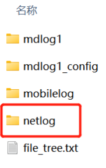

 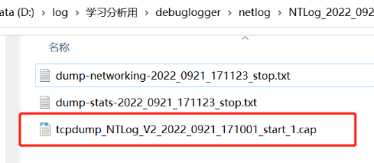

展锐的Logel工具可以解析sip消息，不需要用wireshark单独看，这点比mtk的要方便

但也可以用wireshark看抓包情况，展锐没有直接的cap文件，需要先用logel工具解析一次modem log，cap文件在解析后出现的文件夹里，如图

 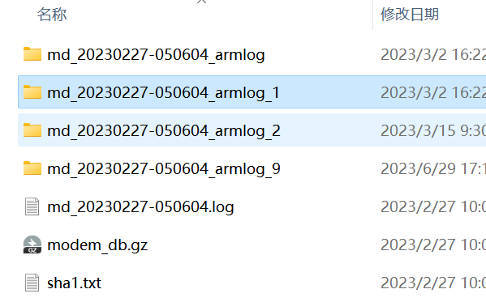

 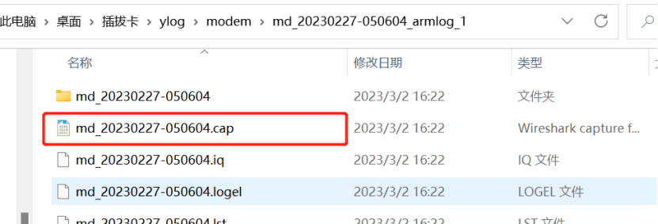

Wireshark工具打开cap文件，上面是按时间排序的消息列表，下面是某条消息的详细内容，包括来源地址、目的地址、消息头、消息体、序列号等等

 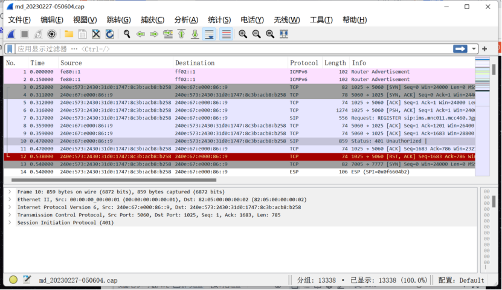

主要是看sip消息，有两种方法

第一种，在过滤栏搜sip

 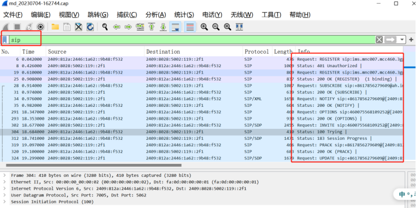

第二种，菜单栏 电话--》sip流

 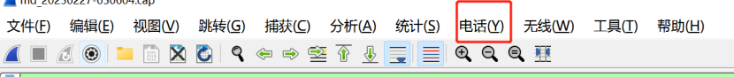

 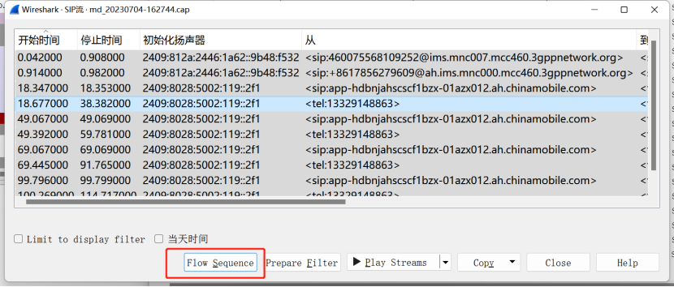

选一个或ctrl+A全选看flow sequence

全选后看到的是这样的

 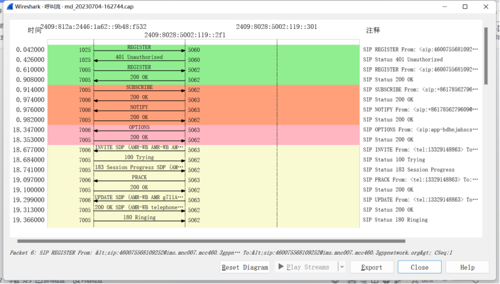

点哪行跳转哪行

ims消息的相关知识在[了解IMS](https://r29f33hhdx.feishu.cn/wiki/KTMbwvAsXi0bPMkjumlcFq0FnTe)

## **三、抓包**

虽然我们工作上很少会用到，但也简单介绍一下怎么抓包，毕竟是wireshark最基本的功能

捕获--选项--WLAN/以太网（以实际情况为准，抓有流量的）

 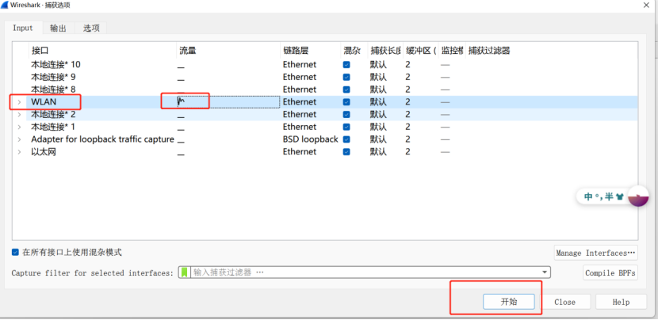

 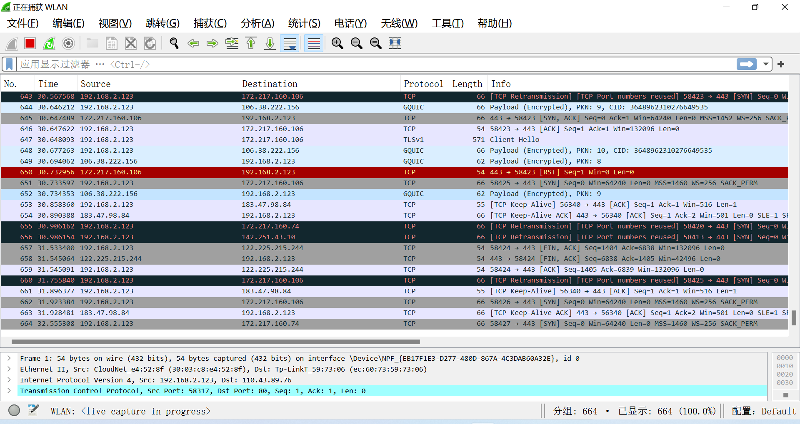

菜单栏---统计---流量图

 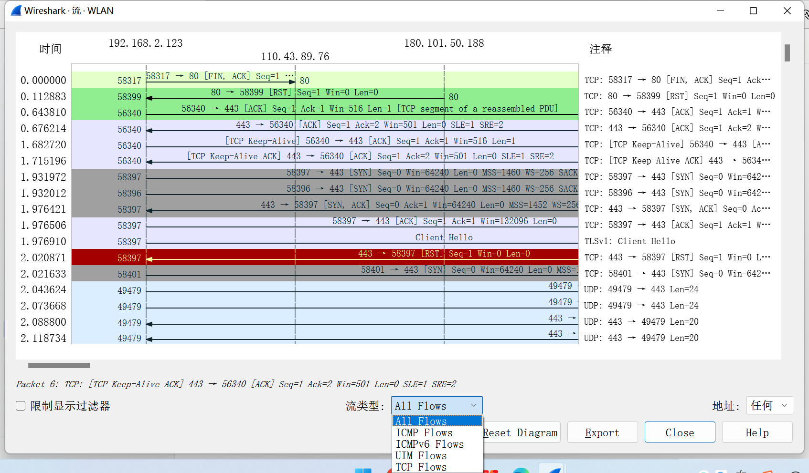

要看TCP抓包情况的，筛选一下TCP Flows

看UDP的直接过滤栏搜一下吧

数据包结构

不同类型的数据包有不同的结构

比如HTTP数据包有5层结构，TCP数据包有4层结构，都是对应了OSI七层模型的

TCP数据包结构

可以看到有四行，对应了OSI七层模型的下四层

|  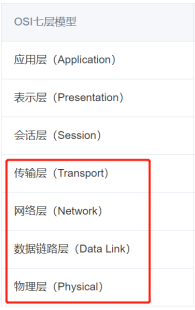 |    |
|:---|----|

展开看一下

Frame是数据包的整体概述

 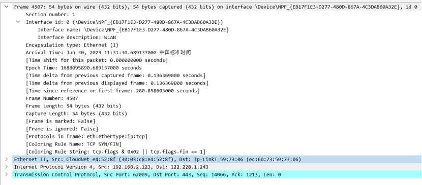

第四行Transmission Control Protocol

 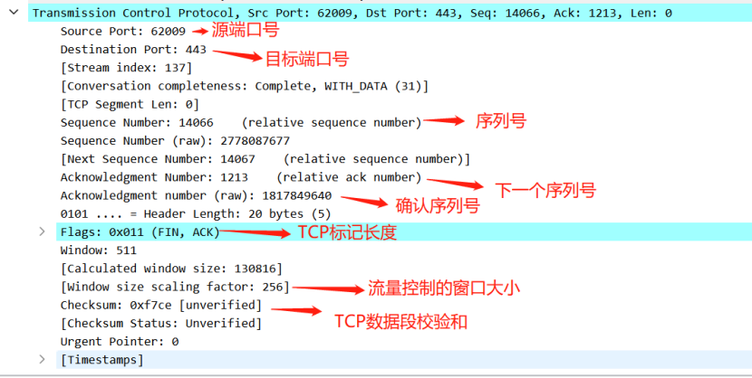

UDP数据包结构

和上面TCP的差不多

 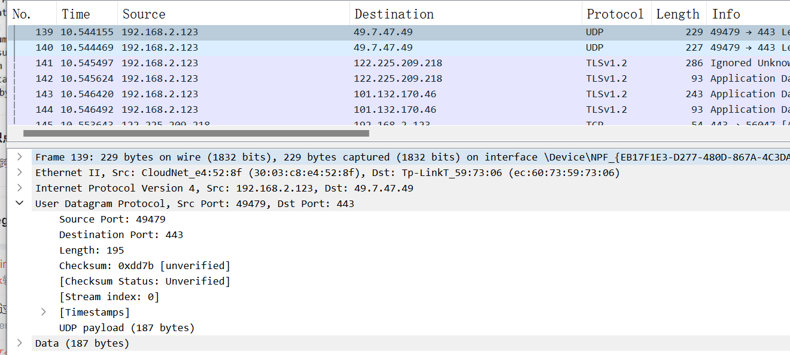

其他协议的数据包格式也都是差不多的，看得懂以太帧的可以自己分一下研究研究

 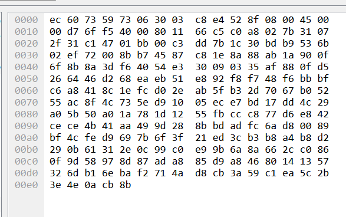

## 来源记录

- [Logel工具使用](http://192.168.3.94:8888/doc/logel-9PX7Jl2Ddm) (`9PX7Jl2Ddm`)
- [Wireshark工具使用](http://192.168.3.94:8888/doc/wireshark-3kJdZ2oqNB) (`3kJdZ2oqNB`)
