# Catch Log补充资料

<!-- REFERENCE_BOUNDARY_START -->
## 使用边界

- 本页是抓 log 导入资料合集，只作为低频参考和历史资料回溯。
- 日常现场抓 log 优先使用 [场测Log抓取SOP](场测Log抓取SOP.md) 和 [MTK网络通信问题抓Log与提交模板](MTK-网络通信问题抓Log与提交模板.md)。
- 后续稳定步骤应拆到具体 SOP，本页不再作为主入口扩写。
<!-- REFERENCE_BOUNDARY_END -->

## 使用入口

- 先确认目标：抓 log、解 log、写卡、导入参数、射频/校准、专项验证。
- 操作类内容优先看截图；遇到版本差异时检查工具菜单、依赖环境和输入文件格式。
- 本文图片已转成本地附件；非图片附件仍保留原 Outline 链接作为资料索引。

迁入抓 log SOP、MTK/UNISOC/Qualcomm/Wi-Fi sniffer 抓取资料。

> 图片已保存为本地附件；非图片附件仍保留原 Outline 链接作为资料索引。
> MTK / UNISOC 抓 log SOP 中有 18 张飞书 asynccode 临时图片已过期，当前用本地占位图保留位置；原 URL 已记录在 `attachments/external/manifest.json`，拿到原图后可替换。

## 1.MTK Smart Phone

### 1.1 Catch logs for normal issues.

1. Go to Settings-->About phone and double click 5 times on Build number;
2. Back to Settings-->System-->Developer options and turn USB debugging ON
3. Plug in usb and enable "always allow from this computer" option in your device.

 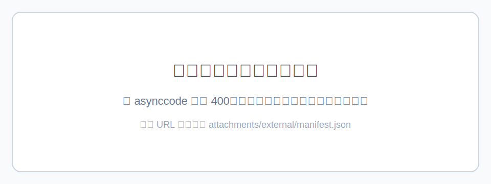

4. Go in Phone application, dial \*#\*#9646633#\*#\*or\*#\*#3646633#\*#\* or \*#\*#8646633#\*#\* to enter into Engineer Mode
5. Go in Log and Debugging menu and enter DebugLoggerUI
6. Click the settings option in the upper right corner ---->enter ----->choose "Enable Tag Log"
7. Click the start button

 

8. Start reproducing the issue
9. After reproducing the issue, click on the stop button to stop logs retrieval

 

10. After reproduce the issues, use the script attached to pull the logs, double click "02_get-trace.bat" is OK

Usually, it will show like this （Download Link:[get-trace-V4.52.zip](https://r29f33hhdx.feishu.cn/file/boxcnje1GNrMK5fal4IIGhhfZUc) ）

 

11. In your PC folder, there will be a folder, Usually, it will show like this

 

12. Pls compress the folders in your PC to us for analysis.

---

---

### 1.2 Catch logs for network issues.

1. Go to Settings-->About phone and double click 5 times on Build number;
2. Back to Settings-->System-->Developer options and turn USB debugging ON
3. Plug in usb and enable "always allow from this computer" option in your device.

 

4. Go in Phone application, dial \*#\*#9646633#\*#\*or \*#\*#3646633#\*#\* or \*#\*#8646633#\*#\* to enter into Engineer Mode
5. Go in Log and Debugging menu and enter DebugLoggerUI
6. Click the settings option in the upper right corner ---->enter ----->choose "Enable Tag Log"
7. Click the start button

 

8. Click the "Dynamic Settings"---->TelephonyLog---->Enable ---->ok
9. Reboot the device

  

10. Start reproducing the issue
11. For ims and network issues, pls reboot your device again to catch the whole network register logs.
12. After reproducing the issue, click on the stop button to stop logs retrieval

 

13. After reproducing the issues, use the script attached to pull the logs, double click "02_get-trace.bat" is OK

Usually, it will show like this （Download Link:[get-trace-V4.52.zip](https://r29f33hhdx.feishu.cn/file/boxcnje1GNrMK5fal4IIGhhfZUc) ）

 

14. In your PC folder, there will be a folder, Usually, it will show like this

 

15. Pls compress the folders in your PC to us for analysis.

---

---

## 2.Unisoc Smart Phone

### 2.1 Catch logs for normal issues.

1. Go to Settings-->About phone and double click 5 times on Build number;
2. Back to Settings-->System-->Developer options and turn USB debugging ON
3. Plug in usb and enable "always allow from this computer" option in your device.

 

4. Go in Phone application, dial \*#\*#9646633#\*#\*or \*#\*#83781#\*#\* or \*#\*#8646633#\*#\* to enter into Engineer Mode
5. Switch to DEBUG&LOG tab, launch into Ylog option.
6. Click the right top settings, choose "Clear" to clear history logs first. It will show "Clear log successfully" toast.

 

7. Back to ylog settings, choose "Settings" option, close "Log Cycle Cover" options in all log tags(Ap Logs Settings /Modem Logs Settings/Connectivity Log Settings)

 

 8. Back to ylog settings, choose the "Custom" option, check all the child options in it.
 9. Also choose the "Normal" option in Template settings.
10. Then start the logs. Note that it will show all the log tag infos at the top. If any info is empty in AP/Modem/Connectivity/Others, pls check if you have done before steps.

 

11. Start reproducing the issue
12. For ims and network issues, pls reboot your device to catch the whole network register logs.
13. After reproducing the issue, click on the stop button to stop logs retrieval
14. After reproducing the issues, use the script attached to pull the logs, double click "02_get-trace.bat" is OK

Usually, it will show like this （Download Link:[get-trace-V4.52.zip](https://r29f33hhdx.feishu.cn/file/boxcnje1GNrMK5fal4IIGhhfZUc) ）

 

15. In your PC folder, there will be a folder, Usually, it will show like this

 

16. Pls compress the folders in your PC to us for analysis.

## Kali-linux 抓取WiFi sniffer log，安装、抓取指导(支持抓WiFi 6e空口)

1、双击VMware_17.6.3虚拟机.exe直接按默认安装

备注：VMware安装包 及虚拟机：\\192.168.3.127\\127\\02_SW\\127文件目录\\02_工具TOOL\\03 工具软件\\28 VMware+Kali-linux虚拟机

2、打开安装好的VMware Workstation Pro，选择打开虚拟机

 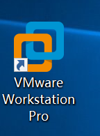 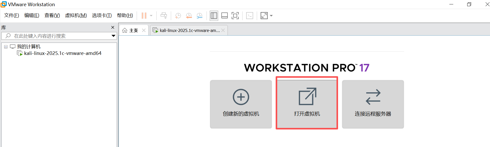

3、选择kali-linux2025专用系统镜像.7z 解压文件夹中的如下.vmx文件

 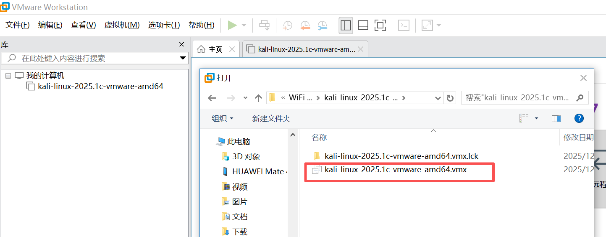

4、点击"启动此客户机操作系统"，用户名和密码都是kali，输入后等待系统启动完成

 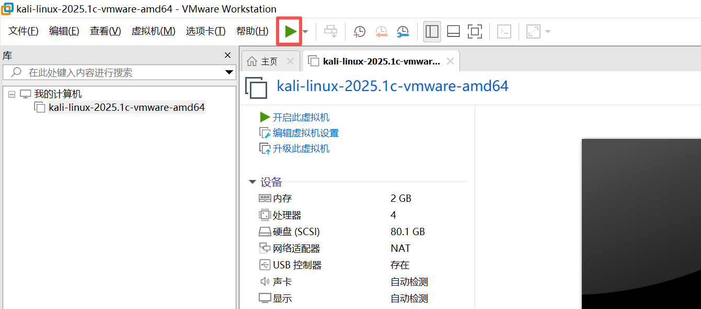

 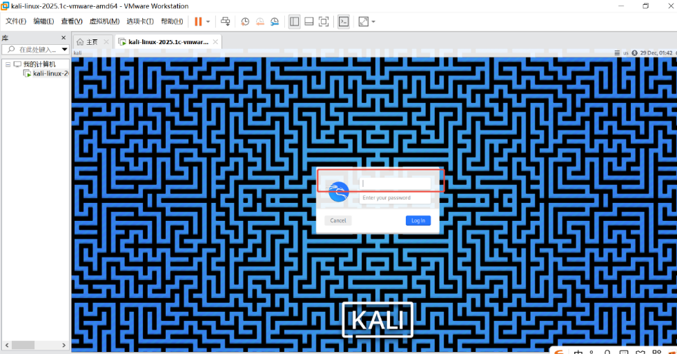

5、插入WiFi6网卡，在虚拟机->设置->USB控制器路径下，USB兼容性选择USB 3.1，点击确定

 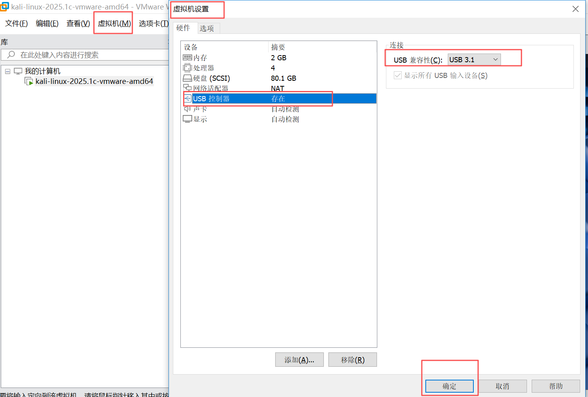

6、选择虚拟机->可移动设备->MediaTek Wireless_Device->连接，弹窗点击确认

 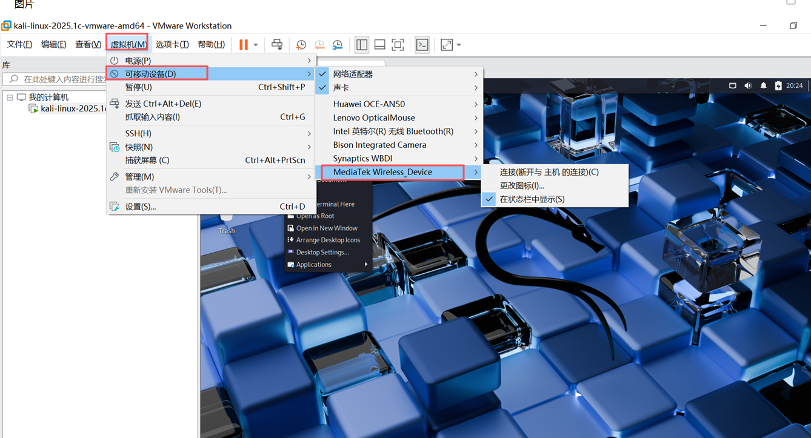 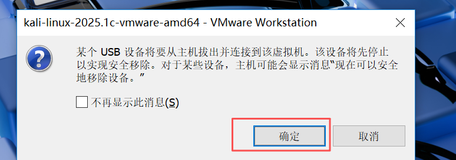

7、右键打开命令窗口，命令行输入iwconfig看下wlan0是否识别成功

 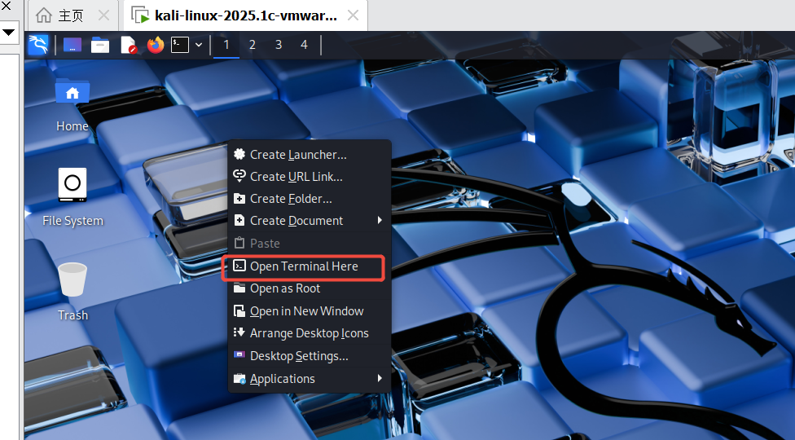 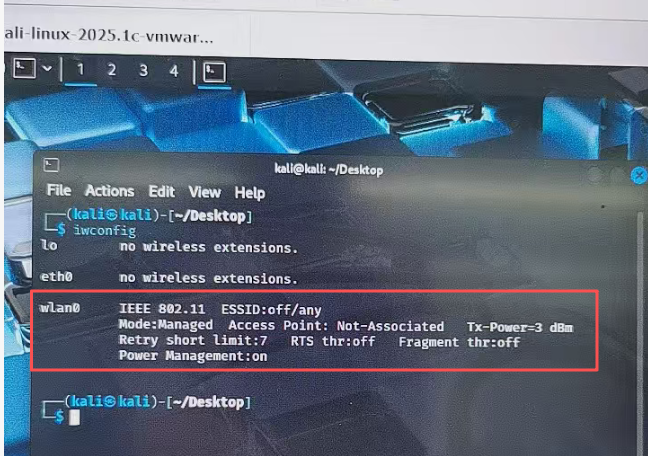

8、使用iw list 查看6 GHz频段状态，默认为disable状态。国内目前还未开放6GHz，需要先修改kali虚拟机区域码为支持6GHz区域比如US，使6GHz变为非disable状态才能开始抓取WiFi 6 GHz空口log

 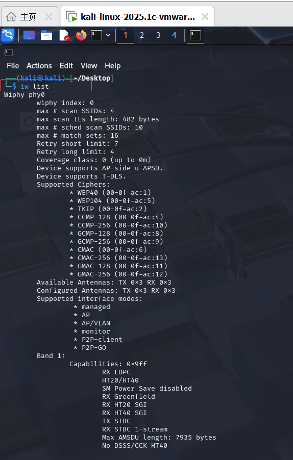 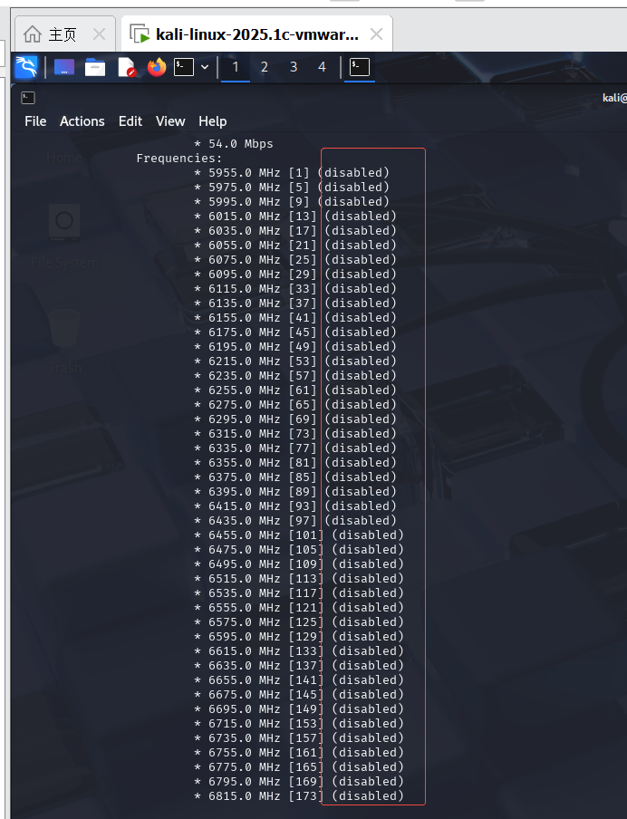

9、按如下指令修改kali虚拟机区域码为支持6GHz区域，比如US

sudo iw reg get //获取区域国家码

sudo iw reg set US //设置区域国家码为US后，再iw list查看6GHZ频段

iw list //再次查看6 GHz频段状态，变为no IR

 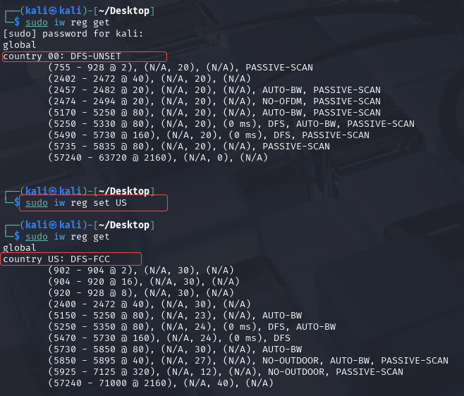 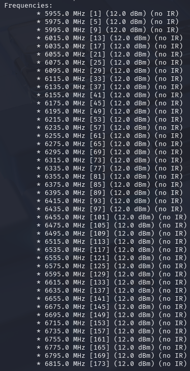

10、按如下步骤，开启监听，设置监听频率

sudo airmon-ng check kill //清除干扰进程

sudo airmon-ng start wlan0 //开启监听模式

sudo iw dev wlan0mon set freq 5975 //设置监听频率

11、左上角打开wireshark，双击选择wlan0mon，开始抓取log

 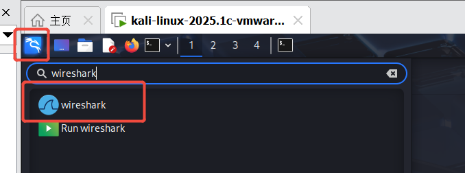 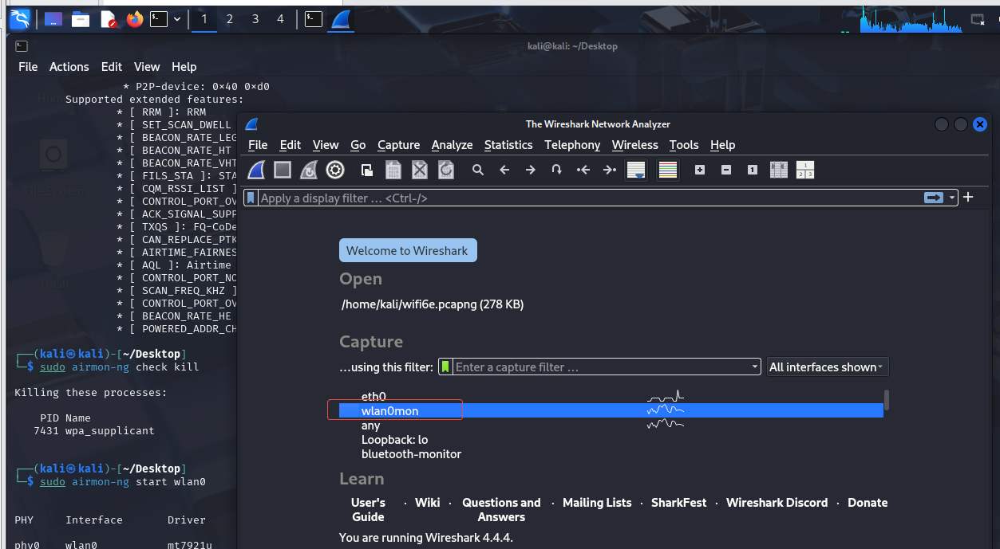

12、抓取完成，点击红色方框停止抓取log，然后File->Save保存log

 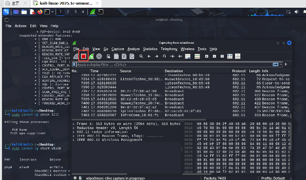 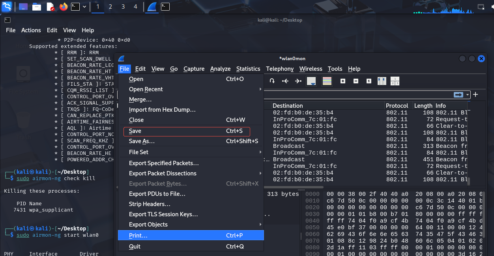

13、kali-linux系统，保存的log文件可以直接拖拽到主系统桌面等

 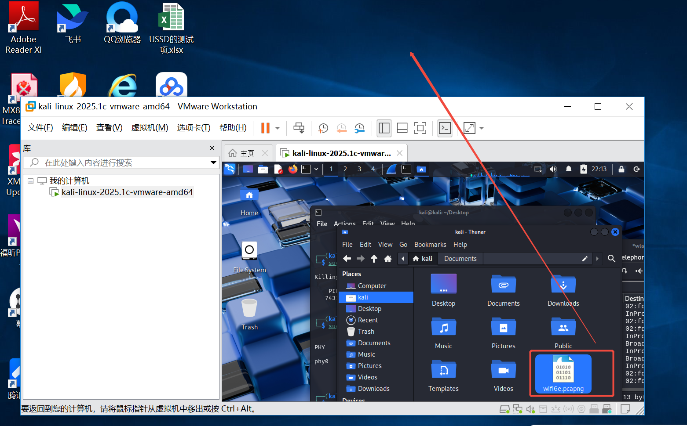

备注：

①扫描，确定AP工作channel方法（实测无法扫到wifi 6e的AP，即工作在6GHz的AP）

sudo airodump-ng wlan0mon --band bga

 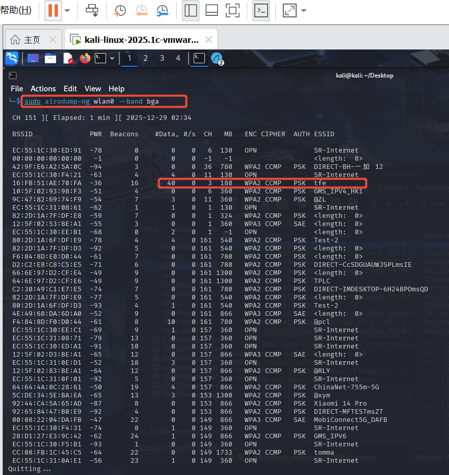

② 修改监听抓取信道方法（6GHz直接设置对应频率抓取，设置信道方式实测未抓到）

sudo iw dev wlan0mon set channel 6 //修改信道

## 来源记录

- [Catch Log](http://192.168.3.94:8888/doc/catch-log-wOkSR4iPwh) (`wOkSR4iPwh`)
- [Kali-linux 抓取WiFi sniffer log，安装、抓取指导(支持抓WiFi 6e空口)](http://192.168.3.94:8888/doc/kali-linux-wifi-sniffer-logwifi-6e-6VveQH6Zq6) (`6VveQH6Zq6`)
