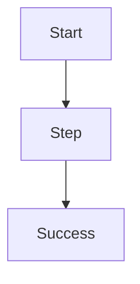

---
doc_type: template
quality: template
search_tier: reference_only
domain: Template
rat: TBD
feature: TBD
layer: TBD
status: active
---

# 流程名称

## 一句话

这个流程解决什么问题。

## 前置条件

- 

## 正常路径

## AP侧观察点

- 

## Modem侧观察点

- 

## 网络侧观察点

- 

## 常见异常分叉

| 阶段 | 异常 | 可能方向 | 需要证据 |
|---|---|---|---|
|  |  |  |  |

## 关联case

- 

